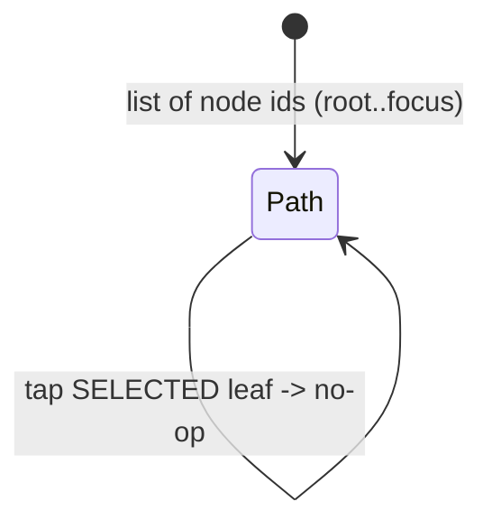
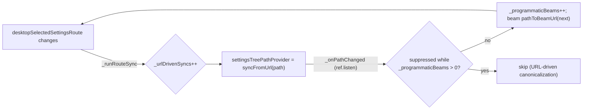

# Settings v2 Feature

`settings_v2` is the single declarative source of truth for the **Settings menu
and its navigation chrome**. It replaces the old hand-maintained per-platform
settings lists: the entire menu is declared once as a flag-gated tree
(`buildSettingsTree`), and that same tree is rendered two ways —

- **desktop:** a master/detail layout (a resizable tree column on the left, an
  in-pane detail panel on the right, with bidirectional URL ↔ tree sync)
- **mobile:** a drill-down where each tree level is its own Beamer page

Leaf "panels" embed the **real feature pages** — which still physically live in
`features/settings/`, `features/ai/`, `features/agents/`, `features/sync/`,
`features/categories/`, `features/labels/` — as headerless `*Body` widgets. So
the two platforms can never disagree about which settings exist, how they group,
or which flags gate them. This feature owns navigation, layout, and selection
state; it does **not** own the underlying domain logic.

## What This Feature Owns

1. the declarative settings tree and its index/URL mapping (`domain/`)
2. the selected-path state machine and the desktop tree-column width (`state/`)
3. the desktop master/detail chrome, tree rendering, detail-panel registry, and
   breadcrumb/resize widgets (`ui/`)
4. the mobile drill-down shell and per-level pages (`ui/mobile/`)
5. bidirectional URL ↔ tree synchronisation (`ui/url_sync/`)

It does **not** own the feature pages it embeds (those are imported by id through
the panel registry) nor the Beamer route table (that lives in
`lib/beamer/locations/settings_location.dart`).

## Mounting / Entry Points

There is **no feature flag gating `settings_v2` itself** — it is unconditionally
the Settings surface. `SettingsRootPage` (in `features/settings/`) is the
platform fork point: `isDesktopLayout(context)` renders `SettingsV2Page`, else
`SettingsMobileRootPage`.

- **Desktop:** `SettingsLocation.buildPages` pushes a single page →
  `SettingsRootPage` → `SettingsV2Page`. Sub-routes are not stacked; they flow
  through `NavService.desktopSelectedSettingsRoute` and are dispatched into the
  right-hand pane by the panel registry.
- **Mobile:** `SettingsLocation.buildPages` builds a real Beamer page stack
  starting at `SettingsMobileRootPage`, inserting `SettingsMobileBranchPage`
  hubs for the two pure-navigation branches (`definitions`, `advanced`).

## Directory Shape

```text
lib/features/settings_v2/
├── domain/
│   ├── settings_node.dart            # SettingsNode + NodeBadge/NodeTone
│   ├── settings_tree_data.dart       # buildSettingsTree() — pure, flag-gated
│   └── settings_tree_index.dart      # SettingsTreeIndex + URL<->path mapping
├── state/
│   ├── settings_tree_controller.dart        # settingsTreePathProvider (path = source of truth)
│   └── settings_tree_width_controller.dart  # settingsTreeNavWidthProvider (persisted)
└── ui/
    ├── settings_tree_builder.dart    # watchSettingsTree() Riverpod wrapper
    ├── settings_tree_scope.dart      # SettingsTreeScope(Host) shared snapshot
    ├── settings_v2_constants.dart    # SettingsV2Constants (dp/ms/alpha literals)
    ├── labels/settings_tree_labels.dart      # localized (title, desc) resolver
    ├── pages/settings_v2_page.dart           # desktop master/detail root chrome
    ├── tree/
    │   ├── settings_tree_view.dart
    │   ├── settings_tree_node_widget.dart
    │   └── settings_tree_row.dart    # shared by desktop + mobile
    ├── detail/
    │   ├── settings_detail_pane.dart # empty / branch / leaf dispatch
    │   ├── leaf_panel.dart           # IndexedStack body cache
    │   ├── panel_registry.dart       # kSettingsPanels + builders (largest file)
    │   ├── detail_id_dispatch.dart   # generic list / create / detail
    │   ├── ai_panel_dispatch.dart    # AI multi-kind dispatch
    │   └── default_panel.dart / category_empty.dart / empty_root.dart
    ├── url_sync/settings_tree_url_sync.dart  # bidirectional URL<->tree bridge
    ├── widgets/
    │   ├── settings_v2_top_crumbs.dart
    │   └── settings_tree_resize_handle.dart
    └── mobile/
        ├── settings_mobile_root_page.dart    # mobile landing (root level)
        ├── settings_mobile_branch_page.dart  # definitions / advanced hubs
        ├── settings_mobile_tree_page.dart    # presentational rung
        ├── settings_mobile_shell.dart        # fixed header chrome
        └── settings_mobile_nav.dart          # handleSettingsNodeTap()
```

## Domain Model

### `SettingsNode`

A `SettingsNode` (`domain/settings_node.dart`) carries:

- `id` — a stable, slash-delimited path (e.g. `sync/backfill`)
- `icon`, `title`, `desc`
- `children` — `null` ⇒ **leaf**; non-null ⇒ **branch** (even if empty)
- `panel` — the registry id of the detail body to render (a branch with
  `panel == null` is a pure-navigation hub)
- optional `badge` (`NodeBadge` + `NodeTone {info, teal, error}`) — the type and
  render path exist but the tree does not currently emit badges

### `buildSettingsTree` (pure + flag-gated)

`buildSettingsTree(...)` in `domain/settings_tree_data.dart` is a **pure**
function (no `BuildContext`): it takes a `SettingsTreeLabelResolver` plus the
gating booleans and declares the whole tree via local `leaf()`/`branch()`
helpers. Keeping it `BuildContext`-free makes the tree fully unit-testable;
`ui/labels/settings_tree_labels.dart` supplies the localized `(title, desc)`
resolver and `ui/settings_tree_builder.dart` (`watchSettingsTree`) is the
Riverpod wrapper that watches the flags.

Node gating (flag → node):

| Node | Gate |
| --- | --- |
| `whats-new` leaf (panel `whats-new`, no URL — opens a modal) | `enableWhatsNew` |
| `sync` branch (+ all `sync/*` leaves) | `enableMatrix` |
| `definitions/habits` | `enableHabits` |
| `definitions/dashboards` | `enableDashboards` |
| `speech` leaf | `enableSpeechTts` (`enableAiSummaryTtsFlag`) |
| `advanced/health-import` | `enableHealthImport` (mobile only) |
| `ai`, `agents`, `definitions`, `theming`, `advanced` branches | always shown |

`enableHealthImport` is mobile-only by construction: `watchSettingsTree` passes
`enableHealthImport: isMobile`, while the desktop scope host never enables it.

### `SettingsTreeIndex` + URL mapping

`SettingsTreeIndex.build(tree)` (`domain/settings_tree_index.dart`) flattens the
tree into `_byId` and `_ancestors` (root→self chains) and exposes `findById`,
`ancestors`, and `isValidPath`. Duplicate ids assert in debug. The same file
hosts the URL mapping that keeps Beamer and the tree in agreement:

- `settingsNodeUrls` — node id → canonical Beamer URL (`whats-new` is
  deliberately absent: it opens a modal, it has no route)
- `pathToBeamUrl` — deepest node in the path wins
- `beamUrlToPath` — greedy longest-prefix match back to a path
- a few intentional legacy quirks are encoded here (e.g.
  `sync/conflicts` → `/settings/advanced/conflicts`, `advanced/flags` →
  `/settings/flags`, and the hyphen-in-id vs slash-in-URL for
  `sync/matrix-maintenance`)

## State

### `settingsTreePathProvider` — path is the source of truth

`SettingsTreePath` (`state/settings_tree_controller.dart`) is a
`Notifier<List<String>>`: the **single source of truth is an ordered list of
node ids** (root → focus). Open branches, the selected leaf, the breadcrumb
trail, and the URL are all derived from this list — there are no separate
open/closed booleans. `onNodeTap(nodeId, depth, hasChildren)` implements four
rules, clamping `depth` to `[0, current.length]`:



It also exposes `syncFromUrl(beamPath)` and `truncateTo(depth)` (used by the
breadcrumbs).

### `settingsTreeNavWidthProvider` — persisted column width

`SettingsTreeNavWidth` (`state/settings_tree_width_controller.dart`) owns the
desktop tree-column width: clamped to `[280, 480]` (default `340`), keyboard
steps of `8`/`32`, and a 300 ms debounced persist to `SettingsDb` under its own
key `SETTINGS_TREE_NAV_WIDTH` (intentionally distinct from the shared list-pane
width). It carefully sequences the persisted-load vs. user-mutation race so a
late DB read never clobbers an in-flight drag.

## URL ↔ Tree Sync

`SettingsTreeUrlSync` (`ui/url_sync/settings_tree_url_sync.dart`) is a zero-size
bridge mounted inside `SettingsV2Page`. It is **bidirectional**: URL→tree
listens to `NavService.desktopSelectedSettingsRoute` and calls `syncFromUrl`;
tree→URL `ref.listen`s the path provider and beams to `pathToBeamUrl(next)`.
Because each direction would otherwise re-trigger the other, two counters break
the feedback loop:



`_programmaticBeams` suppresses the inbound listener while a tree-driven beam
settles; `_urlDrivenSyncs` suppresses the outbound canonicalization that would
otherwise erase a panel-local URL tail (e.g. `/create` or a detail UUID). Syncs
are deferred out of Beamer's build phase via `SchedulerPhase` checks.

## UI

A shared `SettingsTreeScopeHost` (`ui/settings_tree_scope.dart`) watches the
gating flags once, builds the tree + index, and publishes both through the
`SettingsTreeScope` InheritedWidget. The tree view, detail pane, and crumbs all
read `SettingsTreeScope.maybeOf` and fall back to a local build in isolation
tests.

**Desktop (`ui/pages/settings_v2_page.dart`):** a `Column` of a 56dp header
(hosting `SettingsV2TopCrumbs`), then a `Row` of `[SizedBox(treeWidth) →
SettingsTreeView | 1dp divider + SettingsTreeResizeHandle | Expanded →
SettingsDetailPane]`, with the zero-size `SettingsTreeUrlSync` mounted at the
top.

**Tree column (`ui/tree/`):** `SettingsTreeView` lists the roots; each
`SettingsTreeNodeWidget` narrows its watch to its own path slot (so siblings
don't rebuild) and animates its children; `SettingsTreeRow` is the stateless,
reusable row (active rail, icon tile, title/desc, optional badge chip, chevron)
parameterised for reuse on mobile.

**Detail pane + panel registry (`ui/detail/`):** `SettingsDetailPane` resolves
the focused node and picks `EmptyRoot` (empty path) / `CategoryEmpty` (hub) /
`LeafPanel`, cross-fading by *mode* (`empty`/`branch:<id>`/`leaf`) so sibling
leaf swaps don't tear down `LeafPanel`. `LeafPanel` keeps visited bodies mounted
in an `IndexedStack` (preserving scroll/filter state) and resolves the body via
`panelSpecFor(leaf.panel)`. `panel_registry.dart` is the heart of the feature:
`kSettingsPanels` maps each `panelId` to a `SettingsPanelSpec {build, scrollable}`
that wires the panel to a real feature `*Body` (`FlagsBody`, `ThemingBody`,
`AboutBody`, `SyncStatsBody`, `AgentSettingsBody`, …) or, for list↔detail
surfaces, to `DetailIdDispatch` / `AiPanelDispatch`. `AiPanelDispatch` is
separate because AI has three orthogonal detail surfaces (`providerId`,
`modelId`, `profileId`).

**Header chrome (`ui/widgets/`):** `SettingsV2TopCrumbs` renders the path as a
breadcrumb page-title (non-terminal segments tap to `truncateTo(depth)`);
`SettingsTreeResizeHandle` drives the width controller via drag / double-tap /
Home / arrow keys and exposes a `Semantics(slider: true)`.

## Mobile

Mobile consumes the *same* `buildSettingsTree` (via `watchSettingsTree`) but
renders **one level per page**. `SettingsMobileTreePage` is the presentational
rung (full-width rows, no active rail, leaf chevrons), wrapped in
`SettingsMobileShell`'s fixed header. `SettingsMobileRootPage` shows the root
level; `SettingsMobileBranchPage` shows a hub's children. Navigation is pure
Beamer-stack, not in-widget: `handleSettingsNodeTap` opens the What's-New modal
for `whats-new`, otherwise `beamToNamed(settingsNodeUrls[node.id])` and lets
`SettingsLocation` rebuild the stack.

## Adding a Settings Entry

The coupling to the embedded feature pages is **one-directional and by id**. To
add a menu entry:

1. add a `leaf()`/`branch()` node in `buildSettingsTree` (with its gate, if any)
2. register its canonical URL in `settingsNodeUrls`
3. add a panel builder for its `panel` id in `kSettingsPanels`
4. add the Beamer route in `lib/beamer/locations/settings_location.dart`

The `domain/` layer (tree + index + URL mapping) is `BuildContext`-free and
fully unit-testable; the UI layer falls back to local tree builds when the scope
is not mounted, which is what the isolation tests rely on.

## Relationship to Other Features

- [`settings`](../settings/README.md) still hosts the leaf utility/editor pages
  (and their `*Body` variants) plus the Beamer route table; `settings_v2` is the
  menu/navigation surface that embeds those bodies.
- `ai`, `agents`, `sync`, `categories`, `labels` provide the `*Body` widgets the
  panel registry mounts.
