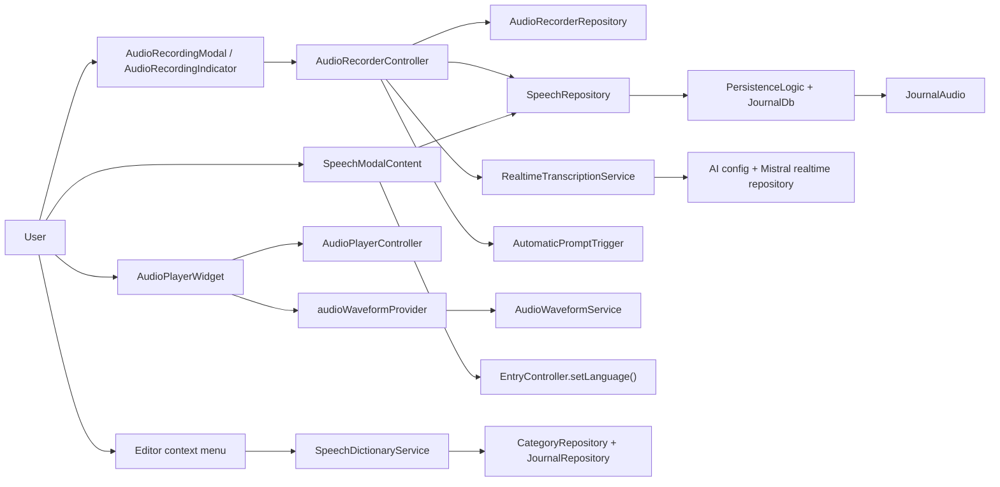
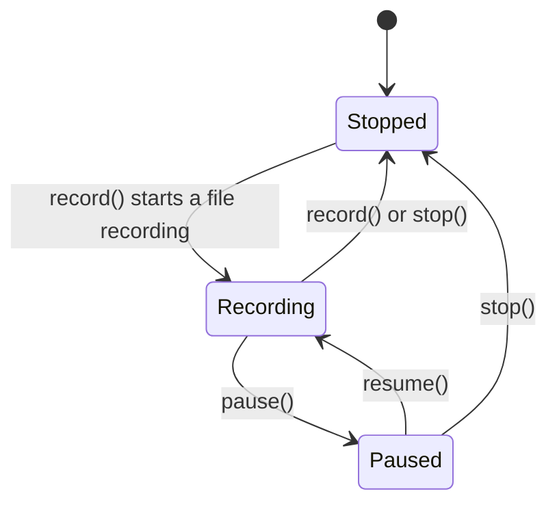
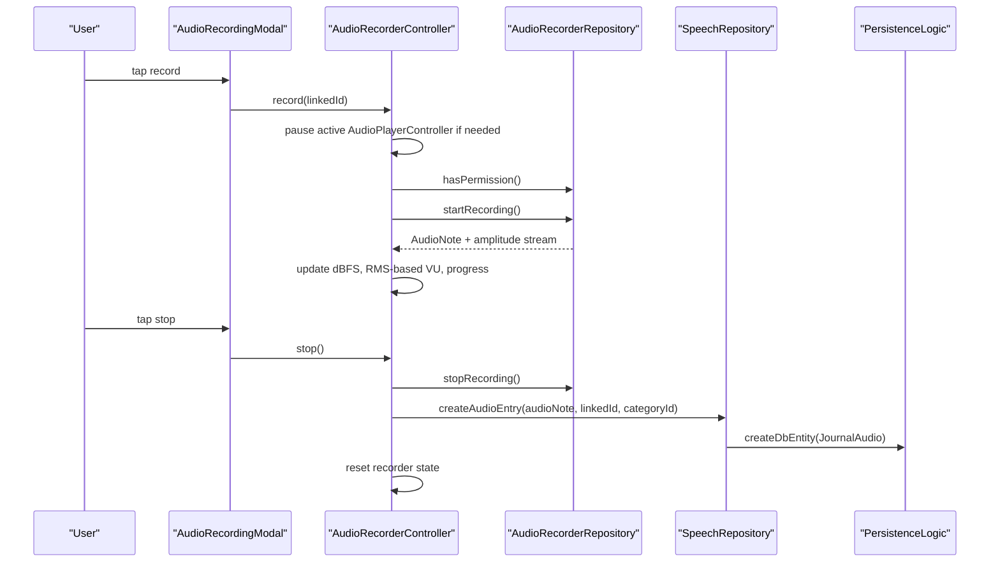
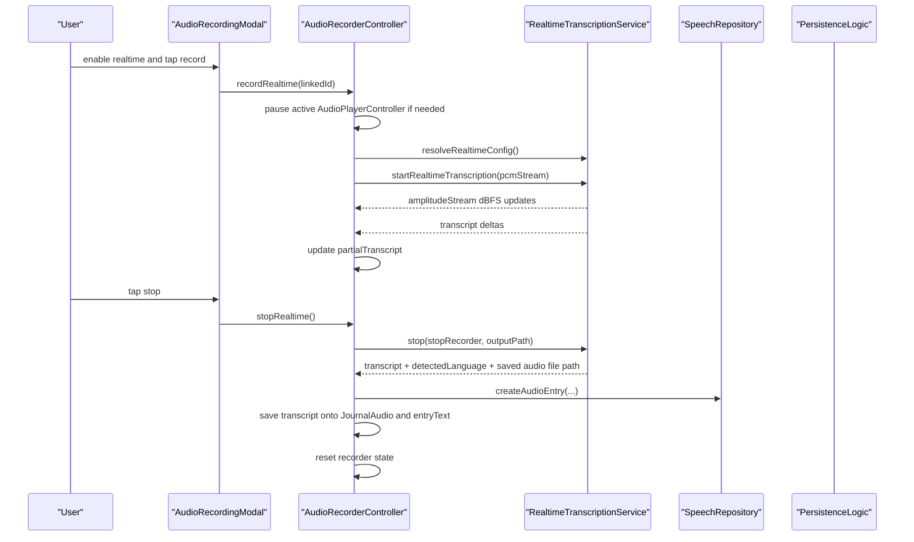
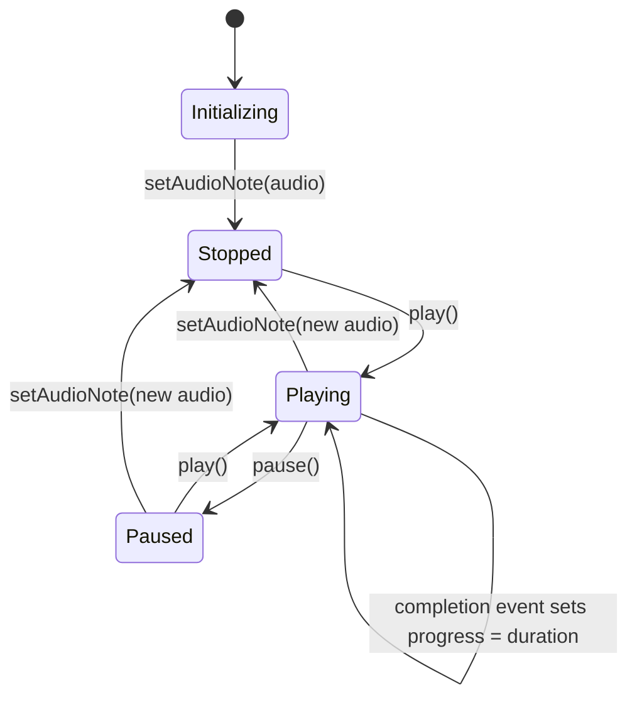

# Speech Feature

The `speech` feature owns audio capture, audio playback, waveform extraction,
and transcript-adjacent tools for `JournalAudio` entries.

In the current implementation it does three concrete jobs:

1. capture audio and persist it as `JournalAudio`
2. play back `JournalAudio` entries with progress, speed, and waveform scrubbing
3. maintain speech-specific metadata around audio entries, including language,
   transcripts, and category speech dictionaries

It does not own provider configuration or the general AI inference stack.
Whenever realtime transcription or linked-task automation is involved, it calls
into AI-side services.

## Directory Shape

```text
lib/features/speech/
├── helpers/
├── model/
├── repository/
├── services/
├── state/
├── ui/
└── README.md
```

## Runtime Architecture



The feature is not only a recorder. It also owns the app-wide playback
controller, waveform cache, transcript maintenance UI, and the category speech
dictionary helper used from the editor.

## Recording

### Standard recording path

Standard recording goes through `AudioRecorderRepository`, which wraps the
`record` package and is responsible for:

- permission checks
- starting file-backed recording at `48kHz`
- pause and resume
- stop and dispose
- amplitude sampling every `20ms`

`AudioRecorderController` sits above that repository and adds:

- Riverpod state for recording UI
- VU calculation from dBFS samples
- linked-entry and category context
- coordination with app-wide playback
- persistence through `SpeechRepository`
- optional hand-off to profile-driven transcription automation

`record()` is a toggle-style entry point:

- if the repository is paused, it resumes
- if the repository is already recording, it stops and saves
- otherwise it starts a new recording

The current recording modal exposes `record` and `stop`. The controller also
has `pause()` and `resume()`, but that branch is not surfaced by the current
modal UI.

### Recorder state

`AudioRecorderState` currently carries:

- `status`
- `progress`
- `vu`
- `dBFS`
- `modalVisible`
- `linkedId`
- `enableSpeechRecognition`
- `partialTranscript`
- `isRealtimeMode`

The enum still includes `AudioRecorderStatus.initializing`, but
`AudioRecorderController.build()` returns `stopped` immediately and uses the
asynchronous initialization step only for permission probing and logging.



One implementation detail worth calling out: the state object still has
`showIndicator`, but the current `AudioRecordingIndicator` widget derives
visibility from `status == recording && !modalVisible` rather than that field.

### Standard recording flow



The persisted `JournalAudio` is created from `AudioData` and stored through
`PersistenceLogic`. The audio file lives under `/audio/YYYY-MM-DD/`.

## Realtime Recording

Realtime recording is a separate transport path. It does not reuse
`AudioRecorderRepository`.

`AudioRecorderController.recordRealtime()`:

- creates a raw `record.AudioRecorder`
- starts `pcm16bits`, `16kHz`, mono streaming
- resolves realtime configuration through `RealtimeTranscriptionService`
- currently requires a configured Mistral realtime model/provider pair
- subscribes to the realtime amplitude stream for the same VU meter
- accumulates transcript deltas into `partialTranscript`

The realtime toggle in `AudioRecordingModal` is only shown when
`realtimeAvailableProvider` resolves to `true`.



Two important implementation details:

1. `stopRealtime()` only creates a `JournalAudio` entry if the realtime service
   actually produced an audio file. Very short recordings can still return
   transcript text from the service, but the controller does not persist
   anything unless an audio artifact exists.
2. When a realtime transcript exists, the controller appends an
   `AudioTranscript` to `JournalAudio.data.transcripts` and also mirrors the
   transcript into `entryText`.

`cancelRealtime()` is a real third path. It tears down the recorder and
realtime service without creating or updating a `JournalAudio` entry.

## Playback And Waveforms

`AudioPlayerController` is a keep-alive Riverpod notifier backed by
`media_kit.Player`.

It owns:

- the active `JournalAudio`
- playback progress
- buffered progress
- playback speed
- pause position
- native player setup and cleanup

The controller subscribes to `media_kit` position, buffer, and completion
streams. It also exposes `disposeActivePlayer()` so `WindowService` can shut
the native player down before process exit.

### Actual player state transitions

The player state is simpler than the README used to claim. In the current
implementation:

- `build()` returns `AudioPlayerStatus.initializing`
- `setAudioNote()` moves the state to `stopped`
- `play()` moves it to `playing`
- `pause()` moves it to `paused`
- completion updates `progress` to the clip duration after a short delay, but
  does not flip `status` back to `stopped`



That last transition is deliberate in this diagram because it reflects the
code as written, not an idealized player state machine.

### Waveform extraction

`AudioPlayerWidget` uses `audioWaveformProvider`, which delegates to
`AudioWaveformService`.

`AudioWaveformService`:

- resolves the local audio file path
- extracts waveform data with `just_waveform`
- downsamples it into UI bucket counts
- caches normalized waveform payloads on disk
- prunes the cache when it grows beyond the configured limit

The cache key includes the audio entry ID and requested bucket count, and the
cache payload is validated against file path, file size, and modified time.

## Transcript Tools

The feature also owns the small speech-specific tools around an existing audio
entry.

### Speech modal

`SpeechModalContent` is a thin composition of:

- `LanguageDropdown`
- `TranscriptsList`

`LanguageDropdown` does not talk to `SpeechRepository` directly. It calls
`EntryController.setLanguage()`, which delegates to
`SpeechRepository.updateLanguage()`.

`TranscriptsList` renders existing `AudioTranscript` entries from
`JournalAudio.data.transcripts`. Each `TranscriptListItem` can remove one
transcript through `SpeechRepository.removeAudioTranscript()`.

Today the language dropdown is hard-coded to:

- `auto`
- `en`
- `de`

That is worth documenting because it is a product constraint in the current UI,
not just a placeholder detail.

### Speech dictionary service

`SpeechDictionaryService` is a separate path from recording and playback.

It supports adding a selected term to a category speech dictionary by:

- looking up the entry from `JournalRepository`
- resolving the category from the task itself or from a task linked to a
  `JournalAudio` or `JournalImage`
- updating the category through `CategoryRepository`

This is why the `speech` feature is wider than "audio recording". It also owns
the category-level speech vocabulary helper used from the editor.

## Automatic Transcription Hand-Off

The helper is still named `AutomaticPromptTrigger`, but the current behavior is
more specific than that name suggests.

What it actually does today:

- only runs when a recording is linked to a task
- asks `profileAutomationServiceProvider` whether that task has an automated
  transcription skill
- optionally forwards the saved audio entry to `SkillInferenceRunner`

What it does not do:

- it does not run for unlinked recordings
- it does not expose a general menu of prompt automations in the modal
- it does not batch-transcribe a realtime recording that already produced its
  own transcript

The checkbox UI in `AudioRecordingModal` is consistent with that behavior:
`checkboxVisibilityProvider` only exposes a speech-recognition checkbox when
the linked task has profile-driven transcription available.

## Boundaries

- `journal` owns entry detail surfaces and supplies `JournalAudio`
- `ai_chat` owns realtime transcription transport and Mistral WebSocket access
- `ai` owns profile automation and skill execution
- `categories` owns the speech dictionary persistence target
- `speech` owns the audio-specific runtime, playback, waveform cache, and
  transcript maintenance layer that connects those systems
