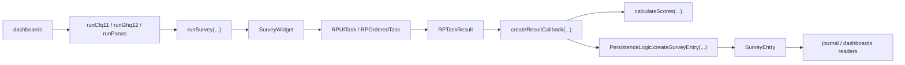
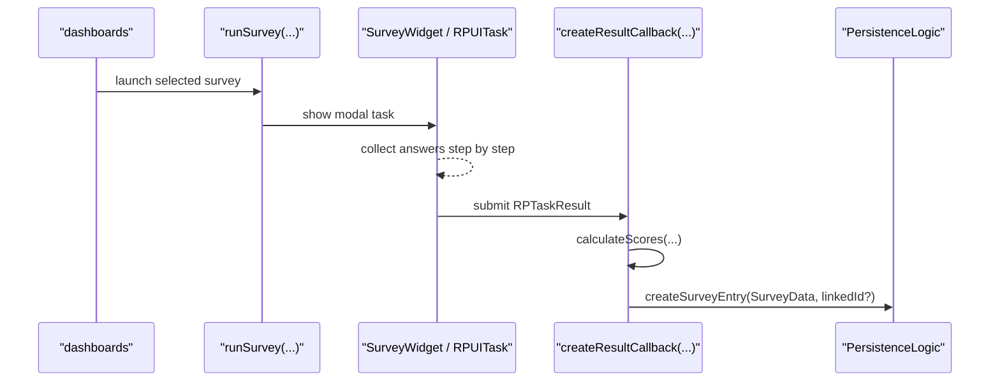
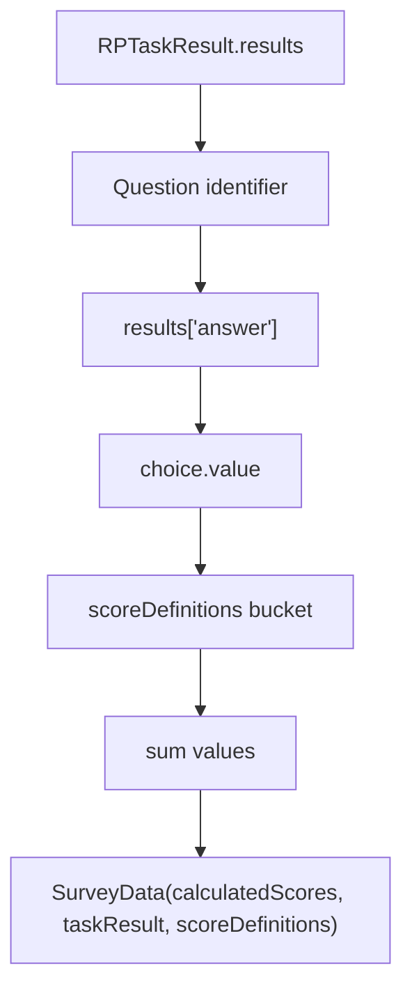

# Surveys Feature

The `surveys` feature executes a small set of predefined questionnaires, calculates score buckets from the submitted answers, and persists the result as a survey journal entry.

It is intentionally narrow in scope. This feature is not a survey-authoring system and it does not own charting or journal presentation.

## What This Feature Owns

At runtime, the feature owns:

1. survey definitions built with `research_package`
2. a thin modal runner around `RPUITask`
3. score calculation based on per-survey score definitions
4. persistence handoff into `PersistenceLogic.createSurveyEntry(...)`

## What It Does Not Own

This feature does not own:

1. the UI affordance that launches a survey
2. dashboard chart configuration or chart rendering
3. journal rendering of persisted survey entries
4. authoring, editing, or syncing survey definitions from outside the app

Those responsibilities currently live elsewhere:

- `dashboards` decides when to launch `runCfq11`, `runGhq12`, or `runPanas`
- `journal` renders persisted `SurveyEntry` data
- `logic/persistence_logic.dart` creates and stores the final entity

## Directory Shape

```text
lib/features/surveys/
├── definitions/
│   ├── cfq11_survey.dart
│   ├── ghq12_survey.dart
│   └── panas_survey.dart
├── tools/
│   ├── calculate.dart
│   └── run_surveys.dart
├── ui/
│   └── fill_survey_page.dart
└── README.md
```

## Runtime Architecture



The architecture is deliberately simple:

- definition files declare `RPOrderedTask`s plus score buckets
- `run_surveys.dart` themes and presents the task inside a modal
- `calculate.dart` converts an `RPTaskResult` into `SurveyData`
- persistence stores both the raw result and the calculated aggregates

There is no surveys-specific controller, repository, or state machine in this feature today.

## Execution Flow



## Survey Definitions

The feature currently ships three hard-coded surveys:

- `CFQ-11`
- `GHQ-12`
- `PANAS`

Each definition file contains the same core ingredients:

- an instruction step
- one or more question steps
- a completion step
- a `Map<String, Set<String>>` that maps score names to question identifiers

That last part matters because the runner does not know anything survey-specific. It only executes a task and hands the raw result to a callback.

## Scoring Model

`calculateScores(...)` is data-driven. For each score bucket, it walks the configured question IDs, reads the answer stored under `stepResult.results['answer']`, extracts the numeric choice value, and sums the result.



This keeps the responsibilities clean:

- definitions describe which questions belong to which score bucket
- the calculator applies one generic aggregation path
- persistence stores both the raw `RPTaskResult` and the computed summaries

## Persistence Contract

The surveys feature does not write directly to storage. `createResultCallback(...)` closes over `PersistenceLogic` and forwards a `SurveyData` object.

`PersistenceLogic.createSurveyEntry(...)` then:

1. derives entry metadata from `taskResult.startDate` and `taskResult.endDate`
2. creates a `JournalEntity.survey`
3. optionally links it to another entry via `linkedId`
4. persists it through the shared journal persistence path

## Cancellation Behavior

Cancellation is intentionally lightweight. `SurveyWidget` logs the partial `RPTaskResult` through `DevLogger`, but it does not persist a `SurveyEntry`.

That matches the current runtime contract: only submitted surveys become journal data.

## Relationship to Other Features

- `dashboards` launches surveys from chart widgets and reads back persisted scores for charting
- `journal` renders `SurveyEntry` details and can embed a survey chart next to the calculated scores
- `surveys` stays focused on task definition, execution, score calculation, and persistence handoff

This feature is small, but the boundary is clear: define a questionnaire, run it, calculate the scores, and hand the result to the rest of the app as first-class journal data.
