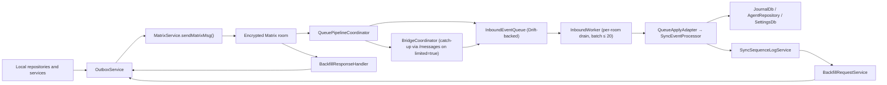
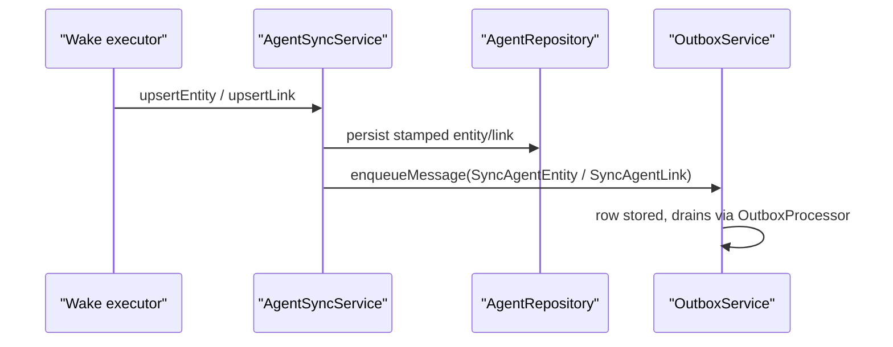
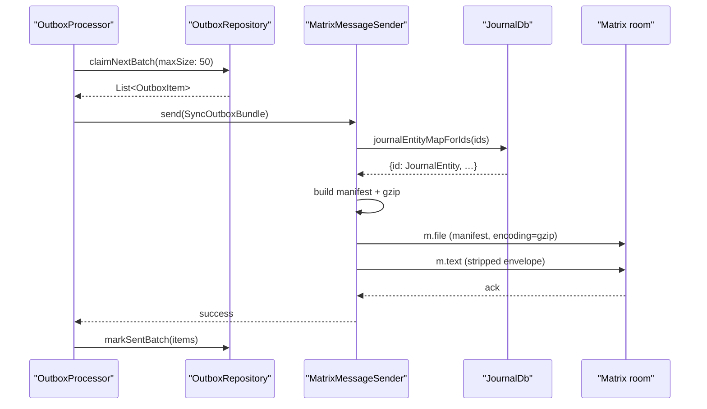
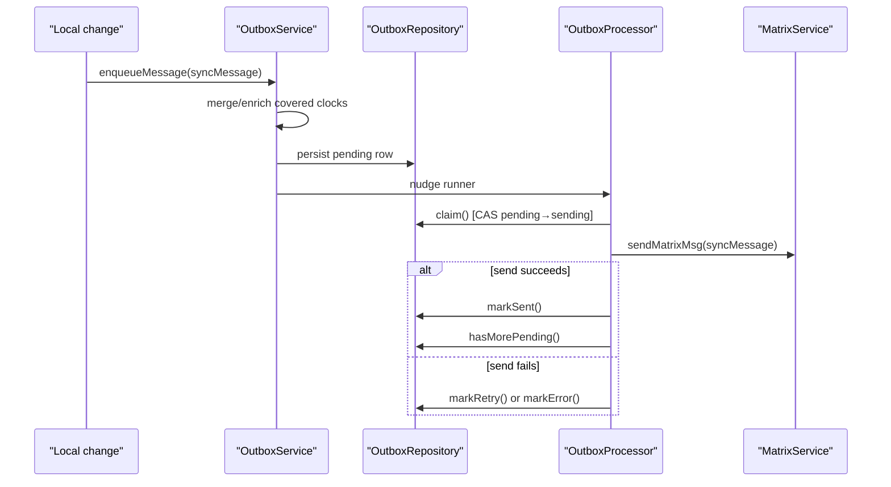
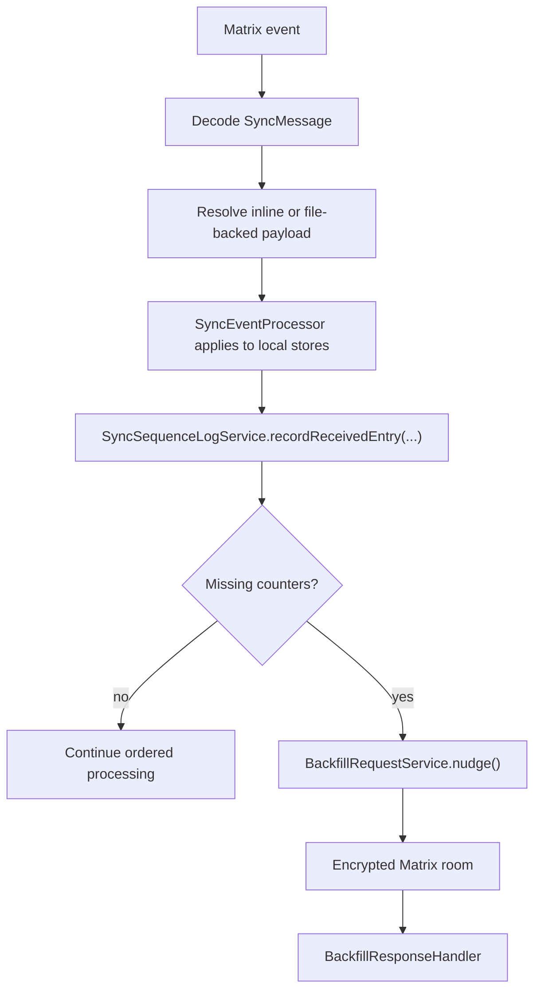
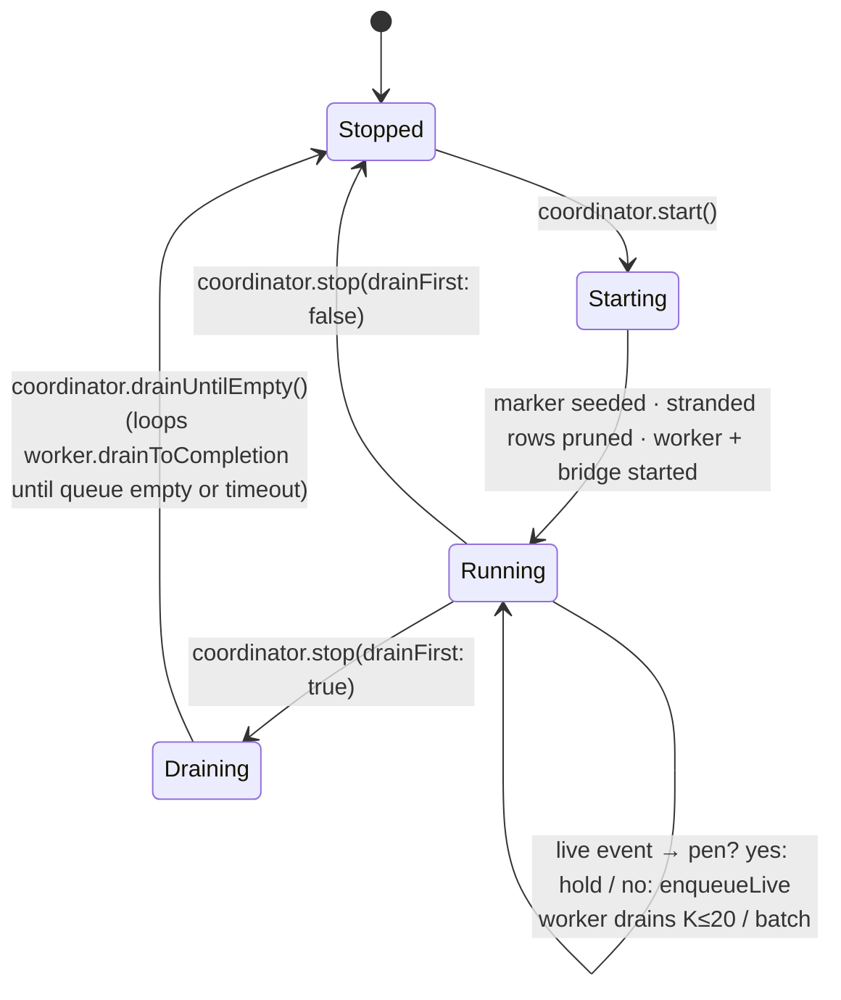
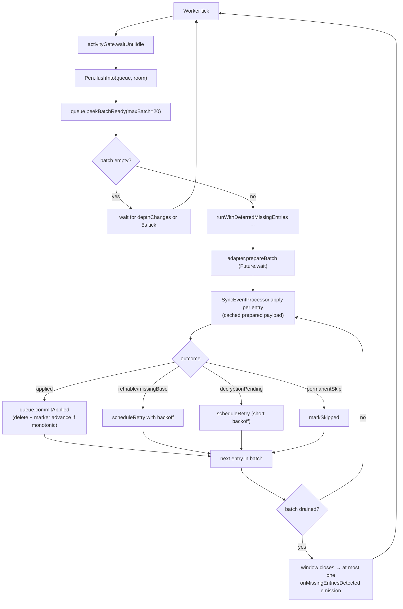
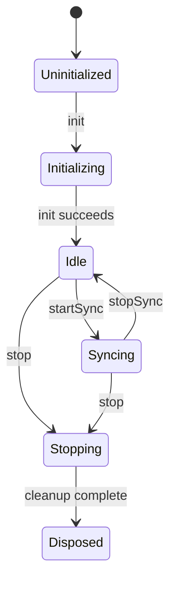

# Sync Feature

`sync` replicates one user's data across that user's devices over Matrix.

This is single-user, multi-device sync. It is not a collaboration layer, and
it is not a raw event forwarder. The feature persists outbound work, replays
inbound Matrix history in order, tracks `(hostId, counter)` coverage, and asks
peers for missing counters when gaps appear.

## Default Runtime Wiring

The default app bootstrap in `lib/get_it.dart` wires the sync feature through
these services:

- `MatrixService`
- `OutboxService`
- `SyncEventProcessor`
- `SyncSequenceLogService`
- `BackfillRequestService`
- `BackfillResponseHandler`

That is the runtime path this README describes.



## What This Feature Owns

At runtime, the sync feature owns:

1. outbound queueing, retries, backoff, and send nudges
2. Matrix session and room lifecycle
3. inbound ingestion via the persistent queue: live `timelineEvents` stream
   plus a `/messages` bridge on `timeline.limited == true` for catch-up
4. applying sync payloads into local stores
5. sequence-log tracking for sequence-aware payloads
6. backfill request and response handling
7. provisioning, maintenance, verification, and diagnostics UI/state

## Code Map

| Area | Role |
| --- | --- |
| `outbox/` | Persist pending payloads in `sync_db`, merge superseded work, enrich sequence metadata, and drive send retries |
| `matrix/` | Session management, room discovery/persistence, message sending, read markers, verification, and high-level lifecycle |
| `matrix/pipeline/` | Attachment ingestion + index, metrics aggregation, and the `sync.limited` Phase-0 diagnostic listener |
| `queue/` | Persistent inbound queue, per-room worker, `onSync` bridge for catch-up, and pending-decryption holding pen |
| `sequence/` | Record `(hostId, counter)` coverage, detect gaps, and track missing/requested/backfilled/deleted/unresolvable states |
| `backfill/` | Send missing-counter requests and answer peer requests with resend, deleted, unresolvable, or covering-payload hints |
| `state/` and `ui/` | Riverpod controllers and sync-facing settings, stats, diagnostics, provisioning, and maintenance screens |
| `actor/` | Separate isolate-based sync implementation; present in the repo, but not wired by the default bootstrap path above |

## Message Model

Transport payloads are `SyncMessage` values.

Current message families in `model/sync_message.dart`:

- `journalEntity`
- `entityDefinition`
- `entryLink`
- `aiConfig`
- `aiConfigDelete`
- `themingSelection`
- `backfillRequest`
- `backfillResponse`
- `agentEntity`
- `agentLink`

Sequence-tracked payloads are narrower:

- `journalEntity`
- `entryLink`
- `agentEntity`
- `agentLink`

> The `agentBundle` wire variant still exists in [sync_message.dart][sync-message]
> so messages from peers that predate the wake-bundle removal continue to parse,
> but the receiver no-ops them and the producer never builds new ones —
> agent-wake writes hit the outbox as individual `agentEntity`/`agentLink` rows
> and the generic dequeue-time bundler ([SyncOutboxBundle](#syncoutboxbundle))
> coalesces them. Children of any in-flight legacy bundle resurface via the
> per-(host, counter) backfill path on demand.

Those payloads can carry:

- `originatingHostId`
- `coveredVectorClocks`

`coveredVectorClocks` are not optional decoration. `SyncSequenceLogService`
pre-marks covered counters before normal gap detection so a newer payload can
prove that older counters were semantically superseded instead of simply lost.

## Vector Clock Mechanism

`VectorClock` in this feature is a `Map<String, int>` from host id to that
host's monotonic counter.

For locally written payloads, the map answers:

> "When this payload version was written, what counters were already present in
> the version it was derived from, plus the current host's next counter?"

`VectorClockService.getNextVectorClock(previous: ...)` keeps the previous clock
entries and advances only the current host's counter. For a brand-new local
payload with no previous clock, the map contains only the current host's
counter.

That is different from `originatingHostId`:

- `originatingHostId` identifies the host that created or modified the current
  payload version
- `vectorClock` carries the causal snapshot that payload was created from, and
  it can mention other hosts too

### Compare Rules

`vector_clock.dart` implements four comparison outcomes for
`VectorClock.compare(a, b)`:

- `equal`: both clocks contain the same counters
- `a_gt_b`: `a` dominates `b`; every host counter in `a` is greater than or
  equal to `b`, and at least one is greater
- `b_gt_a`: the same relation in the other direction
- `concurrent`: neither clock dominates the other

Important details from the implementation:

- missing host entries compare as `0`
- negative counters are invalid and throw `VclockException`
- `VectorClock.merge(a, b)` takes the per-host maximum

### Compare Examples

| A | B | `compare(A, B)` | Why |
| --- | --- | --- | --- |
| `{A: 5}` | `{A: 5}` | `equal` | Same counter for every host |
| `{A: 7}` | `{A: 5}` | `a_gt_b` | `A` moved forward |
| `{A: 5}` | `{A: 7}` | `b_gt_a` | Same case in reverse |
| `{A: 1, B: 1}` | `{A: 1}` | `a_gt_b` | Missing hosts count as `0`, so `B:1 > 0` |
| `{A: 3, B: 1}` | `{A: 1, B: 3}` | `concurrent` | `A` is ahead on one host and behind on another |

Merge example:

```text
merge({A:5, B:1}, {A:3, B:4, C:2}) == {A:5, B:4, C:2}
```

### How Sync Uses Vector Clocks

The feature uses vector clocks in three separate ways.

1. Conflict and freshness checks

   `SyncEventProcessor` and `MatrixMessageSender` compare clocks to decide
   whether the payload on disk, in memory, or already stored locally is older,
   newer, equal, or concurrent.

   When a `concurrent` result is reached the incoming payload is stored as a
   `Conflict` row instead of being merged. The user can pick a winner from the
   **Settings → Advanced → Conflicts** page. The list shows status, entity
   type, creation timestamp and an 8-char prefix of the conflict id; tapping a
   row opens the resolution surface.

   The detail page (`ConflictDetailRoute`) renders an inline-diff picker:
   each side's title is run through a word-level LCS
   (`computeTitleDiff` in `ui/widgets/conflicts/title_diff.dart`) so tokens
   unique to local are tinted as `added`, tokens the remote dropped are
   line-through `removed`, and tokens the remote introduced are tinted as
   `replaced`. The accent palette comes from the new `colors.conflict.*`
   token group (local = teal, remote = blue, diverged = amber); the
   highlight backgrounds come from `colors.diff.*`. Selection lives in
   widget state — tapping a card or a picker pill (`Use this device`,
   `Use from sync`) only stages the choice; the sticky footer's Apply
   button is what commits via `PersistenceLogic.updateJournalEntity`.
   Cancel beams back without writing. `Edit & merge…` (a third desktop
   pill, a left-side mobile link) routes to the existing
   `/settings/advanced/conflicts/<id>/edit` surface for hand merges.

   The desktop V2 panel uses `DetailIdDispatch(idParamKey: 'conflictId')`
   so the right-hand pane swaps from list to picker when the URL gains an
   id, matching the categories / labels / dashboards flows.

   ```mermaid
   stateDiagram-v2
       [*] --> Detected: incoming clock is concurrent with local
       Detected: Detected (status = unresolved)
       Detected --> Picking: user opens conflict detail
       Picking: Picking (no side staged yet)
       Picking --> Local: tap This device card / pill
       Picking --> Remote: tap From sync card / pill
       Local --> Picking: tap the other side
       Remote --> Picking: tap the other side
       Local --> Resolved: tap Apply
       Remote --> Resolved: tap Apply
       Picking --> Detected: tap Cancel
       Resolved --> [*]
   ```

2. Gap detection

   `SyncSequenceLogService.recordReceivedEntry()` iterates every host in the
   incoming clock except the receiver's own host, not only the originator.
   It only turns those observations into gaps for the originator and for hosts
   the receiver has already seen online. That means a payload written by Alice
   can still reveal that Bob's counter `7` is missing if the clock carries
   Bob at `8` and the receiver already has Bob in host activity.

3. Supersession tracking

   `coveredVectorClocks` carries the counters that a newer payload
   semantically replaces. The receiver processes those covered clocks before
   normal gap detection.

### Example: Rapid Updates On One Host

Suppose host `A` updates the same journal entry several times before the outbox
drains:

1. first version: `{A:5}`
2. second version: `{A:6}`
3. third version: `{A:7}`

The outbox merge path can collapse those into one pending message with:

```text
vectorClock = {A:7}
coveredVectorClocks = [{A:5}, {A:6}, {A:7}]
```

On receive, `SyncSequenceLogService` filters out the covered clock equal to the
current payload clock before pre-marking. The practical result is:

- counters `5` and `6` are marked as covered/received first
- counter `7` is recorded as the payload being applied now
- the receiver does not leave `5` and `6` behind as permanent "missing" rows

That behavior is covered by the outbox and sequence-log tests.

### Example: Multi-Host Clock, Single Originator

Suppose the previous stored version already had:

```text
{Alice:9, Bob:8}
```

That can happen because Bob edited earlier, synced that version, and Alice
later edited the same payload locally.

When Alice writes the next local version, `getNextVectorClock(previous: ...)`
preserves Bob's counter and advances Alice's own counter, producing:

```text
originatingHostId = Alice
vectorClock = {Alice:10, Bob:8}
```

This means:

- the current payload version was produced on Alice
- Bob's `8` was inherited causal history from the previous version, not a
  counter Alice invented locally
- by the time this Alice-authored version was written, it still carried the
  fact that Bob's counter `8` was already part of that payload's history

If another device has already seen Bob online and its local sequence log says
Bob only reached `6`, then receiving Alice's payload can legitimately create a
gap for Bob's counter `7`. If Bob has never been seen online by that receiver,
the code still records Bob's counter from the vector clock but skips gap
detection for Bob.

That is why gap detection walks all hosts in the vector clock, not only the
originator.

### Example: Why A Later Clock Is Not Enough

Later clock alone is insufficient:

```text
missing counter: {A:11}
new payload clock: {A:20}
```

`{A:20}` proves that the sender knows about later work. It does not prove that
counter `11` was semantically superseded by the payload currently being
received.

That proof has to come from explicit covered clocks. A realistic message may
look like:

```text
vectorClock = {A:20}
coveredVectorClocks = [{A:10}, {A:12}, {A:15}, {A:20}]
```

The receiver will pre-mark the covered counters `10`, `12`, and `15`, then
handle `20` as the current payload. Any non-covered counters between them can
still remain missing and can still trigger backfill.

In this feature, vector clocks describe causal knowledge.
`coveredVectorClocks` describes semantic replacement.

## Send Path

`OutboxService` stages local work in `sync_db`, merges superseded work when it
can, enriches sequence-aware payloads with covered clocks, and nudges a
`ClientRunner`-driven `OutboxProcessor`.

### Agent Wake-Cycle Sync

Agent wake execution does **not** install any wake-scoped sync interceptor.
Each `AgentRepository` write performed inside the wake commits immediately,
receives a vector clock at write time, and enqueues its own `SyncAgentEntity`
or `SyncAgentLink` row in `OutboxService`. The dequeue-time outbox bundler
described below coalesces those rows into one `SyncOutboxBundle` per Matrix
event when the queue depth allows it.



An earlier design coalesced wake writes into a `SyncAgentBundle` envelope
flushed at the terminal edge of the wake scope. The wire variant is still
parseable (peers running an older build can be received without errors), but
the producer no longer builds it: agent writes ride the same generic
dequeue-time bundling path that journal entities and entry links use.

If a peer is missing one of the children that an in-flight legacy bundle
silently dropped, the receiver's per-(host, counter) gap detection in
`SyncSequenceLogService` will reopen the gap and `BackfillRequestService`
will pull each child from the originating peer as an individual
`SyncAgentEntity` / `SyncAgentLink` response.

### Dequeue-Time Outbox Bundling

A second, transport-only bundle layer fires inside `OutboxProcessor` itself.
When `OutboxRepository.claimNextBatch(maxSize: SyncTuning.outboxBundleMaxSize)`
returns more than one row, the processor wraps them in a `SyncOutboxBundle`
and ships the whole batch as one Matrix envelope. Media-attachment rows
(`filePath != null`) always travel alone — the boundary rule lives in
`claimNextBatch`, so a bundle never carries audio or image bytes.

`MatrixMessageSender._sendOutboxBundlePayload` builds the on-the-wire form:

1. Bulk-load every `SyncJournalEntity` child's `JournalEntity` from
   `JournalDb.journalEntityMapForIds` in a single `WHERE id IN (…)` query —
   the database is the system of record, so the sender never reads
   per-child JSON files from disk.
2. Reconcile each child envelope's `vectorClock` against the DB version
   (same logic as the per-row `_sendJournalEntityPayload` reconcile block,
   just aggregated over the bundle).
3. Emit a single manifest of records:
   `{version: 1, entries: [{envelope: <SyncMessage>, payload: <JournalEntity?>}]}`.
   Inline-payload families (`SyncEntryLink`, `SyncAiConfig`,
   `SyncAiConfigDelete`, `SyncEntityDefinition`, `SyncThemingSelection`,
   `SyncBackfillRequest`, `SyncBackfillResponse`) and agent envelopes
   (`SyncAgentEntity`, `SyncAgentLink`) carry their data inside the freezed
   envelope and need no separate `payload` field.
4. `gzipEncodeJson` the manifest map (json.encode + utf8.encode + gzip on
   a worker isolate) and upload as a single `m.file` event with
   `relativePath: /outbox_bundles/<uuid>.json`, upload display name
   `<uuid>.json.gz`, and `extraContent.encoding = "gzip"` — same
   convention as compressed agent payloads (`relativePath` describes the
   on-disk artifact; `.gz` rides along on the upload name only). No temp
   file ever touches the sender's disk.
5. Send the thin `SyncOutboxBundle` text event — `children: []`, `jsonPath`
   pointing at the just-uploaded `.json` cache path.

Receivers reverse the path inside
`SyncEventProcessor._resolveOutboxBundleManifest`:

1. Reuse the existing descriptor pipeline; `decodeAttachmentBytes` gunzips
   the manifest bytes transparently.
2. Bulk-load the local `JournalEntity` map for every `SyncJournalEntity`
   id in the manifest — one query, no N+1.
3. For each entry, run a vector-clock dominance check against the
   database. When the local copy already covers the incoming envelope's
   clock, leave the on-disk JSON cache alone so
   `SmartJournalEntityLoader` returns the canonical local entity.
   Otherwise, write the inlined payload to its declared `jsonPath` so the
   apply pipeline reads it as a cache hit and skips the descriptor index
   entirely.
4. Hand the reconstructed children list to `OutboxBundleUnpacker.prepare`,
   which dispatches each through the existing per-type prepare path.

The manifest is rejected if:

- the `version` field is absent or unequal to
  `SyncTuning.outboxBundleManifestVersion`,
- the `entries` array is missing, or
- the post-gzip size exceeds `SyncTuning.outboxBundleMaxBytes` (8 MiB).

In each case the bundle is dropped (`null` returned) and
`OutboxRepository.markRetryBatch` re-queues every row for the next pass.
Outbox rows stay pending until they are acknowledged as sent, so a failed
manifest send simply re-bundles from outbox state on the next drain — no
on-disk artifact survives across attempts.



`OutboxProcessor` then:

1. atomically claims the pending head (`pending` → `sending`) via
   `OutboxRepository.claim()`, so in-flight merges fall through to a fresh
   pending row instead of overwriting the claimed row
2. sends the claimed payload through `MatrixService`
3. marks it sent, retryable, or errored in `sync_db`
4. probes `hasMorePending()` to decide immediate continuation

The send path is also nudged by:

- connectivity regain
- Matrix login completion
- outbox row-count changes
- a watchdog for pending-but-idle queues

Sending is gated by `UserActivityGate`, so the queue waits for idle time before
running a send pass.



The `claim()` step is a CAS from `pending` to `sending` on the row. Any
merge that fires while the send is in flight runs
`updateOutboxMessage(... WHERE status = pending)` and gets
`affectedRows = 0`, so the merged content spills into a fresh pending
row (via the existing fresh-insert fallback in `_enqueueAgentPayload` /
`_enqueueJournalEntity` / `_enqueueEntryLink`) instead of silently
overwriting the row whose old content is currently being serialized on
the wire. Without this, the old pre-merge Matrix event would still go
out while the new `coveredVectorClocks` list sat in a row that would
never be sent — producing scattered single-counter holes on receivers
that only backfill could resolve.

## Receive Path

`MatrixService` composes `SyncEngine`, `SyncRoomManager`,
`QueuePipelineCoordinator`, and `SyncEventProcessor`. The retained
`MatrixStreamConsumer` is a thin façade that seeds startup state for the
`SyncEventProcessor`, attaches the `sync.limited` Phase-0 diagnostic via
`MatrixStreamSignalBinder`, and surfaces metrics for the Matrix Stats UI —
inbound ingestion is owned by the queue pipeline.

The important runtime rules are:

- `QueuePipelineCoordinator` subscribes to `MatrixSessionManager.timelineEvents`
  for live ingestion and to `Client.onSync` for catch-up triggers
- live events are routed through `PendingDecryptionPen` so pre-decryption
  ciphertext never lands in `inbound_event_queue.raw_json`, then enqueued via
  `InboundEventQueue.enqueueLive`
- on `timeline.limited == true`, `BridgeCoordinator` walks `/messages` back to
  the per-room marker stored in `queue_markers` and feeds events through the
  same enqueue path
- `InboundWorker` drains each room in batches of up to 20 (gated by
  `UserActivityGate`), prepares events in parallel via `QueueApplyAdapter`, and
  applies them through `SyncEventProcessor` inside a single `JournalDb.transaction`
- `event_id` UNIQUE on the queue table is the sole cross-producer dedupe
  primitive; `lease_until` is a durable worker lease that survives crashes
- per-room markers in `queue_markers` advance only after a successful slice
  commit, so a crash mid-drain just re-leases the same rows on restart

`SyncEventProcessor` decodes `SyncMessage`, resolves file-backed payloads,
applies them to local stores, records sequence state, and delegates backfill
messages to `BackfillResponseHandler`.

Journal entities and agent payloads can be file-backed via `jsonPath`. Those
payloads are resolved through the attachment/index loader path before they are
applied, which is why attachment ordering and dedupe matter to sync behavior.

### Attachment Encoding

Attachment events may carry a `com.lotti.encoding` key in the Matrix event
content that declares an on-wire encoding applied by the sender. The only
value currently defined is `gzip`, which signals that the raw bytes returned
from `event.downloadAndDecryptAttachment()` are a gzip stream and must be
decompressed before the file is written to the local documents directory.
The `relativePath` in the event is still the logical target path, unchanged
by the encoding.

Receivers decode this header unconditionally, so the receive path is
forward-compatible with senders that later opt in. On the send side, gzip
compression is gated by the `use_compressed_json_attachments` config flag
(off by default) and only applies when the attachment's `relativePath` ends
in `.json`, since media files are already compressed and would not benefit.
When the flag is on, the uploaded file name gains a `.gz` suffix and the
event content includes the encoding header; otherwise bytes are sent
verbatim with no header and no suffix.



## Inbound Event Queue

The queue pipeline is the sole receive path. `MatrixStreamSignalBinder` is
retained only for the `sync.limited` Phase-0 diagnostic; ingestion is owned
by `QueuePipelineCoordinator` → `BridgeCoordinator` → `InboundEventQueue` →
`InboundWorker` → `QueueApplyAdapter`.

Components (all under `lib/features/sync/queue/`):

- **`InboundQueue`** — Drift-backed queue in `sync_db`
  (`inbound_event_queue` table + `queue_markers` per-room table). `event_id`
  UNIQUE is the sole cross-producer dedupe primitive; `lease_until` is a
  durable worker lease that survives crashes.
- **`InboundWorker`** — per-room drain loop. Wraps each batch in
  `SyncSequenceLogService.runWithDeferredMissingEntries` so per-slice gap
  detections coalesce into one `onMissingEntriesDetected` emission — the
  F1 concern from the design review. Honours `UserActivityGate`.
- **`BridgeCoordinator`** — subscribes to `Client.onSync` and, on any
  joined room's `timeline.limited == true`, walks `/messages` back to the
  stored marker via `CatchUpStrategy.collectEventsForCatchUp`, feeding
  the result to `enqueueBatch` with `producer=bridge`. Single-flight.
- **`PendingDecryptionPen`** — LRU holding pen for Megolm-encrypted events
  that arrive before their session key. The worker re-resolves them via
  `room.getEventById` on every drain iteration; only fully-decrypted
  events ever reach `raw_json` (F3).
- **`QueueApplyAdapter`** — bridges the worker to
  `SyncEventProcessor.prepare`/`apply`. Prepare runs outside the writer
  transaction, apply inside — preserving the P1 freeze fix (#2981).
  Per-batch parallel prepare: `bindPrepareBatch()` returns a hook the
  worker invokes with the whole batch before the per-entry apply loop.
  Prepare is I/O-bound (attachment downloads, gzip decode, JSON
  decode) so fanning out via `Future.wait` collapses the critical
  path to the slowest entry instead of the sum. Prepared payloads are
  cached by `eventId` and consumed one-at-a-time by the apply phase;
  terminal outcomes (permanentSkip, pendingAttachment, retriable)
  caught at prepare time also survive in the cache so apply surfaces
  them without re-running prepare.
- **`QueuePipelineCoordinator`** — owns the above plus the live producer
  subscription; exposed on `MatrixService.queueCoordinator`.
- **`QueueMarkerSeeder`** — one-shot migration copying the legacy
  `lastReadMatrixEventTs`/`Id` into `queue_markers` on first enable.
  Never overwrites an existing row.

### Lifecycle



### Worker batch drain (F1 coalescing preserved)



### Marker advancement is monotonic (F2)

`commitApplied` reads the existing `queue_markers` row and only advances
`last_applied_ts` / `last_applied_event_id` when
`TimelineEventOrdering.isNewer` returns true — so an out-of-order apply
(live event at ts=100 applied first, then a bridge event at ts=60 from
the same burst) cannot regress the stored marker.

### UI (flag-gated on `backfill_settings_page.dart`)

- `QueueDepthCard` — subscribes to `InboundQueue.depthChanges`, shows
  total + per-producer breakdown + empty-state message.
- `FetchAllHistoryDialog` — drives
  `QueuePipelineCoordinator.collectHistory` with an in-dialog cancel
  button and page-by-page progress.

### Observability

Pipeline-tagged log lines let a log analyzer compare apply rates:

- Queue pipeline: `queue.commit pipeline=queue eventId=... originTs=... markerAdvanced=...`
- Legacy pipeline: `marker.local id=... ts=... pipeline=legacy`

The Phase-2 ±15% gate compares event/sec rates between the two.

### Sidebar activity indicator (D4a)

`SyncActivitySignaler` (`state/sync_activity_signaler.dart`) is a
broadcast pulse emitter wired into the two committal chokepoints:

- **TX** — `DatabaseOutboxRepository.markSent` and `markSentBatch` pulse
  one event per row that actually transitioned to `status=sent`.
- **RX** — `InboundQueue.commitApplied` pulses one event per row that
  flipped to `status=applied`.

The signaler is registered as a `getIt` singleton and exposed to the UI
via `syncActivityTxPulsesProvider` / `syncActivityRxPulsesProvider`.
The sidebar `SyncActivityIndicator` (`ui/widgets/sync_activity_indicator.dart`,
gated behind the `show_sync_activity_indicator` config flag) listens
to both streams to drive a 140 ms LED flash per packet, alongside live
counts pulled from `outboxPendingCountProvider` (existing) and
`inboundQueueDepthProvider` (new — sourced from
`InboundQueue.depthChanges` via `MatrixService.queueCoordinator`).
Tapping the strip beams to `/settings/sync` (Settings → Sync), where
the outbox monitor, queue depth card, backfill, and sync stats live.

The signaler is fire-and-forget and carries no payload; correctness
still lives in the underlying queue/outbox state. Producers tolerate a
null signaler (constructors take `SyncActivitySignaler?`) so tests that
do not need the indicator can omit it without modifying call sites.

## Sequence Log And Backfill

`SyncSequenceLogService` is the causal accounting layer. It records which
`(hostId, counter)` pairs are known locally and tracks transitions through
states such as:

- `missing`
- `requested`
- `received`
- `backfilled`
- `deleted`
- `unresolvable`

Important implementation details:

- gap detection runs for hosts that have been seen online, plus the current
  originating host
- sent entries from this device are recorded so peers can request them later
- later vector clocks do not automatically close gaps; explicit coverage still
  matters
- verified covering entries are used as hints when an exact payload is no
  longer the best answer

`BackfillRequestService` periodically sends bounded batches of missing
counters, supports manual full historical backfill, and can re-request entries
that were previously requested but never resolved.

`BackfillResponseHandler` can answer a request with one of four outcomes:

- exact payload resend
- `deleted`
- `unresolvable`
- a verified covering payload hint

Responses are rate-limited and cooled down per `(hostId, counter)` so repair
traffic does not turn into its own loop.

## Isolate Actor Path

`actor/` contains a separate isolate-based implementation:

- `SyncActorCommandHandler`
- `SyncActorHost`
- actor-side `OutboundQueue`

That code has a real lifecycle in `actor/sync_actor.dart`:



The actor path is worth documenting because it is in the repo and tested, but
it is not the default bootstrap path described above.

## Current Constraints

The code still depends on a few sharp assumptions:

- sender-side `coveredVectorClocks` enrichment has to stay correct for offline
  convergence to stay sound
- file-backed payload replay depends on attachment dedupe and ordering in
  `matrix/pipeline/attachment_*`
- backfill correctness depends on verified `(hostId, counter) -> payloadId`
  mappings, not on "some later vector clock exists"
- the detailed performance and failure analysis lives in
  [current_architecture.md](./current_architecture.md), not in this overview

## Relationship To Other Features

- `journal` repositories and `PersistenceLogic` enqueue journal entities and
  links
- `agents/sync/agent_sync_service.dart` enqueues agent entities and links
- `ai` repositories enqueue AI config updates and deletes
- theming changes enqueue `themingSelection`
- sync-facing settings, verification, maintenance, and diagnostics UI live
  under `lib/features/sync/ui/` and `lib/features/sync/state/`

## Further Reading

- [current_architecture.md](./current_architecture.md)
- [docs/implementation_plans/2026-03-13_sender_offline_convergence.md](../../../docs/implementation_plans/2026-03-13_sender_offline_convergence.md)

Read this README first for the runtime shape. Read
[current_architecture.md](./current_architecture.md) when you need the recent
failure history, log-backed investigations, and tuning context.
