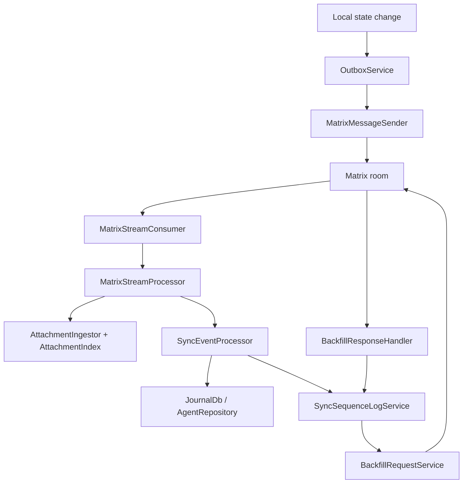
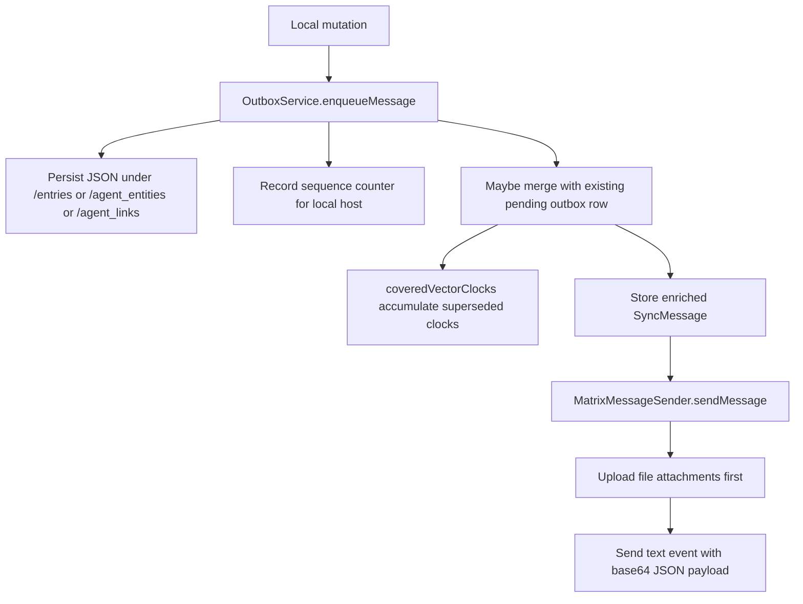
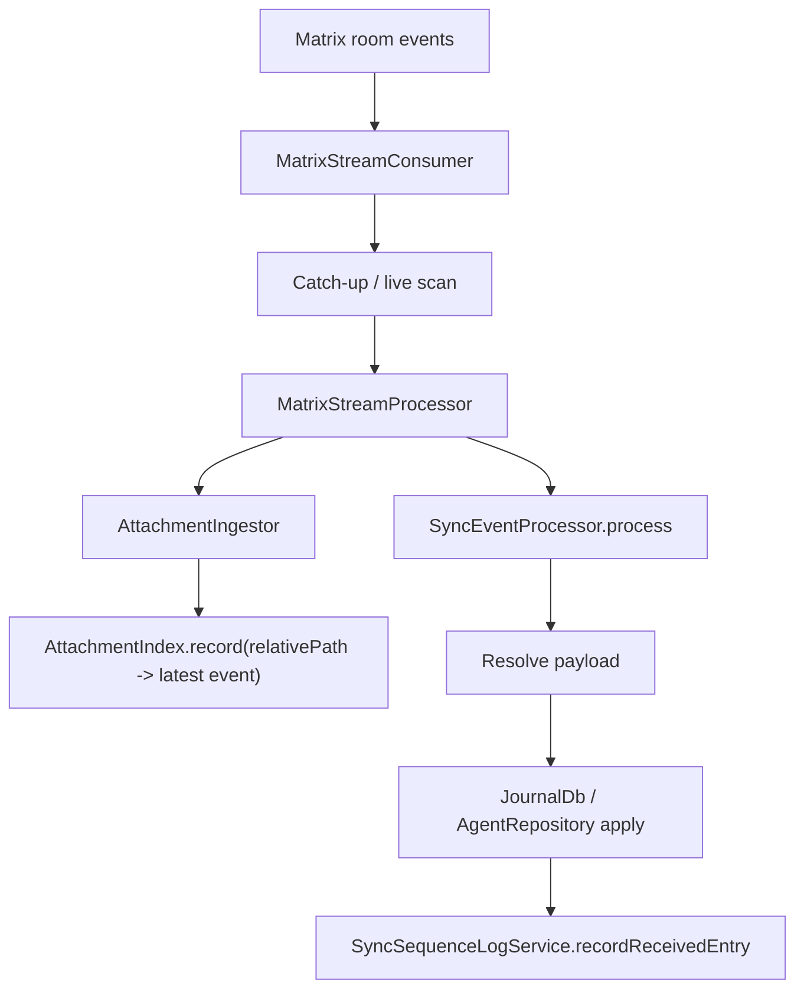
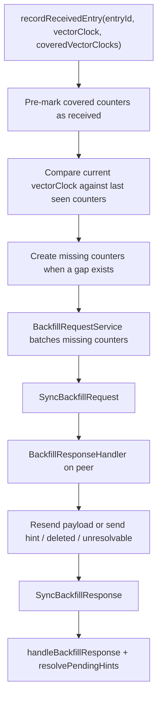
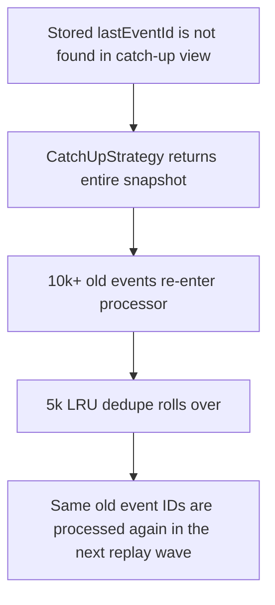
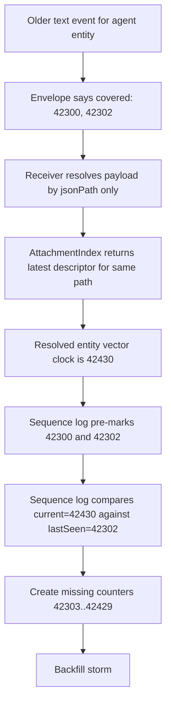
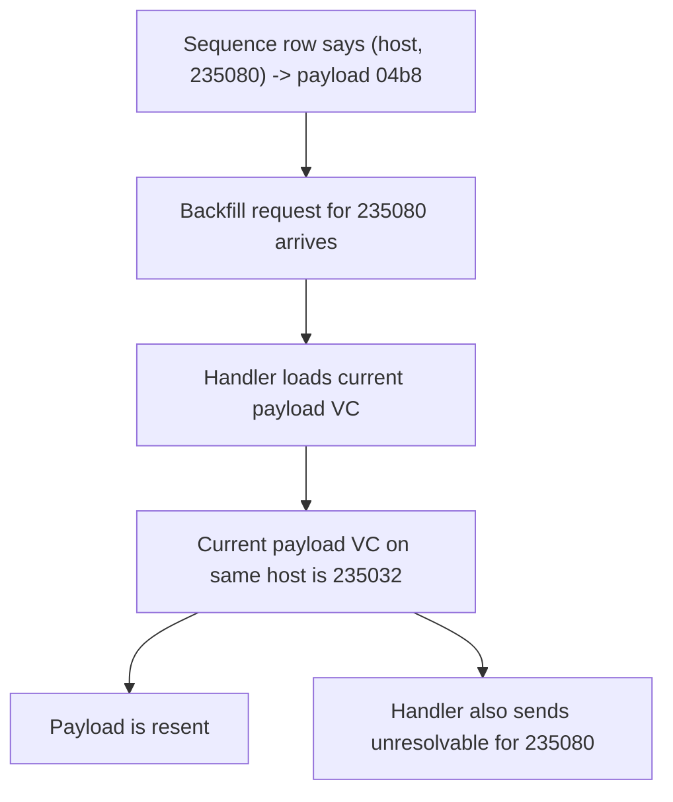

# Sync Current Architecture

## Scope

This document describes the sync system as it exists in the codebase on
2026-03-11.

It is not a target architecture document. It is a map of the current system,
the recent fix history, and the code-backed failure surfaces that are relevant
to the current investigation.

The user request behind this document is specific:

- desktop log volume is far too high for the amount of real work performed
- sync does eventually converge, but slowly
- some entries are reported missing or unresolvable when they should not be

The evidence used here comes from:

- `lib/features/sync/**`
- `test/features/sync/**`
- `logs/sync-2026-03-11.log`
- `logs/sync-2026-03-11_desktop.log`
- `logs/sync-2026-03-11_mobile.log`
- recent sync PRs in March 2026

## Executive View

The main control loop is:

The important property is that sync is not just "send message, apply message".
It is a feedback system:

- normal sync writes sequence state
- sequence state can create missing entries
- missing entries produce backfill requests
- backfill responses can update or reopen sequence entries
- newer messages can mark older counters as covered

That makes it powerful, but also very easy to amplify mistakes.

## Recent Fix Timeline

These PRs matter directly for the current behavior:

| PR | Date | Title | Relevant change |
| --- | --- | --- | --- |
| `#2749` | 2026-03-05 | `fix: sync hot loop & missing accounting` | added missing-accounting work, backfill cooldowns/rate limits, and agent sequence tracking |
| `#2752` | 2026-03-06 | `feat: improve population of sequence log` | population/backfill support extended to agent entities and agent links |
| `#2762` | 2026-03-07 | `feat: improve sync of agent data structures` | improved agent sync handling, startup population, self-request guard |
| `#2773` | 2026-03-09 | `fix: sync backfill issue` | old backfill requests stopped being skipped |
| `#2774` | 2026-03-09 | `fix: backfill logic & improved logging` | nearest-covering lookup, agent covered clocks, race-condition work, more logging |
| `#2784` | 2026-03-11 | `chore: sync timing tweaks` | faster request/response timing and larger backfill batches |
| `#2785` | 2026-03-11 | `refactor: improve logging` | more observability, not a behavioral change by itself |

That sequence matters. The system was recently changed in ways that:

- increased sequence-log coverage
- increased backfill aggressiveness
- increased agent sync participation in the same machinery
- deliberately re-enabled processing of historical backfill requests

## 2026-03-11 Stabilization Update

Since the first draft of this document, two targeted fixes have landed:

- exact backfill hits are now validated before resend, instead of trusting any
  `(hostId, counter) -> payloadId` row blindly
- marker-missing catch-up now returns a bounded tail with explicit logging,
  instead of replaying the entire visible snapshot

The log evidence below is still useful because it explains why those changes
were necessary. The remaining open question is whether the agent
text-event-to-attachment binding model is still producing synthetic gaps after
those stabilizations.

## Observed Symptoms In The 2026-03-11 Logs

There are now three relevant artifacts:

- `logs/sync-2026-03-11_mobile.log`: about `409 KB`
- `logs/sync-2026-03-11_desktop.log`: about `9.5 MB`
- `logs/sync-2026-03-11.log`: combined capture, `24 MB`, `162811` lines

The combined log is the most useful one for pattern analysis because it shows
the repeated replay waves in one place.

Top combined categories observed:

- `processor.SyncEventProcessor`: `60529`
- `processor.apply`: `49134`
- `processor.resolve`: `18499`
- `backfill.response`: `10904`
- `sequence.backfillResponse`: `10014`
- `backfill.cooldownSkip`: `4702`
- `outbox.send`: `2292`
- `outbox.enqueue`: `1162`
- `backfill.found`: `995`
- `sequence.recordSent`: `946`
- `sequence.coveredClocks`: `796`
- `backfill.skipSelf`: `310`
- `sequence.gapDetected`: `268`

The asymmetry is still important:

- mobile is mostly producing work
- desktop/combined logs are dominated by processing, backfill response
  handling, and repeated sequence activity

That still points away from "sender just created too much" and toward
"receiver is doing too much with what it sees".

The biggest new symptom is that the same old event IDs are replayed in large
waves:

- `lotti-2911-1770920513575` appears at lines `95`, `32445`, `63568`,
  `91964`, `144091`
- each time it is immediately followed by
  `backfill.skipSelf: skipping own request (7 entries)`
- the next historical journal event also restarts from the same old event:
  `lotti-5479-1771763051862` at lines `97`, `32447`, `63570`, `91966`,
  `144093`

The replay batches are not small:

- lines `95..32444`: `11551` processing events
- lines `32445..63567`: `10649`
- lines `63568..91963`: `10463`
- lines `91964..144090`: `20508`
- lines `144091..end`: `7357`

That is large enough to overflow the current `5000`-event in-memory dedupe in
the stream processor.

## File Map

| Area | Files | Role |
| --- | --- | --- |
| Send path | `outbox/outbox_service.dart`, `matrix/matrix_message_sender.dart` | stage payloads, merge pending work, upload JSON and text events |
| Receive path | `matrix/pipeline/matrix_stream_consumer.dart`, `matrix/pipeline/matrix_stream_processor.dart` | catch-up, live scan, retry, ordered processing |
| Attachment resolution | `matrix/pipeline/attachment_index.dart`, `matrix/pipeline/attachment_ingestor.dart` | remember latest attachment by path and fetch/save payloads |
| Apply path | `matrix/sync_event_processor.dart` | decode messages, resolve payloads, upsert journal/agent state |
| Gap tracking | `sequence/sync_sequence_log_service.dart` | detect gaps, mark covered counters, resolve hints |
| Backfill request loop | `backfill/backfill_request_service.dart`, `backfill/backfill_response_handler.dart` | ask for and answer missing counters |
| Message model | `model/sync_message.dart`, `vector_clock.dart` | message schema and vector clock comparison |

## Core Flows

## 1. Send Path

### Relevant code

`OutboxService._enqueueAgentPayload()`:

- writes agent JSON to a stable path based on entity ID
- merges `coveredVectorClocks` only if the previous outbox row is still pending
- falls back to inserting a fresh row if the old row is no longer pending

`MatrixMessageSender._enrichAndUploadAgentPayload()`:

- uploads the JSON file first
- for `SyncAgentEntity`, strips the inline payload and keeps only `jsonPath`
- for `SyncAgentLink`, preserves the inline payload

That last point is a major difference between agent entities and agent links.

## 2. Receive Path

### Relevant code

`MatrixStreamConsumer` now treats client stream events mostly as signals and
processes ordered slices through catch-up/live scan.

`AttachmentIngestor.process()` records descriptors before the payload is
applied.

`AttachmentIndex` is intentionally simple:

- it maps `relativePath -> Event`
- later events overwrite earlier ones for the same path

That behavior is explicit in `attachment_index.dart`.

## 3. Gap Detection And Backfill

### Relevant code

`SyncSequenceLogService.recordReceivedEntry()` does the work in this order:

1. update host activity
2. filter and pre-mark `coveredVectorClocks`
3. detect gaps using the current vector clock
4. upsert the actual `(hostId, counter)` records
5. resolve pending hints

That order is deliberate. It is also why a bad "current vector clock" can
create a large false gap even if some older counters were correctly marked as
covered.

## Code-Backed Failure Surfaces

The sections below are not guesses without evidence. Each one is backed by
specific code and log behavior. The confidence level differs by item.

## Failure Surface 1: Room History Is Being Replayed In Large Waves

### What the code says

There are three relevant receive-side facts in the code.

#### Old backfill requests are intentionally still processed

In `sync_event_processor.dart`, startup timestamp filtering no longer skips old
backfill requests.

This change was introduced by PR `#2773` (`fix: sync backfill issue`), whose
behavioral summary is: old backfill requests are processed again instead of
being filtered out.

The tests lock this in:

- `test/features/sync/matrix/sync_event_processor_test.dart`
  contains `processes old SyncBackfillRequest even when startupTimestamp is set`

#### Catch-up returns the whole snapshot if the marker cannot be found

`CatchUpStrategy.collectEventsForCatchUp()` returns:

- only events after `lastEventId` when the marker is found
- the entire snapshot when `lastEventId` cannot be located

That fallback is explicit in `catch_up_strategy.dart`.

#### Live scan cannot explain a 10k+ replay by itself

`buildLiveScanSlice()` uses:

- all events strictly after `lastEventId` when the marker is present
- otherwise only the last `tailLimit` events

The current live-scan fallback is therefore bounded by the tail size, while the
combined log replay batches are well above `10000` events.

#### The stream processor dedupe is too small to suppress these waves

`MatrixStreamProcessor` keeps only:

- `5000` recent `_seenEventIds`
- `5000` recent `_completedSyncIds`

### What the logs show

The combined log shows the same old event IDs recurring in five waves:

- `lotti-2911-1770920513575` at `95`, `32445`, `63568`, `91964`, `144091`
- `lotti-5479-1771763051862` at `97`, `32447`, `63570`, `91966`, `144093`
- `lotti-1398-1772247098914` at `2460`, `34787`, `65925`, `94321`, `118359`,
  `146433`
- `lotti-551-1772404042430` at `6337`, `38668`, `69802`, `103929`, `122236`,
  `150318`
- `lotti-1457-1772741602869` at `7228`, `39559`, `70693`, `104820`, `123127`,
  `151213`
- `lotti-2109-1772758819401` at `7258`, `39589`, `70723`, `104850`, `123157`,
  `151243`

The first event in each large wave is immediately followed by:

- `backfill.skipSelf: skipping own request (7 entries)`

The wave sizes are also much larger than the processor's `5000`-event dedupe:

- `11551`
- `10649`
- `10463`
- `20508`
- `7357` in the last partial wave

This is important because it proves the receiver is not only revisiting a few
old requests. It is replaying large slices of old room history.

### Why it matters

The code-plus-log fit here is much tighter than "old backfill requests are
expensive".

What is proven:

- old request traffic is intentionally still processed
- the same old event IDs are replayed in large waves
- those waves are too large to be explained by the live-scan tail fallback
- those waves are too large for the `5000`-entry LRU dedupe to suppress

What is still an inference:

- the exact trigger is likely "catch-up marker missing, so full snapshot
  fallback", but the combined log does not currently include a direct
  `syncLoggingDomain` line saying that in plain words

Even with that caveat, this is a real overhead source. It also creates the
conditions for every downstream bug to be paid repeatedly.

### Confidence

High confidence that room history is being replayed in large waves.

Moderate-to-high confidence that catch-up full-snapshot fallback is the
mechanism, because it matches the code shape and the observed replay size far
better than live scan does.

## Failure Surface 2: Agent Payload Resolution Can Mismatch Text Event Generation

This remains a strong candidate for one class of false gap storms.

### What the code says

#### Stable path reuse for agent entities

`relativeAgentEntityPath()` in `lib/utils/file_utils.dart` returns:

- `/agent_entities/<id>.json`

That means repeated updates to the same agent entity reuse the same file path.

`OutboxService._enqueueAgentPayload()` writes agent payload JSON to that stable
path before enqueueing the message.

#### Agent text events can be file-only

`SyncMessage.agentEntity` has:

- `agentEntity`
- `jsonPath`
- `originatingHostId`
- `coveredVectorClocks`

It does **not** have its own top-level vector clock field.

`MatrixMessageSender._enrichAndUploadAgentPayload()` then strips inline payload
for `SyncAgentEntity`:

- uploaded file first
- returned message keeps `jsonPath`
- returned message sets `agentEntity: null`

So the receiving text event for an agent entity can carry:

- `jsonPath`
- `coveredVectorClocks`
- `originatingHostId`

but **not** the actual payload vector clock inline.

#### Receiver resolves by latest attachment for that path

`AttachmentIndex.record()` stores the last-seen attachment event for a path.

`SyncEventProcessor._fetchFromDescriptor()` looks up the descriptor only by
normalized `jsonPath`:

- `index.find(indexKey)`

There is no binding between:

- a specific text event
- and the exact attachment event that was uploaded for that text event

#### Sequence logging uses the resolved entity vector clock

For agent entities, `SyncEventProcessor` records sequence state using:

- `resolvedEntity.vectorClock`

not a vector clock from the text envelope.

That means the sequence log trusts whatever JSON version `_resolveAgentEntity()`
returned.

### What the logs show

The mobile log shows the same agent entity
`da28f3a4-050b-4516-a141-0f6296c19a72` sent three times:

- `17:00:02.625`
- `17:00:59.009`
- `17:03:22.766`

The mobile sequence log records counters for that same entity:

- `42300`
- `42302`
- `42328`
- `42430`

The desktop log shows the same entity being processed three times at matching
event times:

- text event around `17:00:02.811`
- text event around `17:00:59.181`
- text event around `17:03:22.943`

For the first desktop receive:

- `coveredVectorClocks` logged only `42300` and `42302`
- immediately after that, the receiver reports a large gap from `42302` to
  `42430`

That exact combination is only possible if the current vector clock seen by the
sequence log is already `42430` while the envelope still only covers the older
versions.

### Why this matters

This is the exact synthetic-gap mechanism:

This is not just a vague idea. The mechanism is explicitly permitted by the
current code shape.

### What is proven vs not yet proven

Proven by code:

- same agent entity path is reused across versions
- latest attachment wins in the index
- agent text events can be file-only
- sequence logging uses the resolved payload vector clock

Strongly supported by logs:

- the first receive of `da28...` behaves exactly like "old envelope + newer
  resolved payload"

Not yet proven:

- whether this is the only dominant source of false gaps across the whole log
- whether journal payloads hit a similar issue in a different form

### Confidence

High confidence that this is a real correctness hazard.

Moderate-to-high confidence that it is a major contributor to the observed
false gap storms.

## Failure Surface 3: The Attachment Side Also Prefers Latest-By-Path

This is related to Failure Surface 2 but worth separating.

### What the code says

`AttachmentIngestor` treats agent payload files as legitimately mutable in
place and always re-downloads them.

Its queueing logic is also keyed by normalized relative path.

That means the attachment layer itself is optimized around "latest file for
this path", not "exact file version that belonged to this text event".

### Why it matters

Even if the direct descriptor lookup were not enough on its own, the rest of
the attachment handling is reinforcing the same identity model:

- path identifies the payload
- latest descriptor for that path is authoritative

That is a sensible design for cache freshness, but it is dangerous if the text
event is supposed to be causally paired with one exact descriptor generation.

### Confidence

High confidence that this amplifies Failure Surface 2.

## Failure Surface 4: Backfill Can Answer From A Sequence Row Whose Payload VC Is Behind The Requested Counter

### What the code says

`BackfillResponseHandler._processBackfillEntry()` first does an exact lookup:

- `getEntryByHostAndCounter(hostId, counter)`

That lookup is just a direct DB read through:

- `SyncSequenceLogService.getEntryByHostAndCounter()`
- `SyncDatabase.getEntryByHostAndCounter()`

If the row exists and has an `entryId`, the handler treats it as a candidate
answer source and continues.

For agent entities, `_processAgentBackfillEntry()` then:

1. loads the payload by `payloadId`
2. enqueues that payload to send again
3. checks whether the payload's current vector clock contains the requested
   `(hostId, counter)`

If the current VC is behind the requested counter for our own host,
`_sendHintOrUnresolvable()` sends an `unresolvable` response.

### What the logs show

The combined log proves that this situation is really happening.

Concrete sequence:

- line `68`: local send recorded
  `counter=235080 entryId=04b8b458-4775-4ded-bb76-67bc8bfe6594`
- line `213`: local send recorded
  `counter=235082 entryId=09280a33-da27-4956-90d1-c8dea88f75f9`
- line `63549`: backfill exact lookup finds
  `235080 -> 04b8b458-4775-4ded-bb76-67bc8bfe6594`
- line `63550`: when resending that payload, the current exact counter on the
  same host is logged as `235032`
- line `63552`: handler logs
  `backfill.vcBehind ... counter=235080 ... vcCounter=235032`
- line `63554`: handler sends `unresolvable`
- line `63560`: exact lookup finds `235082 -> 09280a33-da27-4956-90d1-c8dea88f75f9`
- line `91957`: handler logs
  `backfill.vcBehind ... counter=235082 ... vcCounter=235079`
- line `91959`: handler sends `unresolvable`

The same pattern repeats later:

- `142913` / `142917` / `142919`
- `142923` / `142924` / `142926`

This is not only a log artifact. The combined log also shows that newer
receives are recording covered clocks for those same payload IDs:

- `60700`, `88679`, `139626`:
  `04b8b458-...` covers `{..., 6d4abd...: 235080}`
- `142893`, `142945`:
  `09280a33-...` covers `{6d4abd...: 235084}`

So there are rows in the sequence log that still map an old exact counter to a
payload whose current VC is already somewhere else.

### Why it matters

This is a real correctness break, not only overhead.

It proves all of the following:

- the sequence log can contain `(hostId, counter) -> payloadId` mappings that
  no longer match the payload's current VC
- backfill request handling trusts those rows enough to answer from them
- the handler can then discover that its own answer source is invalid and emit
  `unresolvable`

What is not yet proven:

- whether the inconsistent row comes from stale hints being preserved too long
- whether it is downstream of the agent path/descriptor mismatch in Failure
  Surface 2
- whether there is another sequence-log update bug for agent entities

But the contradiction itself is proven.

### Confidence

High confidence that this is a real correctness hazard and a real source of
`unresolvable` churn.

## Failure Surface 5: Duplicate And Stale Journal Events Still Mutate Sequence State

### What the code says

`SyncEventProcessor` still calls `recordReceivedEntry()` for journal entities
in three important cases:

- stale descriptor path
- duplicate path
- normal applied/existing path

This is deliberate. The code comment says duplicates still need sequence-log
processing so `resolvePendingHints()` can run.

Inside `recordReceivedEntry()`, the sequence service still:

1. pre-marks covered clocks
2. detects gaps
3. upserts `(hostId, counter)` rows
4. resolves pending hints

So replayed duplicates are not cheap no-ops.

### What the logs show

The combined log is dominated by one old journal entity:

- `id=07b703a4-628a-55ed-9c24-de412053089c` appears `14055` times

The same covered-clock triplets repeat across replay waves:

- `190809`
- `195534`
- `204889`

Examples:

- `6106..6112`, then `7230..7287`
- `38437..38443`, then `39561..39618`
- `69571..69577`, then `70695..70752`
- `103698..103704`, then `104822..104879`
- `122005..122011`, then `123129..123186`
- `150086..150093`, then `151215..151272`

That proves the replay waves are repeatedly re-running covered-clock handling
and not merely dropping old events at the edge.

### Why it matters

This is the bridge between Failure Surface 1 and the rest of the damage.

If large history replays only logged and returned, the system would still be
slow, but it would be much less dangerous. Instead, replayed duplicates keep
touching the sequence log, which means:

- repeated covered-clock processing
- repeated hint resolution attempts
- repeated opportunities to reopen or mutate missing/backfill state

### Confidence

High confidence that this is real churn and a major amplifier.

## Implementation Note: `startupTimestamp` Is Now Misleading

This is not the main bug, but it matters because it can mislead future
debugging.

`SyncEventProcessor.startupTimestamp` is still documented as:

- "events with backfill requests older than this are skipped"

But the field is no longer used for that behavior, and the tests explicitly
assert the opposite:

- old backfill requests are still processed
- old backfill responses are still processed

### Confidence

High confidence that the comment/field contract is stale and should be cleaned
up to match reality.

## Test Coverage Map

The current tests cover important pieces, but there is still a notable hole.

### Covered well

- `matrix_message_sender_test.dart`
  - agent entity file upload
  - inline payload stripping
  - descriptor-based vector clock adoption for journal entities

- `outbox_service_test.dart`
  - agent `coveredVectorClocks` merge while still pending
  - fallback insert when the old row is no longer pending

- `sync_event_processor_test.dart`
  - descriptor-based agent resolution from `AttachmentIndex`
  - startup handling of old `SyncBackfillRequest`
  - agent sequence logging

### Not covered by focused invariant tests

There is no targeted test that proves the room-history replay path end to end:

1. stored `lastEventId` is missing from catch-up
2. catch-up returns a full snapshot
3. more than `5000` old events re-enter processing
4. the same old event IDs are seen again in a later wave

There is also no targeted test that proves the exact sequence-mapping
contradiction end to end:

1. `(hostId, counter)` resolves to a payload ID in the sequence log
2. the current payload VC for that same payload is behind the requested counter
3. backfill resends the payload
4. backfill also sends `unresolvable`

And there is still no targeted test that spans all of the following at once:

1. same `SyncAgentEntity` ID reused across multiple sends
2. same `jsonPath` reused across those sends
3. older text event still carries only older `coveredVectorClocks`
4. `AttachmentIndex` now points at the newer descriptor for that path
5. `recordReceivedEntry()` uses the newer resolved vector clock
6. a false large gap is produced

That is the most important missing test for the current investigation.

## Recommended Next Verification Work

The next step should not be a speculative fix. It should be a narrow,
reproducible test sequence.

Recommended order:

1. Add a focused test around `BackfillResponseHandler` plus sequence-log state
   that reproduces:
   - exact `(host, counter) -> payloadId` hit
   - payload VC behind the requested counter
   - resend + `unresolvable` in the same handling pass
2. Add a catch-up / stream pipeline test that simulates:
   - missing `lastEventId`
   - full-snapshot fallback
   - replay batch size above `5000`
   - same old event IDs reprocessed in the next wave
3. Add a focused test in `sync_event_processor_test.dart` or a pipeline test
   that simulates:
   - same agent entity path
   - two or three versions
   - older text event processed after the index was updated to the newest
     descriptor
4. Assert whether the sequence log receives:
   - older covered clocks
   - newer resolved vector clock
   - and therefore emits the false gap
5. Only after that decide the fix shape

Likely fix directions to evaluate:

- stop treating any exact sequence row with non-null `entryId` as immediately
  answerable when the payload VC is already behind the requested counter
- bind catch-up progression more tightly to a durable marker so the consumer
  cannot fall back to full-room replay so easily
- bind text events to their exact descriptor event ID instead of path-only
  lookup
- include the agent entity vector clock directly in the text envelope even when
  payload is file-backed
- refuse to use a resolved descriptor whose vector clock is ahead of the
  envelope's declared coverage in a way that would synthesize new gaps

Those are options, not conclusions.

## Summary

The current sync system has three important truths at the same time:

1. the intended model is reasonable: ordered replication plus vector-clock
   dominance plus backfill
2. the actual implementation is a tightly coupled feedback loop where small
   causality mistakes get amplified into missing-counter storms
3. there are now two proven runtime failures in the evidence:
   large room-history replay waves, and exact backfill mappings whose current
   payload VC is already behind the requested counter

The agent path-based descriptor resolution model is still a strong candidate
for one deeper source of false gaps, because it allows an older text event to
be paired with a newer payload generation for the same `jsonPath`.

But the combined log changed the investigation in an important way: there is
now enough evidence to stop talking about a single hypothetical root cause.
At minimum, the current implementation has:

- a replay mechanism that reprocesses large old room slices
- a sequence/backfill integrity problem for some agent counters
- an agent attachment model that still looks structurally capable of creating
  synthetic gaps
