# Tasks Feature

The `tasks` feature is the task-specific layer on top of Lotti's shared journal substrate.

A task is still a `JournalEntity`, but this feature is where it becomes a proper task with its own specific behaviors.

It owns the task-specific experience:

- detail surfaces
- checklist management
- linked-task management
- task progress calculation
- task-specific filter UI hooks
- priority, due-date, labels, project, and cover-art presentation

## What This Feature Owns

At runtime, the feature owns:

1. task detail page composition
2. checklist CRUD and reorder behavior
3. linked-task UI and manage mode
4. task progress aggregation and display
5. task-specific filter widgets and display toggles that plug into the shared journal page controller
6. task detail controls for status, category, priority, project, due date, labels, estimate, and language

It does not own raw task persistence by itself. Task entities still live in the journal/persistence layer, and many write operations flow through shared controllers or repositories there.

## Directory Shape

```text
lib/features/tasks/
├── model/
├── repository/
├── services/
├── state/
├── ui/
│   ├── checklists/
│   ├── filtering/
│   ├── header/
│   ├── labels/
│   ├── linked_tasks/
│   ├── pages/
│   └── widgets/
├── util/
└── widgetbook/
```

## Architecture

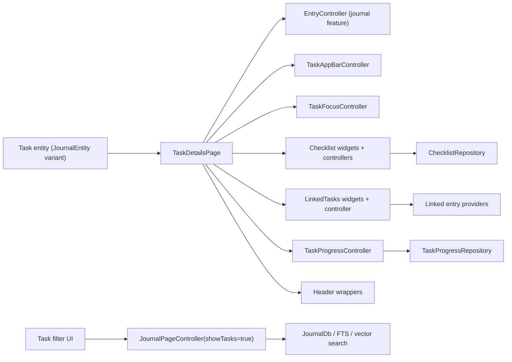

The important boundary here is that the tasks feature owns task behavior and task presentation, but it intentionally reuses the shared journal controllers and persistence paths where possible.

## Tasks Tab Browse Page

The redesigned tasks tab is an in-place browse-page migration, not a new query stack.

`TasksTabPage` still reads from `JournalPageController(showTasks: true)` and still uses the journal feature's existing infinite paging path. The redesign only swaps the browse presentation layer on top of that controller.

In desktop split-pane mode, `TasksRootPage` keeps the list pane mounted while
the detail pane is keyed by the selected task ID. That gives each task detail
surface its own state lifetime instead of reusing the previous task's
stateful page internals across selection changes.

### Desktop task detail stack

On desktop, the right-hand task detail pane is backed by a per-pane stack
held on `NavService.desktopTaskDetailStack` (`ValueNotifier<List<String>>`).

- `TasksLocation` calls `resetDesktopTaskDetail(taskId)` when the URL
  changes, seeding the stack with one entry — the task selected from the
  list pane (the "base").
- Tapping a row inside `LinkedTasksWidget` from inside a task's details
  calls `pushDesktopTaskDetail(linkedId)` so the linked task is shown on top of
  the base, *strictly inside* the right-hand pane. The list pane on the
  left remains visible. Mobile keeps using `Navigator.push` with a
  `MaterialPageRoute` because the navigator stack and the visible
  navigation stack are the same thing on mobile.
- The back arrow in `TaskCompactAppBar` / `TaskExpandableAppBar` is only
  rendered on desktop when `desktopTaskDetailStack.length > 1`. The base
  task hides the arrow because the list pane already lets the user
  return to a sibling task. Pressing the arrow on desktop calls
  `popDesktopTaskDetail()` instead of `NavService.beamBack()`.
- `desktopSelectedTaskId` is kept in sync with `stack.last` so existing
  list-pane highlight listeners keep working without changes.

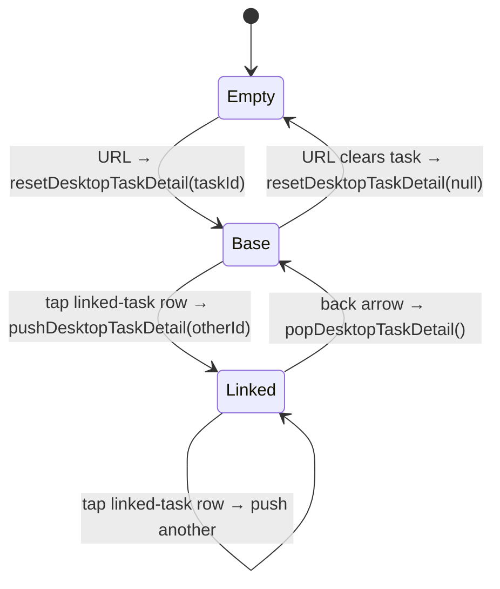

At runtime the browse page does three specific things:

1. it converts paged `JournalEntity` results into `TaskBrowseEntry` rows via `buildTaskBrowseEntries`
2. it derives section headers from the active sort mode
3. it reuses the same grouped-card interaction model as the projects tab so hover and selection backgrounds can suppress adjacent dividers cleanly

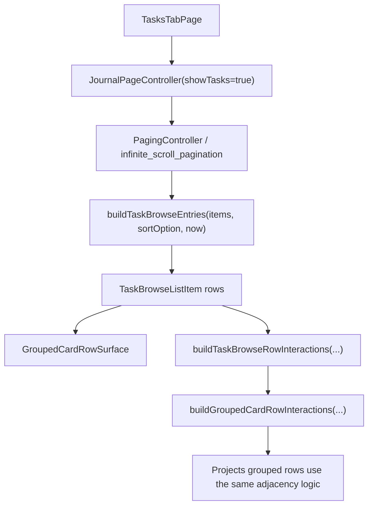

The section semantics are intentionally sort-dependent:

- due-date sort groups into `Today`, `Tomorrow`, `Yesterday`, exact due dates, or `No due date`
- created-date sort groups by the task creation day
- priority sort groups by priority buckets

That is why the browse model carries section metadata separately from the row widget. The card does not guess how to group tasks; it receives that decision from the browse-entry model.

## Core Data Model

Tasks are represented by the `Task` journal entity variant with `TaskData`.

Important task concerns represented directly in `TaskData` include:

- title
- status
- priority
- estimate
- due date
- checklist IDs
- cover-art ID
- language preference
- inference profile ID
- AI-suppressed label IDs

Two important boundaries:

- label assignments live on entry metadata (`meta.labelIds`), not in `TaskData`
- project membership is resolved through the `projects` feature, not embedded as a task field

Checklist content is modeled separately through checklist entities and linked checklist-item entities. That split matters because the UI allows drag, drop, reorder, export, and cross-checklist movement without flattening everything into one giant task row.

## Task Detail Composition

`TaskDetailsPage` is the main task surface. It composes:

- `TaskSliverAppBar`
- `TaskForm` (which begins with the `DesktopTaskHeaderConnector`)
- linked entries with timer-aware highlighting
- reverse linked-from entries
- `TaskActionBar` — a sticky frosted-glass bar hosted in the page's
  `Scaffold.bottomNavigationBar` slot, replacing the floating action
  button. It exposes the most-frequent inline actions directly: a
  "Track time" pill plus round affordances for add-checklist,
  import-image, audio recording, and "more actions" (opens
  `CreateEntryModal` for long-tail items — Event / Text / Paste image /
  link to event, plus capture-screenshot on macOS and Linux). The pill
  has two states:
  - Idle: tapping starts a new timer linked to this task.
  - Tracking-this-task: the live elapsed time replaces the label, with
    an inset stop circle on the leading edge. Tapping the pill body
    navigates to the running timer entry (mirrors the desktop sidebar
    timer card); only the inset stop circle stops the timer. The
  duration text uses `numericBadgeFontFeatures` (tabular figures,
  slashed zero, cv02/03/04) so digits don't shift width as they tick.
  When linked AI inference is running for the task, the bar grows an inline
  top slot above the action row and renders `AiRunningDecoderBars`, a subtle
  decoder-bars shader driven by the same running-inference provider that used
  to feed the separate Siri-wave card. The slot animates its reserved height
  together with shader amplitude and opacity on entry and exit, and removes the
  shader subtree after collapsing.

  The button row is a single `Row` wrapped in a `LayoutBuilder`. When
  the available width can't fit all five children on one line,
  affordances are dropped in priority order: image first, then
  checklist (both stay reachable via the "..." menu). The thresholds
  are exposed as `TaskActionBar.minWidthForImageButton` and
  `TaskActionBar.minWidthForChecklistButton`.
  The Track time pill reserves the localized idle-label width while a
  timer is active, so toggling time recording does not recenter the
  trailing audio, checklist, image, or more-action affordances. The chip
  foregrounds rely on the glass fill and hairline border for contrast
  rather than glyph shadows, avoiding stale-looking shadow silhouettes
  when the row repaints over blurred content. The shared glass strip
  adds a token-backed scrim over the blur so bright screenshots or
  light embedded media cannot wash the row out.
  The page sets `Scaffold.extendBody: true` so body content paints
  behind the bar — that's what the `BackdropFilter` blurs. The mobile
  shell hides its bottom nav pill whenever the active beamer route is
  `/tasks/<uuid>` (computed in `_AppScreenState._isTaskDetailRoute`,
  no per-page lifecycle plumbing), so the action bar can dock flush
  against the home indicator. The desktop shell uses the same predicate
  to hide its bottom-right floating recording indicator on task detail
  routes, since the action bar already exposes the recording control.
  TaskActionBar consumes the safe-area inset internally.

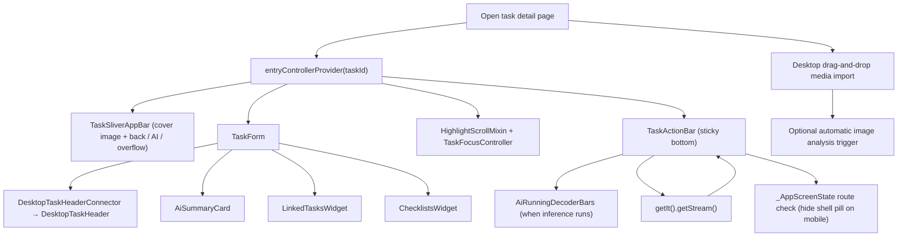

This page is not just "show task fields." It is the task workspace where task metadata, linked content, time tracking, and AI-adjacent affordances meet.

### Sidebar timer coordination

`SidebarTimerSection` (desktop, `aboveSettings` slot — see `lib/widgets/README.md` for the visual contract) and `TaskActionBar`'s running pill both render the same live `TimeService` session. To avoid duplicating the task title on screen, the sidebar card hides itself when the action bar is already showing the indicator — but only when the action bar is actually visible.

The hide condition is the conjunction of:

- the running timer's `linkedFrom` is a `Task`,
- `linkedFrom.meta.id == NavService.desktopSelectedTaskId`, and
- `NavService.currentPath` starts with `/tasks/` (i.e. user is on a task-detail route).

The route check matters because `desktopSelectedTaskId` is sticky across tab switches: it's only mutated by `tasks_location.dart` (via `NavService.resetDesktopTaskDetail` / `pushDesktopTaskDetail` / `popDesktopTaskDetail`). Without the path guard, switching from a task to e.g. Habits would leave the sidebar card hidden even though the action bar is no longer on screen.

Reactivity sources composed inside the card:

- `TimeService.getStream()` — running entity + duration. Seeded with `TimeService.getCurrent()` as `initialData` so an already-running session renders on first frame instead of flashing through a hidden state.
- `NavService.desktopSelectedTaskId` (`ValueListenableBuilder`) — selection changes inside the tasks pane.
- `NavService.getIndexStream()` (`StreamBuilder`) — top-level tab/route changes; `currentPath` is read synchronously when the stream emits.

The show/hide flip runs through an `AnimatedSwitcher` + `AnimatedSize` (`SidebarTimerSection.animationDuration` ≈ 220 ms, `Curves.easeInOut`) so the card fades and the surrounding sidebar collapses smoothly instead of popping.

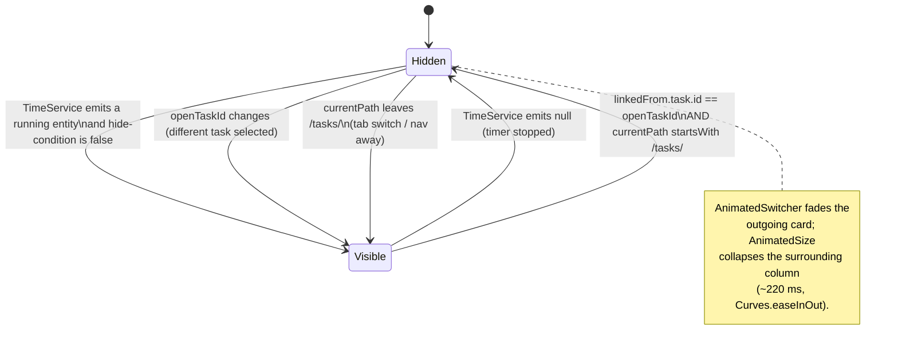

Inside `TaskForm`, the composition is also fairly opinionated:

- `DesktopTaskHeaderConnector` for the interactive header: inline multi-line title edit, priority badge, project reference (with a "No project" placeholder when none is linked), work-category chip (or "unassigned" placeholder), due-date chip (or "No due date" placeholder), estimate chip (with progress bar when set), assigned label chips (or "Add Label" placeholder), and status dropdown. Extended actions (share, speech modal, etc.) are owned by the pinned app bar's `more_vert` button, not the header itself. The connector watches `entryControllerProvider`, `projectForTaskProvider` and the labels stream, maps the task to an immutable `DesktopTaskHeaderData` plus a Riverpod-aware `estimateSlot`, and forwards callbacks to the existing modal pickers (`TaskStatusModalContent`, `showDueDatePicker`, `showEstimatePicker`, `CategorySelectionModalContent`, `ProjectSelectionModalContent`, `LabelSelectionModalUtils`) plus `EntryController.save / updateTaskStatus / updateTaskPriority / updateCategoryId`
- an `EditorWidget` only for legacy tasks that already have non-empty entry text
- `AiSummaryCard` — a single deep-teal-tinted-navy surface that hosts the agent's TLDR + expandable inline report, the unified open-proposal list with swipe / button confirm-or-reject + collapsible history, the recent-activity footer (inline expand), and the wake-cycle affordances (run-now, cancel timer, and a countdown that switches from `m:ss` to `h:mm:ss` once an hour cell is needed). Tapping the agent name (or the avatar / "Open agent internals" pill) opens `AgentInternalsPanel`, a right-side overlay (600–800px wide) that re-houses the existing `AgentInternalsBody` (Stats / Reports / Conversations / Observations / Activity tabs) without page navigation
- `LinkedTasksWidget`
- `ChecklistsWidget`

### Visual surface

Most section cards on the task detail page (Task description, Linked Tasks, Checklists, expanded activity) render on `TaskDetailSectionCard` — solid `background.level02`, `radii.l`, subtle `decorative.level01` border, no gradient, no drop shadow. This matches the `task_browse_list_item` surface in the task list, so the detail page reads as part of the same system. The section is encapsulated by `TaskShowcasePalette` and the design-system tokens — no ad-hoc hex values.

The **AI Summary** card is the deliberate exception. It does not use `TaskDetailSectionCard`. Instead it draws on a dedicated dark AI surface defined in `assets/design_system/tokens.json` under `color.aiCard.*`: a `#0E1A22` background, a teal-at-14%-alpha border, a 14px radius, and a subtle teal outer glow shadow. Proposal-kind chips draw from `color.proposalKind.{add, update, remove, priority, estimate, status, label, due}.{color, surface}` so the chip colors stay tokenized. All accents inside the card route through `color.aiCard.accent` (the existing Lotti teal). The hex values are set up to be visually consistent across both Light and Dark themes since the card itself is dark-only by design.

Some text styles inside the card override the base design-system token's `height` (line-height) to hit the spec's tighter rhythm. That gap is documented as a follow-up under [`docs/design/missing_density_typography_tokens.md`](../../../docs/design/missing_density_typography_tokens.md); the eventual fix is to add a `compact` density tier to `tokens.typography.styles.*` rather than to keep tuning at the call site.

### DesktopTaskHeader visual states

The header has three interactive title states driven by `MouseRegion` + local editing state, all sharing the same 28px capsule (`surface.hover` fill, `radii.s` corners):

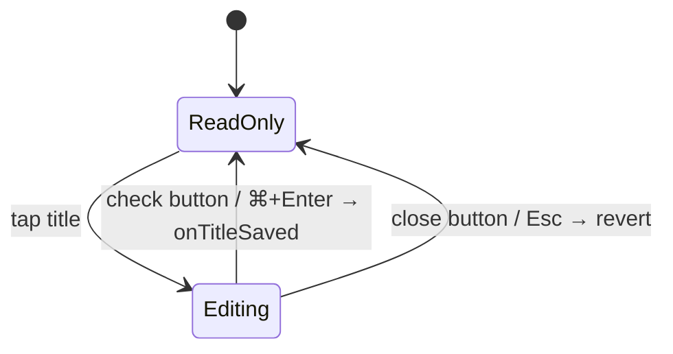

- ReadOnly: the title renders as plain `Text` in Heading 3 Bold, wrapping onto multiple lines for long strings.
- Editing: the title becomes a capsule-shaped inline `TextField` with a teal `interactive.enabled` border and external check (save) and close (cancel) buttons. Enter inserts a newline; ⌘/Ctrl+Enter or tapping the check saves.

The header body is three explicit lines:

1. **Title** — tap to edit.
2. **Classification** — `Wrap` of `[category | unassigned placeholder] → [project | No project placeholder] → [label chips | Add Label placeholder]`.
3. **Metadata** — `Wrap` of `[due date | No due date placeholder] → [estimate chip] → [priority badge] → [status dropdown]`.

There is no ellipsis inside the header — entry actions live on the pinned app bar. `TaskCompactAppBar` and `TaskExpandableAppBar` also surface the task title in `subtitle2` once the detail scroll offset passes a threshold, so the title stays visible as the header scrolls out of view.

The header is exercised in isolation under Widgetbook → Tasks → Desktop task header with Default / Editing / Long title / Empty classification + metadata / Playground use cases. The Playground drives priority, status, category, due date, labels and the editing initial flag via in-page controls — no Riverpod is needed because the presentational `DesktopTaskHeader` takes a plain `DesktopTaskHeaderData` and emits callbacks.

## Checklist Subsystem

Checklists are one of the main reasons the tasks feature exists as its own feature instead of being a loose set of task helper widgets.

### Checklist runtime model

`ChecklistController`:

- loads a checklist entity
- subscribes to the checklist and all linked checklist-item IDs
- updates title and item order
- handles dropping existing items into a checklist
- handles dropping a new item into a checklist
- unlinks and relinks items
- deletes the checklist and removes its ID from the parent task when possible

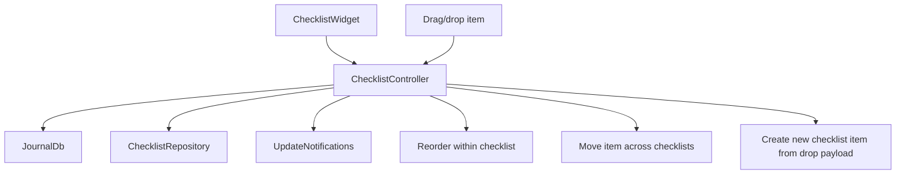

### Checklist sorting state machine

This one is real. `ChecklistsSortingController` owns a small but explicit state machine:

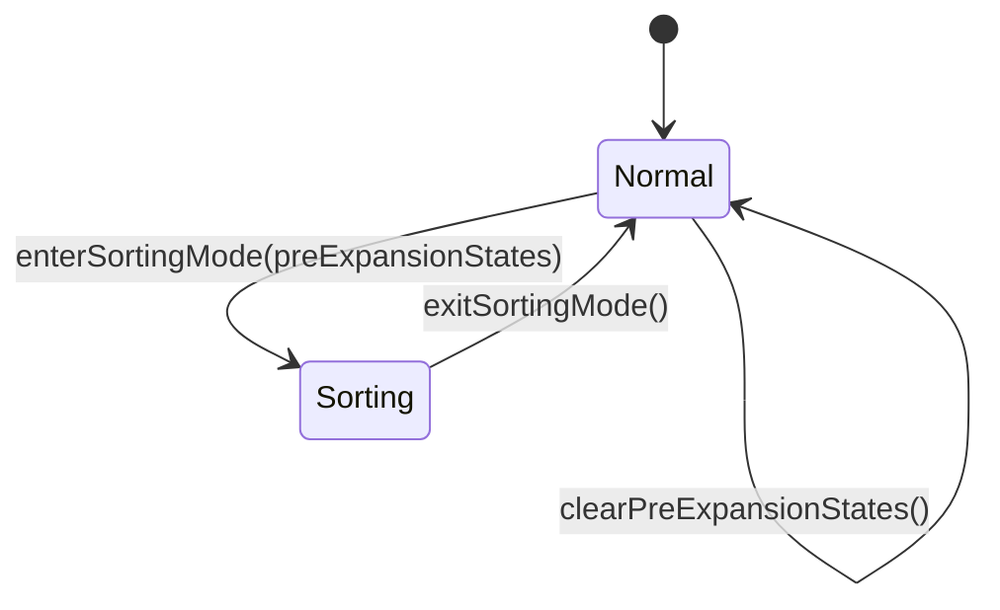

What actually happens in sorting mode:

- checklist cards collapse
- large drag handles appear
- pre-sort expansion states are stored
- widgets can restore their previous expansion states when sorting ends

That is not complex enough to deserve a PhD thesis, but it is absolutely worth documenting because it drives a visible UI mode change.

## Linked Tasks

The linked-task UI is intentionally separate from the generic linked-entry UI.

The feature distinguishes between:

- outgoing task links
- incoming task links
- generic linked entries that are not tasks

`LinkedTasksController` owns the small UI state for this section.

### Linked-task manage-mode state machine

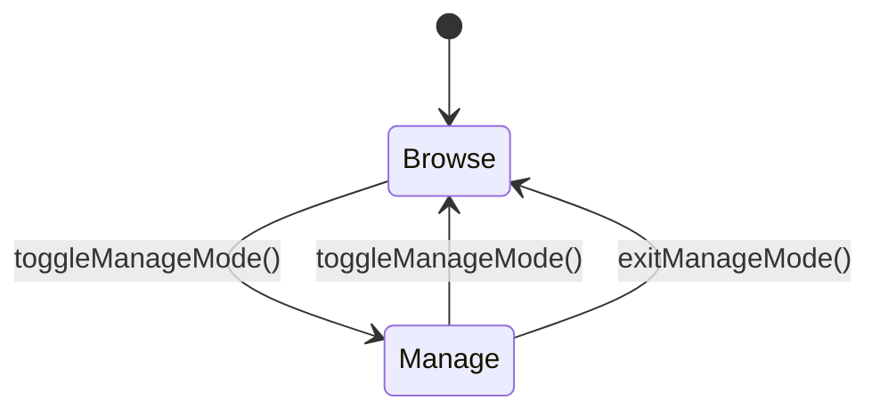

When manage mode is active:

- unlink buttons are shown
- the section behaves like an editor, not just a viewer

This is one of those tiny state machines that users feel immediately even if they never see the code.

### Linked-task flow

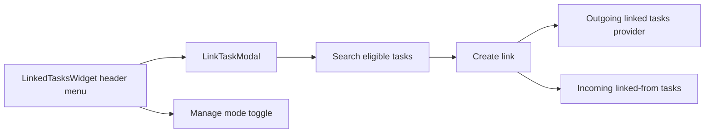

The modal explicitly excludes:

- the current task
- already-linked tasks

which is a good example of the feature preferring guardrails over polite chaos.

## Task Progress Calculation

Task progress is calculated from linked work, not from optimism.

`TaskProgressRepository` batches progress requests across tasks and calculates:

- estimate
- time ranges of linked work
- union duration of meaningful work spans

It deliberately excludes:

- `Task`
- `AiResponseEntry`
- `JournalAudio`

from counted work duration.

That last exclusion is especially important. Otherwise a one-hour audio recording of a meeting could count as one hour of work even when it is just a recording artifact, which would be mathematically neat and practically wrong.

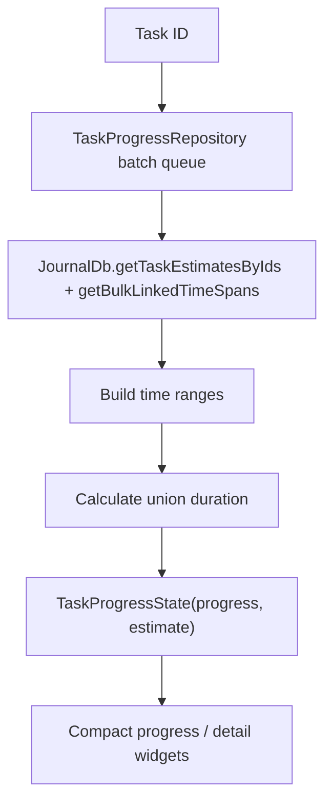

## Filter and List Model

The `/tasks` route resolves through `TasksRootPage`, which renders `TasksTabPage`.

`TasksTabPage` is backed by `JournalPageController(showTasks: true)` and its `PagingController`. The tasks tab must continue to handle thousands of rows without replacing the existing infinite-scroll mechanics.

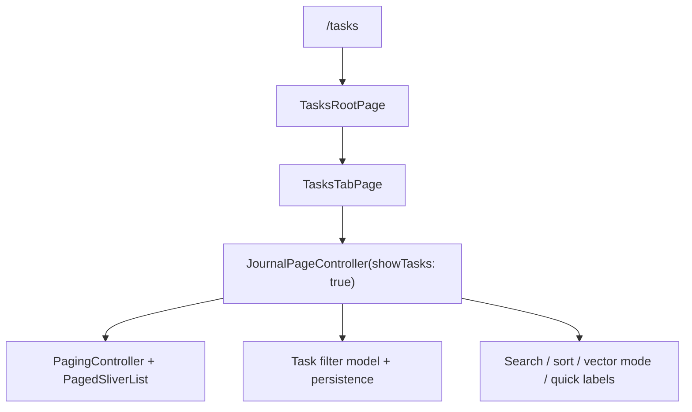

`TasksTabPage` intentionally does not own pagination, query execution, or filter semantics. It reads the already-loaded task slice from the shared paging state and only transforms that visible slice into section presentation metadata.

Current grouping behavior is sort-dependent:

- due-date sort: `Due Today`, `Due Tomorrow`, `Due Yesterday`, dated due buckets, and `No due date`
- priority sort: priority buckets (`P0` .. `P3`)
- creation-date sort: creation-day buckets

The filter button opens the task filter modal. Filter semantics, persistence keys, and controller methods are shared with the journal tab via `JournalPageController`.

Task-specific persisted filter concerns include:

- selected task statuses
- selected priorities
- selected labels
- selected categories
- selected projects
- sort option
- due-date display
- creation-date display
- cover-art display
- projects-header display
- distance display
- agent-assignment filter

Persistence uses:

- `TASKS_CATEGORY_FILTERS` for the tasks tab

which keeps tasks-tab filter state separate from the journal tab. One subtle boundary here: project filtering is persisted in the same controller state, but the visible project filter controls are rendered by shared/project widgets rather than `lib/features/tasks/ui/filtering/`.

### Saved Filters

The tasks tab also supports user-saved filters surfaced as a treeview under the Tasks destination in the desktop sidebar. The model lives in `lib/features/tasks/state/saved_filters/`:

- `SavedTaskFilter` (`{id, name, filter: TasksFilter}`) is a Freezed JSON-serializable model. The ephemeral `query` / `match` field on `JournalPageState` is intentionally NOT part of the saved payload — it stays on the live page state and is preserved across saved-filter activations.
- `SavedTaskFiltersPersistence` writes the ordered list as a single JSON blob to `SettingsDb` under the `SAVED_TASK_FILTERS` key. Position in the list IS the sort order. Mirrors the dedup-on-write pattern of `JournalFilterPersistence`.
- `savedTaskFiltersControllerProvider` (Riverpod `keepAlive: true` async notifier) exposes `create`, `rename`, `updateFilter`, `delete`, `reorder`. Each mutation persists.
- `SavedTaskFilterActivator` applies a `SavedTaskFilter` to the live `JournalPageController` via `applyBatchFilterUpdate`.

Three derived providers wire the UI to the live page state:

- `currentSavedTaskFilterIdProvider` — id of the saved filter whose persisted shape matches the live filter (display-only fields like `showCoverArt`/`showProjectsHeader`/`showDistances` are ignored when matching), or `null` when nothing matches.
- `tasksFilterHasUnsavedClausesProvider` — `true` when the live filter has clauses but doesn't match any saved filter; gates the sidebar `+` and modal Save button.
- `liveTasksFilterProvider` — snapshot of the live `TasksFilter` shape; used by the Save flow to capture exactly what the user sees.

Sidebar counts: `savedTaskFilterCountsProvider` computes `{savedFilterId → matching task count}` by fanning out one `repo.count` per saved filter, recomputed on `taskNotification`. Because each recompute is one count query per filter, notification-driven invalidations are debounced (300ms in `savedTaskFilterCounts`) so a sync burst — already coalesced upstream by `UpdateNotifications` into ~1s/100ms batches — collapses into a single recompute instead of re-running every filter's count per batch. The initial computation is never debounced.

Surfaces:

1. Sidebar treeview (`TasksSavedFiltersTree` → `SavedTaskFiltersSection` + `SavedTaskFilterRow`) — rendered via `DesktopSidebarDestination.expandedChildBuilder` only when the Tasks destination is active and the sidebar is expanded. Hover-trash with two-tap confirm delete, double-click rename, drag-to-reorder via `ReorderableListView.builder`. Empty state is a dashed pill instructing the user to adjust the filter and tap Save.
2. Filter modal Save flow — `DesignSystemTaskFilterActionBar` gained an optional Save button next to Apply. Tapping it opens an inline name popup (`MenuAnchor`-anchored) with autofocus, Enter-to-commit, Escape-to-cancel, click-outside dismiss. The name is passed to `showTaskFilterModal`'s `onSavePressed` handler, which calls `create()` for new saves and `updateFilter()` when the user edits and re-saves the currently active filter under the same name.
3. Tasks pane named-filter indicator — `TabSectionHeader.titleSuffix` renders `· {savedFilterName}` next to "Tasks" when a saved filter is active.
4. Save / update / delete confirmation toasts via `SnackBar` (`saved_task_filter_toast.dart`).

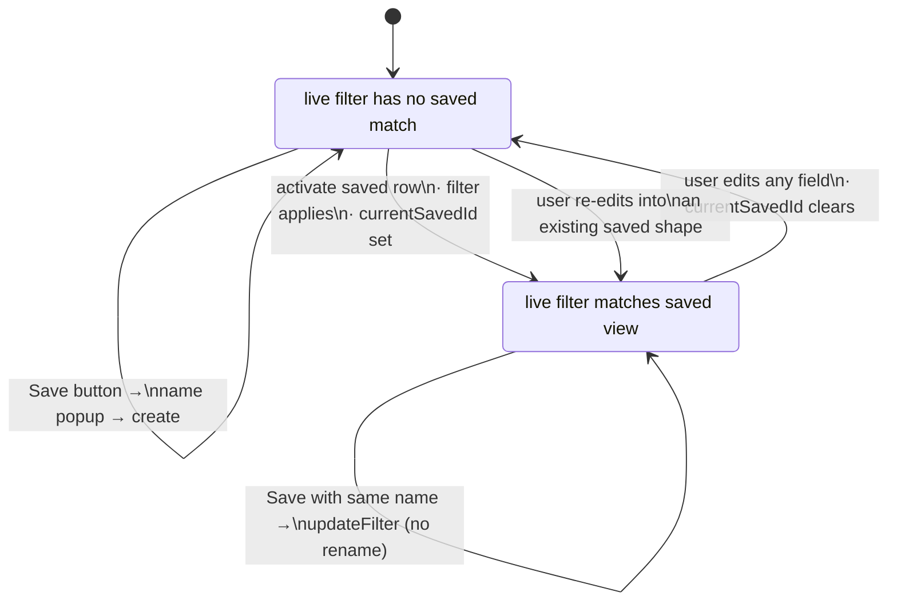

Counts in the saved-filter rows are surfaced through the optional `counts: Map<String, int>?` parameter on `SavedTaskFiltersSection`. The current desktop wiring leaves this null pending a per-saved-filter task-count provider — the row hides the count when none is supplied.

The redesigned browse page also preserves the existing non-filter runtime behavior:

- pull-to-refresh
- full-text vs vector search toggle
- quick-label strip
- optional project health header
- create-task FAB and auto-assign flow
- `/tasks/:taskId` navigation on row selection

## Header Controls and Metadata

The task detail metadata band is concentrated entirely inside `DesktopTaskHeaderConnector`. It provides interactive controls for:

- title (inline capsule edit)
- status
- priority
- category (work)
- project
- due date
- estimate
- labels
- ellipsis actions (share, extended actions, speech modal) via `ExtendedHeaderModal`

Notable behavior already implemented:

- `TaskSliverAppBar` switches between compact and expandable variants based on whether the task has `coverArtId`
- the header is desktop-first and the same component serves mobile — chips wrap onto the next line on narrow widths
- due dates on the detail page use calendar-day urgency styling (overdue,
  today, normal) that ignores time-of-day and daylight-saving offsets, while
  relative/absolute date display is a list-level concern owned by the shared
  page state
- labels are category-aware, but still allow out-of-scope assigned labels to be removed
- project selection integrates with the project health layer without making the task feature own project analysis itself
- language is not surfaced in the new header itself — it is reachable through the pinned app bar's triple-dot menu, which shows a "Set language" action (`ModernSetTaskLanguageItem`). The action renders the currently selected language's flag inline when one is set, falls back to `Icons.language` otherwise, and opens the same `LanguageSelectionModalContent` modal used by the category editor. Selection is persisted via `journalRepositoryProvider.updateJournalEntity` with `ChangeSource.user` on `TaskData.languageSource`.

## AI and Media Integrations

The tasks feature consumes AI-adjacent capabilities rather than owning them.

Examples:

- AI-running animation wrapper at the bottom of the detail page
- automatic image-analysis trigger on dropped media
- linked entries can include AI-generated content or transcriptions
- agent reports and pending change sets are displayed on task pages, but generated elsewhere

That separation is deliberate. The task feature owns the task experience; it should not become a secret duplicate of the AI feature.

## Current Constraints

- task persistence still flows through shared journal/persistence machinery
- task list filtering is powered by the shared journal page controller, so some list-state logic lives outside this feature directory
- checklists are modular and flexible, but that means the feature spans several controllers and widget clusters
- linked-task UI is task-specific, while generic linked-entry rendering still lives in the journal feature

## Relationship to Other Features

- `journal` owns the shared entry substrate and paging/filter controller
- `projects` adds project grouping and project-agent summaries around tasks
- `labels` supplies label entities and category scoping
- `speech` can create task-linked audio entries
- `ai` and `agents` provide reports, change sets, prompts, and automation around task content

If you want to understand why tasks feel like the app's operational center rather than just another entry type, this feature is the answer.
