# Tasks Feature

The `tasks` feature is the task-specific layer on top of Lotti's shared journal substrate.

A task is still a `JournalEntity`, but this feature is where it becomes a proper task with its own specific behaviors.

It owns the task-specific experience:

- detail surfaces
- checklist management
- linked-task management
- task progress calculation
- task-specific filter UI hooks
- priority, due-date, labels, project, and cover-art presentation

## What This Feature Owns

At runtime, the feature owns:

1. task detail page composition
2. checklist CRUD and reorder behavior
3. linked-task UI and manage mode
4. task progress aggregation and display
5. task-specific filter widgets and display toggles that plug into the shared journal page controller
6. task detail controls for status, category, priority, project, due date, labels, estimate, and language

It does not own raw task persistence by itself. Task entities still live in the journal/persistence layer, and many write operations flow through shared controllers or repositories there.

## Directory Shape

```text
lib/features/tasks/
├── model/
├── repository/
├── services/
├── state/
│   └── saved_filters/
├── ui/
│   ├── checklists/
│   ├── filtering/
│   ├── header/
│   ├── labels/
│   ├── linked_tasks/
│   ├── model/
│   ├── pages/
│   ├── saved_filters/
│   └── widgets/
├── util/
└── widgetbook/
```

## Architecture

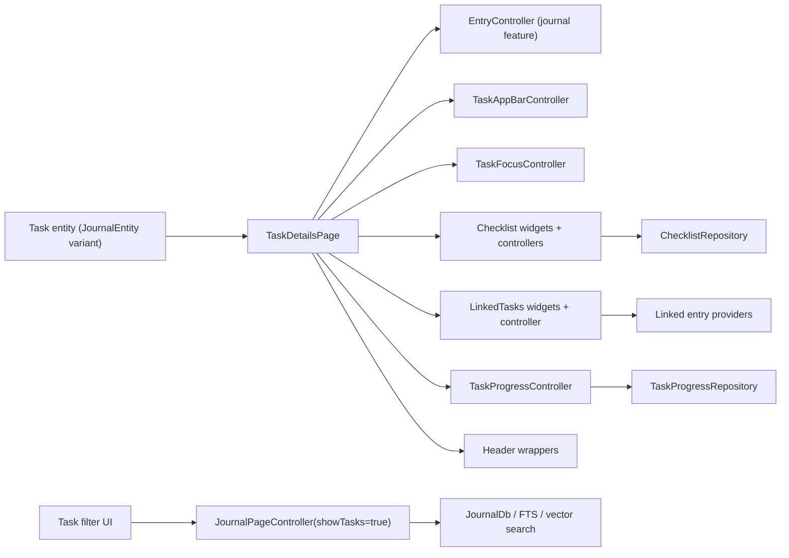

The important boundary here is that the tasks feature owns task behavior and task presentation, but it intentionally reuses the shared journal controllers and persistence paths where possible.

## Tasks Tab Browse Page

The redesigned tasks tab is an in-place browse-page migration, not a new query stack.

`TasksTabPage` still reads from `JournalPageController(showTasks: true)` and still uses the journal feature's existing infinite paging path. The redesign only swaps the browse presentation layer on top of that controller.

In desktop split-pane mode, `TasksRootPage` keeps the list pane mounted while
the detail pane is keyed by the selected task ID. That gives each task detail
surface its own state lifetime instead of reusing the previous task's
stateful page internals across selection changes.

### Desktop task detail stack

On desktop, the right-hand task detail pane is backed by a per-pane stack
held on `NavService.desktopTaskDetailStack` (`ValueNotifier<List<String>>`).

- `TasksLocation` calls `resetDesktopTaskDetail(taskId)` when the URL
  changes, seeding the stack with one entry — the task selected from the
  list pane (the "base").
- Tapping a row inside `LinkedTasksWidget` from inside a task's details
  calls `pushDesktopTaskDetail(linkedId)` so the linked task is shown on top of
  the base, *strictly inside* the right-hand pane. The list pane on the
  left remains visible. Mobile keeps using `Navigator.push` with a
  `MaterialPageRoute` because the navigator stack and the visible
  navigation stack are the same thing on mobile.
- The back arrow in `TaskCompactAppBar` / `TaskExpandableAppBar` is only
  rendered on desktop when `desktopTaskDetailStack.length > 1`. The base
  task hides the arrow because the list pane already lets the user
  return to a sibling task. Pressing the arrow on desktop calls
  `popDesktopTaskDetail()` instead of `NavService.beamBack()`.
- `desktopSelectedTaskId` is kept in sync with `stack.last` so existing
  list-pane highlight listeners keep working without changes.

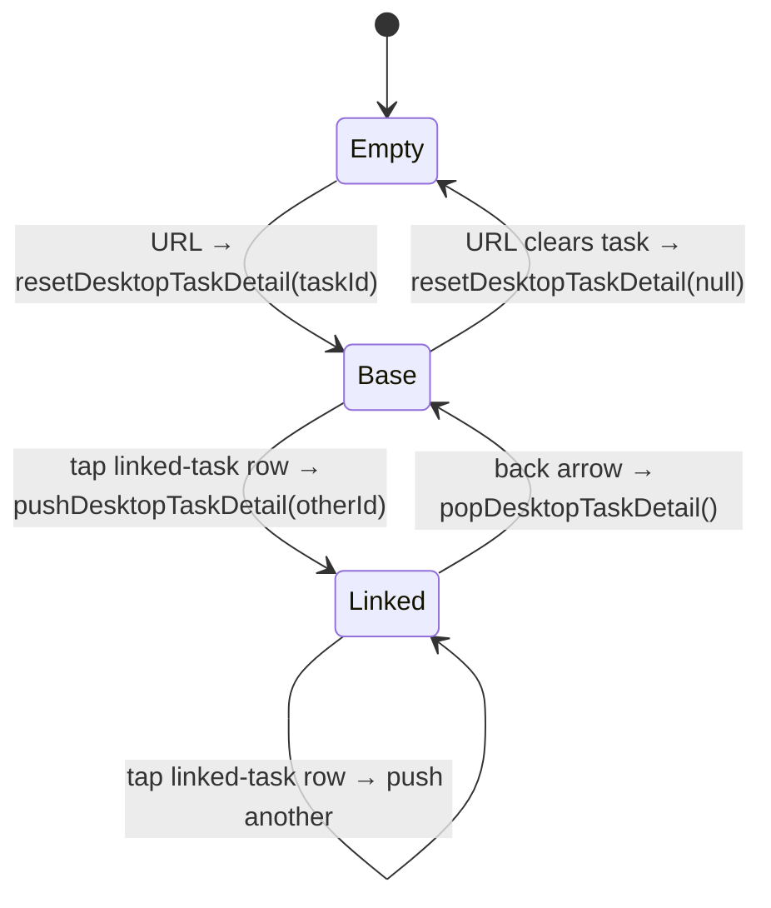

At runtime the browse page does three specific things:

1. it converts paged `JournalEntity` results into `TaskBrowseEntry` rows via `buildTaskBrowseEntries`
2. it derives section headers from the active sort mode
3. it reuses the same grouped-card interaction model as the projects tab so hover and selection backgrounds can suppress adjacent dividers cleanly

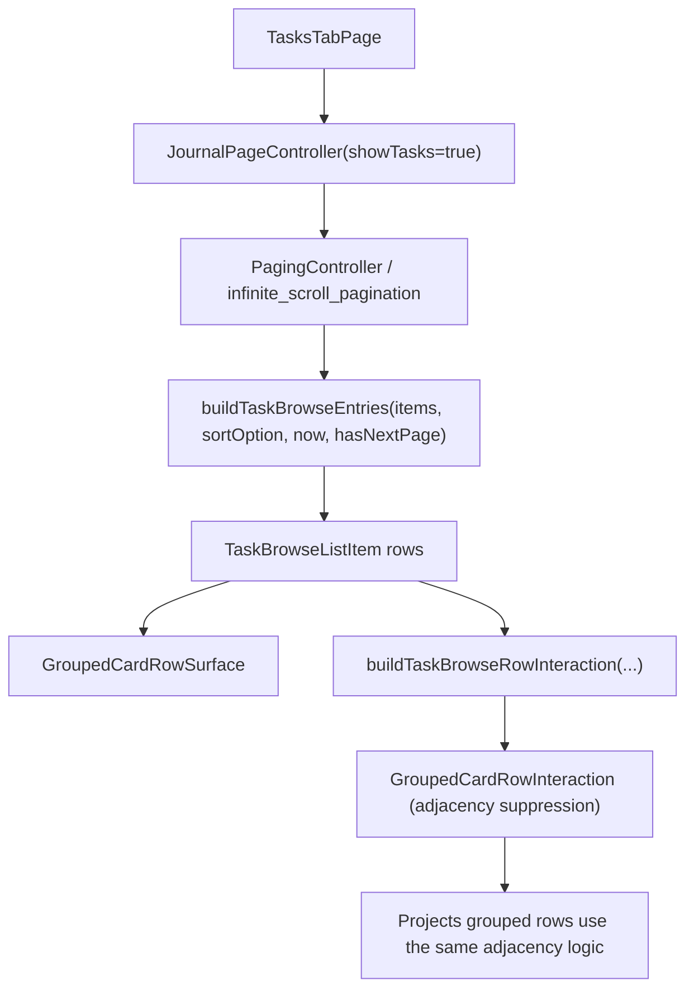

The section semantics are intentionally sort-dependent:

- due-date sort groups into `Today`, `Tomorrow`, `Yesterday`, exact due dates, or `No due date`
- created-date sort groups by the task creation day
- priority sort groups by priority buckets

That is why the browse model carries section metadata separately from the row widget. The card does not guess how to group tasks; it receives that decision from the browse-entry model.

## Core Data Model

Tasks are represented by the `Task` journal entity variant with `TaskData`.

Important task concerns represented directly in `TaskData` include:

- title
- status
- priority
- estimate
- due date
- checklist IDs
- cover-art ID
- language preference
- inference profile ID
- AI-suppressed label IDs

Two important boundaries:

- label assignments live on entry metadata (`meta.labelIds`), not in `TaskData`
- project membership is resolved through the `projects` feature, not embedded as a task field

Checklist content is modeled separately through checklist entities and linked checklist-item entities. That split matters because the UI allows drag, drop, reorder, export, and cross-checklist movement without flattening everything into one giant task row.

### Due Date and Estimate Pickers

The detail header routes due-date edits through `showDueDatePicker` and
estimate edits through `showEstimatePicker`:

- due dates use the shared `DesignSystemCalendarPicker`, so the selected value
  includes its weekday and the month grid exposes weekday headers. **Today**
  updates the draft, **Clear** produces an explicit null result, and dismissal
  remains distinct from either action;
- estimates use `DesignSystemDurationWheel` in the same token-backed frame and
  shared glass action footer. The draft is committed only when Done confirms a
  changed duration; Clear resets a non-zero estimate.

Both pickers use the responsive modal contract: a bottom sheet on narrow
layouts and a dialog on wide layouts, with the same surface color inside the
subtle frame in light and dark themes.

## Task Detail Composition

`TaskDetailsPage` is the main task surface. It composes:

- `TaskSliverAppBar`
- `TaskConsumptionChip` (`ui/header/task_consumption_chip.dart`) — the AI
  consumption pill in the header's `MetaRow` (`consumptionSlot`): lifetime
  cost/energy/CO₂e for tasks with recorded AI calls, full breakdown in the
  tooltip, hidden entirely otherwise. Backed by the `ai_consumption` feature's
  `taskConsumptionTotalsProvider` (see `lib/features/ai_consumption/README.md`).
- `TaskForm` — stacks the reading bands in order: the `DesktopTaskHeaderConnector`
  identity header (a `heading2` title as the focal point; the breadcrumb and
  unset metadata are muted-but-legible at medium emphasis), the optional legacy
  body (set off by a hairline rule + `sectionGap`), then the user's *work*
  (`ChecklistsWidget`, `LinkedTasksWidget`), and finally the `AiSummaryCard`
  assistant zone — checklists come before the AI suggestions so "what's left to
  do" is visible without scrolling past proposals. The AI card leads with a
  `step4` top gap (not a full `sectionGap` — `LinkedTasksWidget` already adds
  its own `step3` bottom padding, so a sectionGap on top stacked into an
  oversized gap) and carries a `sectionGap` *bottom* padding so it has real
  breathing room above the bottom action bar (the linked-entries sliver below
  it contributes almost none). The bands are wrapped in a
  `StaggeredEntrance` (a one-time fade-and-rise on load that does not replay on
  background refresh) and, on wide windows, a centred max-width reading column.
  Because the AI card sits *below* the work, confirming a proposal can change
  the checklist height above it and shove the proposals the user just tapped —
  either *up* (a checked-off item's row collapses) or *down* (a new to-do is
  added). `TaskDetailsPage` guards against both with a `ScrollAnchor`
  (`util/scroll_anchor.dart`). `AiSummaryCard` signals the page synchronously
  when a resolve gesture starts, before checklist persistence can relayout the
  page; the `unifiedSuggestionListProvider` count listener remains a fallback
  for externally resolved proposals. The anchor pins the proposals' on-screen
  viewport position for a `holdDuration` so the page stays put across the
  relayout instead of jumping. Source-entry transcripts and image analysis use
  a separate pre-paint path: `ViewportStableAnimatedSize` arms the page's
  `ViewportStableScrollController` when an off-screen animated region is about
  to relayout. Its custom scroll position consumes the resulting content-extent
  delta in `correctForNewDimensions`, causing Flutter to repeat viewport layout
  with the corrected offset before anything paints. The scroll position
  consumes the animated region's measured height delta—not the whole page's
  extent delta—so the inference indicator collapsing below the viewport in the
  same frame cannot leave a fixed residual nudge. A render-level layout
  invalidation hook also covers analysis consumers that rebuild below the
  wrapper without invoking its `didUpdateWidget`. Newly
  created checklist rows and checklist cards reveal through `SizeFadeEntrance`,
  so the compensated layout change is a progressive expansion rather than a
  one-frame insertion. The window spans
  the checked item's *delayed* row collapse
  (`checklistCompletionAnimationDuration` +
  `checklistCompletionFadeDuration` + buffer), which lands ~a second after the
  tap — long after a short frame burst would have ended. Because the window is
  long, the hold releases the moment the user scrolls (an offset change the
  anchor did not itself make) so it never fights a deliberate scroll; the
  deadline is measured from frame timestamps, so it is frame-rate independent
  and deterministic under `pump`.
- linked entries with timer-aware highlighting (card padding evened onto tokens)
- reverse linked-from entries
- `TaskActionBar` — a sticky frosted-glass bar hosted in the page's
  `Scaffold.bottomNavigationBar` slot, replacing the floating action
  button. It exposes the most-frequent inline actions directly: a
  "Track time" pill plus round affordances for add-checklist,
  import-image, audio recording, and "more actions" (opens
  `CreateEntryModal` for long-tail items — Checklist (task host only) /
  Event / Task / Audio / Timer / Text / Paste image, plus import-image on
  macOS and mobile and capture-screenshot on macOS and Linux). The pill
  has two states:
  - Idle: tapping starts a new timer linked to this task.
  - Tracking-this-task: the live elapsed time replaces the label, with
    an inset stop circle on the leading edge. Tapping the pill body
    navigates to the running timer entry (mirrors the desktop sidebar
    timer card); only the inset stop circle stops the timer. The
  duration text uses `numericBadgeFontFeatures` (tabular figures,
  slashed zero, cv02/03/04) so digits don't shift width as they tick.
  When linked AI inference is running for the task, the bar grows an inline
  top slot above the action row and renders `AiRunningDecoderBars`, a subtle
  decoder-bars shader driven by the same running-inference provider that used
  to feed the separate Siri-wave card. The slot animates its reserved height
  together with shader amplitude and opacity on entry and exit, and removes the
  shader subtree after collapsing.

  The button row is a single `Row` wrapped in a `LayoutBuilder`. When
  the available width can't fit all five children on one line,
  affordances are dropped in priority order: image first, then
  checklist (both stay reachable via the "..." menu). The thresholds
  are exposed as `TaskActionBar.minWidthForImageButton` and
  `TaskActionBar.minWidthForChecklistButton`.
  The Track time pill reserves the localized idle-label width while a
  timer is active, so toggling time recording does not recenter the
  trailing audio, checklist, image, or more-action affordances. The chip
  foregrounds rely on the glass fill and hairline border for contrast
  rather than glyph shadows, avoiding stale-looking shadow silhouettes
  when the row repaints over blurred content. The shared glass strip
  adds a token-backed scrim over the blur so bright screenshots or
  light embedded media cannot wash the row out.
  The page sets `Scaffold.extendBody: true` so body content paints
  behind the bar — that's what the `BackdropFilter` blurs. The mobile
  shell hides its bottom nav pill whenever the active beamer route is
  `/tasks/<uuid>` (computed in `_AppScreenState._isTaskDetailRoute`,
  no per-page lifecycle plumbing), so the action bar can dock flush
  against the home indicator. This predicate is mobile-only — the desktop
  shell has no floating recording indicator; the desktop running-timer
  surface is the sidebar `SidebarTimerSection` card, which stays visible for
  the whole lifetime of a running timer (see "Sidebar timer coordination"
  below).
  TaskActionBar consumes the safe-area inset internally.

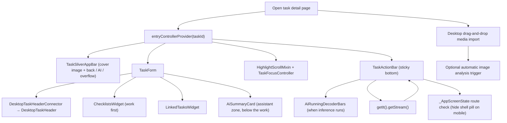

This page is not just "show task fields." It is the task workspace where task metadata, linked content, time tracking, and AI-adjacent affordances meet.

### Sidebar timer coordination

`SidebarTimerSection` (desktop, `aboveSettings` slot — see `lib/widgets/README.md` for the visual contract) and `TaskActionBar`'s running pill both render the same live `TimeService` session. They are allowed to be on screen at the same time: the sidebar card is **not** suppressed while the running task is open in the details pane. A single, always-present place to read the elapsed time and jump back to the running task is worth more than avoiding the duplicate title — so the duplication is intentional.

Visibility is a pure function of `TimeService.getStream()`:

- a running entity → the card is shown,
- `null` (timer stopped) → the card collapses to `SizedBox.shrink`.

Neither `NavService.desktopSelectedTaskId`, the active route, nor the selected top-level tab affects visibility. The card therefore survives every navigation: opening the running task, switching to Habits/Settings, or leaving the Tasks tab entirely all leave it in place. The stream is seeded with `TimeService.getCurrent()` as `initialData` so an already-running session renders on the first frame instead of flashing through a hidden state.

The appear/disappear transition runs through an `AnimatedSwitcher` + `AnimatedSize` (`SidebarTimerSection.animationDuration` ≈ 220 ms, `Curves.easeInOut`) so the card fades and the surrounding sidebar collapses smoothly instead of popping.

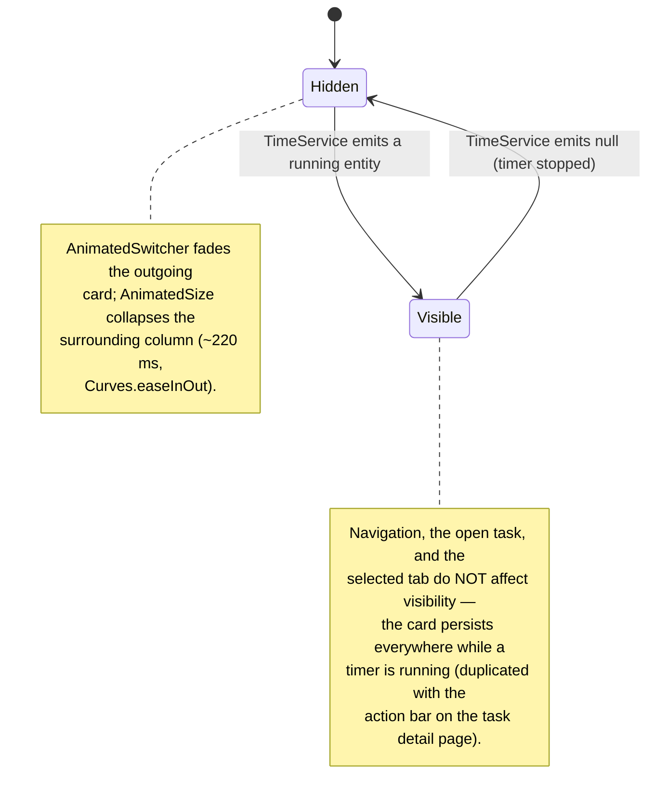

Inside `TaskForm`, the composition is also fairly opinionated:

- `DesktopTaskHeaderConnector` for the interactive header: inline multi-line title edit, priority badge, project reference (with a "No project" placeholder when none is linked), work-category chip (or "unassigned" placeholder), due-date chip (or "No due date" placeholder), estimate chip (with progress bar when set), assigned label chips (or "Add Label" placeholder), and status dropdown. Extended actions (share, speech modal, etc.) are owned by the pinned app bar's `more_vert` button, not the header itself. The connector watches `entryControllerProvider`, `projectForTaskProvider` and the labels stream, maps the task to an immutable `DesktopTaskHeaderData` plus a Riverpod-aware `estimateSlot`, and forwards callbacks to the existing modal pickers (`TaskStatusModalContent`, `showDueDatePicker`, `showEstimatePicker`, `showCategoryPicker`, `ProjectSelectionModalContent`, `LabelSelectionModalUtils`) plus `EntryController.save / updateTaskStatus / updateTaskPriority / updateCategoryId`
- an `EditorWidget` only for legacy tasks that already have non-empty entry text
- `AiSummaryCard` — a single deep-teal-tinted-navy surface that hosts the agent's TLDR + expandable inline report, the unified open-proposal list with swipe / button confirm-or-reject + collapsible history, the recent-activity footer (inline expand), and the wake-cycle affordances (run-now, cancel timer, and a countdown that switches from `m:ss` to `h:mm:ss` once an hour cell is needed). Tapping the agent name (or the avatar / "Open agent internals" pill) opens `AgentInternalsPanel`, a right-side overlay (600–800px wide) that re-houses the existing `AgentInternalsBody` (Stats / Reports / Conversations / Observations / Activity tabs) without page navigation
- `LinkedTasksWidget`
- `ChecklistsWidget`

### Visual surface

Most section cards on the task detail page (Task description, Checklists, expanded activity) render on `TaskDetailSectionCard` — solid `background.level02`, `radii.l`, subtle `decorative.level01` border, no gradient, no drop shadow. `LinkedTasksWidget` does not use that shared widget; it replicates the same surface treatment inline (a raw `DecoratedBox` with `background.level02`, `radii.l`, and a `decorative.level01` border). This matches the `task_browse_list_item` surface in the task list, so the detail page reads as part of the same system. The section is encapsulated by `TaskShowcasePalette` and the design-system tokens — no ad-hoc hex values.

The **AI Summary** card is the deliberate exception. It does not use `TaskDetailSectionCard`. Instead it draws on a dedicated dark AI surface defined in `assets/design_system/tokens.json` under `color.aiCard.*`: a `#0E1A22` background, a teal-at-14%-alpha border, a 14px radius, and a subtle teal outer glow shadow. Proposal-kind chips draw from `color.proposalKind.{add, update, remove, priority, estimate, status, label, due}.{color, surface}` so the chip colors stay tokenized. All accents inside the card route through `color.aiCard.accent` (the existing Lotti teal). The hex values are set up to be visually consistent across both Light and Dark themes since the card itself is dark-only by design.

Some text styles inside the card override the base design-system token's `height` (line-height) to hit the spec's tighter rhythm. That gap is documented as a follow-up under [`docs/design/missing_density_typography_tokens.md`](../../../docs/design/missing_density_typography_tokens.md); the eventual fix is to add a `compact` density tier to `tokens.typography.styles.*` rather than to keep tuning at the call site.

### DesktopTaskHeader visual states

The header title has two interactive states driven by local editing state. The ReadOnly state is a plain-text click-to-edit region (no capsule, no pencil glyph); the Editing state is a capsule-shaped `TextField` with a `surface.hover` fill and an 8px radius (`_capsuleRadius = 8.0`):

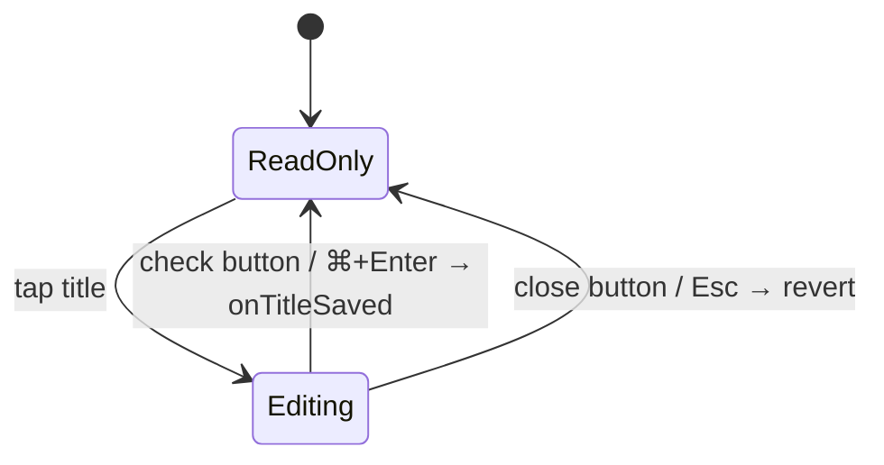

- ReadOnly: the title renders as plain `Text` in Heading 2 Bold at a 1.15 line-height (so a wrapping multi-line title reads as one cohesive block). The whole title is the edit target — there is deliberately **no trailing pencil glyph** (a persistent pencil drifted into a dead gutter beside short / wrapping titles), so the affordance is carried by the hover click-cursor, an "Edit title" `Semantics` button, and keyboard activation. The title spans the full content width and wraps freely — no control rides this line.
- Editing: the title becomes a capsule-shaped inline `TextField` with a teal `interactive.enabled` border and external check (save) and close (cancel) buttons. Enter inserts a newline; ⌘/Ctrl+Enter or tapping the check saves.

The header body is composed top-to-bottom in `DesktopTaskHeader.build`:

1. **Crumb** (`_HeroCrumb`) — a `Row` of `[category | unassigned placeholder] / [project | No project placeholder]` separated by a literal `/`. No label chips here.
2. **Title** (`TitleReadOnly` / `TitleEditor`) — full-width, tap to edit.
3. **Meta** (`MetaRow`) — a two-lane `Column`. The **attribute lane** is a left-aligned `Wrap` led by the status pill: `[status select] → [priority] → [due | No due date placeholder] + [estimate chip]`. The **label lane** below is a second left-aligned `Wrap` of `[label chips | Add Label placeholder]`. Status *leads* the attribute lane (rather than being pinned to a trailing edge) so it has one stable home that never opens a horizontal dead zone next to a short cluster and never gets marooned when the row wraps; separating the structured attributes from the free-form label taxonomy keeps the "what state / when / how big" read distinct from the user's tags. The due date and time-estimate are bonded into a single inner `Wrap` unit (`MetaRow._timeGroup`) so when the lane wraps on a narrow viewport the optional estimate travels with the due chip (the lane breaks as `status+priority` / `due+estimate`) instead of stranding the lone estimate on its own near-empty row; the inner wrap reuses the same chip gap, so the pair is visually identical to two adjacent chips on wide screens and only ever splits internally at extreme widths. The chips share one neutral filled shell at one height — the status pill is the lane's only tinted accent (matched to the chip height), priority carries its urgency via a coloured glyph, and the due chip escalates to a tinted accent only when it is due today / overdue. Every neutral filled metadata chip (priority, normal due, estimate, labels) carries a quiet 1px `decorative.level02` border (`DsPill(bordered: true)`) so its boundary is legible against the near-same-tone surface for low-vision users; the status pill and an urgent (tinted) due chip skip the border since their fill already reads. The **priority** chip spells the level out (`TaskPriority.localizedLabel` → Urgent / High / Medium / Low) rather than the opaque `P2` code, so the urgency direction reads at a glance (the compact `priority.short` "P{n}" is retained only for the priority picker rows and AI-context strings). The **estimate** chip (`_TaskEstimateChip`) reads `{tracked} of {estimate}` in plain duration units (e.g. `0m of 1h`, `1h 30m of 2h` — not a clock-like `00:00 / 01:00`, which users misread as a time-of-day range) with a `Tooltip` ("Time tracked: … of … estimated") so the two numbers are not a guessing game. The **label lane** caps at `_maxVisibleLabels` (4) chips and collapses the remainder behind a tappable `+N` `_LabelOverflowChip`; expanding swaps in a "Show fewer" chip, and a label change (new task) resets the expansion via `didUpdateWidget`. Inter-chip horizontal gaps (`step2`) are kept tighter than each pill's internal padding (`step3`) so the chips read as one anchored cluster, while a full `step4` context-break step (the same gap used between the breadcrumb and the title) sets the two lanes apart so the label lane reads as a distinct register from vertical rhythm alone, not just the chips' colour dots.

The status pill's *label text* is kept at high contrast (the high-emphasis text colour, not the accent itself — accent-on-accent-tint fails WCAG); the status's colour identity is instead carried by its translucent tinted fill plus the per-status glyph. The vertical rhythm uses proximity grouping: a `step4` gap separates the breadcrumb (ancestor context) from the title, and a tighter `step3` gap bonds the title down to its metadata block so title + chips read as one unit.

There is no ellipsis inside the header — entry actions live on the pinned app bar. `TaskCompactAppBar` and `TaskExpandableAppBar` also surface the task title in `subtitle2` once the detail scroll offset passes a threshold, so the title stays visible as the header scrolls out of view.

The header is exercised in isolation under Widgetbook → Tasks → Desktop task header with Default / Editing / Long title / Empty classification + metadata / Playground use cases. The Playground drives priority, status, category, due date, labels and the editing initial flag via in-page controls — no Riverpod is needed because the presentational `DesktopTaskHeader` takes a plain `DesktopTaskHeaderData` and emits callbacks.

## Checklist Subsystem

Checklists are one of the main reasons the tasks feature exists as its own feature instead of being a loose set of task helper widgets.

Completing checklist work is celebrated through the shared celebration
primitives (see the design-system README): checking an item fires a light
haptic + an `easeOutBack` checkbox pop + a spark burst at the checkbox +
a left-to-right `StrikethroughWipe` on its title. The burst is fired
imperatively from the tap via `spawnCompletionBurst` (not the widget edge), so
it still plays when checking the **last** open item collapses the row away.
Reaching 100% on a checklist blooms a soft, low-intensity (`glowIntensity: 0.1`)
glow around the card with a medium haptic — and *no* card-wide burst, since the
completing item's own checkbox burst already carries the sparks. Marking the
whole task Done fires the full celebration (glow + spark burst + an
`anchorScale` pop + a heavy haptic) on the status pill.

The **visual** beats are gated on the user's celebration switches
(`celebrationPreferencesProvider`: `.checklistItems` for the item pop/burst,
the strike-through wipe, and the 100% glow; `.tasks` for the task-done beat —
Settings → Advanced → Animations) and on the system reduce-motion setting. The
haptics always fire (the switch turns off animations, not feedback). Every beat
fires only on the not-done → done transition.

Each row's checkbox keeps a compact 20×20 visual but is centred inside a 44×44
`InkWell` tap target so it clears the Material / WCAG touch-target minimum
without enlarging the box — users with reduced motor precision can hit the
surrounding ring instead of aiming at the tiny square. A centre tap lands on
the `Checkbox` itself (keeping its native gesture + a11y semantics); the ring
is caught by the `InkWell`, and both route through the row's single
`applyCheck` handler so the toggle behaviour stays in one place. The 44px zone
draws a faint resting "well" (a `surface.enabled` fill with a
`decorative.level02` border — the same filled+bordered language as the metadata
chips) so the forgiving tap area is *visible at rest*; on touch there is no
hover, so a hover-only highlight left it invisible where most users tap. The
`InkWell` also carries a `hoverColor` for hover/press feedback on pointer
devices. The drag-grip icon is a
quiet hint at a low (0.2) alpha (a long-press anywhere on the row starts the
drag), so the repeating grip texture doesn't compete with the checkbox + title.
The empty checkbox draws its outline at medium emphasis / 2px (not the faint
low-emphasis 1.5px it used to) — an unchecked control must stay visible against
the dark card for low-vision users; this is control legibility, not the
metadata-chip emphasis tiering.

The row renders **stale-while-revalidate**: it reads `itemAsync.value` (the
retained value) rather than `itemAsync.map(loading: …)`, so a *reloading* item
keeps its current state instead of blanking to `SizedBox.shrink` for a frame
(the flicker when an accepted AI suggestion updated the checklist); a genuine
first mount / deletion still collapses, and a hard load error with no prior
value still surfaces an `ErrorWidget`. Relatedly, the checklist cards in
`ChecklistsWidget` are keyed by checklist **identity** (`Key('checklist-$id-…')`,
not the list index), so inserting or reordering a checklist keeps every other
card's element + state instead of shifting indices and re-fetching (which
flashed them). Both checklist IDs and linked-item IDs seed their existing set on
first render; only IDs arriving later play the one-shot size/fade entrance, so
background refreshes do not replay initial-load motion.

### Checklist runtime model

`ChecklistController`:

- loads a checklist entity
- subscribes to the checklist and all linked checklist-item IDs
- updates title and item order
- handles dropping existing items into a checklist
- handles dropping a new item into a checklist
- unlinks and relinks items
- deletes the checklist and removes its ID from the parent task when possible

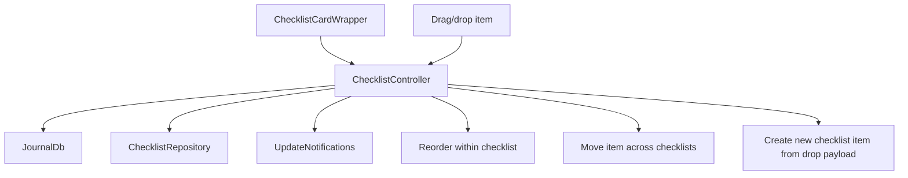

When a user renames a checklist item, `ChecklistItemController.updateTitle`
fires a fire-and-forget `correctionCaptureService.captureCorrection(...)` with
the before/after title and the item's category, and the rename surfaces an undo
affordance (`CorrectionUndoSnackbar`). That before→after pair becomes
category-scoped AI guidance — see the [`checklist`](../checklist/README.md)
feature, which owns the capture/undo logic.

### Checklist sorting state machine

This one is real. `ChecklistsSortingController` owns a small but explicit state machine:

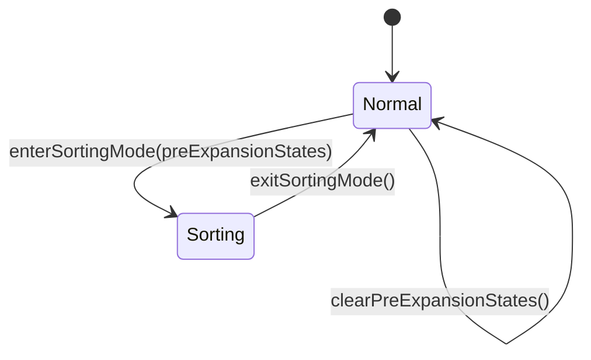

What actually happens in sorting mode:

- checklist cards collapse
- large drag handles appear
- pre-sort expansion states are stored
- widgets can restore their previous expansion states when sorting ends

That is not complex enough to deserve a PhD thesis, but it is absolutely worth documenting because it drives a visible UI mode change.

## Linked Tasks

The linked-task UI is intentionally separate from the generic linked-entry UI.

The feature distinguishes between:

- outgoing task links
- incoming task links
- generic linked entries that are not tasks

`LinkedTasksController` owns the small UI state for this section.

### Linked-task manage-mode state machine

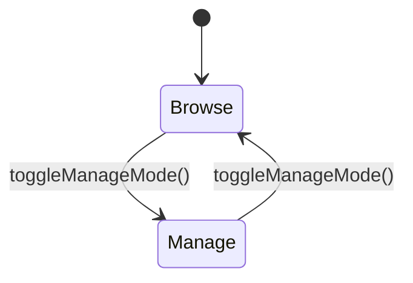

When manage mode is active:

- unlink buttons are shown
- the section behaves like an editor, not just a viewer

This is one of those tiny state machines that users feel immediately even if they never see the code.

### Linked-task flow

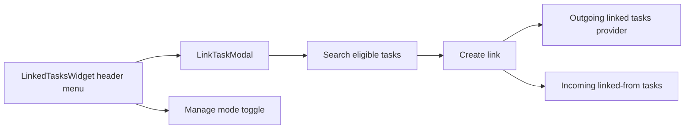

The modal explicitly excludes:

- the current task
- already-linked tasks

which is a good example of the feature preferring guardrails over polite chaos.

## Task Progress Calculation

Task progress is calculated from linked work, not from optimism.

`TaskProgressRepository` batches progress requests across tasks and calculates:

- estimate
- time ranges of linked work
- union duration of meaningful work spans

It deliberately excludes:

- `Task`
- `AiResponseEntry`
- `JournalAudio`

from counted work duration.

That last exclusion is especially important. Otherwise a one-hour audio recording of a meeting could count as one hour of work even when it is just a recording artifact, which would be mathematically neat and practically wrong.

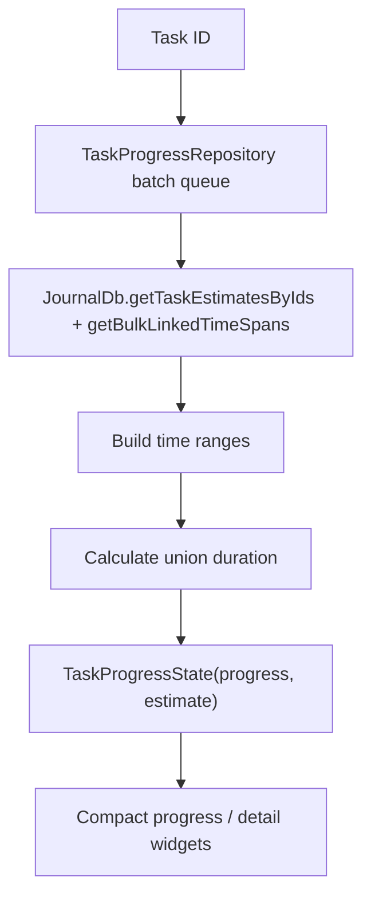

## Filter and List Model

The `/tasks` route resolves through `TasksRootPage`, which renders `TasksTabPage`.

`TasksTabPage` is backed by `JournalPageController(showTasks: true)` and its `PagingController`. The tasks tab must continue to handle thousands of rows without replacing the existing infinite-scroll mechanics.

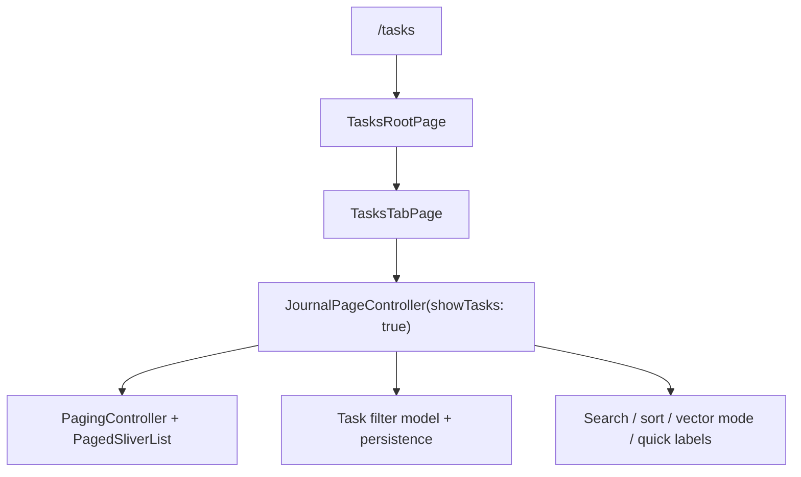

`TasksTabPage` intentionally does not own pagination, query execution, or filter semantics. It reads the already-loaded task slice from the shared paging state and only transforms that visible slice into section presentation metadata.

Current grouping behavior is sort-dependent:

- due-date sort: `Due Today`, `Due Tomorrow`, `Due Yesterday`, dated due buckets, and `No due date`
- priority sort: priority buckets (`P0` .. `P3`)
- creation-date sort: creation-day buckets

The filter button opens the task filter modal. Filter semantics, persistence keys, and controller methods are shared with the journal tab via `JournalPageController`.

Task-specific persisted filter concerns include:

- selected task statuses
- selected priorities
- selected labels
- selected categories
- selected projects
- sort option
- due-date display
- creation-date display
- cover-art display
- projects-header display
- distance display
- agent-assignment filter

Persistence uses:

- `TASKS_CATEGORY_FILTERS` for the tasks tab

which keeps tasks-tab filter state separate from the journal tab. The visible project filter controls live in this feature: `task_filter_modal.dart`'s `_handleProjectFieldPressed` opens the grouped project-selection modal `showProjectSelectionModal` (`lib/features/tasks/ui/filtering/task_project_selection_modal.dart`), and the resulting project IDs are persisted in the same controller state as the other filter clauses.

### Saved Filters

The tasks tab also supports user-saved filters surfaced as a treeview under the Tasks destination in the desktop sidebar. The model lives in `lib/features/tasks/state/saved_filters/`:

- `SavedTaskFilter` (`{id, name, filter: TasksFilter}`) is a Freezed JSON-serializable model. The ephemeral `match` (search text) field on `JournalPageState` is intentionally NOT part of the saved payload — it stays on the live page state and is preserved across saved-filter activations.
- `SavedTaskFiltersPersistence` writes the ordered list as a single JSON blob to `SettingsDb` under the `SAVED_TASK_FILTERS` key. Position in the list IS the sort order. Mirrors the dedup-on-write pattern of `JournalFilterPersistence`.
- `savedTaskFiltersControllerProvider` (Riverpod `keepAlive: true` async notifier) exposes `create`, `rename`, `updateFilter`, `delete`, `reorder`. Each mutation persists.
- `SavedTaskFilterActivator` applies a `SavedTaskFilter` to the live `JournalPageController` via `applyBatchFilterUpdate`.

Two derived providers wire the UI to the live page state:

- `currentSavedTaskFilterIdProvider` — id of the saved filter whose persisted shape matches the live filter (display-only fields like `showCoverArt`/`showProjectsHeader`/`showDistances` are ignored when matching), or `null` when nothing matches.
- `tasksFilterHasUnsavedClausesProvider` — `true` when the live filter has clauses but doesn't match any saved filter; gates the modal Save button (`canSave`).

Both derive the live `TasksFilter` snapshot from the page state via the top-level helper `liveTasksFilterFor(JournalPageState)` in `saved_task_filter_activator.dart` (the desktop Save flow builds the filter via `_draftStateToTasksFilter` in `task_filter_modal.dart`; the mobile "Save current filter as…" flow reuses `liveTasksFilterFor`) — there is no `liveTasksFilterProvider`. `SavedTaskFilterActivator` also exposes `clearToDefault()`, which resets every clause to the `TasksFilter` defaults (the mobile "All" entry; the search query is preserved).

Sidebar counts: `savedTaskFilterCountsProvider` computes `{savedFilterId → matching task count}` by fanning out one `repo.count` per saved filter, recomputed on `taskNotification`. Because each recompute is one count query per filter, notification-driven invalidations are debounced (300ms in `savedTaskFilterCounts`) so a sync burst — already coalesced upstream by `UpdateNotifications` into ~1s/100ms batches — collapses into a single recompute instead of re-running every filter's count per batch. The initial computation is never debounced. `allTasksTotalCountProvider` (the rail/sheet "All" total) and `currentTasksFilterCountProvider` (the rail "Custom" pill's live filtered count) share the same repository + debounce wiring; `currentTasksFilterCountProvider` additionally expands an empty status selection to every status before counting, mirroring how the live list treats "no status filter" as "all statuses" so the Custom pill's number agrees with the list.

Surfaces:

1. Sidebar treeview (`TasksSavedFiltersTree` → `SavedTaskFiltersSection` + `SavedTaskFilterRow`) — rendered via `DesktopSidebarDestination.expandedChildBuilder` only when the Tasks destination is active and the sidebar is expanded. The desktop section has its own caption header and count, shows the first four saved filters by default, and adds a token-backed More/Less row when the list is longer; tapping More reveals every saved filter and swaps the control to Show fewer. While collapsed, if the active saved filter is outside the first four, it replaces the last visible row so the current view never disappears behind the fold. Hover-trash with two-tap confirm delete, double-click rename, drag-to-reorder via `ReorderableListView.builder`. When there are no saved filters the section is hidden entirely (`SizedBox.shrink`) — there is no add affordance in the sidebar; new filters are saved only through the Save button in the Tasks Filter modal.
2. Filter modal Save flow — `DesignSystemTaskFilterActionBar` gained an optional Save button next to Apply. Tapping it opens an inline name popup (`MenuAnchor`-anchored) with autofocus, Enter-to-commit, Escape-to-cancel, click-outside dismiss. The name is passed to `showTaskFilterModal`'s `onSavePressed` handler, which calls `create()` for new saves and `updateFilter()` when the user edits and re-saves the currently active filter under the same name.
3. Mobile saved-filter rail + sheet (`lib/features/tasks/ui/saved_filters/mobile/`) — see "Mobile saved-filter rail" below. The mobile rail replaces the old header `· {savedFilterName}` suffix (the now-removed `_SavedFilterTitleSuffix`); the desktop layout still surfaces the active filter through the sidebar treeview.
4. Save / update / delete confirmation toasts via the design-system toast (`context.showToast`, in `saved_task_filter_toast.dart`).

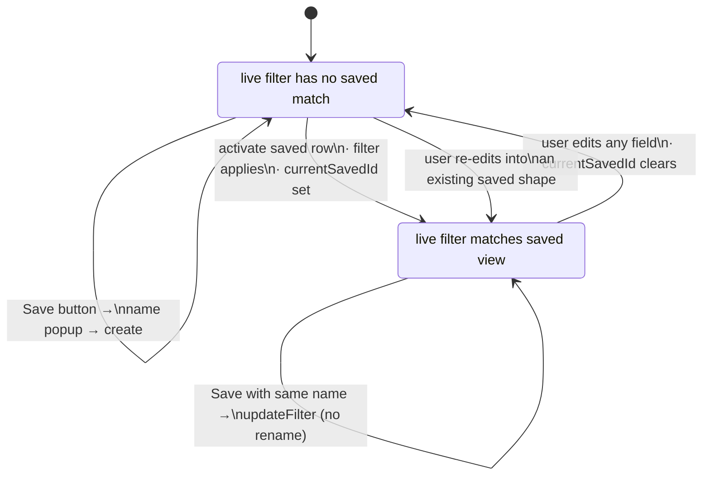

Counts in the saved-filter rows are surfaced through the optional `counts: Map<String, int>?` parameter on `SavedTaskFiltersSection`. The desktop wiring (`TasksSavedFiltersTree`) supplies real counts by watching `savedTaskFilterCountsProvider` (falling back to an empty map while loading); the row hides the count for any filter not present in the map.

### Mobile saved-filter rail

On mobile (`!isDesktopLayout`), `TasksTabPage` renders `SavedTaskFilterRail` between the header and the active-filter chips. The mobile widgets live in `lib/features/tasks/ui/saved_filters/mobile/` and reuse the shared state (`savedTaskFiltersControllerProvider`, `currentSavedTaskFilterIdProvider`, `tasksFilterHasUnsavedClausesProvider`, `savedTaskFilterCountsProvider`, `SavedTaskFilterActivator`) — they create no dependency on the desktop `SavedTaskFilterRow`.

- `SavedTaskFilterRail` — a conditional band rendered only when ≥1 saved filter exists (otherwise `SizedBox.shrink`, so the layout is unchanged for users without saved filters). The normal layout is a non-scrolling `Row`, left→right: the band-leading "Saved" button, then an "All" pill (clears to the default view), then the active saved pill (or a "Custom" pill carrying the live filtered count for an ad-hoc filter that matches no saved filter — sourced from `currentTasksFilterCountProvider`, which mirrors the live list's empty-status→all-statuses expansion so the number agrees with the list), then as many most-recently-used quick-jump pills as fit, and a trailing "+ Save" call-to-action shown only when `tasksFilterHasUnsavedClausesProvider` is true.
  - **"Saved" button** (`_SavedButton`) — the rail's single explicit sheet opener, and deliberately distinct from the filter pills: a **borderless** filled `DsPill` (the All / active pills are filled **and** bordered), so the menu-opener never reads as just another selectable filter value. It is led by a `bookmarks_outlined` glyph, carries the **saved-filter count** (`saved.length`) in the SAME shared `SavedFilterCountText` slot the rail pills use — so it reads "Saved 6" peer to "All 214", not a subordinate parenthetical numeral — and is closed by an `unfold_more` glyph rather than a down-chevron: a down-chevron implied a dropdown, but the manager rises from the bottom as a sheet, so the bidirectional unfold glyph signals "opens a panel that rises". Label word and glyphs use `text.highEmphasis` so they stay legible over the light-theme pill fill. One tap opens the sheet.
  - **"+ Save" CTA** (`_SaveChip`) — a teal-`tinted` `DsPill` (`DsPillVariant.tinted`, `color: interactive.enabled`: a filled mint wash, no border) with a leading `+`, so it reads as a distinct call-to-action — NOT the teal-`outline` vocabulary the bordered active / "Custom" pills use, and NOT the muted dashed `DsGhostChip` skin (reserved for true empty/placeholder states). Wrapped in a ≥48dp tap target.
  - **No chevron on the pills:** only the "Saved" button carries a disclosure affordance. The active and "Custom" pills carry none — the whole pill body opens the sheet on a tap, while an inactive quick-jump pill applies/switches its filter — so each pill is one predictable whole-pill tap target.
  - The pill run is hard-capped and never scrolls — overflow lives in the sheet; MRU fit is computed deterministically in `LayoutBuilder` from token-derived width heuristics (capped at `maxMruPills`). The selection is tri-state (a saved pill, "All", or "Custom") so exactly one anchor always reads.
  - **Large text** (`MediaQuery.textScalerOf(context).scale(1) ≥ 1.3`): the rail collapses to a **SINGLE** horizontal `SingleChildScrollView` holding `[active anchor (leads), "All", "Saved", "+ Save"?]` separated by the SAME token gap as the normal rail (so chips never overlap), with a right-edge `ShaderMask` alpha fade (`BlendMode.dstIn`) as the scroll affordance. There is **no** "Saved pinned outside the scroll" split — everything lives in the one scroll view. The active anchor leads and stays fully readable (capped at the viewport width so a long name ellipsizes rather than pushing the row arbitrarily wide); "All" follows because return-to-unfiltered is the most common escape hatch, and when "All" *is* the active selection it doubles as the anchor rather than rendering twice; the MRU quick-jumps are dropped.
  - Counts use stale-while-revalidate (`AsyncValue.value`) so a background sync never flashes pills back to `–`.
- `SavedTaskFilterPill` — a `DsPill(filled, bordered)` pill (optional leading category dot, ellipsizing name, shared tabular count slot capped at `999+`, dimmed `0`, `–` on cold start) wrapped in a ≥48dp tap target. There is deliberately **no** in-pill selection check and **no** chevron: the active state is already encoded by the teal `interactive.enabled` border + `surface.selected` tint + bold name (and the category dot), so each pill stays a single unambiguous tap target and the freed width goes to the name. The leading category dot carries a thin background-toned ring (`Border.all(background.level01)`) so a teal category colour never melts into the teal selection accent. A name that still overflows truncates its leading "Category · " prefix *before* its trailing "· Status" segment (`_PillLabel` lays the prefix out in a `Flexible` so it ellipsizes first while the `·`-led status segment is pinned beside it; names without a `·` fall back to ordinary trailing ellipsis) — the dot already conveys the category, so the status is the higher-value half to keep. In the normal rail the active pill is the `Flexible` (priority-width) element while "All" stays content-sized. The count is rendered by the shared `SavedFilterCountText` widget (see below); selection draws on the orthogonal `DsPill.selected` flag.
- `SavedFilterCountText` (`saved_task_filter_pill.dart`) — the **single** count renderer shared by the rail pill, the "Saved" button, and the sheet rows, so the same number never changes type, weight, or sizing between surfaces. One type token (`others.caption`), tabular figures, fixed `w600` weight. Emphasis is gated on `selected`: a non-zero count on the active/tinted pill or row reads `text.highEmphasis` (so it stays legible on the mint fill), an unselected non-zero count reads `text.mediumEmphasis`, and a dimmed `0` or a cold-start / loading `–` (a null count) drops to `text.lowEmphasis`. `minWidth` reserves a stable column start (rail pill `step7`, sheet `step8`) but is only a MIN — the slot grows so at large text the name ellipsizes while the full count is never width-clipped.
- `SavedTaskFiltersSheet` (`showSavedTaskFiltersSheet`) — the complete switcher + manager: full-width ≥48dp single-select rows whose **active** row carries a token-backed `colors.surface.selected` background tint (the same mint the rail's selected pill uses) so selection is multi-channel (tinted surface + indicator + bold name) rather than leaning on the indicator alone, plus a right-aligned `SavedFilterCountText` column (the same shared renderer + min-width-but-growable slot as the rail pill). The leading indicator (`_SelectionIndicator`) depends on the mode: **outside Edit** it is a single-select **radio** — a filled teal `interactive.enabled` dot when selected, an empty `text.mediumEmphasis` ring (not the near-invisible `lowEmphasis`) otherwise; **in Edit mode** selection is disabled, so the radio degrades to a **non-interactive status dot** (a filled accent dot marks the currently-applied filter; non-active rows show an empty slot of the same footprint so the name column never shifts on toggle). An "All tasks" row shows `allTasksTotalCountProvider`. An Edit toggle (teal `interactive.enabled` foreground — the sheet's one accent) reveals per-row Rename (→ text modal) / Delete (→ `showConfirmationModal`), each a ≥48dp target separated by a clear gap. Edit-mode rows keep the **same 48dp row height** as normal rows (the ≥48dp action targets define the height; no extra vertical padding is added) so toggling Edit swaps the count column for the action pair without the list jumping, and "All tasks" drops its count in Edit mode so a lone count is never mixed against the other rows' action-pairs. Deleting the *currently-active* saved filter falls back to the default "All" view (`SavedTaskFilterActivator.clearToDefault()`) so the live filter is never left on an orphaned shape; "All tasks" itself is non-deletable. A bottom "Save current filter as…" create row closes the sheet. Tapping a row applies + closes.
- `promptSaveCurrentTaskFilter` / `promptTaskFilterName` (`save_current_task_filter.dart`) — the one create verb shared by the rail "+ Save" chip and the sheet create row: snapshot the live filter via `liveTasksFilterFor`, prompt for a name, then `create()` and promote the new id in the per-device MRU order.
- `savedTaskFilterMruProvider` (`saved_task_filter_mru_controller.dart`) — an in-memory, per-device most-recently-used order (never persisted or synced) feeding the rail's quick-jump pills; `touch(id)` promotes an id to the front on activation/create.

Every number in the rail and sheet flows through the one `SavedFilterCountText` renderer — the "Saved" button's saved-*definitions* count and the per-pill / per-row task counts all share the same tabular, `selected`-gated treatment, so the same value never changes type or weight between surfaces.

The redesigned browse page also preserves the existing non-filter runtime behavior:

- pull-to-refresh
- full-text vs vector search toggle
- quick-label strip
- create-task FAB and auto-assign flow
- `/tasks/:taskId` navigation on row selection

## Header Controls and Metadata

The task detail metadata band is concentrated entirely inside `DesktopTaskHeaderConnector`. It provides interactive controls for:

- title (inline capsule edit)
- status
- priority
- category (work)
- project
- due date
- estimate
- labels

Each selection control opens the same adaptive Wolt presentation contract:
compact layouts render a bottom sheet and wide layouts render a dialog. Status
and priority use `TaskStatusModalContent` and `TaskPriorityModalContent`;
category, project, and labels embed their shared feature pickers. All option
lists converge on `DesignSystemSelectionRow`, so typography, the fixed leading
rail, full-width selected/hover/focus states, accessibility semantics, and
trailing checks or chevrons stay identical. Homogeneous options do not render
dividers, preventing a shorter rule from showing through a selected or hovered
row.

Ellipsis actions (share, extended actions, speech modal) are NOT owned by the connector — `ExtendedHeaderModal.show` is invoked from the pinned app bar's `more_vert` button (`TaskCompactAppBar` / `TaskExpandableAppBar`), not the header.

Notable behavior already implemented:

- `TaskSliverAppBar` switches between compact and expandable variants based on whether the task has `coverArtId`
- `CoverArtBackground` (the expandable variant's cover image) quantizes its decode target: the layout width is converted to physical pixels and rounded **up** to the next 256-px bucket (`coverArtCacheExtent`), and that single cap is applied to both axes via `ResizeImagePolicy.fit`. The `ResizeImage` cache key therefore stays identical across a whole band of pane widths (no re-decode per dragged pixel) and ignores the height entirely, so SliverAppBar collapse doesn't churn the cache either; the height axis only supplies the cap when the width is unbounded or zero
- when a resize does cross a bucket boundary, `gaplessPlayback` keeps the previous frame on screen while the larger decode resolves (the cover never blanks mid-resize), and the superseded decode variant is evicted from the image cache so a long drag doesn't accumulate one cached bitmap per bucket
- the header is desktop-first and the same component serves mobile — chips wrap onto the next line on narrow widths
- due dates on the detail page use calendar-day urgency styling (overdue,
  today, normal) that ignores time-of-day and daylight-saving offsets, while
  relative/absolute date display is a list-level concern owned by the shared
  page state
- labels are category-aware, but still allow out-of-scope assigned labels to be removed
- project selection integrates with the project health layer without making the task feature own project analysis itself
- language is not surfaced in the new header itself — it is reachable through the pinned app bar's triple-dot menu, which shows a "Set language" action (`ModernSetTaskLanguageItem`). The action renders the currently selected language's flag inline when one is set, falls back to `Icons.language` otherwise, and opens the same `LanguageSelectionModalContent` modal used by the category editor. Selection is persisted via `EntryController.updateTaskLanguage`, which writes through `PersistenceLogic.updateTask`, setting `ChangeSource.user` on `TaskData.languageSource`.

## AI and Media Integrations

The tasks feature consumes AI-adjacent capabilities rather than owning them.

Examples:

- AI-running animation wrapper at the bottom of the detail page
- automatic image-analysis trigger on dropped media
- linked entries can include AI-generated content or transcriptions
- agent reports and pending change sets are displayed on task pages, but generated elsewhere

That separation is deliberate. The task feature owns the task experience; it should not become a secret duplicate of the AI feature.

`TaskDetailsPage` wraps its scroll view in `TaskScrollStabilityScope`. Both
nested AI response cards and the source-entry editors that receive audio
transcripts or image-analysis markdown opt into `ViewportStableAnimatedSize`
only inside that scope. If the changing region is visible, its top and the page
scroll offset stay fixed while it unfolds downward. If the region is fully
above the viewport, `ViewportStableScrollController` compensates each measured
region-height delta from the viewport's own layout cycle—even when only the
editor consumer rebuilt and unrelated content elsewhere changes in the same
frame—so the content currently being read never paints at an intermediate
displaced position. User scrolling cancels the hold
immediately, and the standalone journal-entry detail page remains outside the
scope.

## Current Constraints

- task persistence still flows through shared journal/persistence machinery
- task list filtering is powered by the shared journal page controller, so some list-state logic lives outside this feature directory
- checklists are modular and flexible, but that means the feature spans several controllers and widget clusters
- linked-task UI is task-specific, while generic linked-entry rendering still lives in the journal feature

## Relationship to Other Features

- `journal` owns the shared entry substrate and paging/filter controller
- `projects` adds project grouping and project-agent summaries around tasks
- `labels` supplies label entities and category scoping
- `speech` can create task-linked audio entries
- `ai` and `agents` provide reports, change sets, prompts, and automation around task content

If you want to understand why tasks feel like the app's operational center rather than just another entry type, this feature is the answer.
