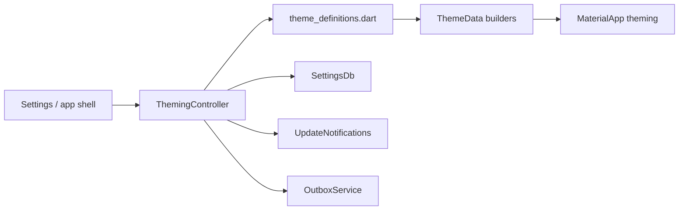
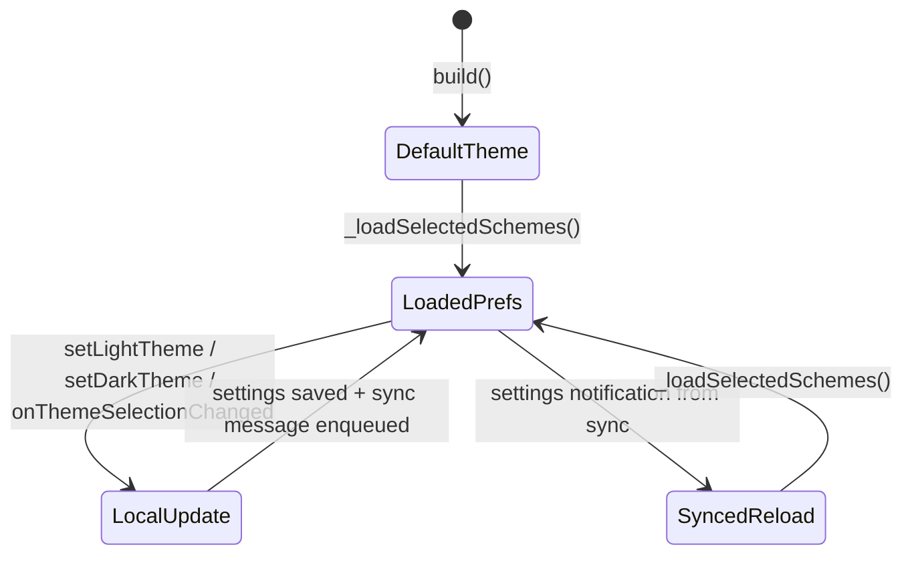
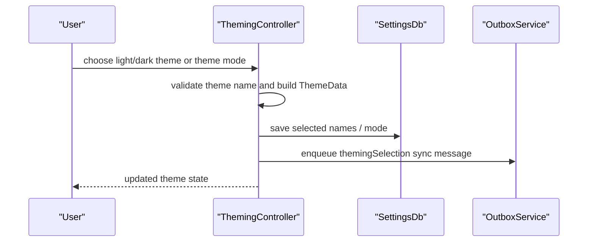

# Theming Feature

The `theming` feature owns app theme selection and theme construction.

It takes stored user preferences and turns them into actual `ThemeData` objects for:

- light theme
- dark theme
- theme mode

It also syncs theme selection across devices through the sync feature.

## What This Feature Owns

At runtime, the feature owns:

1. the current theming state (`lightTheme`, `darkTheme`, names, mode)
2. building `ThemeData` from theme definitions
3. persistence of theme selection to `SettingsDb`
4. enqueueing theme-selection sync messages
5. live reload when synced settings changes arrive

## Directory Shape

```text
lib/features/theming/
├── model/
├── state/
└── README.md
```

## Architecture



The feature is conceptually simple, but the runtime path matters because theme changes can come from:

- the local user
- synced settings updates from another device

## Theme Construction Model

`ThemingController` builds theme data from:

- the selected light theme name
- the selected dark theme name
- the selected `ThemeMode`

Theme definitions come from standard `FlexScheme` mappings.

The build path also applies:

- shared overrides
- Linux emoji font fallback

## Theming State Machine

The explicit runtime lifecycle looks like this:



That split between local update and synced reload is important. The controller explicitly avoids enqueuing a new sync message while it is applying synced changes, which prevents theme ping-pong between devices.

## Theme Selection Flow



## Theme Definitions

`theme_definitions.dart` provides:

- the map of standard theme names to `FlexScheme`
- validation helpers
- the default theme name
- light-mode surface constants

## Sync Semantics

Theme changes are synced via `SyncMessage.themingSelection`.

Theming therefore behaves like a user preference with cross-device propagation, not like a purely local UI tweak. That is the right choice for an app where users generally expect "my chosen theme" to follow them.

## Relationship to Other Features

- `settings` exposes the user-facing theme controls
- `sync` transports theme-selection changes across devices

This feature is small, but it is one of the cleanest examples in the codebase of a focused controller doing one job well: build theme state, persist it, and keep it in sync.
