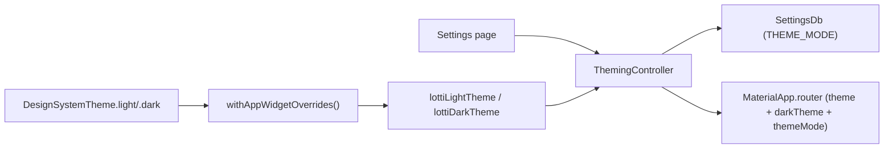
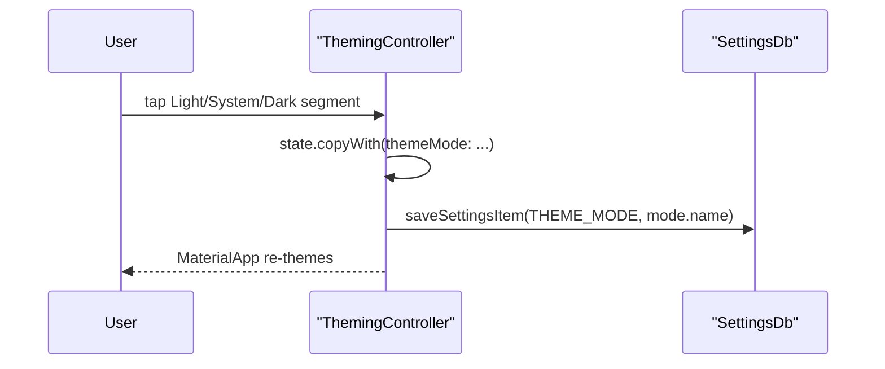

# Theming Feature

The `theming` feature owns the active theme mode and exposes the
`ThemeData` objects that `MaterialApp` consumes.

The app supports exactly three modes:

- **Light** — the design-system light theme
- **Dark** — the design-system dark theme
- **System** — follow the platform's brightness setting

There is no named-theme picker. Light and dark are built once from the
Figma-derived design system tokens and reused for the entire app
lifecycle. The user only selects which mode applies.

## What This Feature Owns

At runtime, the feature owns:

1. the current `ThemeMode` selection
2. the cached `ThemeData` for light and dark (built from
   `DesignSystemTheme`)
3. persistence of the selected mode to `SettingsDb` (`THEME_MODE` key)
4. a `Stream<bool>` provider that surfaces the `enable_tooltip` config
   flag (co-located here because tooltip behaviour follows app shell
   theming concerns)

## Directory Shape

```text
lib/features/theming/
├── state/
│   └── theming_controller.dart
└── README.md
```

## Architecture



Theme construction is driven by the design tokens, with a thin layer of
widget-level styling on top. The controller holds no theme-building
logic of its own — it just wires the singleton themes into Riverpod
state and toggles the active mode.

## Theme Construction

`DesignSystemTheme.light()` and `DesignSystemTheme.dark()` (in
`lib/features/design_system/theme/design_system_theme.dart`) build
`ThemeData` directly from `DsTokens`:

- color scheme is mapped from token color groups (background, text,
  interactive, alert, decorative)
- text theme is mapped from token typography styles
- the active `DsTokens` instance is attached as a `ThemeExtension`, so
  any widget can reach the design tokens via
  `Theme.of(context).extension<DsTokens>()`

`withAppWidgetOverrides()` in `lib/themes/theme.dart` then layers on
widget concerns that tokens do not express:

- card, dialog, bottom-sheet, and app-bar shape / elevation
- input-decoration borders and focus treatment
- text-button, elevated-button, segmented-button, chip, slider, and
  snack-bar styling
- a `pageTransitionsTheme` with an empty builders map, which disables
  Flutter's default per-platform transitions so navigation feels uniform
  across iOS, Android, and desktop
- `ThemeExtension`s for `GptMarkdownThemeData` (heading sizes, link
  colors) and `WoltModalSheetThemeData` (pagination animation curve),
  consumed by the AI/agent markdown surfaces and modal sheets

Both themes are top-level singletons in `theming_controller.dart`
(`lottiLightTheme`, `lottiDarkTheme`) — they are pure functions of
compile-time tokens and never change at runtime.

## Theming Lifecycle

```mermaid
stateDiagram-v2
  [*] --> Default: build() returns ThemingState(themeMode: system)
  Default --> Loaded: _loadThemeMode() reads THEME_MODE
  Loaded --> Loaded: onThemeSelectionChanged({mode})\npersists THEME_MODE
```

There is no sync-driven reload state and no debounced enqueue: theme
mode is a per-device preference (see "Sync Semantics" below).

## Theme Selection Flow



If `_loadThemeMode()` reads a missing or unrecognized stored value, the
controller falls back to `ThemeMode.system` and logs the failure to
`LoggingService` under `domain: THEMING_CONTROLLER, subDomain:
loadThemeMode`.

## Sync Semantics

Theme selection is **not synced across devices**. Each device picks its
own mode — the same way most platforms treat appearance preferences
(brightness on a phone, dark-mode toggle on a desktop).

The `SyncMessage.themingSelection` variant remains in the wire schema
purely for backward compatibility with peers running older releases:

- the controller never enqueues new `themingSelection` messages
- the receiver in `sync_event_processor.dart` accepts the variant but
  discards it (no settings written, just a trace log)

This keeps cross-version sync robust without re-introducing a synced
preference that users on one device would feel as a surprise on another.

## Relationship to Other Features

- `settings` exposes the user-facing mode picker
  (`features/settings/ui/pages/theming_page.dart`)
- `design_system` owns the tokens and `DesignSystemTheme` builders
- `sync` carries the (now no-op on receive) `themingSelection` variant
