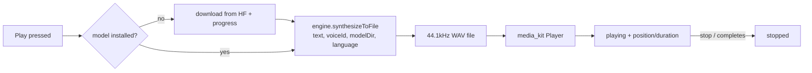
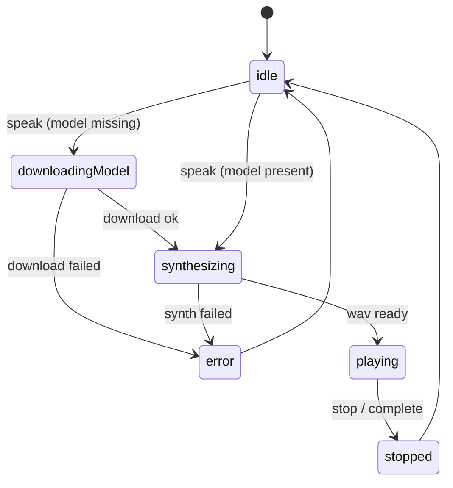

# Text-to-speech (Supertonic)

On-device text-to-speech that reads a task's AI **TL;DR** aloud: it runs the
[Supertonic 3](https://huggingface.co/Supertone/supertonic-3) ONNX model
(~99M params, 44.1kHz 16-bit WAV) locally via `flutter_onnxruntime` and plays
the result through the app's existing `media_kit` stack. No cloud, no API.

The engine is wired (`ttsEngine` → `SupertonicOnnxEngine` on the Apple platforms
— macOS + iOS — behind a `TtsEngine` interface). onnxruntime ships as a
statically linked binary, which CocoaPods rejects under the project's dynamic
`use_frameworks!`; rather than the global `use_frameworks! :linkage => :static`
(which breaks `super_native_extensions`' Rust FFI), both `macos/Podfile` and
`ios/Podfile` use a targeted `pre_install` hook that forces only the
`flutter_onnxruntime` plugin and its `onnxruntime-*` deps to link statically
(`static_library` on macOS; `static_framework` on iOS so the ObjC `@import` in
`GeneratedPluginRegistrant.m` finds a module). The ten voice-style JSONs are
bundled under `assets/tts/voice_styles/`; the ~400MB `onnx/` model files are
**downloaded from Hugging Face on first use** (see the download repository —
filenames verified against the repo). This feature **replaces** the previous
MLX/Qwen3-TTS "speak summary" path and is gated behind the
`enable_ai_summary_tts` config flag (default off), so the playback control
appears once the flag is on, the engine is supported (macOS or iOS), and a
TL;DR exists.

## Architecture

```
features/tts/
  engine/                      pure, ONNX-independent core (no Flutter deps beyond services)
    text_preprocessing.dart    NFKD/Hangul/Latin normalization + language tags
    text_chunker.dart          sentence-aware chunking (KO/JA-aware max length)
    wav_writer.dart            encodeWavBytes (16-bit mono PCM) + file writer
    unicode_processor.dart     code-point -> token-id tokenizer + padding mask
    tts_engine.dart            TtsEngine interface (synthesize boundary)
  model/                       immutable value types + catalogs
    tts_voice.dart             10 Supertonic voices (F1-F5 / M1-M5), default female
    tts_model_option.dart      model catalog (Supertone/supertonic-3)
    tts_playback_state.dart    utterance state machine + progress
    tts_settings.dart          persisted voice/model/speed prefs
  state/                       Riverpod controllers + IO boundaries
    tts_settings_controller.dart   persists prefs via SettingsDb
    tts_audio_player.dart          TtsAudioPlayer interface + media_kit impl
    tts_model_repository.dart      first-run Hugging Face download boundary
    tts_engine_provider.dart       engine provider (+ Unavailable fallback)
    tts_playback_controller.dart   orchestrates ensure-model -> synthesize -> play
  ui/widgets/
    tts_play_button.dart       focal 44pt play/stop control (filled-accent
                               circle; play/stop by shape+label, progress arc)
    tts_voice_selector.dart    Female|Male DsSegmentedToggle switching which
                               gender's five numbered voices are listed
    tts_model_selector.dart    model rows ("Recommended" badge only with >1)
    tts_speed_selector.dart    0.5x-2x playback-speed picker
```

The **AI-card header** integration lives in the agents feature
(`lib/features/agents/ui/ai_summary_card.dart` + `.../ai_summary_card/
tldr_section_part.dart`): the card builds a `TtsPlayButton` from
`TtsPlaybackController` (gated on the `enable_ai_summary_tts` flag + a non-empty
TL;DR + a supported engine), and the agent "Thinking…" pill is visually
distinct from the audio control. This **replaced** the old fire-and-forget MLX
`_speakSummary` path.

## Done

- **Settings → Speech page** — voice / model / playback-speed selectors in the
  entity-definition design language, wired into the mobile `SettingsPage` list
  and the desktop Settings-v2 tree/panel (flag-gated).
- **Engine + native:** concrete `SupertonicOnnxEngine` wired; `macos/Podfile`
  uses static linkage; voice JSONs bundled; model filenames verified against
  the HF repo.
- **`flutter_onnxruntime` fork** (`third_party/flutter_onnxruntime`, path
  `dependency_override`): runs ONNX inference on a dedicated serial background
  queue on macOS, which Flutter can't do via platform-channel task queues
  (flutter/flutter#162613). Without it, synthesis blocks the main thread and the
  preparing spinner stutters. See `third_party/flutter_onnxruntime/LOTTI_PATCHES.md`.

## Remaining work (handoff)

- **End-to-end run:** the first playback downloads ~400MB of `onnx/` model
  files from Hugging Face — exercise it on macOS (network + storage) and confirm
  audio before enabling `enable_ai_summary_tts` by default.
- **iOS first-use download guard:** iOS is now un-gated (the engine reports
  `isSupported` on macOS + iOS and `ios/Podfile` links the static framework),
  but the ~400MB model download is heavy on a phone and inference is slower on
  mobile CPUs — add a Wi-Fi/size confirmation before enabling it broadly on iOS.
- **Dead-code cleanup:** `MlxAudioChannel.speakText`/`stopSpeaking` and the
  Qwen3-TTS catalog entry are unreachable but still co-tested with ASR
  behaviour; remove them in a focused pass that preserves the ASR tests.
- **CHANGELOG** entry once the feature is user-visible (flag on by default).

The engine is split so the correctness-sensitive, deterministic logic
(normalization, tokenization, WAV encoding) is unit-tested without the native
ONNX runtime, and the playback orchestration is tested against fakes for the
engine, player, and model repository (see `test/features/tts/test_utils.dart`).

The preprocessing/tokenization is ported 1:1 from Supertone's open-source
Flutter example (MIT) because the models were trained against exactly that
normalization — divergence degrades synthesis quality.

## Playback flow



## Playback state machine



## Provisioning

The `onnx/` model files (`duration_predictor`, `text_encoder`,
`vector_estimator`, `vocoder`, plus `tts.json` and `unicode_indexer.json`) are
~hundreds of MB and are **downloaded from Hugging Face on first use**, not
bundled. The tiny voice-style JSONs (`voice_styles/<id>.json`) are bundled
assets. `flutter_onnxruntime` fetches its native runtime at install time and
needs iOS deployment target ≥ 16.0 (`ios/Podfile` is on 17.0) and macOS ≥ 14.0.

## Testing

- `test/features/tts/engine/` — normalization, chunking, WAV bytes, tokenizer.
- `test/features/tts/model/` — value types + state machine.
- `test/features/tts/state/` — settings persistence + playback orchestration
  (download/synthesize/play/stop/complete) via injected fakes.
- Async tests use `pumpEventQueue` and microtask yields — no real timers/delays.
