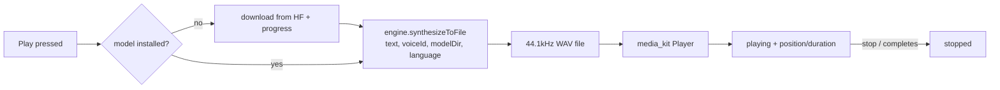
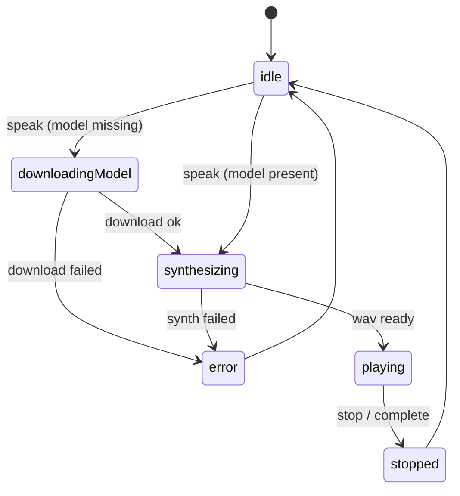

# Text-to-speech (Supertonic)

On-device text-to-speech that reads a task's AI **TL;DR** aloud. Runs the
[Supertonic 3](https://huggingface.co/Supertone/supertonic-3) ONNX model
(~99M params, 44.1kHz 16-bit WAV) locally via `flutter_onnxruntime`, and plays
the result through the app's existing `media_kit` stack. No cloud, no API.

This feature **replaces** the previous MLX/Qwen3-TTS "speak summary" path (a
hidden, default-off, fire-and-forget call with no player). It is gated behind
the `enable_supertonic_tts` config flag during rollout.

## Architecture

```
features/tts/
  engine/                      pure, ONNX-independent core (no Flutter deps beyond services)
    text_preprocessing.dart    NFKD/Hangul/Latin normalization + language tags
    text_chunker.dart          sentence-aware chunking (KO/JA-aware max length)
    wav_writer.dart            encodeWavBytes (16-bit mono PCM) + file writer
    unicode_processor.dart     code-point -> token-id tokenizer + padding mask
    tts_engine.dart            TtsEngine interface (synthesize boundary)
  model/                       immutable value types + catalogs
    tts_voice.dart             10 Supertonic voices (F1-F5 / M1-M5), default female
    tts_model_option.dart      model catalog (Supertone/supertonic-3)
    tts_playback_state.dart    utterance state machine + progress
    tts_settings.dart          persisted voice/model/speed prefs
  state/                       Riverpod controllers + IO boundaries
    tts_settings_controller.dart   persists prefs via SettingsDb
    tts_audio_player.dart          TtsAudioPlayer interface + media_kit impl
    tts_model_repository.dart      first-run Hugging Face download boundary
    tts_engine_provider.dart       engine provider (+ Unavailable fallback)
    tts_playback_controller.dart   orchestrates ensure-model -> synthesize -> play
  ui/                          Settings -> Speech page + selectors (in progress)
```

The engine is split so the correctness-sensitive, deterministic logic
(normalization, tokenization, WAV encoding) is unit-tested without the native
ONNX runtime, and the playback orchestration is tested against fakes for the
engine, player, and model repository (see `test/features/tts/test_utils.dart`).

The preprocessing/tokenization is ported 1:1 from Supertone's open-source
Flutter example (MIT) because the models were trained against exactly that
normalization — divergence degrades synthesis quality.

## Playback flow



## Playback state machine



## Provisioning

The `onnx/` model files (`duration_predictor`, `text_encoder`,
`vector_estimator`, `vocoder`, plus `tts.json` and `unicode_indexer.json`) are
~hundreds of MB and are **downloaded from Hugging Face on first use**, not
bundled. The tiny voice-style JSONs (`voice_styles/<id>.json`) are bundled
assets. `flutter_onnxruntime` fetches its native runtime at install time and
needs iOS deployment target 16.0.

## Testing

- `test/features/tts/engine/` — normalization, chunking, WAV bytes, tokenizer.
- `test/features/tts/model/` — value types + state machine.
- `test/features/tts/state/` — settings persistence + playback orchestration
  (download/synthesize/play/stop/complete) via injected fakes.
- Async tests use `pumpEventQueue` and microtask yields — no real timers/delays.
