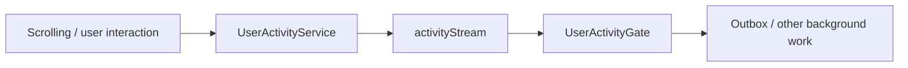
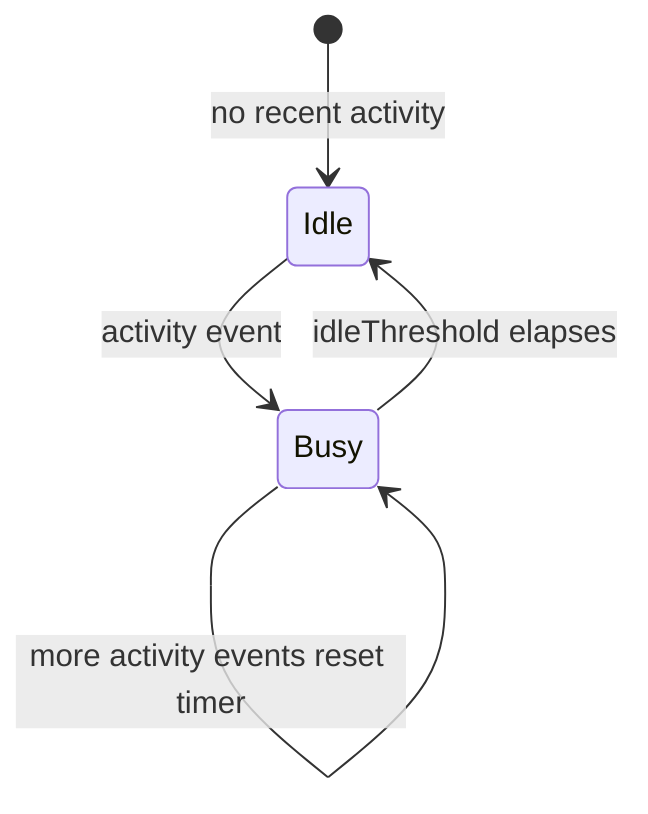
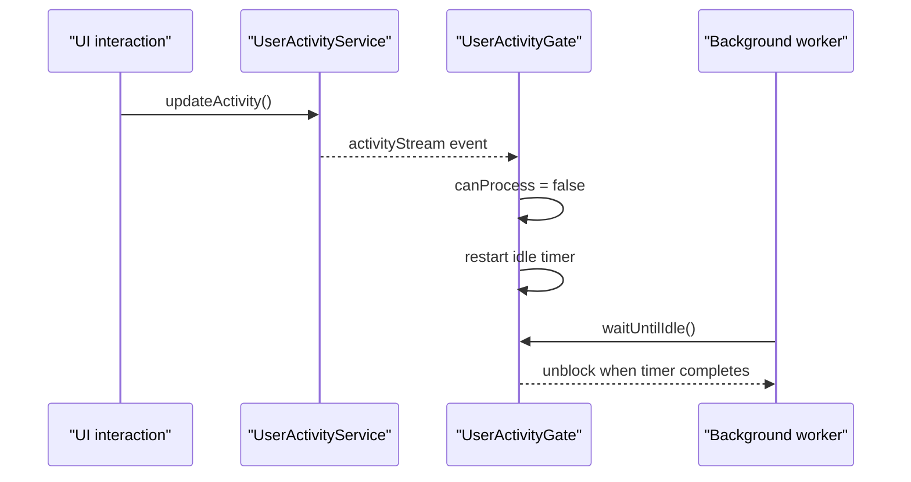

# User Activity Feature

The `user_activity` feature is a tiny coordination feature with an outsized effect.

It tracks whether the user was active recently and exposes a gate that background work can wait on before doing potentially disruptive processing.

This is the feature that lets other parts of the app say:

- "The user is actively doing things right now."
- "Wait until they have been idle for a bit."

## What This Feature Owns

At runtime, the feature owns:

1. a broadcast stream of user-activity timestamps
2. the latest known activity time
3. an idle gate that flips between active and idle based on a threshold
4. a wait-until-idle API used by background systems

## Directory Shape

```text
lib/features/user_activity/
└── state/
    ├── user_activity_service.dart
    └── user_activity_gate.dart
```

## Architecture



The feature is intentionally minimal:

- `UserActivityService` only records activity
- `UserActivityGate` turns activity into "can process" state

## User Activity Service

`UserActivityService` stores:

- `lastActivity`
- `activityStream`

and exposes:

- `updateActivity()`
- `msSinceLastActivity`
- `dispose()`

That is all it needs to do. It is a timestamp emitter, not an analytics platform.

## Activity Gate State Machine

`UserActivityGate` is the interesting part.



Real behavior from the implementation:

- the gate computes its initial state from `lastActivity`
- each activity event flips `canProcess` to `false`
- each activity event resets the idle timer
- once `idleThreshold` elapses without new activity, `canProcess` becomes `true`

## Gate Flow



This is why the feature exists at all: it gives background systems a clean way to avoid doing heavy or chatty work while the user is actively interacting with the app.

## Where It Is Used

The clearest consumer today is the sync outbox path, which waits for idle before pushing outbound work. Other UI surfaces also call `updateActivity()` while the user scrolls or interacts.

That means this feature quietly influences perceived app smoothness without ever getting a flashy page of its own.

## Relationship to Other Features

- `sync` uses the gate to avoid sending aggressively while the user is active
- pages such as dashboards and task details report activity into the service

This is a very small feature, but it is a good example of useful infrastructure: boring, explicit, and capable of preventing a surprising amount of bad timing.
