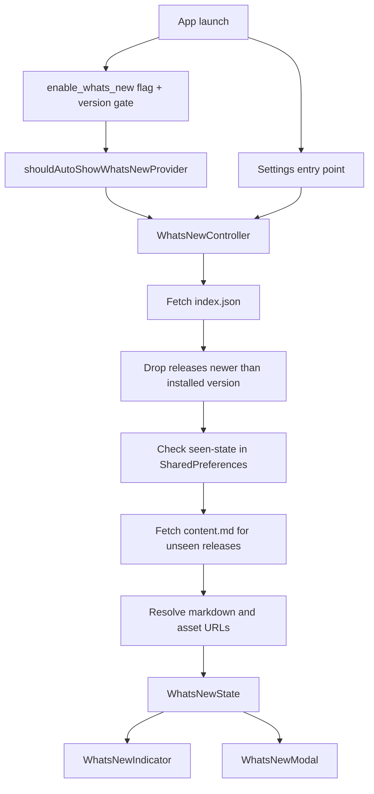
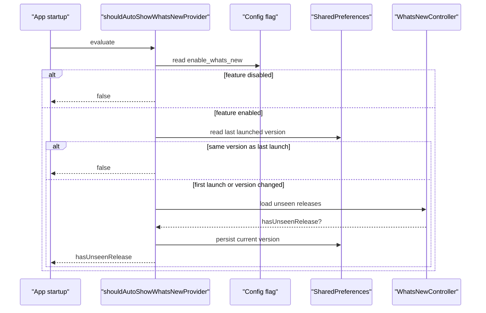

# What's New Feature

The What's New feature turns release notes into an in-app editorial surface instead of a changelog graveyard nobody opens twice.

Its runtime job is narrow:

- fetch release metadata and markdown from the docs repository
- keep only releases that are not newer than the installed app version
- remember which releases this device has already seen
- optionally auto-open the modal once per installed app version

This is remote content with local gating. The content lives in `lotti-docs`; the "should this device still show this?" decision lives in app state and `SharedPreferences`.

## High-Level Model



## Directory Shape

```text
lib/features/whats_new/
├── model/
│   ├── whats_new_release.dart
│   ├── whats_new_content.dart
│   └── whats_new_state.dart
├── repository/
│   └── whats_new_service.dart
├── state/
│   └── whats_new_controller.dart
├── ui/
│   ├── whats_new_modal.dart
│   └── whats_new_indicator.dart
└── util/
    └── whats_new_markdown_parser.dart
```

## Content Source

Release content is fetched from:

`https://raw.githubusercontent.com/matthiasn/lotti-docs/main/whats-new`

Expected layout:

```text
whats-new/
├── index.json
├── 0.9.805/
│   ├── content.md
│   └── banner.jpg
└── ...
```

Each `index.json` entry maps to `WhatsNewRelease` and must provide:

- `version`
- `date`
- `title`
- `folder`

### Why Remote Content?

Because shipping release notes inside the binary would require an app update just to fix the app update notes. That is a decent joke, but not good architecture.

## Runtime Responsibilities

### `WhatsNewService`

`WhatsNewService` does the network I/O:

- `fetchIndex()` downloads and parses `index.json`
- `fetchContent(release)` downloads `content.md` and hands it to the parser

It stays deliberately boring:

- no custom cache layer
- no retry orchestration
- a fixed 10-second timeout
- exception logging and `null` on failure

It also sorts releases by `date` descending, so display order is driven by metadata rather than file order in `index.json`.

### `WhatsNewMarkdownParser`

The parser translates editorial markdown into `WhatsNewContent`.

Rules:

- normalize CRLF to LF
- split content on `\n---\n`
- treat the first chunk as `headerMarkdown`
- keep later chunks in `sections`
- rewrite relative markdown image paths to absolute GitHub raw URLs
- derive the banner URL as `<baseUrl>/<folder>/banner.jpg`

Important nuance: the split is preserved in the data model, but the current modal renders one scrollable document per release by joining `headerMarkdown` and `sections` back together. Navigation is between releases, not between markdown sections.

### `WhatsNewController`

`WhatsNewController` is the local coordinator. On build it:

1. reads the installed app version from `PackageInfo`
2. fetches release metadata
3. skips releases newer than the installed version
4. checks `SharedPreferences` for per-version seen state
5. fetches content only for unseen eligible releases
6. exposes a `WhatsNewState` to the UI

It also owns the mutation side:

- `markAsSeen(version)` removes one loaded release from the unseen set
- `markAllAsSeen()` clears the current unseen set
- `resetSeenStatus()` removes all persisted seen markers and invalidates the provider

## Entry Points

There are two ways into the feature:

- `beamer_app.dart` listens to `shouldAutoShowWhatsNewProvider` and schedules the modal after the first frame when startup gating says yes
- `settings_page.dart` exposes both a dedicated Settings row and a small pulsing indicator in the Settings header

That split keeps "should I auto-open?" separate from "what content exists?" and separate again from "let the user open it manually".

## Auto-Show Logic

`shouldAutoShowWhatsNewProvider` is intentionally not the content loader. Its job is only to decide whether startup should open the modal.



The current version is persisted only after the controller read succeeds. That avoids writing launch state before the feature has even finished its own decision path.

## Seen-State Semantics

Seen tracking is version-based and intentionally simple:

- `whats_new_seen_<version>` marks a specific release as seen
- `whats_new_last_launched_version` records which app version last completed startup gating

Important behaviors:

- dismissing the modal normally marks only the releases the user actually navigated to
- pressing `Skip` or `Done` marks all currently loaded releases as seen
- the empty-state modal offers "View past releases", which resets seen markers and reopens the reader
- if loading fails, the feature degrades to empty state rather than persisting half-baked state

## UI Composition

### `WhatsNewIndicator`

`WhatsNewIndicator` is the small pulsing dot in Settings. It watches `whatsNewControllerProvider` and disappears entirely when there is nothing unseen.

### `WhatsNewModal`

`WhatsNewModal` is one Wolt modal page per unseen release. Each page contains:

- a 21:9 hero banner with a fallback gradient when the image is missing
- a version badge, with `NEW` only on the newest loaded release
- a single scrollable Markdown document for that release
- a sticky footer with arrows, position dots, and `Skip` or `Done`
- banner and inline-image precaching for smoother transitions

The presentation is deliberately more magazine than changelog. Release notes should not feel like a raw JSON dump wearing a blazer.

## Network and Privacy Boundary

This feature performs plain HTTP GET requests to the public docs repository. It does not send journal entries, tasks, or AI payloads anywhere.

What leaves the device:

- requests for static release-note assets on GitHub raw content

What stays local:

- seen-state
- installed-version comparison
- auto-show decisions

## Failure Model

Failures degrade to "show nothing" rather than "break startup":

- timeout
- network error
- malformed `index.json`
- unexpected response payloads
- missing or broken images

Exceptions are logged. The controller falls back to an empty `WhatsNewState`, and the indicator/modal simply have nothing to show.

## Authoring Workflow

To publish a new release note:

1. create `lotti-docs/whats-new/<version>/`
2. add `content.md`
3. add `banner.jpg` if you want the intended hero treatment; the app does have a visual fallback
4. add the release entry to `index.json`
5. update the main app changelog and release metadata

Keeping newest entries first in `index.json` is still sensible for humans, but runtime ordering comes from the `date` field.

The app will only show that release when the installed version is new enough.

## Why The Feature Is Structured This Way

Because release notes are content, not code. The app only needs a reliable local gate, a parser, and a reader that does not insult the content on arrival.

Everything else is just a civilized way of saying: show the notes, remember that I saw them, and do not spoil features I have not installed yet.

## Testing

Tests use a mock `PackageInfo` to simulate a high app version (99.99.99) so all test releases are included.

```dart
TestDefaultBinaryMessengerBinding.instance.defaultBinaryMessenger
    .setMockMethodCallHandler(
  const MethodChannel('dev.fluttercommunity.plus/package_info'),
  (methodCall) async => {'version': '99.99.99', ...},
);
```

Run the What's New tests with:

```sh
fvm flutter test test/features/whats_new/
```
