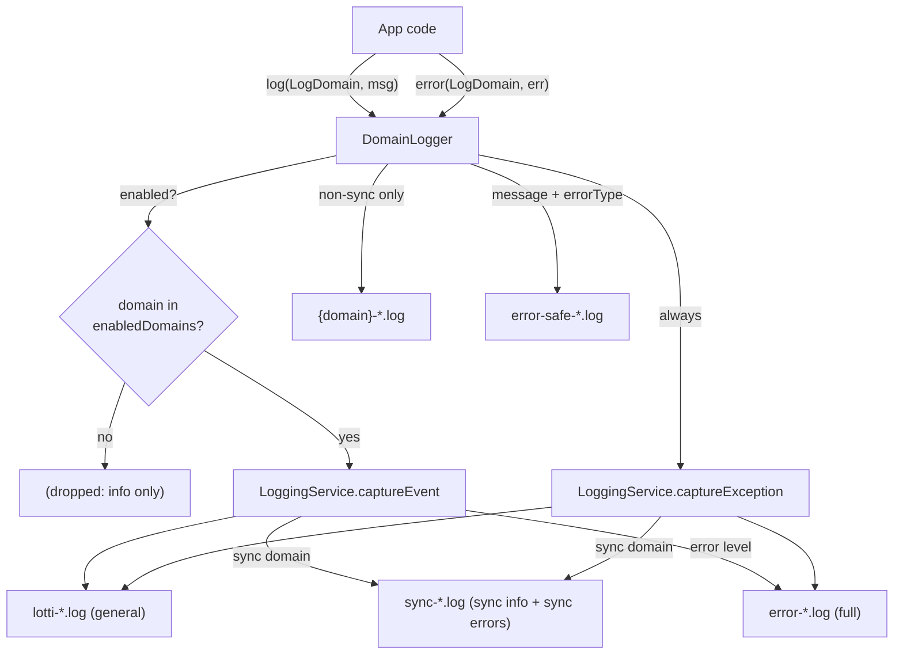

# Logging

This directory hosts the app's structured-logging stack. There are three layers:

- **`LogDomain`** (`logging_domains.dart`) — the single source of truth for the
  curated set of logging domains.
- **`DomainLogger`** (`domain_logging.dart`) — the domain-aware logging entry
  point for app code.
- **`LoggingService`** (`logging_service.dart`) — the low-level, buffered file
  sink that `DomainLogger` owns.

## `LogDomain`

`LogDomain` is an enum with ~23 curated domains (consolidating the ~70 ad-hoc
domain strings used historically). Each value carries:

| Field | Meaning |
|---|---|
| `flagName` | The config flag controlling it (`log_<snake>`). `sync` / `agentRuntime` / `agentWorkflow` reuse the historical `log_sync` / `log_agent_runtime` / `log_agent_workflow` flags so existing user preferences survive. |
| `label` | English fallback label. The Settings UI shows a localized label (`loggingDomain*` ARB keys). |
| `defaultEnabled` | Whether the domain logs by default while the global logging flag is on. All default **on** except `sync`. |
| `routesToSyncFile` | Whether events route to the shared `sync-*.log`. Only `sync` does. |
| `wireName` (== `name`) | The string written into log files / used as the per-domain file stem. |

`initConfigFlags` (`database/journal_db/config_flags.dart`) seeds one config
flag per `LogDomain.values`. Settings → Advanced → Logging renders one toggle
per domain (plus the master logging switch and the slow-query switch).

## `DomainLogger`

`DomainLogger` is the only logging entry point for app code. It:

- gates info-level `log(LogDomain, msg, …)` calls on a per-domain enabled set
  (`enabledDomains`), populated from config flags by `domainLoggerProvider`;
- always logs `error(LogDomain, Object, {message, stackTrace, subDomain})` —
  errors are never silently swallowed;
- delegates to `LoggingService` for the general (`lotti-*.log`), shared
  `sync-*.log`, and full `error-*.log` files;
- writes the non-sync per-domain files itself at
  `{documentsDir}/logs/{domain}-YYYY-MM-DD.log` (`sync` routes to the shared
  `sync-*.log` via `LoggingService` instead of a per-domain file).

`domainLoggerProvider` (in `features/agents/state/agent_providers.dart`) wires
each `LogDomain`'s config flag into `enabledDomains` via `ref.listen`, so toggling
a domain mutates the set in place without rebuilding dependents. It is constructed
transitively at app startup via the agent-init chain: `lib/beamer/beamer_app.dart`
listens to `agentInitializationProvider`, which watches agent providers (e.g.
`agentRepositoryProvider`) that `ref.watch(domainLoggerProvider)`. (For ad-hoc
error logging, `beamer_app.dart` also calls `getIt<DomainLogger>()` directly,
since `main.dart` registers the `DomainLogger` GetIt singleton at boot.)

Callers must treat `log` messages as **telemetry, not content** — never include
task titles, notes, prompt text, model output, or other user-authored content.

## Error logs

Errors are mirrored into **two** daily files so they can be inspected in one
place (and shared safely):

- **`error-YYYY-MM-DD.log`** — owned by `LoggingService`. Every exception and
  every error-level event is mirrored here in **full** (raw message + stack).
- **`error-safe-YYYY-MM-DD.log`** — owned by `DomainLogger.error`. Records the
  developer-supplied `message` plus the error's **runtime type**
  (`'<message> (errorType=<Type>)'`), but never the raw exception string or the
  stack trace, so it is safe to share without leaking user-authored content.

Under normal operation both stay empty.

## Migration status

The migration to `DomainLogger` is **complete**. All former direct
`LoggingService.captureEvent/captureException` call sites across feature, agent,
sync, and persistence code now route through `DomainLogger`; the only remaining
callers of `LoggingService.captureEvent/captureException` are inside
`DomainLogger` itself (`domain_logging.dart`). `LoggingService` is retained
solely as the low-level file sink that `DomainLogger` owns. See
`docs/implementation_plans/2026-05-30_logging_domainlogger_migration.md`.
