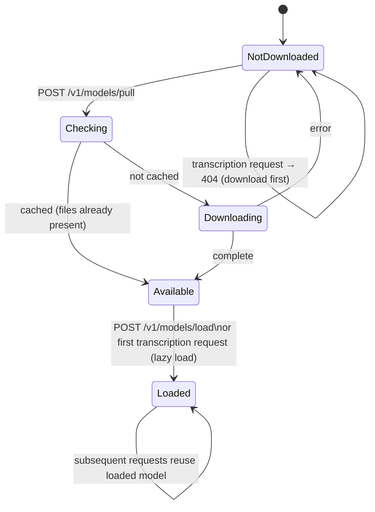

# Voxtral Local Service

Local speech transcription service using Mistral AI's Voxtral model with OpenAI-compatible API.

## Features

- **30-minute transcription support** - Much longer than Whisper's typical limits
- **9 languages** with automatic detection - English, Spanish, French, Portuguese, Hindi, German, Dutch, Italian, Arabic
- **OpenAI-inspired JSON API** - Accepts base64-encoded audio in a JSON body (not OpenAI's multipart upload); returns a custom `{text, model, language}` shape
- **Local inference** - No cloud dependencies, all processing on your machine
- **Apache 2.0 license** - Fully open source, no HuggingFace token required

## Requirements

### Hardware
- **Voxtral Mini 3B**: ~9.5 GB VRAM (bf16/fp16)
  - NVIDIA: RTX 3090/4090 (24GB) recommended
  - Apple Silicon: 16GB+ unified memory
  - CPU: Works but slower

### Software
- Python 3.9–3.13 (mistral-common requires Python < 3.14; `start_server.sh` refuses to start on 3.14+)
- PyTorch 2.2+
- FFmpeg (optional; used only for `m4a`/unknown formats, falls back to librosa when absent)

## Installation

```bash
cd services/voxtral-local

# Create virtual environment
python -m venv venv
source venv/bin/activate  # On Windows: venv\Scripts\activate

# Install dependencies
pip install -r requirements.txt

# Copy and configure environment
cp .env.example .env
# Edit .env as needed
```

## Usage

### Start the server

```bash
./start_server.sh
# Or directly:
python main.py
```

The server runs on `http://127.0.0.1:11344` by default.

### Download the model (first time)

```bash
curl -X POST http://localhost:11344/v1/models/pull \
  -H "Content-Type: application/json" \
  -d '{"model_name": "mistralai/Voxtral-Mini-3B-2507", "stream": false}'
```

### Transcribe audio

```bash
# Using the transcription endpoint
curl -X POST http://localhost:11344/v1/audio/transcriptions \
  -H "Content-Type: application/json" \
  -d '{
    "file": "<base64-encoded-audio>",
    "model": "voxtral-mini"
  }'

# Using chat completions (with audio)
curl -X POST http://localhost:11344/v1/chat/completions \
  -H "Content-Type: application/json" \
  -d '{
    "model": "voxtral-mini",
    "messages": [{"role": "user", "content": "Transcribe this audio"}],
    "audio": "<base64-encoded-audio>"
  }'
```

## API Endpoints

| Endpoint | Method | Description |
|----------|--------|-------------|
| `/health` | GET | Health check |
| `/v1/audio/transcriptions` | POST | OpenAI-compatible transcription |
| `/v1/chat/completions` | POST | Chat completion with audio support |
| `/v1/models` | GET | List available models |
| `/v1/models/pull` | POST | Download model |
| `/v1/models/load` | POST | Load model into memory |

## Model Lifecycle

The model moves through two independent dimensions: whether its files are downloaded to the local cache (`is_model_available()`, true when the cache holds `*.safetensors`) and whether weights are loaded in memory (`is_model_loaded()`, true when `model is not None`). Both are surfaced by `/health` as `model_available` and `model_loaded`.

Downloads run through `download_model()`, which streams progress with a `status` that transitions through `checking` → (`cached` | `downloading` → `complete`), or `error` on failure. Loading is lazy: the first transcription request (`/v1/audio/transcriptions` or `/v1/chat/completions`) loads the model automatically if it is available but not yet loaded; `/v1/models/load` loads it explicitly. If a request arrives when the model is not downloaded, the service returns 404 pointing at `/v1/models/pull`.



The download status enum in code is `idle` (initial) / `checking` / `cached` / `downloading` / `complete` / `error`; `idle` is the pre-pull resting state.

## Configuration

Environment variables (set in `.env`):

| Variable | Default | Description |
|----------|---------|-------------|
| `HOST` | 127.0.0.1 | Server host |
| `PORT` | 11344 | Server port |
| `VOXTRAL_MODEL_ID` | mistralai/Voxtral-Mini-3B-2507 | Model to use |
| `VOXTRAL_DEVICE` | auto | Device (auto, cuda, mps, cpu) |
| `MAX_AUDIO_SIZE_MB` | 100 | Max audio file size |
| `AUDIO_CHUNK_SIZE_SECONDS` | 300 | Chunk size for long audio (code default is 300s/5 min; the shipped `.env.example` overrides this to 60) |

## Performance

### Transformers Backend (Current)
- ~30s for 1-minute audio
- ~2.5min for 5-minute audio
- ~15min for 30-minute audio

### vLLM Backend (Planned - Phase 7)
- 14-24x faster throughput
- ~2-3s for 1-minute audio
- ~10-15s for 5-minute audio
- ~1-2min for 30-minute audio

## Comparison with Whisper

| Feature | Voxtral | Whisper |
|---------|---------|---------|
| Max audio | 30 min | ~30 min |
| VRAM | 9.5 GB | 2-10 GB |
| Languages | 9 | 99 |
| HF token | Not needed | Not needed |
| License | Apache 2.0 | MIT |

## Building Standalone Binary

Build a standalone executable that doesn't require Python:

```bash
# Using the build script
./build_binary.sh

# Or manually with PyInstaller
pip install pyinstaller
pyinstaller voxtral_server.spec
```

The binary will be created at `dist/voxtral_server`.

### Pre-built Binaries

Pre-built binaries for Linux and macOS are available in [GitHub Releases](https://github.com/matthiasn/lotti/releases).

| Platform | Architecture | Filename |
|----------|--------------|----------|
| Linux | x64 | `voxtral_server-linux-x64.tar.gz` |
| macOS | Apple Silicon (ARM64) | `voxtral_server-macos-arm64.tar.gz` |

Download and extract:

```bash
# Linux (x64)
tar -xzvf voxtral_server-linux-x64.tar.gz
./voxtral_server

# macOS Apple Silicon (M1/M2/M3/M4)
tar -xzvf voxtral_server-macos-arm64.tar.gz
./voxtral_server
```

## Troubleshooting

### Out of memory
- Set `VOXTRAL_DEVICE=cpu` for CPU-only inference (slower)
- Reduce `AUDIO_CHUNK_SIZE_SECONDS` for smaller chunks

### Model download fails
- Check internet connection
- The model is ~18GB, ensure sufficient disk space
- HuggingFace token is NOT required for Voxtral

### Slow transcription
- Ensure GPU is being used (check `/health` endpoint)
- vLLM backend (Phase 7) will provide 14-24x speedup

## License

Apache 2.0 - Same as the Voxtral model itself.
