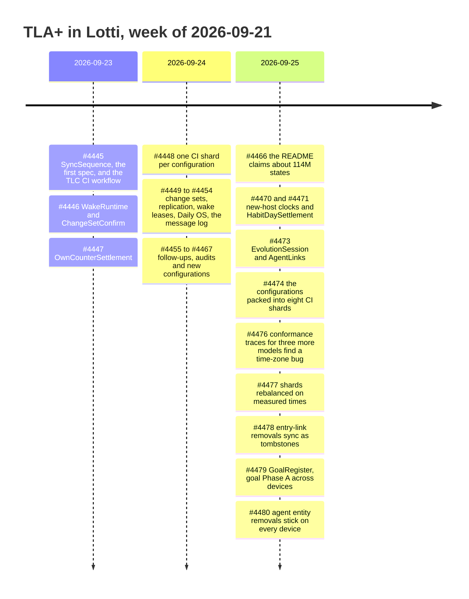

# Formal verification ledger

A running record of what the TLA+ work has covered and what it caught, one row
per pull request. [README.md](README.md) is the reference for each spec: its
configurations, properties, per-configuration state counts and mutation
counterexamples. This file records the history and the totals, and links there
rather than repeating it.

Add a row to the [pull request ledger](#pull-request-ledger) for every PR that
adds or changes a spec, or that fixes a bug a spec or its conformance traces
exposed. Then update the [totals](#totals) from the README's tables.

## Totals

Historical snapshot of `main` at `ed4ef4340` (2026-09-25):

| Measure | Value |
|---------|------:|
| TLA+ specs | 20 |
| TLC configurations | 55 |
| CI shards they run in | 8 |
| Distinct states explored | 172,228,076 |
| States generated (at `b551bf587`, 42 configurations) | 927,744,398 |
| Deepest counterexample-free trace (same run) | 53 steps |
| Named safety and liveness properties | 85 |
| Bugs fixed | 101 |
| of which TLC produced the counterexample | 60 |
| [By severity](#severity), P0 / P1 / P2 / P3 | 2 / 42 / 24 / 33 |
| Architecture decision records | 14 (ADR 0065–0071, 0075–0078, 0080–0082) |
| Source paths the specs model, each re-triggering the TLC workflow | 81 |

How the figures are counted:

- **Distinct states** is the sum of the latest figure for each configuration in
  the README (`DayJobPreparation`'s 12 is in #4462). The 42 configurations on
  `main` at `b1bd9ae11` summed to exactly the figure measured for #4466. A
  configuration's count changes when its spec does, so never add up the numbers
  quoted in successive PRs.
- **Bugs fixed** follows each PR description's own list, and is the length of
  the [full list](#severity) below. A few PRs bundle sub-fixes, so where one
  bug ends and the next begins is a judgement call. Bugs that a PR introduced
  and a later one fixed before release count once, in the fixing PR (#4447).
- **TLC-found** counts only bugs where the PR says TLC produced the trace. The
  rest came from code audits the models prompted, review rounds, Glados
  conformance traces (#4476 among them), exhaustive tests and a CI shard failure.
- **Properties** counts named invariants and temporal properties, excluding
  `TypeOK`, once per spec that checks it in any of its configurations. The
  same name can appear in several specs (`Converged` is in ten), and each of
  those is counted; there are 71 distinct names.
- **Source paths** counts the distinct Dart files and globs in the workflow's
  `paths:` filter (some are listed twice). A change to `specs/tla/` or to the
  workflow file itself also triggers it.

The notification/settings follow-up adds two specs, four configurations, ten
named properties and 180,826 distinct states to `8428b0a479`. These are
incremental figures; the historical snapshot above excludes the intervening
outbox, inbound-queue and journal models.

The `OutboxCausality` follow-up adds one spec, one configuration, five named
properties and 28,451 distinct states to the configurations present at
`5ad1095618`. These are incremental figures; the historical snapshot above
does not include the intervening outbox, inbound-queue and journal models.

The `SyncPipeline` follow-up (#4493) adds one composed spec and eight
configurations spanning six payload families. Its bounded pipeline found one
additional burn-staging bug; guarded mutations, repair reachability and two
known lost-tail limitations are executable CI checks. These additions are not
included in the historical totals above; configuration results live in the
[composed model section](README.md#syncpipeline--the-composed-sync-protocol).

## Timeline

## Pull request ledger

"Bugs" is the number the PR fixed, followed by how many of those TLC's
counterexamples found. "Severity" grades each of those bugs; see
[severity](#severity).

| PR | Merged | Area | Specs added | Configs added | Bugs (TLC) | Severity | ADR | What it caught |
|----|--------|------|-------------|--------------:|-----------:|----------|-----|----------------|
| [#4493](https://github.com/matthiasn/lotti/pull/4493) | pending | sync | `SyncPipeline` | 8 | 1 (1) | P2 | — | A swallowed burn-marker enqueue failure terminalized the own counter, preventing startup retry; CI reproduced the model trace before the fix |
| [#4445](https://github.com/matthiasn/lotti/pull/4445) | 09-23 | sync | `SyncSequence` | 5 | 6 (3) | P1×2 P2 P3×3 | [0065](../../docs/adr/0065-model-checked-sync-sequence-reservations.md) | A crash between saving and queuing left a counter reserved forever, and the change never reached other devices. Also added the TLC workflow and a checksummed `tlc.sh` |
| [#4446](https://github.com/matthiasn/lotti/pull/4446) | 09-24 | agents | `WakeRuntime`, `ChangeSetConfirm` | 4 | 4 (4) | P1×2 P2×2 | [0066](../../docs/adr/0066-model-checked-agent-wakes-and-confirmations.md) | "Confirm all" racing a tap applied one suggestion twice. A conformance trace also rejected the first design of the wake fix before it shipped |
| [#4447](https://github.com/matthiasn/lotti/pull/4447) | 09-23 | sync | `OwnCounterSettlement` | 1 | 2 (–) | P3×2 | — | Counter settlement could discard durable evidence (both bugs came from #4445 and never shipped) |
| [#4448](https://github.com/matthiasn/lotti/pull/4448) | 09-24 | agents | — | — | 2 (–) | P3×2 | — | Recovery lost wake ownership. CI now runs one TLC job per configuration, gated by an aggregate `TLC` check |
| [#4449](https://github.com/matthiasn/lotti/pull/4449) | 09-24 | agents | `ChangeSetLifecycle` | 5 | 5 (5) | P1×5 | [0067](../../docs/adr/0067-model-checked-change-set-lifecycle.md) | Whole-row writes put applied items back to pending, across writers and devices |
| [#4450](https://github.com/matthiasn/lotti/pull/4450) | 09-24 | agents | `AgentReplication`, `AgentStateWrites`, `VersionHeads` | 5 | 6 (6) | P1×2 P2×4 | [0068](../../docs/adr/0068-model-checked-agent-convergence.md) | A throttle stamped the synced timestamp locally, so devices diverged for good |
| [#4451](https://github.com/matthiasn/lotti/pull/4451) | 09-24 | agents | `ScheduledWakeLease`, `GoalChatReply` | 6 | 6 (6) | P1 P2×3 P3×2 | [0069](../../docs/adr/0069-model-checked-scheduled-wake-leases.md) | Two devices answered the same goal chat message (a 4-step trace). TLC also rejected the first draft of one fix |
| [#4452](https://github.com/matthiasn/lotti/pull/4452) | 09-24 | daily-os | `DigestRecovery`, `DayProcessingJob` | 4 | 5 (5) | P1 P2×2 P3×2 | [0070](../../docs/adr/0070-model-checked-digest-recovery-and-processing-jobs.md) | After a crash, startup replayed a digest that had already been briefed, paying for a second inference |
| [#4454](https://github.com/matthiasn/lotti/pull/4454) | 09-24 | agents | `AgentMessageLog`, `LogCompaction` | 4 | 5 (5) | P2×2 P3×3 | [0071](../../docs/adr/0071-model-checked-agent-message-log.md) | A state row without a head re-chained the message log by timestamp, closing a cycle in 6 steps |
| [#4455](https://github.com/matthiasn/lotti/pull/4455) | 09-24 | agents | `ChangeSetDependency` | 1 | 1 (–) | P2 | — | Consolidation dropped unresolved checklist-migration groups |
| [#4456](https://github.com/matthiasn/lotti/pull/4456) | 09-24 | agents | — | 2 | 3 (–) | P1 P2×2 | [0068](../../docs/adr/0068-model-checked-agent-convergence.md) | Nine writer sites wrote without the replaced row's clock, so the resolver could reverse a local write |
| [#4458](https://github.com/matthiasn/lotti/pull/4458) | 09-24 | agents | — | 4 | 6 (4) | P1×2 P2 P3×3 | [0075](../../docs/adr/0075-idempotent-change-set-tools.md) | Confirming on two devices created two follow-up tasks. Ids now derive from the item, and field writes use compare-and-set. 12 of 12 mutants killed |
| [#4459](https://github.com/matthiasn/lotti/pull/4459) | 09-24 | agents | — | — | 3 (3) | P3×3 | [0076](../../docs/adr/0076-model-checked-agent-head.md) | Last-writer-wins moved the agent head back to an ancestor |
| [#4460](https://github.com/matthiasn/lotti/pull/4460) | 09-24 | sync | — | — | 1 (–) | P3 | — | A failed descriptor refresh was never retried |
| [#4461](https://github.com/matthiasn/lotti/pull/4461) | 09-24 | agents | — | — | 3 (–) | P3×3 | — | Wakes were consumed before their intent was durable |
| [#4462](https://github.com/matthiasn/lotti/pull/4462) | 09-24 | daily-os | `DayJobPreparation` | 1 | 1 (–) | P3 | — | Overlapping job attempts each started an inference |
| [#4463](https://github.com/matthiasn/lotti/pull/4463) | 09-25 | test | — | — | 0 | — | — | Regression test: replaying a deleted checklist batch stays empty |
| [#4464](https://github.com/matthiasn/lotti/pull/4464) | 09-25 | sync | — | — | 2 (–) | P0 P1 | [0077](../../docs/adr/0077-a-reservation-names-the-id-written.md) | Three create paths reserved a counter under the wrong id. A CI shard failure exposed a corrupt-database probe that deleted the WAL |
| [#4466](https://github.com/matthiasn/lotti/pull/4466) | 09-25 | docs | — | — | 0 | — | — | The root README now claims about 114M states across 42 configurations |
| [#4467](https://github.com/matthiasn/lotti/pull/4467) | 09-24 | sync | — | — | 3 (–) | P1×2 P3 | [0078](../../docs/adr/0078-entry-link-versions-are-ordered.md) | A task removed from a project came back, because receiving a link compared no clocks. 8 of 8 mutants killed |
| [#4470](https://github.com/matthiasn/lotti/pull/4470) | 09-25 | sync | — | 2 | 1 (–) | P0 | [0080](../../docs/adr/0080-a-present-counter-ranks-above-an-absent-host.md) | A new device's first edit tied with the version it extended (counter 0 read as absent) and did not stick, even on that device |
| [#4471](https://github.com/matthiasn/lotti/pull/4471) | 09-25 | goals, habits | `HabitDaySettlement` | 2 | 8 (1) | P1×2 P2×3 P3×3 | — | An automatic success from one device overwrote a skip the user set on another. Also, 10 × 0.1 l summed to 0.9999999999999999, so a "1 l" goal failed |
| [#4472](https://github.com/matthiasn/lotti/pull/4472) | 09-25 | docs | — | — | 0 | — | — | This ledger |
| [#4473](https://github.com/matthiasn/lotti/pull/4473) | 09-25 | agents | `EvolutionSession`, `AgentLinks` | 3 | 8 (8) | P1×7 P2 | [0081](../../docs/adr/0081-model-checked-evolution-sessions-and-agent-links.md) | A peer's sweep marked an approved 1-on-1 as abandoned on every device. A removed agent link came back, because the receive read its tombstone as no row |
| [#4474](https://github.com/matthiasn/lotti/pull/4474) | 09-25 | ci | — | — | 0 | — | — | Packs the configurations into eight CI shards balanced by measured runtime, instead of one runner each |
| [#4476](https://github.com/matthiasn/lotti/pull/4476) | 09-25 | agents | — | — | 1 (–) | P1 | — | A generated conformance trace found the due-wake query comparing a UTC timestamp with local time as strings: east of UTC a peer answered a goal chat message beside its author, west of UTC recovery waited hours. Traces now drive `ScheduledWakeLease`, `GoalChatReply` and `VersionHeads` |
| [#4477](https://github.com/matthiasn/lotti/pull/4477) | 09-25 | ci | — | — | 0 | — | — | Rebalanced the eight shards on per-configuration TLC times measured in the first sharded runs |
| [#4478](https://github.com/matthiasn/lotti/pull/4478) | 09-25 | sync | — | — | 3 (–) | P1×3 | [0078](../../docs/adr/0078-entry-link-versions-are-ordered.md) addendum | Removing an entry link deleted the row locally and sent nothing, so peers kept it and their next update restored it. Removals are now synced tombstones, and linking again revives the same id. Closed the residual ADR 0078 left open |
| [#4479](https://github.com/matthiasn/lotti/pull/4479) | 09-25 | goals, habits | `GoalRegister` | 4 | 8 (5) | P1×3 P2 P3×4 | [0082](../../docs/adr/0082-model-checked-goal-registers.md) | A device whose journal was behind could win the lease and report "behind" all day while every device showed the goal on track, with no fault at all. Overlapping evaluations dropped a synced check-off, and an escalation died with the device that noticed the change. Review found three more in the fix itself |
| [#4480](https://github.com/matthiasn/lotti/pull/4480) | 09-25 | agents | — | 2 | 8 (5) | P1×7 P2 | [0081](../../docs/adr/0081-model-checked-evolution-sessions-and-agent-links.md) addendum | A removed agent entity came back from a late copy or a backfill, and a write or re-creation over a removal lost. `AgentReplication` gained a removal kind, lossy delivery and a split receive; an audit of every soft-delete writer found three more |

| [#4491](https://github.com/matthiasn/lotti/pull/4491) | pending | sync | `NotificationReplication`, `SyncSettings` | 4 | 1 (1) | P1 | — | A lifecycle patch changed the content tie-break, so peers retained different same-time notification text. Also models typed recovery and documents untracked settings limits |
| [#4490](https://github.com/matthiasn/lotti/pull/4490) | pending | sync | `OutboxCausality` | 1 | 1 (0) | P1 | — | Checks concurrent inline versions through append, collapse and receipt after #4489; fixes missing/empty-clock snapshots being folded at send time. A deliberately unsound collapse violates causal coverage. Also restores TLC triggers for startup and profile teardown |

## Severity

Each bug is graded by what it would have done to a user in production, then
adjusted for how reachable it was. The grades are a judgement made from the PR
descriptions, applied the same way across PRs, not a measurement.

| Level | Meaning |
|-------|---------|
| P0 | Silent, permanent loss of user data, or devices that disagree and never converge |
| P1 | A wrong result the user sees and that persists: a change applied twice, a duplicate entity, a wrong status, a removed item coming back, an edit overwritten |
| P2 | Wasted work or a problem that heals: a duplicate paid inference, a stuck state that a retry or restart clears, a late wake a later trigger covers |
| P3 | Latent or unreachable in practice, internal bookkeeping with no visible effect, or introduced and fixed before it shipped |

Three rules keep the grades consistent. A bug that needs a crash in a narrow
window drops one level; one triggered by an ordinary failure, such as a write
that throws, does not. A bug that never shipped is P3. The agent message-log
fork and head bugs (#4454, #4459) are P3 because a fork has no user-visible
effect.

| Level | Bugs | TLC-found | sync | agents | daily-os | goals, habits |
|-------|-----:|----------:|-----:|-------:|---------:|--------------:|
| P0 | 2 | 0 | 2 | 0 | 0 | 0 |
| P1 | 42 | 30 | 8 | 28 | 1 | 5 |
| P2 | 24 | 18 | 1 | 17 | 2 | 4 |
| P3 | 33 | 12 | 7 | 16 | 3 | 7 |
| **Total** | **101** | **60** | 18 | 61 | 6 | 16 |

Neither P0 came from a TLC trace: the WAL deletion surfaced as a CI shard
failure (#4464), and the discarded first edit on a new device in the review of
#4467 (#4470). TLC found 30 of the 42 P1s.

The P0 and P1 bugs:

| PR | Level | TLC | Bug |
|----|-------|-----|-----|
| [#4464](https://github.com/matthiasn/lotti/pull/4464) | P0 | no | Restoring a corrupt database deleted its WAL, losing recent changes |
| [#4470](https://github.com/matthiasn/lotti/pull/4470) | P0 | no | First edit on a new or reinstalled device silently discarded |
| [#4445](https://github.com/matthiasn/lotti/pull/4445) | P1 | yes | Crash after saving left the change unsent to other devices |
| [#4445](https://github.com/matthiasn/lotti/pull/4445) | P1 | yes | Failed post-save step made the saved entry announced as never written |
| [#4446](https://github.com/matthiasn/lotti/pull/4446) | P1 | yes | Double tap or Confirm all applied one suggestion twice |
| [#4446](https://github.com/matthiasn/lotti/pull/4446) | P1 | yes | A failing post-confirm hook let a retry apply the change again |
| [#4449](https://github.com/matthiasn/lotti/pull/4449) | P1 | yes | Failed item's revert put an applied sibling back to pending |
| [#4449](https://github.com/matthiasn/lotti/pull/4449) | P1 | yes | Follow-up task rewrite reset an applied migration to pending |
| [#4449](https://github.com/matthiasn/lotti/pull/4449) | P1 | yes | Consolidated copy showed confirmed for a change that never landed |
| [#4449](https://github.com/matthiasn/lotti/pull/4449) | P1 | yes | Confirms on two devices: one device's confirm was dropped |
| [#4449](https://github.com/matthiasn/lotti/pull/4449) | P1 | yes | Receiving a change set overwrote a local claim, reapplying it |
| [#4450](https://github.com/matthiasn/lotti/pull/4450) | P1 | yes | Wake throttle made devices keep different agent state for good |
| [#4450](https://github.com/matthiasn/lotti/pull/4450) | P1 | yes | Stale local write resurrected a retracted agent item on one device |
| [#4451](https://github.com/matthiasn/lotti/pull/4451) | P1 | yes | Two devices both answered the same goal chat message |
| [#4452](https://github.com/matthiasn/lotti/pull/4452) | P1 | yes | Slow plan refinement produced two duplicate suggestion sets |
| [#4456](https://github.com/matthiasn/lotti/pull/4456) | P1 | no | Edited agent personality or template ignored under clock skew |
| [#4458](https://github.com/matthiasn/lotti/pull/4458) | P1 | yes | Confirming on two devices created two follow-up tasks or entries |
| [#4458](https://github.com/matthiasn/lotti/pull/4458) | P1 | yes | Late second apply overwrote the user's field edit |
| [#4464](https://github.com/matthiasn/lotti/pull/4464) | P1 | no | Created task, AI response or person never reached other devices |
| [#4467](https://github.com/matthiasn/lotti/pull/4467) | P1 | no | Task removed from a project reappeared; devices kept different links |
| [#4467](https://github.com/matthiasn/lotti/pull/4467) | P1 | no | Link edit or removal lost to a peer with a clock ahead |
| [#4471](https://github.com/matthiasn/lotti/pull/4471) | P1 | no | Decimal logs like 10 x 0.1 l missed exact habit or goal targets |
| [#4471](https://github.com/matthiasn/lotti/pull/4471) | P1 | yes | Skip set on one device overwritten by another device's auto-success |
| [#4473](https://github.com/matthiasn/lotti/pull/4473) | P1 | yes | Approved 1-on-1 recorded as abandoned on every device |
| [#4473](https://github.com/matthiasn/lotti/pull/4473) | P1 | yes | Failed approval left new version live but session abandoned |
| [#4473](https://github.com/matthiasn/lotti/pull/4473) | P1 | yes | Retrying a soul approval created a second version |
| [#4473](https://github.com/matthiasn/lotti/pull/4473) | P1 | yes | Receiving a session row overwrote a fresh approval |
| [#4473](https://github.com/matthiasn/lotti/pull/4473) | P1 | yes | Removed agent link came back from a late copy |
| [#4473](https://github.com/matthiasn/lotti/pull/4473) | P1 | yes | Unlink then relink left devices disagreeing on a link |
| [#4473](https://github.com/matthiasn/lotti/pull/4473) | P1 | yes | Link receive race overwrote a local link write |
| [#4476](https://github.com/matthiasn/lotti/pull/4476) | P1 | no | East of UTC a peer answered a goal chat message alongside its author |
| [#4478](https://github.com/matthiasn/lotti/pull/4478) | P1 | no | Removing a link on one device never reached the others |
| [#4478](https://github.com/matthiasn/lotti/pull/4478) | P1 | no | A removed link came back from a peer's next entry update |
| [#4478](https://github.com/matthiasn/lotti/pull/4478) | P1 | no | Re-linking after a removal left devices disagreeing on the link |
| [#4479](https://github.com/matthiasn/lotti/pull/4479) | P1 | yes | Overlapping goal evaluations dropped a synced check-off |
| [#4479](https://github.com/matthiasn/lotti/pull/4479) | P1 | yes | A goal evaluation committed over a peer's row it never read |
| [#4479](https://github.com/matthiasn/lotti/pull/4479) | P1 | yes | A goal report said "behind" all day while every device showed on track |
| [#4480](https://github.com/matthiasn/lotti/pull/4480) | P1 | yes | A late copy of an agent entity brought its removal back |
| [#4480](https://github.com/matthiasn/lotti/pull/4480) | P1 | yes | A write over a peer's removal lost to that peer's older version |
| [#4480](https://github.com/matthiasn/lotti/pull/4480) | P1 | yes | Drafting a removed day plan again handed the removal back |
| [#4480](https://github.com/matthiasn/lotti/pull/4480) | P1 | yes | Receiving most agent entity types overwrote a local write made meanwhile |
| [#4480](https://github.com/matthiasn/lotti/pull/4480) | P1 | no | A removal sorted before the concurrent edit it followed, so the entity returned |
| [#4480](https://github.com/matthiasn/lotti/pull/4480) | P1 | no | Removing parsed items, versions or change sets used a stale snapshot clock |
| [#4480](https://github.com/matthiasn/lotti/pull/4480) | P1 | no | A project recommendation recorded again after an undo stayed removed on peers |

All 101 bugs

| PR | Level | TLC | Bug |
|----|-------|-----|-----|
| [#4445](https://github.com/matthiasn/lotti/pull/4445) | P1 | yes | Crash after saving left the change unsent to other devices |
| [#4445](https://github.com/matthiasn/lotti/pull/4445) | P1 | yes | Failed post-save step made the saved entry announced as never written |
| [#4445](https://github.com/matthiasn/lotti/pull/4445) | P2 | yes | Peer told a change was burned while it was still being saved |
| [#4445](https://github.com/matthiasn/lotti/pull/4445) | P3 | no | Crash plus failed reservation insert lost a saved change's sync |
| [#4445](https://github.com/matthiasn/lotti/pull/4445) | P3 | no | Guarded bind misread ignored inserts as successful |
| [#4445](https://github.com/matthiasn/lotti/pull/4445) | P3 | no | Recovery bound a counter before its resend was durably queued |
| [#4446](https://github.com/matthiasn/lotti/pull/4446) | P2 | yes | An agent could run twice at once after a cancel or timeout |
| [#4446](https://github.com/matthiasn/lotti/pull/4446) | P2 | yes | Queued agent wakes were lost when the app quit or crashed |
| [#4446](https://github.com/matthiasn/lotti/pull/4446) | P1 | yes | Double tap or Confirm all applied one suggestion twice |
| [#4446](https://github.com/matthiasn/lotti/pull/4446) | P1 | yes | A failing post-confirm hook let a retry apply the change again |
| [#4447](https://github.com/matthiasn/lotti/pull/4447) | P3 | no | Startup migration race could falsely burn a saved change's counter |
| [#4447](https://github.com/matthiasn/lotti/pull/4447) | P3 | no | Counter bound without its payload durably queued |
| [#4448](https://github.com/matthiasn/lotti/pull/4448) | P3 | no | Outbox failure after confirming left suggestion confirmed but unapplied |
| [#4448](https://github.com/matthiasn/lotti/pull/4448) | P3 | no | Daily OS jobs replayed as wake intents after restart |
| [#4449](https://github.com/matthiasn/lotti/pull/4449) | P1 | yes | Failed item's revert put an applied sibling back to pending |
| [#4449](https://github.com/matthiasn/lotti/pull/4449) | P1 | yes | Follow-up task rewrite reset an applied migration to pending |
| [#4449](https://github.com/matthiasn/lotti/pull/4449) | P1 | yes | Consolidated copy showed confirmed for a change that never landed |
| [#4449](https://github.com/matthiasn/lotti/pull/4449) | P1 | yes | Confirms on two devices: one device's confirm was dropped |
| [#4449](https://github.com/matthiasn/lotti/pull/4449) | P1 | yes | Receiving a change set overwrote a local claim, reapplying it |
| [#4450](https://github.com/matthiasn/lotti/pull/4450) | P1 | yes | Wake throttle made devices keep different agent state for good |
| [#4450](https://github.com/matthiasn/lotti/pull/4450) | P2 | yes | Agent counters lost increments across devices |
| [#4450](https://github.com/matthiasn/lotti/pull/4450) | P1 | yes | Stale local write resurrected a retracted agent item on one device |
| [#4450](https://github.com/matthiasn/lotti/pull/4450) | P2 | yes | Lagging clock let arrival order pick the winning agent version |
| [#4450](https://github.com/matthiasn/lotti/pull/4450) | P2 | yes | End-of-wake write marked a stale report fresh again |
| [#4450](https://github.com/matthiasn/lotti/pull/4450) | P2 | yes | Concurrent goal revisions left a twin active version with stale banners |
| [#4451](https://github.com/matthiasn/lotti/pull/4451) | P2 | yes | Second goal escalation of the day never ran |
| [#4451](https://github.com/matthiasn/lotti/pull/4451) | P2 | yes | A finished goal escalation window ran again after sync |
| [#4451](https://github.com/matthiasn/lotti/pull/4451) | P3 | yes | Crash after firing a scheduled wake lost it |
| [#4451](https://github.com/matthiasn/lotti/pull/4451) | P3 | yes | Crash after firing a scheduled wake ran it twice |
| [#4451](https://github.com/matthiasn/lotti/pull/4451) | P2 | yes | Consuming a wake overwrote the next synced-in window |
| [#4451](https://github.com/matthiasn/lotti/pull/4451) | P1 | yes | Two devices both answered the same goal chat message |
| [#4452](https://github.com/matthiasn/lotti/pull/4452) | P3 | yes | Crash replayed an already-briefed morning digest |
| [#4452](https://github.com/matthiasn/lotti/pull/4452) | P2 | yes | Crash mid-digest ran the morning digest twice on restart |
| [#4452](https://github.com/matthiasn/lotti/pull/4452) | P2 | yes | Morning digest ran twice while its job sat in the drain |
| [#4452](https://github.com/matthiasn/lotti/pull/4452) | P3 | yes | Backward clock step made a completed digest retry |
| [#4452](https://github.com/matthiasn/lotti/pull/4452) | P1 | yes | Slow plan refinement produced two duplicate suggestion sets |
| [#4454](https://github.com/matthiasn/lotti/pull/4454) | P3 | yes | Missing head pointer re-chained the agent message log into a cycle |
| [#4454](https://github.com/matthiasn/lotti/pull/4454) | P3 | yes | Message synced ahead of its edge was joined as a head |
| [#4454](https://github.com/matthiasn/lotti/pull/4454) | P3 | yes | Joins missing edges went unchecked, producing bad joins |
| [#4454](https://github.com/matthiasn/lotti/pull/4454) | P2 | yes | Agent memory summary silently missed a late edit from another device |
| [#4454](https://github.com/matthiasn/lotti/pull/4454) | P2 | yes | Agent paid for the same summary on every wake while syncing |
| [#4455](https://github.com/matthiasn/lotti/pull/4455) | P2 | no | Consolidation broke a pending checklist migration awaiting its follow-up task |
| [#4456](https://github.com/matthiasn/lotti/pull/4456) | P2 | no | New agent report saved but the old one kept showing |
| [#4456](https://github.com/matthiasn/lotti/pull/4456) | P1 | no | Edited agent personality or template ignored under clock skew |
| [#4456](https://github.com/matthiasn/lotti/pull/4456) | P2 | no | Goal progress briefly reverted to a twin's evaluation |
| [#4458](https://github.com/matthiasn/lotti/pull/4458) | P1 | yes | Confirming on two devices created two follow-up tasks or entries |
| [#4458](https://github.com/matthiasn/lotti/pull/4458) | P1 | yes | Late second apply overwrote the user's field edit |
| [#4458](https://github.com/matthiasn/lotti/pull/4458) | P2 | yes | Confirming original and its consolidated copy created a duplicate entity |
| [#4458](https://github.com/matthiasn/lotti/pull/4458) | P3 | yes | Migration could stay confirmed though never applied |
| [#4458](https://github.com/matthiasn/lotti/pull/4458) | P3 | no | Second device made a new checklist when the task update lagged |
| [#4458](https://github.com/matthiasn/lotti/pull/4458) | P3 | no | Query-chat field proposals lacked a base for compare-and-set |
| [#4459](https://github.com/matthiasn/lotti/pull/4459) | P3 | yes | Agent head moved back to an ancestor, forking the log |
| [#4459](https://github.com/matthiasn/lotti/pull/4459) | P3 | yes | Append chained off a message that already had a child |
| [#4459](https://github.com/matthiasn/lotti/pull/4459) | P3 | yes | Receive race moved the agent head backwards |
| [#4460](https://github.com/matthiasn/lotti/pull/4460) | P3 | no | Failed descriptor refresh settled recovery with stale content |
| [#4461](https://github.com/matthiasn/lotti/pull/4461) | P3 | no | Failed intent save let a scheduled wake be consumed and lost |
| [#4461](https://github.com/matthiasn/lotti/pull/4461) | P3 | no | Already-owed path consumed a wake whose intent was only in memory |
| [#4461](https://github.com/matthiasn/lotti/pull/4461) | P3 | no | Wake finished during save failure ran again on next scan |
| [#4462](https://github.com/matthiasn/lotti/pull/4462) | P3 | no | Overlapping plan job attempts each started an inference |
| [#4464](https://github.com/matthiasn/lotti/pull/4464) | P1 | no | Created task, AI response or person never reached other devices |
| [#4464](https://github.com/matthiasn/lotti/pull/4464) | P0 | no | Restoring a corrupt database deleted its WAL, losing recent changes |
| [#4467](https://github.com/matthiasn/lotti/pull/4467) | P1 | no | Task removed from a project reappeared; devices kept different links |
| [#4467](https://github.com/matthiasn/lotti/pull/4467) | P1 | no | Link edit or removal lost to a peer with a clock ahead |
| [#4467](https://github.com/matthiasn/lotti/pull/4467) | P3 | no | Text entry creation accepted an id it silently ignored |
| [#4470](https://github.com/matthiasn/lotti/pull/4470) | P0 | no | First edit on a new or reinstalled device silently discarded |
| [#4471](https://github.com/matthiasn/lotti/pull/4471) | P1 | no | Decimal logs like 10 x 0.1 l missed exact habit or goal targets |
| [#4471](https://github.com/matthiasn/lotti/pull/4471) | P2 | no | Recovery hint overstated the successful days still needed |
| [#4471](https://github.com/matthiasn/lotti/pull/4471) | P2 | no | Goal with an either-option already met shown off track |
| [#4471](https://github.com/matthiasn/lotti/pull/4471) | P3 | no | Unmet combined goal could show as fully attained |
| [#4471](https://github.com/matthiasn/lotti/pull/4471) | P1 | yes | Skip set on one device overwritten by another device's auto-success |
| [#4471](https://github.com/matthiasn/lotti/pull/4471) | P3 | no | Goal editor accepted quotas no window could ever meet |
| [#4471](https://github.com/matthiasn/lotti/pull/4471) | P2 | no | Two window-capacity definitions disagreed (month 28 vs 31 days) |
| [#4471](https://github.com/matthiasn/lotti/pull/4471) | P3 | no | Dead import helper claimed a faithful conversion it did not do |
| [#4473](https://github.com/matthiasn/lotti/pull/4473) | P1 | yes | Approved 1-on-1 recorded as abandoned on every device |
| [#4473](https://github.com/matthiasn/lotti/pull/4473) | P1 | yes | Failed approval left new version live but session abandoned |
| [#4473](https://github.com/matthiasn/lotti/pull/4473) | P1 | yes | Retrying a soul approval created a second version |
| [#4473](https://github.com/matthiasn/lotti/pull/4473) | P1 | yes | Receiving a session row overwrote a fresh approval |
| [#4473](https://github.com/matthiasn/lotti/pull/4473) | P1 | yes | Removed agent link came back from a late copy |
| [#4473](https://github.com/matthiasn/lotti/pull/4473) | P2 | yes | Backfill could not deliver an agent link removal |
| [#4473](https://github.com/matthiasn/lotti/pull/4473) | P1 | yes | Unlink then relink left devices disagreeing on a link |
| [#4473](https://github.com/matthiasn/lotti/pull/4473) | P1 | yes | Link receive race overwrote a local link write |
| [#4476](https://github.com/matthiasn/lotti/pull/4476) | P1 | no | East of UTC a peer answered a goal chat message alongside its author |
| [#4478](https://github.com/matthiasn/lotti/pull/4478) | P1 | no | Removing a link on one device never reached the others |
| [#4478](https://github.com/matthiasn/lotti/pull/4478) | P1 | no | A removed link came back from a peer's next entry update |
| [#4478](https://github.com/matthiasn/lotti/pull/4478) | P1 | no | Re-linking after a removal left devices disagreeing on the link |
| [#4479](https://github.com/matthiasn/lotti/pull/4479) | P1 | yes | Overlapping goal evaluations dropped a synced check-off |
| [#4479](https://github.com/matthiasn/lotti/pull/4479) | P1 | yes | A goal evaluation committed over a peer's row it never read |
| [#4479](https://github.com/matthiasn/lotti/pull/4479) | P1 | yes | A goal report said "behind" all day while every device showed on track |
| [#4479](https://github.com/matthiasn/lotti/pull/4479) | P2 | yes | A restart lost a synced goal row from the dispatcher's queue |
| [#4479](https://github.com/matthiasn/lotti/pull/4479) | P3 | yes | A goal status change never escalated if its device died in the countdown |
| [#4479](https://github.com/matthiasn/lotti/pull/4479) | P3 | no | The new startup recompute dropped a restored report refresh |
| [#4479](https://github.com/matthiasn/lotti/pull/4479) | P3 | no | The new stale check ignored a report published mid-evaluation |
| [#4479](https://github.com/matthiasn/lotti/pull/4479) | P3 | no | A refresh published from a snapshot every commit had rejected |
| [#4480](https://github.com/matthiasn/lotti/pull/4480) | P1 | yes | A late copy of an agent entity brought its removal back |
| [#4480](https://github.com/matthiasn/lotti/pull/4480) | P2 | yes | Backfill answered "deleted" for a removed agent entity, so the peer kept it |
| [#4480](https://github.com/matthiasn/lotti/pull/4480) | P1 | yes | A write over a peer's removal lost to that peer's older version |
| [#4480](https://github.com/matthiasn/lotti/pull/4480) | P1 | yes | Drafting a removed day plan again handed the removal back |
| [#4480](https://github.com/matthiasn/lotti/pull/4480) | P1 | yes | Receiving most agent entity types overwrote a local write made meanwhile |
| [#4480](https://github.com/matthiasn/lotti/pull/4480) | P1 | no | A removal sorted before the concurrent edit it followed, so the entity returned |
| [#4480](https://github.com/matthiasn/lotti/pull/4480) | P1 | no | Removing parsed items, versions or change sets used a stale snapshot clock |
| [#4480](https://github.com/matthiasn/lotti/pull/4480) | P1 | no | A project recommendation recorded again after an undo stayed removed on peers |

## Specs

"States" is the sum over the spec's configurations in [README.md](README.md).

| Spec | Introduced | Configs | States |
|------|------------|--------:|-------:|
| `SyncSequence` | #4445 | 5 | 12,188,801 |
| `OwnCounterSettlement` | #4447 | 1 | 160 |
| `WakeRuntime` | #4446 | 2 | 483,330 |
| `ChangeSetConfirm` | #4446 | 2 | 337 |
| `ChangeSetLifecycle` | #4449 | 9 | 2,421,196 |
| `ChangeSetDependency` | #4455 | 1 | 14 |
| `AgentReplication` | #4450 | 8 | 104,495,395 |
| `AgentStateWrites` | #4450 | 1 | 604 |
| `VersionHeads` | #4450 | 2 | 9,468,242 |
| `ScheduledWakeLease` | #4451 | 4 | 11,450,359 |
| `GoalChatReply` | #4451 | 2 | 104,416 |
| `DigestRecovery` | #4452 | 2 | 586 |
| `DayProcessingJob` | #4452 | 2 | 13,170,702 |
| `AgentMessageLog` | #4454 | 3 | 2,682,996 |
| `LogCompaction` | #4454 | 1 | 590,909 |
| `DayJobPreparation` | #4462 | 1 | 12 |
| `HabitDaySettlement` | #4471 | 2 | 174,119 |
| `EvolutionSession` | #4473 | 1 | 243,264 |
| `AgentLinks` | #4473 | 2 | 11,110,469 |
| `GoalRegister` | #4479 | 4 | 3,642,165 |
| **Total** | | **55** | **172,228,076** |

## How the specs earn their keep

- **Every configuration runs in CI.** The workflow finds every checked-in
  `.cfg`; #4448 gave each its own job, and #4474 packs them into eight shards
  balanced by measured runtime (see [README.md](README.md#running)). An
  aggregate `TLC` check requires all of them to pass. The workflow runs
  whenever a spec changes, or when any of the 73 source paths the specs
  model changes.
- **Every fix is pinned by a switch.** Each fix gets a boolean switch in its
  spec. Turning the switch off in a temporary copy must reproduce the original
  counterexample. The README lists each switch together with its trace.
- **Models drive the code.** Glados conformance traces replay model scenarios
  against the real Dart code. In #4446 one of them rejected a wake fix before
  it merged.
- **Models prompt audits.** Several bugs, in #4456, #4464, #4467 and #4470,
  were found by reading the code for the pattern a model had just exposed,
  rather than by TLC itself.
- **Scope is stated, not implied.** The specs verify statements about the
  design, not every line of code. Known gaps are listed in the README as
  residuals.
