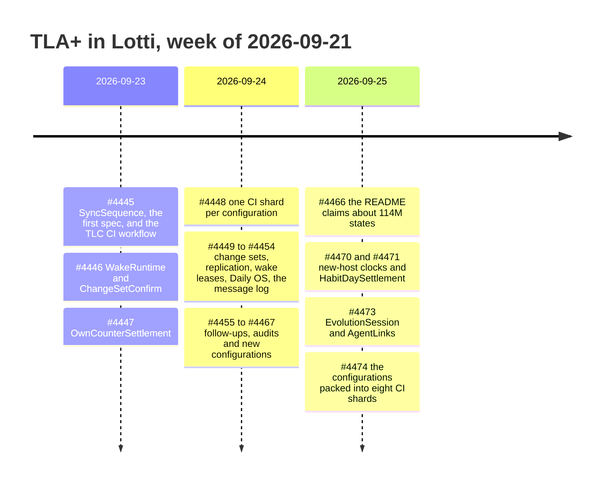

# Formal verification ledger

A running record of what the TLA+ work has covered and what it caught, one row
per pull request. [README.md](README.md) is the reference for each spec: its
configurations, properties, per-configuration state counts and mutation
counterexamples. This file records the history and the totals, and links there
rather than repeating it.

Add a row to the [pull request ledger](#pull-request-ledger) for every PR that
adds or changes a spec, or that fixes a bug a spec or its conformance traces
exposed. Then update the [totals](#totals) from the README's tables.

## Totals

As of `main` at `00c2a40f0` (2026-09-25):

| Measure | Value |
|---------|------:|
| TLA+ specs | 19 |
| TLC configurations | 49 |
| CI shards they run in | 8 |
| Distinct states explored | 152,766,553 |
| States generated (at `b551bf587`, 42 configurations) | 927,744,398 |
| Deepest counterexample-free trace (same run) | 53 steps |
| Named safety and liveness properties | about 80 |
| Bugs fixed | 81 |
| of which TLC produced the counterexample | 50 |
| Architecture decision records | 13 (ADR 0065–0071, 0075–0078, 0080, 0081) |
| Source paths that re-trigger the TLC workflow | 73 |

How the figures are counted:

- **Distinct states** is the sum of the latest figure for each configuration in
  the README (`DayJobPreparation`'s 12 is in #4462). The 42 configurations on
  `main` at `b1bd9ae11` summed to exactly the figure measured for #4466. A
  configuration's count changes when its spec does, so never add up the numbers
  quoted in successive PRs.
- **Bugs fixed** follows each PR description's own list. A few PRs bundle
  sub-fixes, so read it as roughly 80, give or take five. Bugs that a PR introduced and a later
  one fixed before release count once, in the fixing PR (#4447).
- **TLC-found** counts only bugs where the PR says TLC produced the trace. The
  rest came from code audits the models prompted, review rounds, Glados
  conformance traces, exhaustive tests and a CI shard failure.
- **Properties** counts named invariants and temporal properties, excluding
  `TypeOK`. The same name can appear in several specs (`Converged` is in eight),
  and each of those checks is counted.

## Timeline

## Pull request ledger

"Bugs" is the number the PR fixed, followed by how many of those TLC's
counterexamples found.

| PR | Merged | Area | Specs added | Configs added | Bugs (TLC) | ADR | What it caught |
|----|--------|------|-------------|--------------:|-----------:|-----|----------------|
| [#4445](https://github.com/matthiasn/lotti/pull/4445) | 09-23 | sync | `SyncSequence` | 5 | 6 (3) | [0065](../../docs/adr/0065-model-checked-sync-sequence-reservations.md) | A crash between saving and queuing left a counter reserved forever, and the change never reached other devices. Also added the TLC workflow and a checksummed `tlc.sh` |
| [#4446](https://github.com/matthiasn/lotti/pull/4446) | 09-24 | agents | `WakeRuntime`, `ChangeSetConfirm` | 4 | 4 (4) | [0066](../../docs/adr/0066-model-checked-agent-wakes-and-confirmations.md) | "Confirm all" racing a tap applied one suggestion twice. A conformance trace also rejected the first design of the wake fix before it shipped |
| [#4447](https://github.com/matthiasn/lotti/pull/4447) | 09-23 | sync | `OwnCounterSettlement` | 1 | 2 (–) | — | Counter settlement could discard durable evidence (both bugs came from #4445 and never shipped) |
| [#4448](https://github.com/matthiasn/lotti/pull/4448) | 09-24 | agents | — | — | 2 (–) | — | Recovery lost wake ownership. CI now runs one TLC job per configuration, gated by an aggregate `TLC` check |
| [#4449](https://github.com/matthiasn/lotti/pull/4449) | 09-24 | agents | `ChangeSetLifecycle` | 5 | 5 (5) | [0067](../../docs/adr/0067-model-checked-change-set-lifecycle.md) | Whole-row writes put applied items back to pending, across writers and devices |
| [#4450](https://github.com/matthiasn/lotti/pull/4450) | 09-24 | agents | `AgentReplication`, `AgentStateWrites`, `VersionHeads` | 5 | 6 (6) | [0068](../../docs/adr/0068-model-checked-agent-convergence.md) | A throttle stamped the synced timestamp locally, so devices diverged for good |
| [#4451](https://github.com/matthiasn/lotti/pull/4451) | 09-24 | agents | `ScheduledWakeLease`, `GoalChatReply` | 6 | 6 (6) | [0069](../../docs/adr/0069-model-checked-scheduled-wake-leases.md) | Two devices answered the same goal chat message (a 4-step trace). TLC also rejected the first draft of one fix |
| [#4452](https://github.com/matthiasn/lotti/pull/4452) | 09-24 | daily-os | `DigestRecovery`, `DayProcessingJob` | 4 | 5 (5) | [0070](../../docs/adr/0070-model-checked-digest-recovery-and-processing-jobs.md) | After a crash, startup replayed a digest that had already been briefed, paying for a second inference |
| [#4454](https://github.com/matthiasn/lotti/pull/4454) | 09-24 | agents | `AgentMessageLog`, `LogCompaction` | 4 | 5 (5) | [0071](../../docs/adr/0071-model-checked-agent-message-log.md) | A state row without a head re-chained the message log by timestamp, closing a cycle in 6 steps |
| [#4455](https://github.com/matthiasn/lotti/pull/4455) | 09-24 | agents | `ChangeSetDependency` | 1 | 1 (–) | — | Consolidation dropped unresolved checklist-migration groups |
| [#4456](https://github.com/matthiasn/lotti/pull/4456) | 09-24 | agents | — | 2 | 3 (–) | [0068](../../docs/adr/0068-model-checked-agent-convergence.md) | Nine writer sites wrote without the replaced row's clock, so the resolver could reverse a local write |
| [#4458](https://github.com/matthiasn/lotti/pull/4458) | 09-24 | agents | — | 4 | 6 (4) | [0075](../../docs/adr/0075-idempotent-change-set-tools.md) | Confirming on two devices created two follow-up tasks. Ids now derive from the item, and field writes use compare-and-set. 12 of 12 mutants killed |
| [#4459](https://github.com/matthiasn/lotti/pull/4459) | 09-24 | agents | — | — | 3 (3) | [0076](../../docs/adr/0076-model-checked-agent-head.md) | Last-writer-wins moved the agent head back to an ancestor |
| [#4460](https://github.com/matthiasn/lotti/pull/4460) | 09-24 | sync | — | — | 1 (–) | — | A failed descriptor refresh was never retried |
| [#4461](https://github.com/matthiasn/lotti/pull/4461) | 09-24 | agents | — | — | 3 (–) | — | Wakes were consumed before their intent was durable |
| [#4462](https://github.com/matthiasn/lotti/pull/4462) | 09-24 | daily-os | `DayJobPreparation` | 1 | 1 (–) | — | Overlapping job attempts each started an inference |
| [#4463](https://github.com/matthiasn/lotti/pull/4463) | 09-25 | test | — | — | 0 | — | Regression test: replaying a deleted checklist batch stays empty |
| [#4464](https://github.com/matthiasn/lotti/pull/4464) | 09-25 | sync | — | — | 2 (–) | [0077](../../docs/adr/0077-a-reservation-names-the-id-written.md) | Three create paths reserved a counter under the wrong id. A CI shard failure exposed a corrupt-database probe that deleted the WAL |
| [#4466](https://github.com/matthiasn/lotti/pull/4466) | 09-25 | docs | — | — | 0 | — | The root README now claims about 114M states across 42 configurations |
| [#4467](https://github.com/matthiasn/lotti/pull/4467) | 09-24 | sync | — | — | 3 (–) | [0078](../../docs/adr/0078-entry-link-versions-are-ordered.md) | A task removed from a project came back, because receiving a link compared no clocks. 8 of 8 mutants killed |
| [#4470](https://github.com/matthiasn/lotti/pull/4470) | 09-25 | sync | — | 2 | 1 (–) | [0080](../../docs/adr/0080-a-present-counter-ranks-above-an-absent-host.md) | A new device's first edit tied with the version it extended (counter 0 read as absent) and did not stick, even on that device |
| [#4471](https://github.com/matthiasn/lotti/pull/4471) | 09-25 | goals, habits | `HabitDaySettlement` | 2 | 8 (1) | — | An automatic success from one device overwrote a skip the user set on another. Also, 10 × 0.1 l summed to 0.9999999999999999, so a "1 l" goal failed |
| [#4472](https://github.com/matthiasn/lotti/pull/4472) | 09-25 | docs | — | — | 0 | — | This ledger |
| [#4473](https://github.com/matthiasn/lotti/pull/4473) | 09-25 | agents | `EvolutionSession`, `AgentLinks` | 3 | 8 (8) | [0081](../../docs/adr/0081-model-checked-evolution-sessions-and-agent-links.md) | A peer's sweep marked an approved 1-on-1 as abandoned on every device. A removed agent link came back, because the receive read its tombstone as no row |
| [#4474](https://github.com/matthiasn/lotti/pull/4474) | 09-25 | ci | — | — | 0 | — | Packs the configurations into eight CI shards balanced by measured runtime, instead of one runner each |

## Specs

"States" is the sum over the spec's configurations in [README.md](README.md).

| Spec | Introduced | Configs | States |
|------|------------|--------:|-------:|
| `SyncSequence` | #4445 | 5 | 12,188,801 |
| `OwnCounterSettlement` | #4447 | 1 | 160 |
| `WakeRuntime` | #4446 | 2 | 483,330 |
| `ChangeSetConfirm` | #4446 | 2 | 337 |
| `ChangeSetLifecycle` | #4449 | 9 | 2,421,196 |
| `ChangeSetDependency` | #4455 | 1 | 14 |
| `AgentReplication` | #4450 | 6 | 88,676,037 |
| `AgentStateWrites` | #4450 | 1 | 604 |
| `VersionHeads` | #4450 | 2 | 9,468,242 |
| `ScheduledWakeLease` | #4451 | 4 | 11,450,359 |
| `GoalChatReply` | #4451 | 2 | 104,416 |
| `DigestRecovery` | #4452 | 2 | 586 |
| `DayProcessingJob` | #4452 | 2 | 13,170,702 |
| `AgentMessageLog` | #4454 | 3 | 2,682,996 |
| `LogCompaction` | #4454 | 1 | 590,909 |
| `DayJobPreparation` | #4462 | 1 | 12 |
| `HabitDaySettlement` | #4471 | 2 | 174,119 |
| `EvolutionSession` | #4473 | 1 | 243,264 |
| `AgentLinks` | #4473 | 2 | 11,110,469 |
| **Total** | | **49** | **152,766,553** |

## How the specs earn their keep

- **Every configuration runs in CI.** The workflow finds every checked-in
  `.cfg`; #4448 gave each its own job, and #4474 packs them into eight shards
  balanced by measured runtime (see [README.md](README.md#running)). An
  aggregate `TLC` check requires all of them to pass. The workflow runs
  whenever a spec changes, or when any of the 63 source paths it models
  changes.
- **Every fix is pinned by a switch.** Each fix gets a boolean switch in its
  spec. Turning the switch off in a temporary copy must reproduce the original
  counterexample. The README lists each switch together with its trace.
- **Models drive the code.** Glados conformance traces replay model scenarios
  against the real Dart code. In #4446 one of them rejected a wake fix before
  it merged.
- **Models prompt audits.** Several bugs, in #4456, #4464, #4467 and #4470,
  were found by reading the code for the pattern a model had just exposed,
  rather than by TLC itself.
- **Scope is stated, not implied.** The specs verify statements about the
  design, not every line of code. Known gaps are listed in the README as
  residuals.
