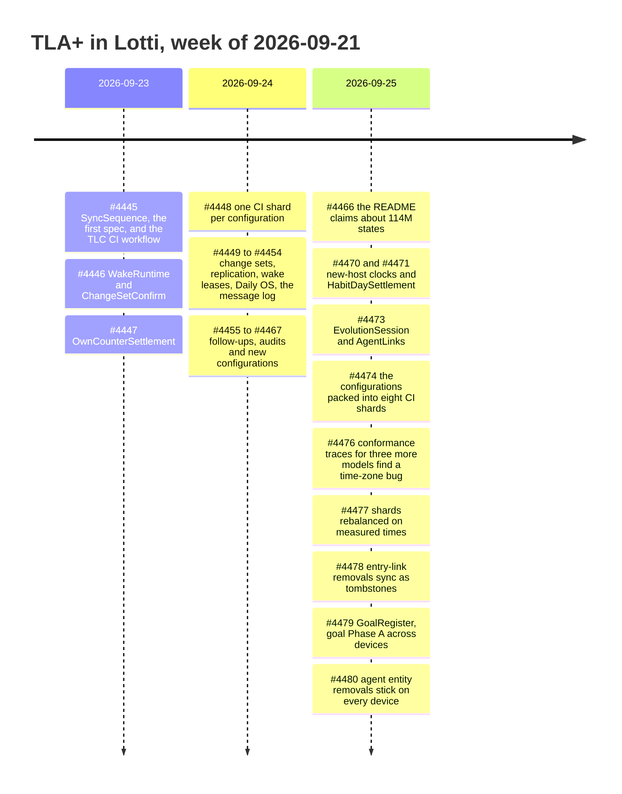

# Formal verification ledger

A running record of what the TLA+ work has covered and what it caught, one row
per pull request. [README.md](README.md) is the reference for each spec: its
configurations, properties, per-configuration state counts and mutation
counterexamples. This file records the history and the totals, and links there
rather than repeating it.

Add a row to the [pull request ledger](#pull-request-ledger) for every PR that
adds or changes a spec, or that fixes a bug a spec or its conformance traces
exposed. Then update the [totals](#totals) from the README's tables.

## Totals

Historical snapshot of `main` at `ed4ef4340` (2026-09-25):

| Measure | Value |
|---------|------:|
| TLA+ specs | 20 |
| TLC configurations | 55 |
| CI shards they run in | 8 |
| Distinct states explored | 172,228,076 |
| States generated (at `b551bf587`, 42 configurations) | 927,744,398 |
| Deepest counterexample-free trace (same run) | 53 steps |
| Named safety and liveness properties | 85 |
| Bugs fixed | 101 |
| of which TLC produced the counterexample | 60 |
| [By severity](#severity), P0 / P1 / P2 / P3 | 2 / 42 / 24 / 33 |
| Architecture decision records | 14 (ADR 0065–0071, 0075–0078, 0080–0082) |

How the figures are counted:

- **Distinct states** is the sum of the latest figure for each configuration in
  the README (`DayJobPreparation`'s 12 is in #4462). The 42 configurations on
  `main` at `b1bd9ae11` summed to exactly the figure measured for #4466. A
  configuration's count changes when its spec does, so never add up the numbers
  quoted in successive PRs.
- **Bugs fixed** follows each PR description's own list, and is the length of
  the [full list](#severity) below. A few PRs bundle sub-fixes, so where one
  bug ends and the next begins is a judgement call. Bugs that a PR introduced
  and a later one fixed before release count once, in the fixing PR (#4447).
- **TLC-found** counts only bugs where the PR says TLC produced the trace. The
  rest came from code audits the models prompted, review rounds, Glados
  conformance traces (#4476 among them), exhaustive tests and a CI shard failure.
- **Properties** counts named invariants and temporal properties, excluding
  `TypeOK`, once per spec that checks it in any of its configurations. The
  same name can appear in several specs (`Converged` is in ten), and each of
  those is counted; there are 71 distinct names.

The notification/settings follow-up adds two specs, four configurations, ten
named properties and 180,826 distinct states to `8428b0a479`. These are
incremental figures; the historical snapshot above excludes the intervening
outbox, inbound-queue and journal models.

The `OutboxCausality` follow-up adds one spec, one configuration, five named
properties and 28,451 distinct states to the configurations present at
`5ad1095618`. These are incremental figures; the historical snapshot above
does not include the intervening outbox, inbound-queue and journal models.

The `SyncPipeline` follow-up (#4493) adds one composed spec and eight
configurations spanning six payload families and 954,724 distinct states. Its
bounded pipeline found one additional burn-staging bug; guarded mutations,
repair reachability and two
known lost-tail limitations are executable CI checks. These additions are not
included in the historical totals above; configuration results live in the
[composed model section](README.md#syncpipeline--the-composed-sync-protocol).

The `ChecklistMembership` model (#4504) adds the first spec of the tasks feature:
one spec, three configurations, six named properties and 5,597,909 distinct
states. TLC found five bugs and an audit of the modelled code one more (P1×3, P2×3). Not included in the historical totals
above.

The `TaskFieldWrites` model (#4545) adds the tasks feature's fields: one spec, three
configurations, four named properties and 8,838,456 distinct states. TLC found
five bugs (P1×3, P2×2). Not included in the historical totals above. #4552
adds `NoSilentFieldLoss` and per-field resolution to the same three
configurations (14,834,328 distinct states in all) and one bug (P1).

The `ChecklistReplication` model (#4551) takes that membership to two
devices: one spec, three configurations, six named properties and 43,764,264
distinct states; its change to `deleteChecklist` moves the three
`ChecklistMembership` configurations to 5,797,014. TLC found eight bugs (P1×5,
P2, P3×2). Not included in the historical totals above.

The `EnvelopeChain` design model (#4501) adds one spec, two configurations, six
named properties and 145,926 distinct states. It models record provenance's
signed chains before they are built, so it caught no shipped bug; its four
design switches each have a counterexample, and it surfaced two open design
questions (orphaned envelopes, where a revocation cuts). Not included in the
historical totals above.

The `SavedTaskFilterSync` model (#4506) adds one spec, two configurations,
five named properties and 2,753,540 distinct states. It came with a fix for
saved filters that never reached a peer; all nine bugs were found by auditing
the code, and TLC reproduces each through its switch. Not included in the
historical totals above.

The `AgentWakeCoordination` model (#4523) adds one spec, four
configurations, four named properties and 4,333,778 distinct states. It
modelled cross-device wake coordination before the code was written; TLC
rejected its first draft, and each of its six switches and its timing
assumption has a counterexample. Not included in the historical totals
above.

The `AiConfigReplication` model ([#4522](https://github.com/matthiasn/lotti/pull/4522)) adds one spec, four configurations,
five named properties and 136,070 distinct states. It came with fixes for AI
settings on top of #4537's version stamps: a synced provider without a key
wiped the key on peers, undoing a prompt deletion did nothing, a model a peer
created before it heard of its provider's deletion outlived the provider, and
a replayed row blanked its type from the repository cache. Four were found by
auditing the code; TLC found a fifth once the cascade's deletions became hard
deletes with stamps (a deleted model recreated by the backfill). Not included
in the historical totals above.

The `TranscriptionRun` model ([#4522](https://github.com/matthiasn/lotti/pull/4522)) adds one spec, two configurations, eleven
named properties and 225,823 distinct states. It came with fixes for skill
transcription: a transcript write the database refused was reported as a
success, and follow-ups, a second request and a concurrent edit each
misbehaved around it. All four bugs were found by reading the code, and TLC
reproduces each through its switch. Review closed the window the model first
left open — a local edit between the re-read and the write — with a guarded
write, and made a retried write idempotent. Not included in the historical
totals above.

The `EmbeddingFreshness` model ([#4522](https://github.com/matthiasn/lotti/pull/4522)) adds one spec, two configurations, four
named properties and 712,647 distinct states. It came with fixes for a vector
index that fell behind the journal: deleted and shortened entries kept their
vectors, failures during an Ollama outage were dropped, concurrent runs could
store an older version, reports stayed in a task's old category, and a crash
recovery could bring back older content. All six were found by reading the
code — five in the audit that prompted the model, one (a short task's
reports) while writing it — and TLC reproduces each through its switch. Not
included in the historical totals above.

The `ConversationLoop` model ([#4522](https://github.com/matthiasn/lotti/pull/4522)) adds one spec, two configurations, seven
named properties and 60,639 distinct states. It came with a fix for an agent
wake that could keep calling the model without end once its tool calls filled
the trimmed history; the six bugs were found by reading the code, and TLC
reproduces the five the protocol covers through its switches (the
streamed-chunk accumulator's is pinned by a Glados property instead). Review
then gave the forced `update_report` retry a turn budget of its own, which the
model first recorded as a residual. Not included in the historical totals
above.

The `TaskAgentAssignment` model (#4546) adds one spec, three
configurations, five named properties and 13,902,177 distinct states. It
reproduces the duplicate task agents a follow-up confirmed on two devices
created, and each of its five switches has a counterexample. Not included in
the historical totals above.

The `TaskLinkGraph` model ([#4549](https://github.com/matthiasn/lotti/pull/4549)) adds one spec, three configurations,
seven named properties and 10,761,709 distinct states (9,213,523 + 163,378 +
1,384,808). It checks what the task links say together — no `blocks` cycle
closed on one device, every cycle reported, one project per task — and came
with eight fixes (P1×2 P2×5 P3), seven of them TLC counterexamples. Not
included in the historical totals above.

The P1 sweep (#4530–#4538, with #4543 and #4558 following #4538) closed every P1
residual open on 26 September. It adds one spec (`EntryLinkIdentity`) and 14
configurations, and raises the specs it touches by 36,956,319 distinct states.
It fixed 34 bugs (P0, P1×21, P2×2, P3×10), 12 of them TLC counterexamples,
and recorded new residuals in the README sections it touched. Not included in
the historical totals above.

## Timeline

```mermaid
timeline
    title TLA+ in Lotti, week of 2026-09-21
    2026-09-23 : #4445 SyncSequence, the first spec, and the TLC CI workflow
               : #4446 WakeRuntime and ChangeSetConfirm
               : #4447 OwnCounterSettlement
    2026-09-24 : #4448 one CI shard per configuration
               : #4449 to #4454 change sets, replication, wake leases, Daily OS, the message log
               : #4455 to #4467 follow-ups, audits and new configurations
    2026-09-25 : #4466 the README claims about 114M states
               : #4470 and #4471 new-host clocks and HabitDaySettlement
               : #4473 EvolutionSession and AgentLinks
               : #4474 the configurations packed into eight CI shards
               : #4476 conformance traces for three more models find a time-zone bug
               : #4477 shards rebalanced on measured times
               : #4478 entry-link removals sync as tombstones
               : #4479 GoalRegister, goal Phase A across devices
               : #4480 agent entity removals stick on every device
```

## Pull request ledger

"Bugs" is the number the PR fixed, followed by how many of those TLC's
counterexamples found. "Severity" grades each of those bugs; see
[severity](#severity).

| PR | Merged | Area | Specs added | Configs added | Bugs (TLC) | Severity | ADR | What it caught |
|----|--------|------|-------------|--------------:|-----------:|----------|-----|----------------|
| [#4493](https://github.com/matthiasn/lotti/pull/4493) | 09-25 | sync | `SyncPipeline` | 8 | 1 (1) | P2 | — | A swallowed burn-marker enqueue failure terminalized the own counter, preventing startup retry; CI reproduced the model trace before the fix |
| [#4445](https://github.com/matthiasn/lotti/pull/4445) | 09-23 | sync | `SyncSequence` | 5 | 6 (3) | P1×2 P2 P3×3 | [0065](../../docs/adr/0065-model-checked-sync-sequence-reservations.md) | A crash between saving and queuing left a counter reserved forever, and the change never reached other devices. Also added the TLC workflow and a checksummed `tlc.sh` |
| [#4446](https://github.com/matthiasn/lotti/pull/4446) | 09-24 | agents | `WakeRuntime`, `ChangeSetConfirm` | 4 | 4 (4) | P1×2 P2×2 | [0066](../../docs/adr/0066-model-checked-agent-wakes-and-confirmations.md) | "Confirm all" racing a tap applied one suggestion twice. A conformance trace also rejected the first design of the wake fix before it shipped |
| [#4447](https://github.com/matthiasn/lotti/pull/4447) | 09-23 | sync | `OwnCounterSettlement` | 1 | 2 (–) | P3×2 | — | Counter settlement could discard durable evidence (both bugs came from #4445 and never shipped) |
| [#4448](https://github.com/matthiasn/lotti/pull/4448) | 09-24 | agents | — | — | 2 (–) | P3×2 | — | Recovery lost wake ownership. CI now runs one TLC job per configuration, gated by an aggregate `TLC` check |
| [#4449](https://github.com/matthiasn/lotti/pull/4449) | 09-24 | agents | `ChangeSetLifecycle` | 5 | 5 (5) | P1×5 | [0067](../../docs/adr/0067-model-checked-change-set-lifecycle.md) | Whole-row writes put applied items back to pending, across writers and devices |
| [#4450](https://github.com/matthiasn/lotti/pull/4450) | 09-24 | agents | `AgentReplication`, `AgentStateWrites`, `VersionHeads` | 5 | 6 (6) | P1×2 P2×4 | [0068](../../docs/adr/0068-model-checked-agent-convergence.md) | A throttle stamped the synced timestamp locally, so devices diverged for good |
| [#4451](https://github.com/matthiasn/lotti/pull/4451) | 09-24 | agents | `ScheduledWakeLease`, `GoalChatReply` | 6 | 6 (6) | P1 P2×3 P3×2 | [0069](../../docs/adr/0069-model-checked-scheduled-wake-leases.md) | Two devices answered the same goal chat message (a 4-step trace). TLC also rejected the first draft of one fix |
| [#4452](https://github.com/matthiasn/lotti/pull/4452) | 09-24 | daily-os | `DigestRecovery`, `DayProcessingJob` | 4 | 5 (5) | P1 P2×2 P3×2 | [0070](../../docs/adr/0070-model-checked-digest-recovery-and-processing-jobs.md) | After a crash, startup replayed a digest that had already been briefed, paying for a second inference |
| [#4454](https://github.com/matthiasn/lotti/pull/4454) | 09-24 | agents | `AgentMessageLog`, `LogCompaction` | 4 | 5 (5) | P2×2 P3×3 | [0071](../../docs/adr/0071-model-checked-agent-message-log.md) | A state row without a head re-chained the message log by timestamp, closing a cycle in 6 steps |
| [#4455](https://github.com/matthiasn/lotti/pull/4455) | 09-24 | agents | `ChangeSetDependency` | 1 | 1 (–) | P2 | — | Consolidation dropped unresolved checklist-migration groups |
| [#4456](https://github.com/matthiasn/lotti/pull/4456) | 09-24 | agents | — | 2 | 3 (–) | P1 P2×2 | [0068](../../docs/adr/0068-model-checked-agent-convergence.md) | Nine writer sites wrote without the replaced row's clock, so the resolver could reverse a local write |
| [#4458](https://github.com/matthiasn/lotti/pull/4458) | 09-24 | agents | — | 4 | 6 (4) | P1×2 P2 P3×3 | [0075](../../docs/adr/0075-idempotent-change-set-tools.md) | Confirming on two devices created two follow-up tasks. Ids now derive from the item, and field writes use compare-and-set. 12 of 12 mutants killed |
| [#4459](https://github.com/matthiasn/lotti/pull/4459) | 09-24 | agents | — | — | 3 (3) | P3×3 | [0076](../../docs/adr/0076-model-checked-agent-head.md) | Last-writer-wins moved the agent head back to an ancestor |
| [#4460](https://github.com/matthiasn/lotti/pull/4460) | 09-24 | sync | — | — | 1 (–) | P3 | — | A failed descriptor refresh was never retried |
| [#4461](https://github.com/matthiasn/lotti/pull/4461) | 09-24 | agents | — | — | 3 (–) | P3×3 | — | Wakes were consumed before their intent was durable |
| [#4462](https://github.com/matthiasn/lotti/pull/4462) | 09-24 | daily-os | `DayJobPreparation` | 1 | 1 (–) | P3 | — | Overlapping job attempts each started an inference |
| [#4463](https://github.com/matthiasn/lotti/pull/4463) | 09-25 | test | — | — | 0 | — | — | Regression test: replaying a deleted checklist batch stays empty |
| [#4464](https://github.com/matthiasn/lotti/pull/4464) | 09-25 | sync | — | — | 2 (–) | P0 P1 | [0077](../../docs/adr/0077-a-reservation-names-the-id-written.md) | Three create paths reserved a counter under the wrong id. A CI shard failure exposed a corrupt-database probe that deleted the WAL |
| [#4466](https://github.com/matthiasn/lotti/pull/4466) | 09-25 | docs | — | — | 0 | — | — | The root README now claims about 114M states across 42 configurations |
| [#4467](https://github.com/matthiasn/lotti/pull/4467) | 09-24 | sync | — | — | 3 (–) | P1×2 P3 | [0078](../../docs/adr/0078-entry-link-versions-are-ordered.md) | A task removed from a project came back, because receiving a link compared no clocks. 8 of 8 mutants killed |
| [#4470](https://github.com/matthiasn/lotti/pull/4470) | 09-25 | sync | — | 2 | 1 (–) | P0 | [0080](../../docs/adr/0080-a-present-counter-ranks-above-an-absent-host.md) | A new device's first edit tied with the version it extended (counter 0 read as absent) and did not stick, even on that device |
| [#4471](https://github.com/matthiasn/lotti/pull/4471) | 09-25 | goals, habits | `HabitDaySettlement` | 2 | 8 (1) | P1×2 P2×3 P3×3 | — | An automatic success from one device overwrote a skip the user set on another. Also, 10 × 0.1 l summed to 0.9999999999999999, so a "1 l" goal failed |
| [#4472](https://github.com/matthiasn/lotti/pull/4472) | 09-25 | docs | — | — | 0 | — | — | This ledger |
| [#4473](https://github.com/matthiasn/lotti/pull/4473) | 09-25 | agents | `EvolutionSession`, `AgentLinks` | 3 | 8 (8) | P1×7 P2 | [0081](../../docs/adr/0081-model-checked-evolution-sessions-and-agent-links.md) | A peer's sweep marked an approved 1-on-1 as abandoned on every device. A removed agent link came back, because the receive read its tombstone as no row |
| [#4474](https://github.com/matthiasn/lotti/pull/4474) | 09-25 | ci | — | — | 0 | — | — | Packs the configurations into eight CI shards balanced by measured runtime, instead of one runner each |
| [#4476](https://github.com/matthiasn/lotti/pull/4476) | 09-25 | agents | — | — | 1 (–) | P1 | — | A generated conformance trace found the due-wake query comparing a UTC timestamp with local time as strings: east of UTC a peer answered a goal chat message beside its author, west of UTC recovery waited hours. Traces now drive `ScheduledWakeLease`, `GoalChatReply` and `VersionHeads` |
| [#4477](https://github.com/matthiasn/lotti/pull/4477) | 09-25 | ci | — | — | 0 | — | — | Rebalanced the eight shards on per-configuration TLC times measured in the first sharded runs |
| [#4478](https://github.com/matthiasn/lotti/pull/4478) | 09-25 | sync | — | — | 3 (–) | P1×3 | [0078](../../docs/adr/0078-entry-link-versions-are-ordered.md) addendum | Removing an entry link deleted the row locally and sent nothing, so peers kept it and their next update restored it. Removals are now synced tombstones, and linking again revives the same id. Closed the residual ADR 0078 left open |
| [#4479](https://github.com/matthiasn/lotti/pull/4479) | 09-25 | goals, habits | `GoalRegister` | 4 | 8 (5) | P1×3 P2 P3×4 | [0082](../../docs/adr/0082-model-checked-goal-registers.md) | A device whose journal was behind could win the lease and report "behind" all day while every device showed the goal on track, with no fault at all. Overlapping evaluations dropped a synced check-off, and an escalation died with the device that noticed the change. Review found three more in the fix itself |
| [#4480](https://github.com/matthiasn/lotti/pull/4480) | 09-25 | agents | — | 2 | 8 (5) | P1×7 P2 | [0081](../../docs/adr/0081-model-checked-evolution-sessions-and-agent-links.md) addendum | A removed agent entity came back from a late copy or a backfill, and a write or re-creation over a removal lost. `AgentReplication` gained a removal kind, lossy delivery and a split receive; an audit of every soft-delete writer found three more |
| [#4491](https://github.com/matthiasn/lotti/pull/4491) | 09-25 | sync | `NotificationReplication`, `SyncSettings` | 4 | 1 (1) | P1 | — | A lifecycle patch changed the content tie-break, so peers retained different same-time notification text. Also models typed recovery and documents untracked settings limits |
| [#4490](https://github.com/matthiasn/lotti/pull/4490) | 09-25 | sync | `OutboxCausality` | 1 | 1 (0) | P1 | — | Checks concurrent inline versions through append, collapse and receipt after #4489; fixes missing/empty-clock snapshots being folded at send time. A deliberately unsound collapse violates causal coverage. Also restores TLC triggers for startup and profile teardown |
| [#4494](https://github.com/matthiasn/lotti/pull/4494) | 09-25 | sync | — | −2 | 0 | — | [0087](../../docs/adr/0087-journal-row-is-the-only-copy.md) | Removed the journal JSON sidecar, and with it `SidecarMatchesRow` and the `JournalReplicationSidecar` and `JournalReplicationSidecarRollback` configurations; the four other `JournalReplication` configurations pass with unchanged state counts |
| [#4501](https://github.com/matthiasn/lotti/pull/4501) | 09-25 | provenance | `EnvelopeChain` | 2 | 0 | — | — | A design model written before the code: per-store signed chains under crashes, restores, retention and revocation. Each of its four design switches has a counterexample, and it raised two open questions — envelopes orphaned by a restore, and where a revocation cuts |
| [#4504](https://github.com/matthiasn/lotti/pull/4504) | 09-26 | tasks | `ChecklistMembership` | 3 | 6 (5) | P1×3 P2×3 | [0089](../../docs/adr/0089-checklist-membership-on-the-stored-row.md) | The first spec of the tasks feature. A stale copy — a screen's state, or a row read several awaits before the write — replaced what sync or the agent had stored: an item dropped from its checklist, a checklist dropped from its task by a status change, an item's back-link reverted by a check; a checklist hidden behind a dragged order; and a crash left a multi-row operation half done, now finished at startup from a recorded intent. Auditing the undo window the model covers found swiped items were never deleted at all |
| [#4551](https://github.com/matthiasn/lotti/pull/4551) | pending | tasks, sync | `ChecklistReplication` | 3 | 8 (8) | P1×5 P2 P3×2 | [0105](../../docs/adr/0105-a-checklist-shows-the-items-naming-it.md) | Checklist membership across two devices, every row delivered on its own. An item moved on both devices, or copied by the migration handler on both, was shown and counted in two checklists; resolving a conflict by keeping one side dropped the other side's checklist from the task, or the other side's item from its checklist; keeping an item or a checklist in a delete-versus-edit conflict left it listed nowhere; deleting a checklist left its items alive. A checklist now shows the items naming it, found by their back-link through a new index; resolutions join membership lists; a deletion takes the checklist's items on every device. Two first fixes — relisting on resolution, cascading over the list — TLC showed racy |
| [#4506](https://github.com/matthiasn/lotti/pull/4506) | 09-26 | tasks, sync | `SavedTaskFilterSync` | 2 | 9 (0) | P0×2 P1×3 P2 P3×3 | — | Saved filters created on a desktop never reached the phone: filters saved before they synced were never sent, and a reorder on the receiver wrote its stale list over the filters sync had just stored. Changes are now owed in a durable ledger until the outbox accepts them, and revisions and deletes have one total order |
| [#4523](https://github.com/matthiasn/lotti/pull/4523) | 09-26 | agents, sync | `AgentWakeCoordination` | 4 | 1 (0) | P2 | [0090](../../docs/adr/0090-cross-device-agent-wake-coordination.md) | Two devices ran the same task agent over the same synced state, an inference paid twice for one result. Modelled before it was built: a claim broadcast with the state digest defers a matching peer, `done` cancels it, a heartbeat carries runs past the two-minute timer. TLC rejected the first draft, where a peer's next claim erased its completion and a device still at the older state ran it again |
| [#4526](https://github.com/matthiasn/lotti/pull/4526) | pending | agents, sync | — | 0 | 1 (0) | P1 | [0091](../../docs/adr/0091-wake-coordination-by-vector-clock-coverage.md) | #4523 stood down only over an exactly equal state, and on two real devices never did: a checklist item checked off on B before A's countdown ran out still ran on B after A completed. A peer's run now covers a device when it read every write the device's inputs rest on — a claim carries the sender's gap-free sync watermark per host, and the receiver checks its inputs' vector clocks against it. With the old equality restored (`CoverSuperset = FALSE`), `Exclusive` fails in nine states |
| [#4562](https://github.com/matthiasn/lotti/pull/4562) | pending | agents, sync | — | 0 | 0 (0) | P2 | [0109](../../docs/adr/0109-a-running-peer-wake-covers-at-once.md) | A live covering claim now drops the waiting device's wake at once, instead of holding it back until the claimer's `done` — on two devices the countdown ran on while the other device was already updating. New `ClaimCancels` switch and `HandoverCovered` invariant; `NoLostEdit` still holds in all four configurations, failures and crashes included, because a failed claimer's own wake stays owed and covers what it was handed |
| [#4527](https://github.com/matthiasn/lotti/pull/4527) | pending | sync | — | 0 | 1 (0) | P0 | [0092](../../docs/adr/0092-one-conflict-row-per-version.md) | Closed the one-conflict-row residual of ADR 0083: a save built on a stale read is refused and parked as the entry's conflict, never sent, and a later concurrent version replaced it in the one-row table, losing it on every device. Conflicts are now keyed by entry and version; the `displaced` ghost is gone, `NothingDropped` and `ConflictNotStale` hold without exception, and the `ConflictPerVersion` switch brings back a five-step counterexample. `JournalReplication` 700,231 and `JournalReplicationLabels` 167,673 distinct states, the other two unchanged |
| [#4545](https://github.com/matthiasn/lotti/pull/4545) | pending | tasks, agents | `TaskFieldWrites` | 3 | 5 (5) | P1×3 P2×2 | [0103](../../docs/adr/0103-task-fields-are-changed-on-the-stored-row.md) | The fields ADR 0089 left: every task field write handed over a copy — the task screen's `TaskData`, or the task an agent tool call began with — under a clock that claimed everything stored, so a field the agent, the user or another device set meanwhile was put back with no conflict. The agent's compare-and-set ran against its copy, not the stored row; a status set on the task screen never reached the status history; and a resolution dropped the other side's statuses. Writers now state a change of the stored data, the agent compares inside the write, and a conformance trace drives the real writers, tools and resolution |
| [#4552](https://github.com/matthiasn/lotti/pull/4552) | pending | sync, tasks | — | 0 | 1 (1) | P1 | [0107](../../docs/adr/0107-a-conflict-shows-every-task-field.md) | `TaskFieldWrites` gains the resolution the conflict screen offers — a base side plus a per-field pick for what it shows — and `NoSilentFieldLoss`: keeping a side settled a task's status, priority, estimate or due date the screen had lumped into "other details" (seven states with `ShownFields = {}`). The four fields are now shown and combined per field; the conformance checks the real diff before every resolution. `TaskFieldWrites` 1,157,524, `TaskFieldWritesAgents` 7,744,632, `TaskFieldWritesResolve` 5,932,172 distinct states |
| [#4546](https://github.com/matthiasn/lotti/pull/4546) | pending | agents, sync | `TaskAgentAssignment` | 3 | 1 (0) | P1 | [0104](../../docs/adr/0104-one-task-agent-per-task.md) | A follow-up task confirmed on two devices got a task agent from each, and so did two manual assignments: the duplicate check was local, and both agents lived on, woke and wrote reports and proposals behind the one the card showed. Every device now ranks the task's agents as the card does and retires the others, after a receive, at startup (which also clears what older builds left) and before a wake. TLC reproduces the bug with `RetireLosers = FALSE` in nine states, and a model with each device keeping its own agent leaves the task with none. It also shows two residuals: clock skew can cost a reassignment, and a local hard delete lets a late copy bring an agent back |
| [#4549](https://github.com/matthiasn/lotti/pull/4549) | pending | tasks, projects | `TaskLinkGraph` | 3 | 8 (7) | P1×2 P2×5 P3 | [0106](../../docs/adr/0106-the-task-link-graph-across-devices.md) | A task unfiled on one device showed up in the project another device had filed it under while offline, and filing it there did nothing. The user and the task agent linking two tasks both ways at once closed a `blocks` cycle the guard exists to refuse, and a cycle two devices closed was never reported: each task said "Blocked by 1 task" and the day agent was told to schedule the other first. Cycles are now kept and reported the same on every device, the check runs inside the write's transaction without a depth cap, and a project move or unfile retires every live project link |
| [#4550](https://github.com/matthiasn/lotti/pull/4550) | pending | sync | `DeepBackfill` | 8 | 0 | — | — | A design model written before the code: a manual round advertises every record, tombstones included, in batches; recipients request what they lack and push back what they hold newer. Each of its nine design switches has a counterexample. TLC's first draft starved a tombstone-carrying batch behind a re-emitted one, so the implementation must process every batch; and it showed that batches must name their id range — otherwise a record only the recipient holds never travels — and that outstanding requests must survive a crash. Review added two switches: a request is settled by coverage, not by sender (`ClearOnlyCovered`), and TLC then found that a concurrent version held only as an open conflict never reached a third device, so conflict versions travel like rows (`ConflictsTravel`) |
| [#4555](https://github.com/matthiasn/lotti/pull/4555) | pending | agents, sync | — | 0 | 1 (1) | P1 | [0108](../../docs/adr/0108-a-deleted-agent-stays-deleted.md) | The residual ADR 0104 left: a hard delete kept nothing, so a late write about the agent — its creation or link, a message from a run on a peer — inserted it again. `TaskAgentAssignment` lets the delete run early and checks `DeletedStaysDeleted` (six states without the tombstone); `deleted_agents` (agent schema v23) records the deletion and both receive paths refuse writes about it. `TaskAgentAssignment` 3,195,988, `TaskAgentAssignmentSkew` 14,340,301, `TaskAgentAssignmentLegacy` 3,880 distinct states |
| [#4530](https://github.com/matthiasn/lotti/pull/4530) | 09-27 | agents | — | 1 | 3 (1) | P1 P3×2 | [0098](../../docs/adr/0098-field-changes-record-their-effect.md) | A field suggestion compared only the value it was proposed against, so a user who put the field back and a second application of the same item — a confirm on a device that received the restored field before the change set, or a reopen and a new confirm — applied it again over the user's value. A task now records the effect key of each change applied, in the same write, and the dispatcher skips one it records. `EffectMark = FALSE` breaks `NoClobber` in seven states; new `ChangeSetLifecycleRaceRestore`, 1,094,284 distinct states |
| [#4531](https://github.com/matthiasn/lotti/pull/4531) | 09-27 | sync | — | 1 | 6 (3) | P1×5 P3 | [0101](../../docs/adr/0101-equal-milliseconds-at-the-catch-up-boundary.md) | Matrix events share milliseconds, and catch-up treated them as ordered: a commit in the marker's own millisecond moved the anchor past a dropped event, a checkpoint claimed its whole millisecond, the backward bound stopped inside the claimed one, and the forward walk ordered a millisecond by event id. `InboundQueue` gains shared timestamps and `InboundQueueSameMs` (15,419,780 states); `TieKeepsAnchor`, `CheckpointAtCursor` and `WalkBelowFloor` fail in 16, 16 and 17 steps. Graded P1 like #4485's skips, since backfill repairs only sequenced payloads |
| [#4532](https://github.com/matthiasn/lotti/pull/4532) | 09-27 | agents | — | 2 | 2 (2) | P1 P3 | [0099](../../docs/adr/0099-agent-link-slots-rank-every-assignment.md) | The swap ADR 0081 left: a live soul or improver assignment tombstoned the slot's other live row locally, so two devices that reassigned one slot concurrently each kept the other's choice. Every assignment is now kept, and every replica shows the one ranked first by `(createdAt, id)`, hiding the others without deleting them. The handoff is in `AgentLinks.tla` with new `AgentLinksSlot` and `AgentLinksSlotLossy` (237,651 and 7,758,650 states); `ClampCreatedAt = FALSE` shows a same-tick reassignment losing in two steps |
| [#4534](https://github.com/matthiasn/lotti/pull/4534) | 09-27 | sync | — | 0 | 5 (0) | P0 P1×4 | [0095](../../docs/adr/0095-a-purge-keeps-the-deletion.md) | A purge removed deleted rows outright, so a device that missed the deletion kept the entry for good, a late copy brought it back, a concurrent edit replaced a purged deletion without a conflict, and a delete-versus-edit conflict could no longer be opened. Review found the P0: restoring an entry while a purge ran could delete its media for good. A purge now keeps each deletion as a compact tombstone. `JournalReplication` models the purge; its four configurations reach 7,510,268 distinct states |
| [#4535](https://github.com/matthiasn/lotti/pull/4535) | 09-27 | sync | `EntryLinkIdentity` | 3 | 1 (0) | P1 | [0096](../../docs/adr/0096-an-entry-link-is-its-natural-key.md) | ADR 0078's residual: the same link created offline on two devices got two random ids, so removing it on one device did not stick. New links take an id derived from `(from, to, type)`, and the receive orders every version of a triple together, whatever its id, which also covers older clients. Both switches off violates `NoLostSuccessor` in five steps; 191,665 distinct states over three configurations |
| [#4536](https://github.com/matthiasn/lotti/pull/4536) | 09-27 | agents | — | 2 | 5 (0) | P1×3 P3×2 | [0100](../../docs/adr/0100-deleted-defaults-stay-deleted.md) | Startup seeding restored a default template or soul the user had deleted, reassigned a default soul the user had replaced, and a device seeding before it synced undid a deletion everywhere. Seeds now take fixed ids and a fixed instant, a deletion is never seeded over, and a seeded assignment yields to any other. New `AgentReplicationSeed` and `AgentReplicationSeedLossy`, 1,843,077 and 339,219 states |
| [#4537](https://github.com/matthiasn/lotti/pull/4537) | 09-27 | sync | — | 1 | 2 (1) | P1×2 | [0094](../../docs/adr/0094-ai-config-versions-are-stamped.md) | ADR 0085's residual 1: a timed-out send that landed late overwrote a newer AI provider, model or prompt on peers, which applied AI configurations in arrival order, and a late copy brought a deleted one back. AI configurations now carry a durable version stamp and the receiver drops an older one. New `OutboxGhostRows`, 28,782 states |
| [#4538](https://github.com/matthiasn/lotti/pull/4538) | 09-27 | agents | — | 3 | 7 (5) | P1×3 P3×4 | [0097](../../docs/adr/0097-idempotent-effects-for-every-change-set-tool.md) | The tools ADR 0075 left without an effect key or a base: a project agent's task confirmed on two devices created two tasks, a checklist, time-entry or project-status change applied twice overwrote an edit, and a label added again brought back one the user removed. Every change-set tool now has an idempotent effect. New `ChangeSetLifecycleRaceAdd`, `ChangeSetLifecycleUndo` and `ChangeSetLifecycleRaceUndo` |
| [#4543](https://github.com/matthiasn/lotti/pull/4543) | 09-27 | agents | — | 0 | 1 (0) | P1 | [0097](../../docs/adr/0097-idempotent-effects-for-every-change-set-tool.md) | A finding #4538 merged with: an Undo reopened its item under the new key before reverting, so a confirm in between created a second task, and a failed revert stranded both. The revert now runs first, and a refused one writes nothing. `Undo` splits into three steps with a refusable revert; `RevertFirst = FALSE` breaks `NoDuplicateEffects` in six states. `ChangeSetLifecycleUndo` 22, `ChangeSetLifecycleRaceUndo` 2,351,210 states |
| [#4558](https://github.com/matthiasn/lotti/pull/4558) | 09-27 | agents, relationships | — | 1 | 2 (0) | P2×2 | [0097](../../docs/adr/0097-idempotent-effects-for-every-change-set-tool.md) | Review findings on #4543: a revert that worked followed by a failed reopen left the item confirmed with its task gone, and the relationship agent's retry refused for good because the live read hid its own tombstone — or, after a purge, found a type-erased one. Every revert is now idempotent. New `ChangeSetLifecycleUndoRetry` (37 states) checks the liveness property `UndoFinishes`; `RevertIdempotent = FALSE` fails it in nine states |

| [#4522](https://github.com/matthiasn/lotti/pull/4522) | pending | ai, sync | `AiConfigReplication` | 4 | 5 (1) | P1×2 P2×3 | — | Built on #4537's version stamps. A provider synced from a device whose keychain read came back empty wiped the key on every peer; undoing a prompt or skill deletion did nothing; a model a peer created before it heard of its provider's deletion outlived the provider; and a replayed row blanked its type from the repository cache. A receiver now keeps its key, deletes the models a deleted provider leaves behind at the deletion's stamp (and resumes that on redelivery), new models take their provider's stamp, the provider undo stamps its models past the provider, and the backfill leaves deleted ids alone — the hole TLC found once the cascade's deletions became hard deletes |
| [#4522](https://github.com/matthiasn/lotti/pull/4522) | pending | ai | `TranscriptionRun` | 2 | 4 (0) | P1×2 P2×2 | — | A skill transcription whose write the database refused — a synced edit landed between the re-read and the write, or the write threw — was reported as a success: status idle, attribution succeeded, the summary and the agent nudge ran, and the check-in waiter sat on its spinner until the timeout. Failed runs still summarized and woke the agent, two requests for one recording both paid for an inference, and text edited during the run was overwritten. Writes are now checked and retried, runs are single-flight per recording, and an edit made during the run wins |
| [#4522](https://github.com/matthiasn/lotti/pull/4522) | pending | ai | `EmbeddingFreshness` | 2 | 6 (0) | P1 P2×3 P3×2 | — | Semantic search kept finding deleted and shortened entries, and pulled up their tasks; edits made while Ollama was down were never indexed. Runs of one entity are now serialised end to end, gone entries lose their vectors, failures retry after the cooldown, reports follow their task, and a crash recovery keeps the newest copy |
| [#4522](https://github.com/matthiasn/lotti/pull/4522) | pending | ai | `ConversationLoop` | 2 | 6 (0) | P2×4 P3×2 | — | The turn limit counted the user messages left after trimming, so a wake calling nine tools a round never reached `maxTurnsPerWake` and kept calling the model, and synthesized tool-call ids repeated. A trim could also open the history on a tool call, a strategy that threw left calls unanswered for the next message, and nothing serialized sends on one conversation |
## Sync follow-up evidence, 2026-09-26

This supplements the historical totals above; it does not add repeated model
runs together or assign unreviewed bug/severity counts. The links identify the
change and its validation record. “Merged” records repository integration, not
proof that every later CI run is green. The open changes still require CI,
coverage, review and integration before the combined result can be claimed.
The consolidated entries are carried together in the sync verification rollup;
the original PR links retain their individual review and validation records.
The rollup restores one profile, `InboundQueueSlice`, with 191,865 distinct
states. This is an incremental result, not an addition of repeated runs to the
historical totals.

| PR | Status at this snapshot | Obligation addressed | Evidence and boundary |
|----|-------------------------|----------------------|-----------------------|
| [#4495](https://github.com/matthiasn/lotti/pull/4495) | Merged 09-25 | Receipt failure must leave delivery retryable; a receipt must follow durable domain apply | Real SQLite receipt/commit failure regressions and a paired temporal receipt-retry check. Retry exhaustion remains outside the bounded transient-failure guarantee |
| [#4498](https://github.com/matthiasn/lotti/pull/4498) | Merged 09-25 | Unsettled own counters retry while the app remains open | Periodic, single-flight recovery and shutdown-drain regressions fail when the relevant guards are removed. Requires the app and stores eventually to remain available |
| [#4500](https://github.com/matthiasn/lotti/pull/4500) | Merged 09-25 | A missing final update becomes observable without a later payload | Three head-announcement profiles cover lost payload, lost burn and crash; disabling announcements gives the expected counterexample. Two/three-device real-database traces drive automatic repair under controlled transport |
| [#4502](https://github.com/matthiasn/lotti/pull/4502) | Reverted by [#4515](https://github.com/matthiasn/lotti/pull/4515) on 09-26 | Limited-sync metadata must claim the missing range before newer events advance the cursor | The original barrier and its delayed-metadata profile were removed after repeated transport integration failures. Synthetic SDK sync passes make the processing/onSync boundary insufficient. The obligation remains unsatisfied on main; the response-specific replacement is tracked in #4517 |
| [#4503](https://github.com/matthiasn/lotti/pull/4503) | Merged 09-26 | Exact attachment discovery can recover beyond the saved cursor | Real queue regressions cover delayed descriptors, keys and downloads, while local disk failures remain bounded. The subsequent Matrix failure is still being investigated in [#4510](https://github.com/matthiasn/lotti/pull/4510); merging this change did not establish transport correctness |
| [#4507](https://github.com/matthiasn/lotti/pull/4507) | Merged 09-26 | Theme/name fields commit together and failed receives retry | SQLite failure injection, cache/queue/shutdown regressions and atomicity/retry model mutations. Cached writes reject an outer settings transaction before entering the write queue |
| [#4508](https://github.com/matthiasn/lotti/pull/4508) | Merged 09-26 | Mixed payload families remain distinct through repair; concurrent fork/successor coverage reaches peers | Typed-identity regressions fail on the old raw-ID key. Separate composed profiles cover three-write fork/successor and two-family/two-peer receipt failure plus crash; eight real two/three-device traces combine inline families, forks, delays, duplicates and repair. The long fork/successor CI profile was still running at merge |
| [#4509](https://github.com/matthiasn/lotti/pull/4509) | Merged 09-26 | Equal-stamp theme/name updates converge regardless of arrival order | Opposite-order receive regressions and deterministic-tie model controls. Depends on atomic settings persistence |
| [#4510](https://github.com/matthiasn/lotti/pull/4510) | Consolidated | An unusable uploaded descriptor must not be referenced or acknowledged | Exact server read-back validates descriptor metadata before publishing. Regression controls cover malformed descriptors, MIME-derived media types and incomplete encryption metadata. Revision `ddc69cec07`, including encryption-metadata validation, passed all seven scenarios in both normal and degraded-network integration jobs. The descriptor branch also passed both transport jobs after #4515; the combined rollup still requires its own CI. The underlying empty-payload cause and attachment-byte verification remain outside this guard |
| [#4511](https://github.com/matthiasn/lotti/pull/4511) | Consolidated | A local preference edit commits a monotone version before publishing its matching payload | `SyncPreferenceEdits`, real SQLite/controller tests and guard-removal regressions. Source-crash recovery and failed or missing publication remain outside its convergence assumption |
| [#4512](https://github.com/matthiasn/lotti/pull/4512) | Consolidated | Config flags use the same durable version order at local commit, outbox collapse and receive | Local-edit and receive/failure models plus migration, transaction and outbox regressions. Old receivers and untracked-message loss remain outside the convergence claim |
| [#4517](https://github.com/matthiasn/lotti/pull/4517) | Open | Consolidated preference/descriptor work and response-specific limited-slice admission | Five inbound profiles pass, including the restored `InboundQueueSlice`; guard removal exposes loss. 108 coordinator tests include real SDK `handleSync` with controlled storage and real inbound SQLite, nested synthetic sync, delayed claims, immediate descriptors, immutable snapshots, decryption failure, missing rooms and shutdown. The prior global barrier remains reverted. Combined CI, coverage and review remain required |

The intended assurance is a bounded composed protocol model, richer component
models and implementation conformance tested against real stores. It is not an
unbounded proof of the Dart implementation, nor one exploration of the full
product of every family, fork, device count and fault. Model-to-runtime mappings,
configuration bounds and fairness assumptions remain in the relevant
[spec reference sections](README.md). The implementation traces replace network
transport with controlled delivery; encryption, server behavior and attachment
bytes still need their own integration evidence.

## Severity

Each bug is graded by what it would have done to a user in production, then
adjusted for how reachable it was. The grades are a judgement made from the PR
descriptions, applied the same way across PRs, not a measurement.

| Level | Meaning |
|-------|---------|
| P0 | Silent, permanent loss of user data, or devices that disagree and never converge |
| P1 | A wrong result the user sees and that persists: a change applied twice, a duplicate entity, a wrong status, a removed item coming back, an edit overwritten |
| P2 | Wasted work or a problem that heals: a duplicate paid inference, a stuck state that a retry or restart clears, a late wake a later trigger covers |
| P3 | Latent or unreachable in practice, internal bookkeeping with no visible effect, or introduced and fixed before it shipped |

Three rules keep the grades consistent. A bug that needs a crash in a narrow
window drops one level; one triggered by an ordinary failure, such as a write
that throws, does not. A bug that never shipped is P3. The agent message-log
fork and head bugs (#4454, #4459) are P3 because a fork has no user-visible
effect.

| Level | Bugs | TLC-found | sync | agents | daily-os | goals, habits |
|-------|-----:|----------:|-----:|-------:|---------:|--------------:|
| P0 | 2 | 0 | 2 | 0 | 0 | 0 |
| P1 | 42 | 30 | 8 | 28 | 1 | 5 |
| P2 | 24 | 18 | 1 | 17 | 2 | 4 |
| P3 | 33 | 12 | 7 | 16 | 3 | 7 |
| **Total** | **101** | **60** | 18 | 61 | 6 | 16 |

Neither P0 came from a TLC trace: the WAL deletion surfaced as a CI shard
failure (#4464), and the discarded first edit on a new device in the review of
#4467 (#4470). TLC found 30 of the 42 P1s.

The P0 and P1 bugs:

| PR | Level | TLC | Bug |
|----|-------|-----|-----|
| [#4464](https://github.com/matthiasn/lotti/pull/4464) | P0 | no | Restoring a corrupt database deleted its WAL, losing recent changes |
| [#4470](https://github.com/matthiasn/lotti/pull/4470) | P0 | no | First edit on a new or reinstalled device silently discarded |
| [#4445](https://github.com/matthiasn/lotti/pull/4445) | P1 | yes | Crash after saving left the change unsent to other devices |
| [#4445](https://github.com/matthiasn/lotti/pull/4445) | P1 | yes | Failed post-save step made the saved entry announced as never written |
| [#4446](https://github.com/matthiasn/lotti/pull/4446) | P1 | yes | Double tap or Confirm all applied one suggestion twice |
| [#4446](https://github.com/matthiasn/lotti/pull/4446) | P1 | yes | A failing post-confirm hook let a retry apply the change again |
| [#4449](https://github.com/matthiasn/lotti/pull/4449) | P1 | yes | Failed item's revert put an applied sibling back to pending |
| [#4449](https://github.com/matthiasn/lotti/pull/4449) | P1 | yes | Follow-up task rewrite reset an applied migration to pending |
| [#4449](https://github.com/matthiasn/lotti/pull/4449) | P1 | yes | Consolidated copy showed confirmed for a change that never landed |
| [#4449](https://github.com/matthiasn/lotti/pull/4449) | P1 | yes | Confirms on two devices: one device's confirm was dropped |
| [#4449](https://github.com/matthiasn/lotti/pull/4449) | P1 | yes | Receiving a change set overwrote a local claim, reapplying it |
| [#4450](https://github.com/matthiasn/lotti/pull/4450) | P1 | yes | Wake throttle made devices keep different agent state for good |
| [#4450](https://github.com/matthiasn/lotti/pull/4450) | P1 | yes | Stale local write resurrected a retracted agent item on one device |
| [#4451](https://github.com/matthiasn/lotti/pull/4451) | P1 | yes | Two devices both answered the same goal chat message |
| [#4452](https://github.com/matthiasn/lotti/pull/4452) | P1 | yes | Slow plan refinement produced two duplicate suggestion sets |
| [#4456](https://github.com/matthiasn/lotti/pull/4456) | P1 | no | Edited agent personality or template ignored under clock skew |
| [#4458](https://github.com/matthiasn/lotti/pull/4458) | P1 | yes | Confirming on two devices created two follow-up tasks or entries |
| [#4458](https://github.com/matthiasn/lotti/pull/4458) | P1 | yes | Late second apply overwrote the user's field edit |
| [#4464](https://github.com/matthiasn/lotti/pull/4464) | P1 | no | Created task, AI response or person never reached other devices |
| [#4467](https://github.com/matthiasn/lotti/pull/4467) | P1 | no | Task removed from a project reappeared; devices kept different links |
| [#4467](https://github.com/matthiasn/lotti/pull/4467) | P1 | no | Link edit or removal lost to a peer with a clock ahead |
| [#4471](https://github.com/matthiasn/lotti/pull/4471) | P1 | no | Decimal logs like 10 x 0.1 l missed exact habit or goal targets |
| [#4471](https://github.com/matthiasn/lotti/pull/4471) | P1 | yes | Skip set on one device overwritten by another device's auto-success |
| [#4473](https://github.com/matthiasn/lotti/pull/4473) | P1 | yes | Approved 1-on-1 recorded as abandoned on every device |
| [#4473](https://github.com/matthiasn/lotti/pull/4473) | P1 | yes | Failed approval left new version live but session abandoned |
| [#4473](https://github.com/matthiasn/lotti/pull/4473) | P1 | yes | Retrying a soul approval created a second version |
| [#4473](https://github.com/matthiasn/lotti/pull/4473) | P1 | yes | Receiving a session row overwrote a fresh approval |
| [#4473](https://github.com/matthiasn/lotti/pull/4473) | P1 | yes | Removed agent link came back from a late copy |
| [#4473](https://github.com/matthiasn/lotti/pull/4473) | P1 | yes | Unlink then relink left devices disagreeing on a link |
| [#4473](https://github.com/matthiasn/lotti/pull/4473) | P1 | yes | Link receive race overwrote a local link write |
| [#4476](https://github.com/matthiasn/lotti/pull/4476) | P1 | no | East of UTC a peer answered a goal chat message alongside its author |
| [#4478](https://github.com/matthiasn/lotti/pull/4478) | P1 | no | Removing a link on one device never reached the others |
| [#4478](https://github.com/matthiasn/lotti/pull/4478) | P1 | no | A removed link came back from a peer's next entry update |
| [#4478](https://github.com/matthiasn/lotti/pull/4478) | P1 | no | Re-linking after a removal left devices disagreeing on the link |
| [#4479](https://github.com/matthiasn/lotti/pull/4479) | P1 | yes | Overlapping goal evaluations dropped a synced check-off |
| [#4479](https://github.com/matthiasn/lotti/pull/4479) | P1 | yes | A goal evaluation committed over a peer's row it never read |
| [#4479](https://github.com/matthiasn/lotti/pull/4479) | P1 | yes | A goal report said "behind" all day while every device showed on track |
| [#4480](https://github.com/matthiasn/lotti/pull/4480) | P1 | yes | A late copy of an agent entity brought its removal back |
| [#4480](https://github.com/matthiasn/lotti/pull/4480) | P1 | yes | A write over a peer's removal lost to that peer's older version |
| [#4480](https://github.com/matthiasn/lotti/pull/4480) | P1 | yes | Drafting a removed day plan again handed the removal back |
| [#4480](https://github.com/matthiasn/lotti/pull/4480) | P1 | yes | Receiving most agent entity types overwrote a local write made meanwhile |
| [#4480](https://github.com/matthiasn/lotti/pull/4480) | P1 | no | A removal sorted before the concurrent edit it followed, so the entity returned |
| [#4480](https://github.com/matthiasn/lotti/pull/4480) | P1 | no | Removing parsed items, versions or change sets used a stale snapshot clock |
| [#4480](https://github.com/matthiasn/lotti/pull/4480) | P1 | no | A project recommendation recorded again after an undo stayed removed on peers |

All 101 bugs in the historical totals

| PR | Level | TLC | Bug |
|----|-------|-----|-----|
| [#4445](https://github.com/matthiasn/lotti/pull/4445) | P1 | yes | Crash after saving left the change unsent to other devices |
| [#4445](https://github.com/matthiasn/lotti/pull/4445) | P1 | yes | Failed post-save step made the saved entry announced as never written |
| [#4445](https://github.com/matthiasn/lotti/pull/4445) | P2 | yes | Peer told a change was burned while it was still being saved |
| [#4445](https://github.com/matthiasn/lotti/pull/4445) | P3 | no | Crash plus failed reservation insert lost a saved change's sync |
| [#4445](https://github.com/matthiasn/lotti/pull/4445) | P3 | no | Guarded bind misread ignored inserts as successful |
| [#4445](https://github.com/matthiasn/lotti/pull/4445) | P3 | no | Recovery bound a counter before its resend was durably queued |
| [#4446](https://github.com/matthiasn/lotti/pull/4446) | P2 | yes | An agent could run twice at once after a cancel or timeout |
| [#4446](https://github.com/matthiasn/lotti/pull/4446) | P2 | yes | Queued agent wakes were lost when the app quit or crashed |
| [#4446](https://github.com/matthiasn/lotti/pull/4446) | P1 | yes | Double tap or Confirm all applied one suggestion twice |
| [#4446](https://github.com/matthiasn/lotti/pull/4446) | P1 | yes | A failing post-confirm hook let a retry apply the change again |
| [#4447](https://github.com/matthiasn/lotti/pull/4447) | P3 | no | Startup migration race could falsely burn a saved change's counter |
| [#4447](https://github.com/matthiasn/lotti/pull/4447) | P3 | no | Counter bound without its payload durably queued |
| [#4448](https://github.com/matthiasn/lotti/pull/4448) | P3 | no | Outbox failure after confirming left suggestion confirmed but unapplied |
| [#4448](https://github.com/matthiasn/lotti/pull/4448) | P3 | no | Daily OS jobs replayed as wake intents after restart |
| [#4449](https://github.com/matthiasn/lotti/pull/4449) | P1 | yes | Failed item's revert put an applied sibling back to pending |
| [#4449](https://github.com/matthiasn/lotti/pull/4449) | P1 | yes | Follow-up task rewrite reset an applied migration to pending |
| [#4449](https://github.com/matthiasn/lotti/pull/4449) | P1 | yes | Consolidated copy showed confirmed for a change that never landed |
| [#4449](https://github.com/matthiasn/lotti/pull/4449) | P1 | yes | Confirms on two devices: one device's confirm was dropped |
| [#4449](https://github.com/matthiasn/lotti/pull/4449) | P1 | yes | Receiving a change set overwrote a local claim, reapplying it |
| [#4450](https://github.com/matthiasn/lotti/pull/4450) | P1 | yes | Wake throttle made devices keep different agent state for good |
| [#4450](https://github.com/matthiasn/lotti/pull/4450) | P2 | yes | Agent counters lost increments across devices |
| [#4450](https://github.com/matthiasn/lotti/pull/4450) | P1 | yes | Stale local write resurrected a retracted agent item on one device |
| [#4450](https://github.com/matthiasn/lotti/pull/4450) | P2 | yes | Lagging clock let arrival order pick the winning agent version |
| [#4450](https://github.com/matthiasn/lotti/pull/4450) | P2 | yes | End-of-wake write marked a stale report fresh again |
| [#4450](https://github.com/matthiasn/lotti/pull/4450) | P2 | yes | Concurrent goal revisions left a twin active version with stale banners |
| [#4451](https://github.com/matthiasn/lotti/pull/4451) | P2 | yes | Second goal escalation of the day never ran |
| [#4451](https://github.com/matthiasn/lotti/pull/4451) | P2 | yes | A finished goal escalation window ran again after sync |
| [#4451](https://github.com/matthiasn/lotti/pull/4451) | P3 | yes | Crash after firing a scheduled wake lost it |
| [#4451](https://github.com/matthiasn/lotti/pull/4451) | P3 | yes | Crash after firing a scheduled wake ran it twice |
| [#4451](https://github.com/matthiasn/lotti/pull/4451) | P2 | yes | Consuming a wake overwrote the next synced-in window |
| [#4451](https://github.com/matthiasn/lotti/pull/4451) | P1 | yes | Two devices both answered the same goal chat message |
| [#4452](https://github.com/matthiasn/lotti/pull/4452) | P3 | yes | Crash replayed an already-briefed morning digest |
| [#4452](https://github.com/matthiasn/lotti/pull/4452) | P2 | yes | Crash mid-digest ran the morning digest twice on restart |
| [#4452](https://github.com/matthiasn/lotti/pull/4452) | P2 | yes | Morning digest ran twice while its job sat in the drain |
| [#4452](https://github.com/matthiasn/lotti/pull/4452) | P3 | yes | Backward clock step made a completed digest retry |
| [#4452](https://github.com/matthiasn/lotti/pull/4452) | P1 | yes | Slow plan refinement produced two duplicate suggestion sets |
| [#4454](https://github.com/matthiasn/lotti/pull/4454) | P3 | yes | Missing head pointer re-chained the agent message log into a cycle |
| [#4454](https://github.com/matthiasn/lotti/pull/4454) | P3 | yes | Message synced ahead of its edge was joined as a head |
| [#4454](https://github.com/matthiasn/lotti/pull/4454) | P3 | yes | Joins missing edges went unchecked, producing bad joins |
| [#4454](https://github.com/matthiasn/lotti/pull/4454) | P2 | yes | Agent memory summary silently missed a late edit from another device |
| [#4454](https://github.com/matthiasn/lotti/pull/4454) | P2 | yes | Agent paid for the same summary on every wake while syncing |
| [#4455](https://github.com/matthiasn/lotti/pull/4455) | P2 | no | Consolidation broke a pending checklist migration awaiting its follow-up task |
| [#4456](https://github.com/matthiasn/lotti/pull/4456) | P2 | no | New agent report saved but the old one kept showing |
| [#4456](https://github.com/matthiasn/lotti/pull/4456) | P1 | no | Edited agent personality or template ignored under clock skew |
| [#4456](https://github.com/matthiasn/lotti/pull/4456) | P2 | no | Goal progress briefly reverted to a twin's evaluation |
| [#4458](https://github.com/matthiasn/lotti/pull/4458) | P1 | yes | Confirming on two devices created two follow-up tasks or entries |
| [#4458](https://github.com/matthiasn/lotti/pull/4458) | P1 | yes | Late second apply overwrote the user's field edit |
| [#4458](https://github.com/matthiasn/lotti/pull/4458) | P2 | yes | Confirming original and its consolidated copy created a duplicate entity |
| [#4458](https://github.com/matthiasn/lotti/pull/4458) | P3 | yes | Migration could stay confirmed though never applied |
| [#4458](https://github.com/matthiasn/lotti/pull/4458) | P3 | no | Second device made a new checklist when the task update lagged |
| [#4458](https://github.com/matthiasn/lotti/pull/4458) | P3 | no | Query-chat field proposals lacked a base for compare-and-set |
| [#4459](https://github.com/matthiasn/lotti/pull/4459) | P3 | yes | Agent head moved back to an ancestor, forking the log |
| [#4459](https://github.com/matthiasn/lotti/pull/4459) | P3 | yes | Append chained off a message that already had a child |
| [#4459](https://github.com/matthiasn/lotti/pull/4459) | P3 | yes | Receive race moved the agent head backwards |
| [#4460](https://github.com/matthiasn/lotti/pull/4460) | P3 | no | Failed descriptor refresh settled recovery with stale content |
| [#4461](https://github.com/matthiasn/lotti/pull/4461) | P3 | no | Failed intent save let a scheduled wake be consumed and lost |
| [#4461](https://github.com/matthiasn/lotti/pull/4461) | P3 | no | Already-owed path consumed a wake whose intent was only in memory |
| [#4461](https://github.com/matthiasn/lotti/pull/4461) | P3 | no | Wake finished during save failure ran again on next scan |
| [#4462](https://github.com/matthiasn/lotti/pull/4462) | P3 | no | Overlapping plan job attempts each started an inference |
| [#4464](https://github.com/matthiasn/lotti/pull/4464) | P1 | no | Created task, AI response or person never reached other devices |
| [#4464](https://github.com/matthiasn/lotti/pull/4464) | P0 | no | Restoring a corrupt database deleted its WAL, losing recent changes |
| [#4467](https://github.com/matthiasn/lotti/pull/4467) | P1 | no | Task removed from a project reappeared; devices kept different links |
| [#4467](https://github.com/matthiasn/lotti/pull/4467) | P1 | no | Link edit or removal lost to a peer with a clock ahead |
| [#4467](https://github.com/matthiasn/lotti/pull/4467) | P3 | no | Text entry creation accepted an id it silently ignored |
| [#4470](https://github.com/matthiasn/lotti/pull/4470) | P0 | no | First edit on a new or reinstalled device silently discarded |
| [#4471](https://github.com/matthiasn/lotti/pull/4471) | P1 | no | Decimal logs like 10 x 0.1 l missed exact habit or goal targets |
| [#4471](https://github.com/matthiasn/lotti/pull/4471) | P2 | no | Recovery hint overstated the successful days still needed |
| [#4471](https://github.com/matthiasn/lotti/pull/4471) | P2 | no | Goal with an either-option already met shown off track |
| [#4471](https://github.com/matthiasn/lotti/pull/4471) | P3 | no | Unmet combined goal could show as fully attained |
| [#4471](https://github.com/matthiasn/lotti/pull/4471) | P1 | yes | Skip set on one device overwritten by another device's auto-success |
| [#4471](https://github.com/matthiasn/lotti/pull/4471) | P3 | no | Goal editor accepted quotas no window could ever meet |
| [#4471](https://github.com/matthiasn/lotti/pull/4471) | P2 | no | Two window-capacity definitions disagreed (month 28 vs 31 days) |
| [#4471](https://github.com/matthiasn/lotti/pull/4471) | P3 | no | Dead import helper claimed a faithful conversion it did not do |
| [#4473](https://github.com/matthiasn/lotti/pull/4473) | P1 | yes | Approved 1-on-1 recorded as abandoned on every device |
| [#4473](https://github.com/matthiasn/lotti/pull/4473) | P1 | yes | Failed approval left new version live but session abandoned |
| [#4473](https://github.com/matthiasn/lotti/pull/4473) | P1 | yes | Retrying a soul approval created a second version |
| [#4473](https://github.com/matthiasn/lotti/pull/4473) | P1 | yes | Receiving a session row overwrote a fresh approval |
| [#4473](https://github.com/matthiasn/lotti/pull/4473) | P1 | yes | Removed agent link came back from a late copy |
| [#4473](https://github.com/matthiasn/lotti/pull/4473) | P2 | yes | Backfill could not deliver an agent link removal |
| [#4473](https://github.com/matthiasn/lotti/pull/4473) | P1 | yes | Unlink then relink left devices disagreeing on a link |
| [#4473](https://github.com/matthiasn/lotti/pull/4473) | P1 | yes | Link receive race overwrote a local link write |
| [#4476](https://github.com/matthiasn/lotti/pull/4476) | P1 | no | East of UTC a peer answered a goal chat message alongside its author |
| [#4478](https://github.com/matthiasn/lotti/pull/4478) | P1 | no | Removing a link on one device never reached the others |
| [#4478](https://github.com/matthiasn/lotti/pull/4478) | P1 | no | A removed link came back from a peer's next entry update |
| [#4478](https://github.com/matthiasn/lotti/pull/4478) | P1 | no | Re-linking after a removal left devices disagreeing on the link |
| [#4479](https://github.com/matthiasn/lotti/pull/4479) | P1 | yes | Overlapping goal evaluations dropped a synced check-off |
| [#4479](https://github.com/matthiasn/lotti/pull/4479) | P1 | yes | A goal evaluation committed over a peer's row it never read |
| [#4479](https://github.com/matthiasn/lotti/pull/4479) | P1 | yes | A goal report said "behind" all day while every device showed on track |
| [#4479](https://github.com/matthiasn/lotti/pull/4479) | P2 | yes | A restart lost a synced goal row from the dispatcher's queue |
| [#4479](https://github.com/matthiasn/lotti/pull/4479) | P3 | yes | A goal status change never escalated if its device died in the countdown |
| [#4479](https://github.com/matthiasn/lotti/pull/4479) | P3 | no | The new startup recompute dropped a restored report refresh |
| [#4479](https://github.com/matthiasn/lotti/pull/4479) | P3 | no | The new stale check ignored a report published mid-evaluation |
| [#4479](https://github.com/matthiasn/lotti/pull/4479) | P3 | no | A refresh published from a snapshot every commit had rejected |
| [#4480](https://github.com/matthiasn/lotti/pull/4480) | P1 | yes | A late copy of an agent entity brought its removal back |
| [#4480](https://github.com/matthiasn/lotti/pull/4480) | P2 | yes | Backfill answered "deleted" for a removed agent entity, so the peer kept it |
| [#4480](https://github.com/matthiasn/lotti/pull/4480) | P1 | yes | A write over a peer's removal lost to that peer's older version |
| [#4480](https://github.com/matthiasn/lotti/pull/4480) | P1 | yes | Drafting a removed day plan again handed the removal back |
| [#4480](https://github.com/matthiasn/lotti/pull/4480) | P1 | yes | Receiving most agent entity types overwrote a local write made meanwhile |
| [#4480](https://github.com/matthiasn/lotti/pull/4480) | P1 | no | A removal sorted before the concurrent edit it followed, so the entity returned |
| [#4480](https://github.com/matthiasn/lotti/pull/4480) | P1 | no | Removing parsed items, versions or change sets used a stale snapshot clock |
| [#4480](https://github.com/matthiasn/lotti/pull/4480) | P1 | no | A project recommendation recorded again after an undo stayed removed on peers |

The 95 bugs fixed since (#4504 on), not in the historical totals

| PR | Level | TLC | Bug |
|----|-------|-----|-----|
| [#4504](https://github.com/matthiasn/lotti/pull/4504) | P1 | yes | Adding or reordering a checklist item from a stale copy dropped an item synced in meanwhile, on every device |
| [#4504](https://github.com/matthiasn/lotti/pull/4504) | P1 | yes | A task field edit, by the user or the agent, dropped a checklist listed since the task was read |
| [#4504](https://github.com/matthiasn/lotti/pull/4504) | P1 | yes | A check saved from stale item state wrote an old back-link over a move made elsewhere |
| [#4504](https://github.com/matthiasn/lotti/pull/4504) | P2 | yes | After a drag, a checklist added to the task stayed hidden until the task was left |
| [#4504](https://github.com/matthiasn/lotti/pull/4504) | P2 | yes | A crash mid-operation left an item unlisted, a move half done or a checklist off its task |
| [#4504](https://github.com/matthiasn/lotti/pull/4504) | P2 | no | A swiped checklist item was never deleted: the row cancelled the delete when it left the screen |
| [#4551](https://github.com/matthiasn/lotti/pull/4551) | P1 | yes | An item moved to different checklists on two devices, or copied into different checklists by the migration handler, was shown and counted twice |
| [#4551](https://github.com/matthiasn/lotti/pull/4551) | P1 | yes | Two devices adding items to one checklist: resolving its conflict left the other device's item listed nowhere |
| [#4551](https://github.com/matthiasn/lotti/pull/4551) | P1 | yes | A checklist added while the task was edited on another device was dropped from the task when the conflict was resolved |
| [#4551](https://github.com/matthiasn/lotti/pull/4551) | P1 | yes | Keeping a swiped item's concurrent edit left it alive and listed nowhere |
| [#4551](https://github.com/matthiasn/lotti/pull/4551) | P1 | yes | Keeping a checklist another device deleted left it off its task |
| [#4551](https://github.com/matthiasn/lotti/pull/4551) | P2 | yes | Deleting a checklist left its items alive in the journal, search and the agent's crawl |
| [#4551](https://github.com/matthiasn/lotti/pull/4551) | P3 | yes | A deletion that died before clearing its intent, replayed, undid another device's choice to keep the checklist |
| [#4551](https://github.com/matthiasn/lotti/pull/4551) | P3 | yes | Unlisting a deleted checklist after deleting it could win over another device's resolution keeping it |
| [#4506](https://github.com/matthiasn/lotti/pull/4506) | P0 | no | Saved filters created before they synced were never sent to any peer |
| [#4506](https://github.com/matthiasn/lotti/pull/4506) | P0 | no | Reordering on a device wrote its stale list over filters sync had stored, deleting them there for good |
| [#4506](https://github.com/matthiasn/lotti/pull/4506) | P1 | no | A failed enqueue, or a crash after the write, left a saved-filter change that was never sent |
| [#4506](https://github.com/matthiasn/lotti/pull/4506) | P1 | no | A delete that arrived before its filter let the filter return for good |
| [#4506](https://github.com/matthiasn/lotti/pull/4506) | P1 | no | An edit from a device whose clock ran behind was dropped as stale by its peers |
| [#4506](https://github.com/matthiasn/lotti/pull/4506) | P2 | no | A synced saved filter did not appear until the app restarted |
| [#4506](https://github.com/matthiasn/lotti/pull/4506) | P3 | no | Two revisions with the same stamp swapped between devices instead of converging |
| [#4506](https://github.com/matthiasn/lotti/pull/4506) | P3 | no | A filter option added by a newer build made the whole synced filter undecodable and skipped for good |
| [#4506](https://github.com/matthiasn/lotti/pull/4506) | P3 | no | One undecodable stored filter blanked the list, and the next save persisted it empty |
| [#4523](https://github.com/matthiasn/lotti/pull/4523) | P2 | no | Edits on two devices at once made both run the same task agent over the same state |
| [#4527](https://github.com/matthiasn/lotti/pull/4527) | P0 | no | A save made while another device's version synced in was lost for good when a third version replaced its conflict |
| [#4545](https://github.com/matthiasn/lotti/pull/4545) | P1 | yes | A field set from the task screen put back a field the agent or another device had set since the screen read the task |
| [#4545](https://github.com/matthiasn/lotti/pull/4545) | P1 | yes | An agent tool writing the task its call read put back a field the user set during the call |
| [#4545](https://github.com/matthiasn/lotti/pull/4545) | P1 | yes | An agent tool set a field over a value the user changed between the call's read and its write |
| [#4545](https://github.com/matthiasn/lotti/pull/4545) | P2 | yes | A status set from the task screen was never appended to the status history |
| [#4545](https://github.com/matthiasn/lotti/pull/4545) | P2 | yes | Resolving a conflict dropped the status history of the side not kept |
| [#4549](https://github.com/matthiasn/lotti/pull/4549) | P1 | yes | Unfiling a task another device had filed elsewhere while offline put it in that other project |
| [#4549](https://github.com/matthiasn/lotti/pull/4549) | P1 | yes | A move lost to a project link underneath it stamped by a device whose clock ran ahead, so the task stayed put |
| [#4549](https://github.com/matthiasn/lotti/pull/4549) | P2 | yes | Filing a task under the project of its link underneath did nothing and reported failure |
| [#4549](https://github.com/matthiasn/lotti/pull/4549) | P2 | yes | The user and the task agent linking two tasks both ways at once closed a `blocks` cycle on one device |
| [#4549](https://github.com/matthiasn/lotti/pull/4549) | P2 | yes | Retyping or turning a link around raced another write: it could close a cycle, or bring back a link removed in between |
| [#4549](https://github.com/matthiasn/lotti/pull/4549) | P2 | yes | A cycle two devices closed was never reported, and the day agent was told to schedule each task's blocker first |
| [#4549](https://github.com/matthiasn/lotti/pull/4549) | P2 | no | Privacy cleanup removed only the project link shown, leaving a mismatched one underneath |
| [#4549](https://github.com/matthiasn/lotti/pull/4549) | P3 | yes | The cycle check stopped after 64 hops, so a longer chain could close a cycle |
| [#4555](https://github.com/matthiasn/lotti/pull/4555) | P1 | yes | A deleted agent came back, active, when sync delivered a late write about it |
| [#4552](https://github.com/matthiasn/lotti/pull/4552) | P1 | yes | Keeping a side of a task conflict settled a status, priority, estimate or due date the conflict screen never showed |
| [#4530](https://github.com/matthiasn/lotti/pull/4530) | P1 | yes | A field the user put back after an agent changed it got the change again on a second confirm |
| [#4530](https://github.com/matthiasn/lotti/pull/4530) | P3 | no | Star, flag and private toggles could drop a task's new applied-change record |
| [#4530](https://github.com/matthiasn/lotti/pull/4530) | P3 | no | Resolving a journal conflict could drop one side's applied-change records |
| [#4531](https://github.com/matthiasn/lotti/pull/4531) | P1 | no | Catch-up could skip a message sent in the same millisecond as its resume point |
| [#4531](https://github.com/matthiasn/lotti/pull/4531) | P1 | yes | A commit in the resume point's own millisecond moved the anchor past a dropped message |
| [#4531](https://github.com/matthiasn/lotti/pull/4531) | P1 | yes | A catch-up checkpoint claimed its whole millisecond, so a retry walked past the rest of it |
| [#4531](https://github.com/matthiasn/lotti/pull/4531) | P1 | yes | The backward catch-up walk stopped inside the claimed millisecond and missed an event there |
| [#4531](https://github.com/matthiasn/lotti/pull/4531) | P1 | no | The forward catch-up walk ordered same-millisecond events by id and dropped some |
| [#4531](https://github.com/matthiasn/lotti/pull/4531) | P3 | no | A resume anchor stored at timestamp zero was treated as no anchor |
| [#4532](https://github.com/matthiasn/lotti/pull/4532) | P1 | yes | Reassigning a template's soul on two devices at once swapped them |
| [#4532](https://github.com/matthiasn/lotti/pull/4532) | P3 | yes | Under the new ranking, a reassignment within the same tick could lose to the link it replaced |
| [#4534](https://github.com/matthiasn/lotti/pull/4534) | P0 | no | Restoring an entry while a purge ran could delete its media files for good |
| [#4534](https://github.com/matthiasn/lotti/pull/4534) | P1 | no | After a purge, a device that missed the deletion kept the deleted entry for good |
| [#4534](https://github.com/matthiasn/lotti/pull/4534) | P1 | no | After a purge, a late copy of an older version brought the deleted entry back |
| [#4534](https://github.com/matthiasn/lotti/pull/4534) | P1 | no | An edit made alongside a deletion replaced a purged deletion without a conflict |
| [#4534](https://github.com/matthiasn/lotti/pull/4534) | P1 | no | A delete-versus-edit conflict could no longer be opened once the deletion was purged |
| [#4535](https://github.com/matthiasn/lotti/pull/4535) | P1 | no | The same link created offline on two devices got two ids, so removing it on one did not stick |
| [#4536](https://github.com/matthiasn/lotti/pull/4536) | P1 | no | A default template or soul the user deleted came back on every device at the next start |
| [#4536](https://github.com/matthiasn/lotti/pull/4536) | P1 | no | A default soul the user unassigned or replaced was reassigned at every start |
| [#4536](https://github.com/matthiasn/lotti/pull/4536) | P1 | no | A device starting before it synced a deletion or rename re-seeded the default and undid it everywhere |
| [#4536](https://github.com/matthiasn/lotti/pull/4536) | P3 | no | A default assignment an older build held under a random id was never compared with the seed |
| [#4536](https://github.com/matthiasn/lotti/pull/4536) | P3 | no | A peer's deletion received during seeding could be overwritten by a re-creation |
| [#4537](https://github.com/matthiasn/lotti/pull/4537) | P1 | yes | A slow, retried send overwrote a newer AI provider, model or prompt edit on other devices |
| [#4537](https://github.com/matthiasn/lotti/pull/4537) | P1 | no | A late copy of an AI configuration sent before its deletion brought it back |
| [#4538](https://github.com/matthiasn/lotti/pull/4538) | P1 | yes | A project agent's task suggestion confirmed on two devices before sync created two tasks |
| [#4538](https://github.com/matthiasn/lotti/pull/4538) | P1 | yes | A checklist, time-entry or project-status suggestion applied twice overwrote an edit made in between |
| [#4538](https://github.com/matthiasn/lotti/pull/4538) | P1 | yes | A label suggestion applied again on another device re-added a label the user had removed |
| [#4538](https://github.com/matthiasn/lotti/pull/4538) | P3 | yes | With derived task ids, confirming again after an Undo would have created nothing |
| [#4538](https://github.com/matthiasn/lotti/pull/4538) | P3 | yes | A stale Undo on a second device could undo a later decision and leave a second task |
| [#4538](https://github.com/matthiasn/lotti/pull/4538) | P3 | no | An archive-only checklist suggestion had no base, so a late replay re-archived a restored item |
| [#4538](https://github.com/matthiasn/lotti/pull/4538) | P3 | no | Undo stopped working if another device re-keyed the item between showing and confirming it |
| [#4543](https://github.com/matthiasn/lotti/pull/4543) | P1 | no | An Undo reopened its item before reverting, so a confirm in between created a second task |
| [#4558](https://github.com/matthiasn/lotti/pull/4558) | P2 | no | A failed reopen after a successful revert left the item confirmed and the relationship Undo refusing for good |
| [#4558](https://github.com/matthiasn/lotti/pull/4558) | P2 | no | A purge between that failure and the retry compacted the tombstone, and the retry refused it too |
| [#4522](https://github.com/matthiasn/lotti/pull/4522) | P1 | no | A provider synced without an API key deleted the key from every peer's keychain |
| [#4522](https://github.com/matthiasn/lotti/pull/4522) | P1 | no | Undoing a prompt or skill deletion did nothing |
| [#4522](https://github.com/matthiasn/lotti/pull/4522) | P2 | no | A model a peer backfilled before seeing its provider's deletion stayed live under the deleted provider |
| [#4522](https://github.com/matthiasn/lotti/pull/4522) | P2 | yes | A device that received a model's deletion before its provider's recreated the model at the next backfill, live under the deleted provider |
| [#4522](https://github.com/matthiasn/lotti/pull/4522) | P2 | no | A replayed AI config, or a write the database watch reported first, left its whole type unlisted in the repository cache until the next change |
| [#4522](https://github.com/matthiasn/lotti/pull/4522) | P1 | no | A skill transcription whose write was refused or threw reported success, and the paid transcript was lost without an error |
| [#4522](https://github.com/matthiasn/lotti/pull/4522) | P1 | no | Text edited (here or on a peer) while a recording was being transcribed was overwritten by the transcript |
| [#4522](https://github.com/matthiasn/lotti/pull/4522) | P2 | no | A failed transcription still ran the paid audio summary over the old text and woke the subject's agent |
| [#4522](https://github.com/matthiasn/lotti/pull/4522) | P2 | no | Two requests for one recording on a device each paid for an inference and appended a transcript and a summary; the status showed idle or error while one still ran |
| [#4522](https://github.com/matthiasn/lotti/pull/4522) | P1 | no | A deleted or shortened entry kept its vectors, so its old text still found it and still surfaced its parent task |
| [#4522](https://github.com/matthiasn/lotti/pull/4522) | P2 | no | Every edit made while the Ollama endpoint was in its outage cooldown was dropped after one failed attempt and never indexed |
| [#4522](https://github.com/matthiasn/lotti/pull/4522) | P2 | no | A manual backfill running beside the background indexer could store an entry's older version after the newer one, and nothing corrected it |
| [#4522](https://github.com/matthiasn/lotti/pull/4522) | P2 | no | A task too short to embed never took its agent reports along when it changed category |
| [#4522](https://github.com/matthiasn/lotti/pull/4522) | P3 | no | A report embedded while its task changed category was filed under the old category |
| [#4522](https://github.com/matthiasn/lotti/pull/4522) | P3 | no | A crash between a recategorising write's two shards restored the copy in the shard whose name sorted last, which could be the older content |
| [#4522](https://github.com/matthiasn/lotti/pull/4522) | P2 | no | The turn limit counted user messages left after trimming, so an agent wake calling many tools a round never hit `maxTurnsPerWake` and kept paying for inference |
| [#4522](https://github.com/matthiasn/lotti/pull/4522) | P2 | no | Gemini tool-call ids repeated after a trim, so a later call overwrote an earlier one's thought signature |
| [#4522](https://github.com/matthiasn/lotti/pull/4522) | P2 | no | A trim could open the request on an assistant tool call with no turn before it |
| [#4522](https://github.com/matthiasn/lotti/pull/4522) | P2 | no | A strategy that threw mid-round left its tool calls unanswered for the next message |
| [#4522](https://github.com/matthiasn/lotti/pull/4522) | P3 | no | Sends into one conversation could interleave |
| [#4522](https://github.com/matthiasn/lotti/pull/4522) | P3 | no | The streamed tool-call parser merged calls with new ids, and treated an empty id as a real one |

## Specs

"States" is the sum over the spec's configurations in [README.md](README.md).

| Spec | Introduced | Configs | States |
|------|------------|--------:|-------:|
| `SyncSequence` | #4445 | 5 | 12,188,801 |
| `OwnCounterSettlement` | #4447 | 1 | 160 |
| `WakeRuntime` | #4446 | 2 | 483,330 |
| `ChangeSetConfirm` | #4446 | 2 | 337 |
| `ChangeSetLifecycle` | #4449 | 9 | 2,421,196 |
| `ChangeSetDependency` | #4455 | 1 | 14 |
| `AgentReplication` | #4450 | 8 | 104,495,395 |
| `AgentStateWrites` | #4450 | 1 | 604 |
| `VersionHeads` | #4450 | 2 | 9,468,242 |
| `ScheduledWakeLease` | #4451 | 4 | 11,450,359 |
| `GoalChatReply` | #4451 | 2 | 104,416 |
| `DigestRecovery` | #4452 | 2 | 586 |
| `DayProcessingJob` | #4452 | 2 | 13,170,702 |
| `AgentMessageLog` | #4454 | 3 | 2,682,996 |
| `LogCompaction` | #4454 | 1 | 590,909 |
| `DayJobPreparation` | #4462 | 1 | 12 |
| `HabitDaySettlement` | #4471 | 2 | 174,119 |
| `EvolutionSession` | #4473 | 1 | 243,264 |
| `AgentLinks` | #4473 | 2 | 11,110,469 |
| `GoalRegister` | #4479 | 4 | 3,642,165 |
| **Total** | | **55** | **172,228,076** |

## How the specs earn their keep

- **Every configuration runs in CI.** The workflow finds every checked-in
  `.cfg`; #4448 gave each its own job, and #4474 packs them into eight shards
  balanced by measured runtime (see [README.md](README.md#running)). An
  aggregate `TLC` check requires all of them to pass. The workflow runs
  nightly against `main` and on demand for a branch.
- **Every fix is pinned by a switch.** Each fix gets a boolean switch in its
  spec. Turning the switch off in a temporary copy must reproduce the original
  counterexample. The README lists each switch together with its trace.
- **Models drive the code.** Glados conformance traces replay model scenarios
  against the real Dart code. In #4446 one of them rejected a wake fix before
  it merged.
- **Models prompt audits.** Several bugs, in #4456, #4464, #4467 and #4470,
  were found by reading the code for the pattern a model had just exposed,
  rather than by TLC itself.
- **Scope is stated, not implied.** The specs verify statements about the
  design, not every line of code. Known gaps are listed in the README as
  residuals.
