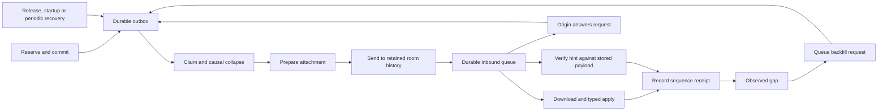

# Formal specs

TLA+ models of the protocols in this app that are too concurrent to trust to
prose, model-checked with TLC. A spec here describes the code as it is: a
change to the modelled code updates the spec in the same pull request. CI
(`.github/workflows/tla-model-check.yml`) re-checks every configuration nightly
against `main`; a pull request that touches a spec or the code it models
should run it by hand first (Actions → TLA+ Model Check → Run workflow, on the
branch) or run `make tla_check` locally.
[LEDGER.md](LEDGER.md) records which pull request added each spec, what it
caught, and the running totals.

## Running

```sh
make tla_check                      # every configuration
specs/tla/tlc.sh SyncSequenceCrash  # one configuration
```

`tlc.sh` needs Java 11 or newer (`JAVA=/path/to/java` if it is not on `PATH`).
It downloads the pinned `tla2tools.jar` once, verifies its SHA-256, and caches
it in `TLA_TOOLS_DIR` (default `~/.cache/lotti-tla`). A configuration
`<Spec><Variant>.cfg` checks `<Spec>.tla`.

CI packs every checked-in `.cfg` into runtime-balanced shards (`shards.py`)
and runs them with `fail-fast: false`.
A shard checks all of its configurations even after one fails, and lists each
result in the job summary. A new configuration joins a shard automatically,
counted at a pessimistic five minutes until its runtime is added to
`SECONDS`; `python3 specs/tla/shards.py --table` prints the plan. The
aggregate `TLC` check passes only when planning and every shard succeed; local
`make tla_check` still runs all configurations sequentially.

## `SyncPipeline` — the composed sync protocol

This is a bounded end-to-end **protocol model**: local reservation and commit,
durable staging, claim/collapse, attachment upload, room send, send completion,
inbound delivery, attachment download, domain apply, receipt, gap discovery and
repair share one state. Backfill requests, payload resends, hints and burns
traverse those same queues. A response cannot directly insert peer data, and a
sequence receipt cannot stand in for applying its payload.



The checked profiles have a causal chain, a two-origin fork, or a fork followed
by a same-origin successor, with at most three writes and one or two receiving
devices. Fork writes have independent clocks even though
the bounded source-write scheduler opens one reservation at a time; their
outbox, transport and receive operations interleave freely. Origins retain
their own payload; each peer tracks a separate sequence head per origin.
Origins do not also act as receiving peers in these configurations.
`ForkSuccessor` composes A1, concurrent B1, and A2 with the shared send/receive
pipeline. `MixedPeers` instead sends an inline agent entity and a file-backed
full notification with the same raw ID, from distinct origins to two receivers;
it permits one receipt failure and one process crash. Family-qualified identity
keeps their source rows, collapse candidates and applied payloads separate.

| Action/state | Implementation boundary |
|---|---|
| `Reserve`, `Commit`, `Stage`, `Bind` | `VectorClockService`, domain persistence, `OutboxEnqueueWriter` and `SyncSequenceLogService` |
| `RecoverStage`, `RecoverBind`, `BurnStage`, `BurnBind` | `BackfillResponseHandler` settlement and its response builders; durable enqueue must precede settlement |
| `Claim`, `Upload`, `Send`, `MarkSent` | `OutboxMessageProcessor`, `MatrixPayloadSender`; successful claim CAS is abstracted |
| `Deliver`, `Download`, `Crash` | retained room/inbound queue contract; `InboundQueue` checks cursor and floor mechanics separately |
| `Apply`, `Record`, `RecordFail` | typed `SyncEventProcessor` handlers and sequence-log persistence |
| `QueueRequest`, `Answer`, `AnswerHint`, `VerifyHint` | backfill request service, response handler, retained payload lookup and clock verification |

Family-specific application retains journal conflicts, selects the deterministic
whole-version winner for entry/agent links and agent entities, joins a notification
lifecycle mark only after its base exists, or inserts an immutable consumption
event. File-backed families require an uploaded and downloaded generation.
The journal row supplies outbound JSON at send time; `descriptor` abstracts
that prepared generation, not an independent local journal sidecar. Detailed domain
rules (CRDT fields, timestamps, tombstones, projection, three-version forks) remain
in `JournalReplication`, `AgentReplication`, `AgentLinks`,
`NotificationReplication` and `OutboxCausality`; this composition does not replace
their richer state spaces.

| Checks | Guarantee within the configured bounds |
|---|---|
| `PayloadFamilySafe` | stored winner, content and conflict versions belong to the row's payload family |
| `NoFalseBurn`, `BurnHasDurableMarker` | committed counters are never burned; terminal own burns have a durably queued marker |
| `BoundHasDurablePayload`, `StagedHasDurablePayload` | settled/staged writes retain a queued or sent causal representative |
| `NoFalseReceipt`, `CausalCoverage` | receipts have an applied causal witness; announced coverage belongs to the actual payload |
| `NoContentlessState`, `AcknowledgedPayload`, `SettledPeersAgree` | receipts correspond to domain state, lifecycle patches have a base, and fully acknowledged peers agree on the winner/conflict set |
| `CommittedReachesRoom`, `CommittedReachesPeer` | committed data eventually reaches transport/peer under the stated delivery obligations |
| `VisibleGapHeals`, `VisiblePayloadsConverge` | observed gaps settle; observing every modeled counter eventually yields the retained payloads |
| `BurnReachesPeer` | durable burns eventually settle under reliable delivery or recurring head announcements |

Every configuration checks all safety invariants. `Consumption` and `Lossy`
check conditional gap repair and room delivery; the others also require delivery
to peers and burn propagation. Profiles deliberately vary one stress dimension
at a time; they are not the Cartesian product of all faults and families.

| Configuration suffix | Payload and stress | Distinct states |
|---|---|---:|
| (none) | entry-link causal chain; collapse and out-of-order receipt | 203,895 |
| `Journal` | two concurrent journal writers, two peers, attachments and retained conflicts | 59,184 |
| `AgentEntity` | concurrent inline writers and one independent process crash | 2,430 |
| `AgentLink` | one write; one staging, send or apply failure | 54 |
| `Notification` | full base plus lifecycle patch, either receive order | 289,859 |
| `Consumption` | two immutable events; one abandoned delivery or failed receipt | 183,515 |
| `Burn` | one aborted reservation, one enqueue/send failure and one process crash | 112 |
| `Lossy` | two distinct entry links; one abandoned delivery or failed receipt | 183,515 |
| `ForkSuccessor` | concurrent agent A1/B1 followed by A2; one receiver, no injected faults | 2,038,963 |
| `MixedPeers` | agent entity and full notification share a raw ID; two receivers, one receipt failure and one crash | 179,850 |

The two added profiles measure different obligations: `SettledPeersAgree` is
non-vacuous in `MixedPeers`; a one-receiver profile cannot establish peer
agreement. `ForkSuccessor` checks successor coverage through the complete
pipeline without injecting crashes. Neither profile claims the full product of
three-version forks, mixed families, multiple receivers and every fault.

The fork/successor exploration took about 164 minutes locally and gets an
isolated CI shard with a six-hour deadline and 12 GiB heap. It runs with every
other configuration, nightly or on demand, and gates the same aggregate `TLC`
check; regular shards
retain their one-hour deadline. `shards_test.py` protects complete configuration
assignment and isolation of the long profile.

The original eight configurations explore **922,564 distinct states** in total.
`Heads`, `HeadsBurn` and `HeadsCrash` additionally enable periodic origin-head
announcements for one final counter: respectively one abandoned delivery, an
aborted reservation with one abandoned delivery, and one process crash. Each
checks unconditional payload/burn delivery under its configured fault bound.
Announcements travel through the same outbox, room and inbound actions as data;
a receiver crash clears its volatile announcement state.

The liveness obligations are explicit:

- Fair workers and retained room history eventually expose each sent message.
  Upload/download generations remain available; there is no purge or permanent
  partition. Encryption, Matrix server behavior and media bytes are interfaces,
  not verified implementations.
- Failures and crashes are bounded. A crash preserves durable stores, releases
  that process's claims and replays its interrupted application. Repeated
  identical enqueues retain one extra in-flight copy; duplicate transport IDs
  are compressed, and resend re-arms an abandoned attempt only after a send.
  `folded` rows retain their claimed representative rather than becoming sent
  before transmission. Physical row deletion and retry counters are abstracted.
- Fair **recovery opportunities** assume the app eventually runs with usable
  stores and fair timer scheduling. Production retries own settlement
  periodically as well as on release, startup, store wiring or request.
  Without announcements, request fairness assumes retry opportunities continue
  (including operator retry), beyond automatic retry exhaustion. Head-enabled
  profiles assume an eventually available origin and fair automatic repair
  within a fresh announcement window. The runtime bounds and expiry are in
  [sequence and backfill](../../knowledge/features/sync/sequence-and-backfill.md#discovering-a-lost-final-update);
  wall-clock expiry, batch budgets and cooldowns are abstracted in this model.
- Profiles without announcements do not promise recovery of an unobserved final counter.
  Receipt failures now retain a retryable delivery; a dedicated temporal check
  proves eventual receipt with one transient failure, including at the tail.
  This assumes retry succeeds before the real worker exhausts its attempt cap.
  Notification state alone cannot repair a permanently lost base.
- Consumption writers must not reuse an event ID for changed content. This is
  the append-only protocol contract, not a database constraint: the repository
  uses an upsert, and this model does not explore conflicting bodies for one ID.
- Named reservations, available stores and causal payload clocks are required.
  Legacy clockless/counter-zero traffic, settings/config flags, cross-family
  dependencies, unbounded devices/writes and arbitrary overlapping local
  transactions are outside this model.

`python3 specs/tla/check_sync_pipeline.py` runs in CI alongside positive model
checks. Each guard has a passing control and must fail with only that guard
removed: durable burn staging, bind-after-enqueue, apply-before-receipt,
hint verification, exact journal payload preparation, and family-qualified
payload identity. The namespace mutant deliberately aliases equal raw IDs across
families and must violate `PayloadFamilySafe`. A separate reachability control
requires both receiving peers to acknowledge both mixed-family commits, so the
agreement assertion cannot pass solely because its antecedent is unreachable. A paired temporal
check requires tail-receipt recovery to pass with retry and fail when receipt
errors are swallowed. Lost-tail delivery passes with announcements and has
an expected counterexample with only announcements disabled. A reachable request/answer/hint/receipt path guards against a
vacuous repair claim.

The mixed-family conformance traces in
`test/features/sync/backfill/sync_head_conformance.dart` use two and three real
in-memory devices, four deterministic schedules each, agent A1/B1/A2 plus an
entry link with the same raw ID, delayed/duplicate delivery, a dropped tail and
a failed SQLite receipt insert. They drive real persistence, outbox claim/mark,
processor/queue-adapter application and periodic head repair. Removing the
backfill handler's family-qualified deduplication makes all eight traces fail.
After the failed receipt write, both origin and lagging peer rebuild their
sequence, repair, receiver and agent services over retained in-memory SQLite
stores. This clears volatile repair state before the next head announcement;
the domain winner survives and the missing receipts and colliding-family
payload still recover. This models a quiescent process restart, not a torn
filesystem write or an operating-system crash.
These traces use inline envelopes: Matrix SDK encryption, uploads, downloads and
server behavior are outside that harness. The formal mixed profile uses a full
notification to additionally exercise the abstract attachment path, rather than
claiming a literal trace equivalence with the Dart entry-link scenario.

The head conformance scenarios run two and three replicas with real journal and
sync databases, enqueue writers, outbox claims, receive adapters and backfill
handlers. They drop the final entry-link payload and an announcement, inject a
receipt-write failure, and duplicate/reorder recovery deliveries. The outbox
facade's scheduling/dispatch is replaced by a controlled transport; this does
not exercise Matrix networking, its SDK, or file-backed attachments. Separate
tracker checks cover fairness, failed scans, retirement, deduplication and
onboarding suppression, including generated head/batch combinations.

The burn mutation exposed a production bug: best-effort enqueue swallowed a
persistence failure before the counter became terminal. The Dart conformance
suite reproduces it with real reservation/sequence databases, then verifies a
fresh service stack retries after enqueue recovers. Its mock outbox distinguishes
the actual APIs' swallowed and propagated errors. The regression failed in CI
on #4493 before the runtime fix; it supplements model checking, not a machine-
checked refinement proof from Dart to TLA+.

The adapter conformance tests also reproduce failed domain commits and receipt
writes using real SQLite stores, for individual and bundled links. They failed
before the fixes: the queue acknowledged failed receipt writes, and an outer
journal commit could roll back a link after its receipt had committed in the
sync database. Narrow domain transactions and propagated receipt/child failures
now satisfy the modeled commit-before-receipt boundary. Typed handler fault
tests cover journals, agents, notifications and consumption events as well.

## `SyncSequence` — the sync sequence log and backfill

One originating device and its peers: counter reservation, the payload write,
the outbox bind, releases and burns, startup reconciliation, backfill requests
and responses, and gap detection on the receivers. The mapping from each action
to the Dart code is in the spec's header; the protocol itself is described in
[Sequence log and backfill](../../knowledge/features/sync/sequence-and-backfill.md)
and the decision in [ADR 0065](../../docs/adr/0065-model-checked-sync-sequence-reservations.md).

| Property | Kind | Says |
|----------|------|------|
| `NoFalseBurn` | invariant | no device ever burns a counter whose payload committed |
| `ReceivedIsReal` | invariant | a peer's `received`/`backfilled` row is backed by that data or newer |
| `BoundRowsHavePayload` | invariant | the originator only answers from rows whose payload is on disk — the write that reserved the counter, not merely whatever the row names |
| `BurnedIsTerminal` | action | `burned` has no outgoing edge on any device |
| `EventuallyDelivered` | liveness | every committed write reaches every peer |
| `NoStuckRequest` | liveness | every backfill request is settled by the protocol, not by giving up |

| Configuration | Crashes | Faults | Unnamed reservations | Checks |
|---------------|---------|--------|----------------------|--------|
| `SyncSequence` | 0 | none | allowed | all |
| `SyncSequenceCrash` | 1, anywhere | none | no | all |
| `SyncSequenceCrashUnnamed` | 1, anywhere | none | allowed | safety |
| `SyncSequenceCrashFault` | 1, anywhere | any one of the faults below | no | safety |
| `SyncSequenceFaults` | 0 | any two of: reserved-row insert (settings fallback taken), reserved-row insert and fallback both, bind, post-commit throw, enqueue, burn broadcast, event loss | no | safety |

All five pass with two entities, three counters and one peer — between 0.8 and
4.4 million distinct states each (`SyncSequence` 1,015,081,
`SyncSequenceCrash` 777,611, `SyncSequenceCrashUnnamed` 3,022,767,
`SyncSequenceCrashFault` 4,357,689, `SyncSequenceFaults` 3,015,653), a few
minutes in total.

The name a reservation records is modelled separately from the entity its
write targets (`named` versus `ent`), because settlement can only look the
payload up by the name. `MisnamedReservations = TRUE` lets a reservation name
another entity — what `createTaskEntry`, `createAiResponseEntry` and
`createRelationship` did when they swapped a caller's id in after reserving
([ADR 0077](../../docs/adr/0077-a-reservation-names-the-id-written.md)). With
one crash, TLC breaks `NoFalseBurn` in five steps (reserve counter 1 for `e1`
naming `e2`, commit, crash, settle: `e2` does not cover 1, so the committed
counter is burned) and `BoundRowsHavePayload` in seven (counter 2 of `e2`
commits, so settlement binds counter 1 to `e2` although `e1` never landed).
Every checked-in configuration sets it `FALSE`; the naming rule is what the
code now guarantees.

What the configurations deliberately leave out:

- **Delivery under faults.** A swallowed enqueue failure or an event a peer
  abandons for good is not retried, so `EventuallyDelivered` is only claimed
  without faults.
- **Unnamed reservations after a crash.** They cannot be settled, so a request
  for one stays open until the requester gives up — which is why
  `SyncSequenceCrashUnnamed` checks safety only.
- **Counter 0.** Counters start at 1, as `VectorClockService` has since
  [ADR 0080](../../docs/adr/0080-a-present-counter-ranks-above-an-absent-host.md).
  Hosts that older builds created handed out a counter 0 first. It lies
  outside gap detection and the contiguous-prefix watermark, so if its
  message is lost it is never requested; the next version of the same
  payload carries its clock.

## `OwnCounterSettlement` — recovery interleavings

This focused safety model expands the atomic settlement and fallback migration
in `SyncSequence`. It separates the sequence-row read, settings read, migration
insert/removal, durable enqueue and binding. An earlier answer in the same batch
may silently fail to enqueue, or enqueue version 2 before version 3 commits.

The configuration checks `TypeOK`, `NoFalseBurn` and `BoundHasQueuedPayload`
across 160 distinct states. It models one named, inactive reservation and two
payload versions. No write can still commit the requested counter after the
settlement reads start. Payload purges, unavailable stores, retries, peers and
crashes are outside this focused model; it claims safety, not delivery liveness.

The recovery guards have mutation switches. In a temporary copy of the configuration,
set one switch to `FALSE` and run TLC against `OwnCounterSettlement.tla`:

| Mutation | Expected counterexample |
|----------|-------------------------|
| `RecheckSequence = FALSE` | `NoFalseBurn`: the first row read misses, migration inserts the row and removes the settings fallback, the second read misses, settlement burns the committed counter |
| `RequireDurableEnqueue = FALSE` | `BoundHasQueuedPayload`: an earlier batch answer attempts a resend, its enqueue fails (or queues an older version), settlement skips its own enqueue and binds |
| `RequireFreshDescriptor = FALSE` | `BoundHasQueuedPayload`: the enqueue queues an older copy than the stored row (as the removed JSON sidecar could, ADR 0087) and settlement binds the newer counter |

Keep mutation configurations outside this directory: CI runs every checked-in
configuration and expects each to pass. The handler suite has deterministic
regressions for both races, newer payload versions, migrated unnamed/already
settled rows, and a failed sequence-log recheck. Reverting the Dart guards makes
those regressions fail. The outbox enqueue suite also checks that a failed
read of the stored row prevents both ordinary and durable enqueue, then
verifies a successful retry queues the stored version.

## `WakeRuntime` — agent wakes

This model covers generic wakes. Daily OS processing jobs are recovered by
their own durable outbox and never replayed by `WakeIntentStore`.

Triggers become queued jobs, the drain dispatches a job when its agent's runner
lease is free, and an executor runs the wake. An abort — a cancel, the
ten-minute run cap, a stale-drain reset — releases the lease, but a Dart future
cannot be cancelled, so the executor runs on. Wake intents persist until a run
covering them completes, and startup restores them. A run covers some of its
agent's queued triggers, not necessarily all: the queue can hold several jobs
for one agent. The decision is
[ADR 0066](../../docs/adr/0066-model-checked-agent-wakes-and-confirmations.md);
the runtime is described in
[Wake orchestration](../../knowledge/features/agents/wake-orchestration.md).

| Property | Kind | Says |
|----------|------|------|
| `SingleFlight` | invariant | at most one live executor per agent, short of one declared hung |
| `HungOnlyWhenDetached` | invariant | only an executor that lost its lease is ever declared hung |
| `NoLostWake` | liveness | every trigger is eventually covered by a run that completes |

| Configuration | Agents | Triggers | Crashes | Aborts | Distinct states |
|---------------|--------|----------|---------|--------|-----------------|
| `WakeRuntime` | 2 | 4 | 0 | 2 | 46,073 |
| `WakeRuntimeCrash` | 2 | 4 | 1 | 1 | 437,257 |

## `ChangeSetConfirm` — confirming a proposed change

One change-set item, confirmed or rejected by concurrent callers — a double
tap, a "Confirm all" racing a single confirm, a swipe-reject racing either, a
retry — through the claim, the post-commit outbox flush, the tool dispatch
and the post-confirm hook. A
reject claims the item the same way a confirm does. The ghost `applied` counts
how often the change actually took effect.

| Property | Kind | Says |
|----------|------|------|
| `AtMostOnceApply` | invariant | a confirmed change takes effect at most once |
| `RejectedMeansNotApplied` | invariant | an item shown rejected never took effect |
| `ConfirmedMeansApplied` | invariant | an item shown confirmed, with no confirm in flight, took effect |

| Configuration | Callers | Faults | Crashes | Checks | Distinct states |
|---------------|---------|--------|---------|--------|-----------------|
| `ChangeSetConfirm` | 2 | outbox flush fails, dispatch fails, hook throws | 0 | all three | 117 |
| `ChangeSetConfirmFaults` | 2 | outbox flush fails, dispatch fails, hook throws | 1 | all but `ConfirmedMeansApplied` | 220 |

Two cases are known residuals rather than checked properties. Adding
`"failsAfterEffect"` to `Faults` — a tool that throws after its effect landed,
which the service reverts to `pending` — breaks `AtMostOnceApply` on retry, and
checking `ConfirmedMeansApplied` with a crash breaks it when the process dies
between the claim and the dispatch. Closing either needs an `applying` status
that sync and the UI understand, or tools that are idempotent per decision id.

## `ChangeSetLifecycle` — a whole change set, across devices

`ChangeSetConfirm` checks one item on one device. This model checks what
happens between the items of a set and between its replicas: every writer of
the set — the claim, a failed dispatch's revert or auto-retraction, the
follow-up task's rewrite of its migration's `targetTaskId`, the migration
cascade, a staged retraction, a wake's consolidation of an older set, the
user's reopen — and the sync that carries each write to the other devices as
a message delivered in any order, applied through the vector-clock comparison
and the concurrent resolver. It also models what a confirmed change does to
the journal on each device: a create-style item creates an entity (modelled
by id), a set-style item writes one field (a register the user can edit
too: a task field, a checklist item's title or check, a time entry's range or
text, a project's status — or, with `AddStyle`, a label's membership of the
task, which the user's edit takes off and suppresses), and both replicate by
message and are received the way the journal receives them — a concurrent
version is kept aside as a `Conflict` row. The project agent's Undo deletes
the entity its confirmation created and reopens the item, in two steps — the
revert, which may be refused (`"revertRefused"` in `Faults`), and the reopen,
which may fail after the revert (`"reopenFails"`), leaving the Undo to be
retried; deletions sync as tombstones. Every user decision runs in its own attempt slot, so a confirm of
an item reopened while an earlier dispatch still runs is a second, concurrent
operation. The ghost `applied` counts, per device, how often each change was
dispatched and took effect. The decisions are
[ADR 0067](../../docs/adr/0067-model-checked-change-set-lifecycle.md),
[ADR 0075](../../docs/adr/0075-idempotent-change-set-tools.md),
[ADR 0098](../../docs/adr/0098-field-changes-record-their-effect.md) and
[ADR 0097](../../docs/adr/0097-idempotent-effects-for-every-change-set-tool.md).

The switches are the fixes, and each is a mutation point. From ADR 0067:
`AtomicWrites` (every local write of a set re-reads it in its transaction and
changes only its own item), `AtomicReceive` (sync compares and writes a
received set in one transaction), `ItemMerge` (concurrent versions merge item
by item by a per-item revision), `PendingCopiesOnly` (consolidation moves only
pending items) and `RevisionGuard` (a failed dispatch moves its item only
while the item holds the revision its claim wrote). From ADR 0075:
`ClaimResolvesTarget` (a migration resolved from the in-memory mapping is
claimed with its resolved target), `DerivedIds` (a create-style tool derives
its entity's id from the item's effect key and does nothing when the entity
exists), `CopyCarriesKey` (a consolidated copy carries its original's key) and
`CasGuard` (a set-style tool writes only while the field holds the value the
proposal was made against) and `ReuseLive` (where a created entity and its
link to a parent sync apart — a checklist and the task update listing it — a
device holding the entity without its link writes nothing, since the
creator's link is on its way; switched on by `SeparateAttach`). From
ADR 0098: `EffectMark` (a set-style tool records its effect key on the task
in the write that sets the field, and applies only while the task does not
record it — so a base the user restored after the change landed is left
alone). From
ADR 0097: `RemoveWins` (with `AddStyle`, an add applies only to a label the
user has not taken off — the task's suppressed labels), `UndoRekeys` (an Undo
that deletes a created entity reopens the item under a new effect key, so
confirming it again creates anew), `UndoOwnKey` (an Undo acts only while
the item carries the key its own device's confirmation used),
`RevertFirst` (an Undo reverts the effect while the item still shows it
confirmed, and reopens it only after a revert that succeeded; a refused
revert writes nothing) and `RevertIdempotent` (a revert run again over the
state it left succeeds, so the retry of an Undo whose reopen failed reaches
the reopen).
`CrashBeforeLink` is not a fix: it lets the creator stop between the entity
and its link. `RaceFree` restricts the environment: no item is
decided on two devices before they have synced. `UserRestoresBase` lets the
user's edit restore the base value, the ABA a value compare-and-set alone
cannot see.

| Property | Kind | Says |
|----------|------|------|
| `AtMostOnceApply` | invariant | a change is dispatched and takes effect at most once, across all devices |
| `AtMostOncePerDevice` | invariant | ... and at most once per device |
| `AppliedStaysDecided` | invariant | a device that applied a change never shows it pending again — no decided item returns to pending except by its own failed dispatch |
| `StatusMatchesEffect` | invariant | once everything is delivered, every device shows `confirmed` exactly when the change was applied, and never `pending` or `rejected` for an applied one |
| `Converged` | invariant | once everything is delivered, the replicas of the set agree |
| `MigrationAfterTarget` | invariant | a checklist migration never runs before its follow-up task exists |
| `NoDuplicateEffects` | invariant | every change has at most one entity that no Undo deleted, across all replicas and the messages in flight |
| `ConfirmedIsLive` | invariant | a device whose confirmation of a create-style change succeeded holds its entity, not deleted — also after an Undo and a new confirmation |
| `NoClobber` | invariant | no dispatch overwrites a value the user wrote into the field — one the user changed, or the base the user wrote back on a version that had seen the change applied (its clock covers a dispatch's write, the ghost `appVcs`) |
| `EffectsConverge` | invariant | once everything, entities and fields included, is delivered, every replica holds the same entities, the field agrees unless a `Conflict` row holds a concurrent version, and a change's entity exists exactly when the change was applied somewhere |
| `SucceededClaimStands` | invariant | an item whose latest claim's dispatch succeeded reads `confirmed` |
| `EffectsLinked` | invariant | with `SeparateAttach`: once everything is delivered, every created entity is linked to its parent on every device |
| `UndoFinishes` | liveness (`FairSpec`) | an Undo whose revert succeeded finishes: the item is reopened, or found to show a later decision — never left confirmed with its entity deleted and an Undo that can no longer run. `FairSpec` assumes the user retries an Undo offered again |

| Configuration | Devices | Items | Checks | Distinct states |
|---------------|---------|-------|--------|-----------------|
| `ChangeSetLifecycle` | 1 | follow-up, migration, plain; both failure kinds; retraction | `AtMostOnceApply`, `AppliedStaysDecided`, `StatusMatchesEffect`, `MigrationAfterTarget`, `NoDuplicateEffects` | 2,643 |
| `ChangeSetLifecycleConsolidate` | 1 | an older set's item and its consolidated copy | as above, without `MigrationAfterTarget` | 133 |
| `ChangeSetLifecycleSync` | 2 | two plain items, `RaceFree` | as `ChangeSetLifecycle` without `MigrationAfterTarget`, plus `Converged`, `EffectsConverge` | 847,082 |
| `ChangeSetLifecycleSyncSplit` | 2 | follow-up and migration, `RaceFree` | all but `NoClobber`, `SucceededClaimStands` | 79,082 |
| `ChangeSetLifecycleRace` | 2 | one create-style item decided on both devices, retryable failures | `Converged`, `NoDuplicateEffects`, `EffectsConverge` | 491,402 |
| `ChangeSetLifecycleRaceSet` | 2 | one set-style item decided on both devices, one user edit per device, retryable failures | `Converged`, `NoClobber`, `EffectsConverge` | 852,966 |
| `ChangeSetLifecycleRaceRestore` | 2 | as `RaceSet`, the user's edit restoring the base (`UserRestoresBase`) | `Converged`, `NoClobber`, `EffectsConverge` | 1,094,284 |
| `ChangeSetLifecycleReopen` | 1 | one item, two confirms, one reopen, both failure kinds | `SucceededClaimStands`, `NoDuplicateEffects` | 90 |
| `ChangeSetLifecycleConsolidateSync` | 2 | an item consolidated on one device while confirmed on the other, `RaceFree` | `NoDuplicateEffects`, `EffectsConverge` | 147,557 |
| `ChangeSetLifecycleRaceLink` | 2 | one create-style item decided on both devices, whose entity and link to its parent sync apart | `Converged`, `NoDuplicateEffects`, `EffectsConverge`, `EffectsLinked` | 241 |
| `ChangeSetLifecycleRaceAdd` | 2 | one label suggestion decided on both devices, the label taken off once per device, retryable failures | `Converged`, `NoClobber`, `EffectsConverge` | 197,946 |
| `ChangeSetLifecycleUndo` | 1 | one create-style item confirmed, undone and confirmed again; retryable failures, refused reverts | `SucceededClaimStands`, `NoDuplicateEffects`, `ConfirmedIsLive` | 22 |
| `ChangeSetLifecycleRaceUndo` | 2 | one create-style item decided on both devices, one Undo per device, retryable failures, refused reverts | `Converged`, `NoDuplicateEffects`, `EffectsConverge` | 2,351,210 |
| `ChangeSetLifecycleUndoRetry` | 1 | as `ChangeSetLifecycleUndo`, the reopen failing after its revert (`"reopenFails"`, two Undos per device), then retried | `SucceededClaimStands`, `NoDuplicateEffects`, `ConfirmedIsLive`, `UndoFinishes` | 37 |

Every configuration also checks `TypeOK`. Each switch set to `FALSE` fails a
configuration with a short trace (kept outside this directory, as for
`OwnCounterSettlement`):

| Mutation | Configuration | Counterexample |
|----------|---------------|----------------|
| `AtomicWrites = FALSE` | `ChangeSetLifecycle` | `AppliedStaysDecided` (8 states): the follow-up task's dispatch fails and its revert reads the set; the plain item is claimed and applied; the revert writes its copy back, putting the applied item to pending. With every switch off, a retry applies the plain item a second time (`AtMostOnceApply`, 10 states) |
| `AtomicWrites = FALSE` | `ChangeSetLifecycleSyncSplit` | `AppliedStaysDecided` (7 states): the sibling rewrite reads the set, the migration is claimed and applied, the rewrite writes the migration back as pending |
| `PendingCopiesOnly = FALSE` | `ChangeSetLifecycleConsolidate` | `StatusMatchesEffect` (5 states): an item is claimed, a wake consolidates and copies it as `confirmed`, the dispatch fails and reverts the original — the copy claims a change that never landed |
| `ItemMerge = FALSE` | `ChangeSetLifecycleSync` | `AppliedStaysDecided` (5 states): one device rejects an item while the other confirms a different one; receiving the rejecting device's row, the whole-row winner drops the confirm, and the confirming device then applies a change its row shows pending |
| `AtomicReceive = FALSE` | `ChangeSetLifecycleSync` | `AppliedStaysDecided` (6 states): a device reads its row to apply a peer's version, claims an item meanwhile, and writes the peer's version over the claim |
| `RevisionGuard = FALSE` | `ChangeSetLifecycleReopen` | `SucceededClaimStands` (7 states): the first confirm's dispatch runs, the item is reopened and confirmed again, the first dispatch fails and reverts the second claim, whose dispatch then succeeds on a pending item |
| `ClaimResolvesTarget = FALSE` | `ChangeSetLifecycle` | `StatusMatchesEffect` (7 states): the follow-up task is applied and mapped in memory, the migration is claimed through the mapping, the sibling rewrite bumps the claimed item's revision, and the migration's failed dispatch can no longer revert its own claim — confirmed, never applied |
| `DerivedIds = FALSE` | `ChangeSetLifecycleRace` | `NoDuplicateEffects` (6 states): both devices confirm and dispatch the item; each mints its own id |
| `DerivedIds = FALSE` | `ChangeSetLifecycleReopen` | `NoDuplicateEffects` (6 states): confirm, apply, reopen, confirm, apply — two entities |
| `CopyCarriesKey = FALSE` | `ChangeSetLifecycleConsolidateSync` | `NoDuplicateEffects` (7 states): one device confirms and applies the original, the other consolidates it into a copy of its own key; the copy is confirmed and creates a second entity |
| `ReuseLive = FALSE` | `ChangeSetLifecycleRaceLink` | `NoDuplicateEffects` (6 states): one device confirms, creates the checklist and lists it; the other receives the checklist but not the task update listing it, confirms, and creates a second checklist |
| `CasGuard = FALSE` | `ChangeSetLifecycleRaceSet` | `NoClobber` (4 states): the change is confirmed, the user edits the field, and the dispatch overwrites the edit |
| `EffectMark = FALSE` | `ChangeSetLifecycleRaceRestore` | `NoClobber` (7 states): device 1 confirms and applies the change, and the user restores the base there; device 2 receives the restored field before the change set, confirms the item it still shows pending, and applies the change over the restore |
| `RemoveWins = FALSE` | `ChangeSetLifecycleRaceAdd` | `NoClobber` (7 states): one device confirms and adds the label, the user takes it off, the other device — which confirmed the same suggestion — receives the removal and adds the label back |
| `UndoRekeys = FALSE` | `ChangeSetLifecycleUndo` | `ConfirmedIsLive` (7 states): confirm, apply, Undo (the entity deleted, then the item reopened), confirm, apply — the dispatch finds the deleted entity under the same key and creates nothing |
| `UndoOwnKey = FALSE` | `ChangeSetLifecycleRaceUndo` | `NoDuplicateEffects` (14 states): both devices confirm; one applies, undoes, confirms and applies again under the new key; the other applies the first decision, receives the later one and undoes it — deleting its own, already deleted entity and reopening the item under a third key, whose confirmation creates a second live entity beside the first device's |
| `RevertIdempotent = FALSE` | `ChangeSetLifecycleUndoRetry` | `UndoFinishes` (9 states, the last stuttering): the item is confirmed and applied (TLC's trace fails a first dispatch before that); the Undo's revert deletes the entity and its reopen fails; the retry's revert finds no live entity and is refused, for good — the item stays confirmed, its entity deleted, and can never be reopened |
| `RevertFirst = FALSE` | `ChangeSetLifecycleUndo` | `NoDuplicateEffects` (6 states): confirm, apply; the Undo reopens the item under its new key before its revert runs; the item is confirmed again and the dispatch creates a second entity beside the one not yet deleted. Refusing the revert next (7 states) leaves both for good: the refused revert can no longer put back an item that is not pending |

What stays open — the residuals, each confirmed by TLC:

- **The same item decided on two devices before they sync** is still
  dispatched on both — no local transaction can prevent it — but for the
  tools ADR 0075 covers it no longer applies twice. `ChangeSetLifecycleRace` checking `AtMostOnceApply` still
  fails in 5 states (confirm and dispatch on each device), while
  `NoDuplicateEffects`, `NoClobber` and `EffectsConverge` hold. What the
  effects do not cover:
  - **Both devices create before either has the other's entity.** One id,
    and the journal keeps the other version as a `Conflict` row for the user,
    because the two versions differ in their creation timestamps. A silent
    merge would need identical content and a journal rule that merges
    identical concurrent versions — a product decision. Two concurrent
    applications of a field change land as a conflict the same way.
  - **The field's ABA** is closed for task fields by ADR 0098's mark, and
    for checklist items, project statuses and labels by ADR 0097: a
    checklist item's base records the stamp of the field's last change, a
    project status's base the status entry's id — both of which a restoring
    edit moves on — and a label taken off stays suppressed. A time entry
    keeps no such stamp, so a range or text restored to the proposal's base
    between the two applications gets the proposed value again.
  - **The status records the dispatch, not the effect.** When one device's
    dispatch fails and reverts while the other's applied, the merged item
    reads pending though its change landed; confirming it again applies
    nothing. `StatusMatchesEffect` and `AppliedStaysDecided` are therefore
    not checked under the race. A confirm beating a concurrent rejection or
    retraction (the merge rank) is *not* part of this residual: it is
    checked.
  - Every change-set tool has an idempotent effect since ADR 0097, or needs
    none. The project agent's next steps turned into tasks through
    `ProjectRecommendationService.createTask` are not change items and keep
    random ids.
- **Consolidation on one device racing a decision on another** no longer
  applies anything twice: the copy carries its original's key. It stays
  pending beside the original applied elsewhere
  (`ChangeSetLifecycleConsolidateSync` checking `StatusMatchesEffect` fails in
  7 states); confirming it is a no-op. A set holding a migration whose follow-up is
  unresolved is not folded at all (`ChangeSetDependency`), so only plain
  pending items are ever copied, and a retained group's items keep their
  position as their effect key.
- **Concurrent sets whose items do not align** — different proposals at one
  index — fall back to the whole-row winner, as before, and with three or
  more versions that fallback can depend on arrival order (the joined clock
  under the canonical tiebreak, as for nudges in `AgentReplication`). The
  aligned merge cannot: `MergeItem` breaks an exact tie by content, never by
  the clock order. The model's items are fixed and it runs two devices, so
  it covers neither case.
- **A checklist its creator never linked.** With `CrashBeforeLink = TRUE`,
  `ChangeSetLifecycleRaceLink` violates `EffectsLinked` in 5 states: the
  creator writes the checklist and stops before the task update that lists
  it, and the other device, holding the checklist, has nothing to add and
  writes nothing. The code matches: only a replay that still creates an item
  lists the checklist (`derivedChecklistFor`), and that listing can raise a
  task conflict when it races the creator's own — chosen over leaving the new
  item in a checklist the task never shows. A replay with nothing to add
  stays a no-op, because a relink would conflict with the creator's listing
  in the common case.
- **Clients that predate the item revision, `effectKey` and `base`** strip
  them when they rewrite a set. An item without a revision is merged by
  status alone — never as revision 0, which would let a newer-build target
  rewrite beat a confirm the older build applied — so a newer-build revert
  racing an older build's confirm keeps the confirm. A copy without its key
  falls back to its own position, and a field change without a base applies
  unconditionally.
- **The model's steps are coarser than the code's** in one place TLC used:
  `ClaimResolvesTarget`'s counterexample needs the sibling rewrite's
  transaction to start after the migration's claim, which today's scheduling
  does not allow — the capture and that transaction request run in one
  continuation. The fix removes the dependence on it.

## `ChangeSetDependency` — consolidation preserves follow-up ownership

A follow-up and its pending migration share one set. Completing the follow-up
rewrites that set's migration target; rejecting it cascades to that set's
migration. Moving the migration while either operation is in flight would
leave the copy pointing at an unresolved placeholder, away from the sibling
that makes the confirmation service recognize it as a placeholder.

| Configuration | Scope | Checks | Distinct states |
|---------------|-------|--------|-----------------|
| `ChangeSetDependency` | one device, pending/claimed/rejected follow-up, completion/cascade and consolidation into a newer set | `MigrationAfterTarget`, `DependencyOwned`, `CompletionReachesMigration` | 14 |

`KeepDependenciesTogether = TRUE` keeps the group at its original set id until
its pending migration has a resolved target. Setting it to `FALSE` restores
moving the migration away and violates `DependencyOwned`; the mutation config
is run outside the checked-in CI configuration set. This is one-device
dependency ownership, not a fix for the cross-device duplicate-application
residual above.

The builder's Dart regressions cover pending, claimed and rejected follow-ups,
the placeholder guard, completion's durable target rewrite, later
consolidation and successful migration, and incremental appends that keep the
original set id. Restoring consolidation of unresolved groups fails all three
parent-status regressions.

## `ScheduledWakeLease` — one device per scheduled window

One scheduled-wake record that must run on exactly one device — a goal or
relationship escalation, the coordinator digest, a goal chat recovery —
replicated on every device as a vector-clocked register. A device claims the
due record, waits out the settle, confirms its claim survived, queues the wake
and consumes the record; a lapsed claim may be taken over. The model carries
wall-clock time (a message is delivered within `MaxDelay` of being sent to a
running device, and the manager's timers act as soon as they can), the
resolver's scheduled-wake rule, the wake's intent in the settings database,
crashes with restart, and devices that never return. A window is ordinal:
arming over a consumed row of window k opens k + 1. The decision is
[ADR 0069](../../docs/adr/0069-model-checked-scheduled-wake-leases.md); the
runtime is described in
[the coordination protocol](../../knowledge/features/daily_os_next/coordination-protocol.md#one-device-per-window-elected-by-the-register-itself).

| Property | Kind | Says |
|----------|------|------|
| `AtMostOnce` | invariant | no window runs to completion twice |
| `NoDeviceRunsTwice` | invariant | no device runs a window twice |
| `WindowTerminal` | invariant | a replica that held a window consumed never holds it pending again |
| `Converged` | invariant | once every write is delivered, the live replicas agree |
| `NoLostWindow` | liveness | every armed window is run to completion by some device |

| Configuration | Devices | Arms | Crashes | Deaths | Arm | Checks | Distinct states |
|---------------|---------|------|---------|--------|-----|--------|-----------------|
| `ScheduledWakeLease` | 2 | 2 | 0 | 1 | goal | all | 414,857 |
| `ScheduledWakeLeaseCrash` | 2 | 1 | 1 | 0 | goal | all but `AtMostOnce` | 192,707 |
| `ScheduledWakeLeaseCrashRearm` | 2 | 2 | 1 | 0 | goal | safety but `AtMostOnce` | 6,640,286 |
| `ScheduledWakeLeaseThree` | 3 | 2 | 0 | 1 | relationship (if absent) | safety | 4,202,509 |

The settle is three time units, the lease five and the sync delay one: the
settle must exceed twice the delay — a crossing claim sent just before the
first claim arrives lands one delay later — as three minutes exceed any
connected sync. Each fix has a switch; in a temporary copy of a configuration
outside this directory, set it to the old behaviour and run TLC against
`ScheduledWakeLease.tla`:

| Mutation | Configuration | Counterexample |
|----------|---------------|----------------|
| `ArmMode = "fresh"` (a null clock at the period's instant) | `ScheduledWakeLease` | `NoLostWindow`: B arms, claims, runs and consumes window 1; A re-arms window 2 from a null clock, which is concurrent with B's consumed copy, so B keeps it; A claims and dies — window 2 never runs. `Converged` fails on the way |
| carried clock, same instant (`ArmAt(r) == 1`, a spec copy) | `ScheduledWakeLeaseCrashRearm` | `WindowTerminal`: B is down across A's lease; A runs and consumes window 1 and arms window 2; B restarts, takes window 1 over on its stale replica, and its claim, concurrent with window 2 and newer, wins on A |
| `FlushBeforeConsume = FALSE` | `ScheduledWakeLeaseCrash` | `NoLostWindow`: A fires and consumes, then crashes before the intent write lands |
| `OwedCheck = FALSE` | `ScheduledWakeLeaseCrash` | `NoDeviceRunsTwice`: A fires, flushes the intent and crashes before consuming; after the restart the record fires again beside the restored wake |
| `ConsumeCurrentRow = FALSE` | `ScheduledWakeLeaseCrashRearm` | `Converged`: a restarted device consumes the window it fired from its snapshot over the next window that had synced in |

`FlushIntent` represents a successful settings write. A failed write leaves
the intent pending, so `FlushBeforeConsume` also requires failures to propagate
through the Dart durability barrier; every consume of an owed wake waits for
that barrier. The store and scheduler regression tests cover failure and retry.

Two residuals are properties the design does not claim, each shown by a
configuration kept out of this directory:

- **`AtMostOnce` across a crash.** A device back from a crash acts on its own
  replica before sync has caught up: it confirms its settled claim and runs a
  window a peer took over and ran while it was down. That is ADR 0048's
  partition case, and a device resuming from sleep is the same. It is why the
  crash configurations check `NoDeviceRunsTwice` instead.
- **A run that settles before its own consume commits.** With
  `RunOutlastsConsume = FALSE`, a crash in between leaves the record pending
  and nothing owed, and the window runs again on the same device. The checked
  configurations assume an inference outlasts a local write.

A third lies outside the model, which its conformance trace shows (see
[From the model to the code](#from-the-model-to-the-code)): `FinishJob`
settles the window's intent in the same step as the run, while the code
settles it with the next coalesced write to the settings database. A process
that dies after a run completes and before that write lands restores the
intent at the next launch, and the window runs a second time on the same
device — the at-least-once side of `WakeRuntime`'s `NoLostWake`, which the
digest avoids by owning its recovery (ADR 0070). Closing it would take the
run's own writes and its settle in one transaction across two databases; it
is left as a decision.

A fencing token (ADR 0018 rule 2) was a suspected gap and is not one TLC can
show: with the settle above twice the sync delay a late confirmation cannot
fire beside a takeover, and where a device is suspended or offline across the
lease, what it spends is a model call, which has no side that could reject a
stale token.

## `GoalChatReply` — who answers a goal chat message

One message typed on its author device and synced to its peers. The author's
own wake answers it; a synced recovery record, due a grace later and elected
by the lease above (taken as given here), lets one device answer instead if
that never succeeds. Runs commit within `RunCap` unless their device is paused.

| Property | Kind | Says |
|----------|------|------|
| `AtMostOneReply` | invariant | the message is answered at most once |
| `Answered` | liveness | while a device lives, the message is answered |

| Configuration | Devices | Failed runs | Deaths | Distinct states |
|---------------|---------|-------------|--------|-----------------|
| `GoalChatReply` | 2 | 1 | 1 | 5,148 |
| `GoalChatReplyThree` | 3 | 1 | 1 | 99,268 |

`Recovery = "eager"` models the code before ADR 0069 — every device's
maintenance enqueued the oldest unanswered message, and any goal wake answered
it — and breaks `AtMostOneReply` in four steps: the author starts answering,
the peer's maintenance queues the same message, both commit. A first draft of
the fix re-armed the next recovery window at the last deadline plus the grace,
which can already be past; TLC found the second window firing while the first
recovery's run was still in flight on another device. The next window is now
due when the last one's lease lapses. The residuals mirror the lease's: a device
paused past the run cap (`MaxPauses = 1`), or one that crashes and restarts
before sync delivers the reply it missed (`MaxCrashes = 1`), answers beside
the device that took over.

## `HabitDaySettlement` — who decides a habit day

One habit on one day across devices. A person records the day by hand on any
device; a signal the habit's rule reads lands on one device and syncs; the
auto-completion engine on a device that has the signal fills the day if it
holds no completion; sync delivers every row in any order; each replica
settles the day to one row. That settled row is what the habits page,
streaks and every goal habit leaf read. The runtime is described in
[habits](../../knowledge/features/habits.md#one-settled-completion-per-habitday)
and [success semantics](../../knowledge/architecture/success-semantics.md).

| Property | Kind | Says |
|----------|------|------|
| `Converged` | invariant | replicas holding the same rows settle the day to the same one |
| `ManualBeatsAuto` | invariant | once a person recorded the day anywhere, no automatic success replaces it |
| `LatestManualWins` | invariant | among a person's entries, the last one stands |
| `EventuallyRecorded` | liveness | once the signal exists, every device ends up with the day recorded |

| Configuration | Devices | Moments | Manual entries | Distinct states |
|---------------|---------|---------|----------------|-----------------|
| `HabitDaySettlement` | 2 | 3 | 2 | 51,316 |
| `HabitDaySettlementThree` | 3 | 2 | 1 | 122,803 |

`Order = "recency"` models the code before the settlement order ranked the
source: newest write first, whatever wrote it. `Converged` holds under it —
replicas always agreed — but `ManualBeatsAuto` breaks: device 1 records the
day by hand, the signal lands on device 2 before that row does, device 2's
engine sees an empty day and writes an automatic success with a later stamp,
and once it syncs it outranks the person's entry on every replica. With a skip
that is "skip beats data" broken. Ranking a person's entry above any automatic
one, in `compareHabitCompletionPrecedence` and the SQL ranking alike, closes
it; `habit_completion_resolution_test.dart` and
`database_data_queries_test.dart` pin the counterexample, each failing with
the rank removed. Not modelled: clock skew between devices, which reorders any
last-write-wins decision.

## `GoalRegister` — Phase A's register and the report it escalates

One goal, one day, across devices. Evidence written on any device syncs in any
order; each device runs Phase A from two lanes — the wake orchestrator for its
own writes, the sync dispatcher for synced ones — and recomputes the day's
register row from its own journal, carrying the clock of the row it builds on.
A status the standing report does not state arms the synced escalation, whose
lease (`ScheduledWakeLease`, taken as given) elects one live device to derive
and write the report. The model carries crashes that lose in-flight runs and
the dispatcher's in-memory queue, devices that never return, and devices whose
views of the journal never agree (`Hidden`: a private entry one device hides,
or a time zone that moves an entry to another day). The runtime is described
in [goals](../../knowledge/features/goals.md#invariants).

| Property | Kind | Says |
|----------|------|------|
| `Converged` | invariant | once sync is quiet, every live replica holds the same row |
| `Complete` | invariant | once quiet, the row was computed from every item written that day |
| `ReportCurrent` | invariant | once quiet, the standing report states the status the day came to |
| `EscalationDurable` | invariant | an escalation a commit owed never dies with the device that owed it |
| `Bounded` | invariant | devices whose views never agree still stop writing |

| Configuration | Devices | Items | Faults | Distinct states |
|---------------|---------|-------|--------|-----------------|
| `GoalRegister` | 2 | 2 | none | 149,268 |
| `GoalRegisterCrash` | 2 | 2 | one restart | 2,784,300 |
| `GoalRegisterDeath` | 2 | 2 | one device lost (`EscalationDurable` only) | 702,372 |
| `GoalRegisterDivergent` | 2 | 2, one hidden from device 2 | none (`Bounded`) | 6,225 |

Each constant but `Hidden` and `MaxTick` contrasts the code before this spec
with the code now; reverting one fix at a time breaks a property in a few
steps, and the code before breaks `ReportCurrent` in 13 with no fault at all.
Each counterexample is pinned by a Dart regression that fails with its fix
reverted:

| Reverted | Breaks | Trace | Regression |
|----------|--------|-------|------------|
| `Lock` and `Validate` | `Complete`, 17 states | a local run reads the journal, a synced check-off is committed by the dispatcher's run, then the local run commits its older snapshot on top: carrying the clock makes it dominate on every device, and nothing re-triggers | `goal_agent_phase_a_test.dart`: a second run of the same goal waits; a register that moved under the run is derived again; a report published between derivation and commit is seen; `goal_agent_workflow_test.dart`: a refresh whose register keeps moving ends without inference |
| `Escalate` | `ReportCurrent`, 12 states | the lease elects a device whose journal is behind; its report states the old status while every register already carries the new one, so no device sees a transition | `goal_agent_phase_a_test.dart`: a report for today that states another status is escalated |
| `Restart` | `ReportCurrent`, 11 states | a synced row is applied and the process dies before the dispatcher runs; after the restart nothing evaluates it that day | `goal_runtime_maintenance_test.dart`: restoreSubscriptions recomputes every active goal |
| `ArmAt` | `EscalationDurable`, 6 states | a transition is committed and its refresh parked on the device-local countdown; the device dies, and its peers, holding the synced row with the new status, see no transition | `goal_agent_phase_a_test.dart`, `goal_agent_providers_test.dart`: the transition arms its escalation with the register |

`Lock` and `Validate` each close the interleaved-lanes trace alone; both
stay because they differ in cost and reach: the lock keeps a device's own
lanes from re-deriving at all, validation also covers a peer's row that
syncs in mid-run, and validation re-reads today's report as well, since the escalation decision read it too.

`OnSynced = "recompute"` is the design this spec rejected: a synced register
row or report owes the receiver a recompute, which would heal a stale row a
lagging device left behind. Under `Hidden` it never stops — each device answers
the other's row with its own — and breaks `Bounded` in 24 states, every
escalating round a paid Phase B run. Damping it (reacting to organic writes
only) or reacting only to a row that beat this device's own on the timestamp
bounds the loop but still fails with a death, because the harmful write is the
lagging device's own recompute from a journal still missing evidence.

That is the residual, and why `GoalRegisterDeath` claims only
`EscalationDurable`: a device that recomputes, or runs Phase B, from a journal
still missing evidence and then never comes back leaves a row or a report no
peer can tell is stale (`Complete` in 11 states, `ReportCurrent` in 8). A device that
does come back heals both — its startup recompute, the evidence that syncs in,
and a report for today that contradicts the status re-escalates.

## `AgentReplication` — converging synced agent entities

Three replicas of one synced agent entity. Local writes build on the
persisted row, on a wake-start snapshot, or on no clock at all
(`vectorClock: null`); a write's `updatedAt` may lag the wall clock, as
another device's can; the throttle coordinator writes device-local
bookkeeping; and the network delivers every write to every replica in any
order, any number of times. The receive path is
`resolveAgentEntityVersions` in `agent_concurrent_resolver.dart`, which
`SyncEventProcessor` applies; the local write path is
`AgentSyncService._upsertEntityRaw` with `resolveLocalAgentWrite`. `Kind`
picks the entity family: `"state"` is `AgentStateEntity` (whole-row
last-writer-wins plus per-host G-counters), `"terminal"` a type whose status
override outranks the timestamp (retracted knowledge, a consumed wake window,
a dismissed nudge), and `"removal"` a register that is removed and written
again, whose tombstone (`deletedAt`) is ordered like any other field — a day
plan deleted and drafted again, a parsed capture item replaced by a re-parse,
a deleted template or soul. `"seeded"` is a default the app seeds under a
well-known id at every start — a default template, soul or soul assignment —
which starts with no row and which the user edits and deletes through the
typed reads. The receive is `resolveReceivedAgentEntity`
(`agent_entity_receive.dart`) inside `SyncEventProcessor`'s receive
transaction. In the lossy configuration a delivery can also be lost, and the
receiver recovers it by backfill from the writer's stored version. The
decisions are
[ADR 0068](../../docs/adr/0068-model-checked-agent-convergence.md) and, for
removals, the addendum of
[ADR 0081](../../docs/adr/0081-model-checked-evolution-sessions-and-agent-links.md),
and, for seeds,
[ADR 0100](../../docs/adr/0100-deleted-defaults-stay-deleted.md).

| Property | Kind | Says |
|----------|------|------|
| `Converged` | invariant | once every write has reached every replica, all hold the same row |
| `NoLostSuccessor` | invariant | a row is never a version that a write it received causally replaced |
| `OwnCountKept` | invariant | a host always sees all of its own G-counter increments |
| `NoLostIncrement` | invariant | once everything is delivered, every replica sees every increment |
| `LocalWriteTakesEffect` | invariant | a write meant to move the row against the resolver's order keeps its fields on the writing device; on the removal kind, a re-creation over a removed row |
| `SeedYieldsToRemoval` | invariant | on the seeded kind, a replica that has received a removal, its own included, never holds a seeded version |

| Configuration | Kind | Replicas | Writes | Clock skew | Checks | Distinct states |
|---------------|------|----------|--------|------------|--------|-----------------|
| `AgentReplication` | state | 3 | 3 | 1 tick | all four | 17,318,265 |
| `AgentReplicationTerminal` | terminal | 3 | 3 | 1 tick | `Converged`, `NoLostSuccessor` | 9,544,635 |
| `AgentReplicationIntent` | state, with `Intend` writes | 3 | 3 | 1 tick | all five | 17,959,029 |
| `AgentReplicationIntentTerminal` | terminal, with `Intend` writes | 3 | 3 | 1 tick | `LocalWriteTakesEffect` | 16,350,444 |
| `AgentReplicationLegacyCounter` | state, with `Intend` writes; every host's first counter is 0 | 3 | 3 | 1 tick | all five | 17,959,029 |
| `AgentReplicationLegacyReceiver` | terminal; received by a build that reads an absent host as 0 | 3 | 3 | 1 tick | `Converged`, `NoLostSuccessor` | 9,544,635 |
| `AgentReplicationRemoval` | removal, with re-creations (`Intend`) | 3 | 3 | 1 tick | `Converged`, `NoLostSuccessor`, `LocalWriteTakesEffect` | 13,561,419 |
| `AgentReplicationRemovalLossy` | removal, with re-creations; any delivery lost and recovered by backfill | 2 | 3 | 1 tick | `Converged`, `NoLostSuccessor`, `LocalWriteTakesEffect` | 2,257,939 |
| `AgentReplicationSeed` | seeded: seeds on every replica, the user's edits and deletions | 3 | 3 | 1 tick | `Converged`, `NoLostSuccessor`, `SeedYieldsToRemoval` | 1,843,077 |
| `AgentReplicationSeedLossy` | seeded; any delivery lost and recovered by backfill | 2 | 3 | 1 tick | `Converged`, `NoLostSuccessor`, `SeedYieldsToRemoval` | 339,219 |

A clock maps each replica to a counter or to `Absent`, and the properties use
the causal order, in which a present entry, 0 included, ranks above an absent
one. `FirstCounter` is a new host's first counter: 1 since
[ADR 0080](../../docs/adr/0080-a-present-counter-ranks-above-an-absent-host.md),
0 on every host an older build created. The two legacy configurations cover
the two halves of a fleet in which not every device has updated: this build
receiving clocks from hosts that started at 0, and an older build receiving
clocks from hosts that start at 1. The configurations with `FirstCounter = 1`
have the same state counts as before the clocks could hold `Absent`.

The design switches are the fixes, and each has a counterexample when set to
`FALSE` (run a copy of the configuration outside this directory):

| Switch | Old behaviour | Counterexample |
|--------|---------------|----------------|
| `ThrottleKeepsTimestamp` | the throttle stamped `updatedAt` on a row it never syncs | `Converged`: A writes v1 at t0, its throttle stamps t2 locally, B writes v2 at t1; A keeps v1 against v2 for ever, B and C keep v2 |
| `CountersJoinAlways` | G-counters were joined only on a concurrent conflict | `OwnCountKept`: B increments, merges A's v1 keeping both counts under v1's clock, then A's successor of v1 — which never saw B's count — replaces the row by causal dominance |
| `ResolveLocalWrites` | a write replaced the row whatever it was built on, under the clock it was built on | terminal: `Converged` — B receives A's retraction, then writes an edit from a stale snapshot or a null clock; B keeps the edit, A and C the retraction. state: `OwnCountKept` — a snapshot write drops the host's own increment |
| `ClampTimestamp` | a successor's `updatedAt` could be older than its predecessor's | `Converged`: a successor written on a lagging clock loses to a third concurrent version that its predecessor beat, so arrival order decides |
| `IntentCarriesClock` | a writer meant to replace the row built on `vectorClock: null` | `LocalWriteTakesEffect`, two steps: A writes a row, then moves it — out of the terminal status (terminal), or to new fields at the row's own timestamp (state) — and the local write resolution, judging the clockless write concurrent, hands the row back |
| `AbsentBelowZero` (ADR 0080) | `VectorClock.compare` read an absent host as counter 0 | with `FirstCounter = 0`, `NoLostSuccessor` in two steps: B writes its first version, `{B: 0}`; C receives it and keeps the row it had, which it reads as equal |
| `CanonAbsentBelowZero` (ADR 0080) | the canonical tiebreak read an absent host as 0 | with `FirstCounter = 0`, `Converged`: A and B each write their first version at the same instant, `{A: 0}` and `{B: 0}`; the tiebreak reads both as all zeros, and each replica keeps the one it received first |
| `ReceiveSeesTombstones` (ADR 0081 addendum) | the receive read the stored entity with `getEntity`, which filters tombstones | removal kind, `NoLostSuccessor` in three steps: A writes, A removes, and A receives its own first version late, which replaces the removal |
| `BackfillServesTombstones` (ADR 0081 addendum) | the backfill responder read the same way and answered `deleted` | removal kind, lossy, `Converged` in three steps: A removes, B's delivery is lost, and B's backfill is answered `deleted`, so B keeps the entity |
| `WriteSeesTombstones` (ADR 0081 addendum) | the local write resolution read the persisted row with `getEntity` too | removal kind, `NoLostSuccessor` in six steps: A writes and removes, B receives the removal and writes the row afresh on `{B:1}` alone, and A's first version, arriving late, wins over B's write on the canonical order |
| `RecreateKeepsFields` (ADR 0081 addendum) | a row built afresh over a tombstone was resolved against it as if concurrent | removal kind, `LocalWriteTakesEffect` in two steps: A removes, then writes the row afresh at the same instant, and the tiebreak hands the removal back |
| `AtomicReceive` (ADR 0081 addendum) | every type but agent state, change sets and evolution sessions was read, then written after an await | removal kind, `NoLostSuccessor` in eight steps: B reads the stored row to receive A's version, writes twice locally, and the receive then writes A's version over both |
| `SeedSeesTombstones` (ADR 0100) | the seed asked the typed read, which reads a tombstone as no row | seeded kind, `SeedYieldsToRemoval` in three steps: A seeds, A deletes, A seeds again at its next start — a re-creation, which succeeds the removal everywhere |
| `SeedYields` (ADR 0100) | the seed was stamped at the wall clock | seeded kind, `SeedYieldsToRemoval` in four steps: A and B seed at the same instant, B deletes, and A, receiving the deletion, keeps its own seed, which wins the canonical tiebreak — with a clock ahead, a later instant wins outright |

`Intend` (ADR 0068's addendum) is the class the local write resolution
opened: a write built on the row whose point is to move it against the
resolver — a pre-warm moved earlier, a report head moved at the stamp of the
head it replaces, a soul or template head moved past a peer's clock that
runs ahead. The terminal configuration claims only `LocalWriteTakesEffect`:
such a write is a successor that ranks below its predecessor, the `RankDrop`
residual below.

The `InboundQueueSlice` profile enables `SliceRace`: the SDK emits the newest
slice before announcing its missing middle. `AdmitResponses` requires the gap
claim before payload delivery; with it disabled, `NoSilentLoss` has a
counterexample. The positive profile checks all declared safety and liveness
properties across 191,865 distinct states. `check_sync_pipeline.py` checks both
the positive control and the counterexample. This models the payload admission
boundary, not SDK cryptography or attachment download scheduling.

Runtime conformance is covered in the coordinator tests, including the real
Matrix SDK's `handleSync` paused at its storage boundary with a real inbound
queue. A nested synthetic sync cannot release the real response's payload,
and the limited slice preserves its gap through apply. A failed decrypt
retains the whole unqueued response, and
shutdown waits for admissions. A delayed claim test also proves descriptors
remain immediate and nested payload content is snapshotted; disabling either
protection makes that test fail. See the [receive path](../../knowledge/features/sync/receive-path.md#live-ingestion)
for the response-specific implementation and why the reverted global barrier
is not used.

What the model leaves out, deliberately or as a residual:

- **`RankDrop` — a successor that leaves the terminal status it built on.**
  The day agent's digest retry re-arms its own consumed window as `pending`
  at the same instant; `_resumeConfiguredEscalations` moves a pending
  relationship retry to an earlier instant. The resolver ranks those
  successors below their predecessors, so a third concurrent version can
  beat the successor but not the predecessor, and arrival order decides:
  with `RankDrop = TRUE` TLC finds `Converged` violated (A consumes, A
  re-arms the same instant, B consumes concurrently: B keeps its consume, A
  and C the retry). Closing it needs the rank to grow along every causal
  edge — a generation field that sync carries and older clients preserve, or
  re-arming under a new record id — which is a protocol decision.
- **Nudges on an exact `updatedAt` tie.** The nudge merge stores the join of
  both clocks, and the canonical-clock tiebreak then compares a history-
  dependent clock: two concurrent nudge versions with the same `updatedAt`
  can resolve differently on different replicas. Agent state keeps the
  winner's own clock and joins its G-counters on every delivery instead,
  which is what this model checks; the nudge variant is not modelled.
- **Devices that have not updated** still read an absent host as 0 (ADR
  0080). Over clocks that carry a counter 0 from a host an older build
  created, two such devices compare that host's first write equal, and an
  older and a newer device can keep different rows (`{h0: 0, h1: 1}` against
  `{h1: 2}`: concurrent here, the second newer there) until a later write
  succeeds both. The legacy configurations check each half of a mixed fleet;
  one that mixes both readings over counter-0 clocks is not modelled. No
  receiver can change what an older build does; it ends as devices update.
- **A removal ranks at its instant.** `effectiveUpdatedAt` takes the later
  of the variant's timestamp and `deletedAt`, so a removal concurrent with an
  edit goes by last-writer-wins on those instants, and on an append-only
  variant, whose edits never move its `createdAt`, the removal always wins.
  The model stamps a removal at its write time, which is this rule; the old
  rule, where a removal kept the timestamp of the row it removed, converges
  too and so has no counterexample here. It is checked by the resolver's and
  the receive's unit tests.
- **The rows a seed writes under fresh ids.** A seeded template or soul's
  version and head rows are minted per device, so a device that seeded
  before it received a deletion keeps its own, behind the removed template
  or soul; the seeded kind is the row under the well-known id (ADR 0100).
- **Hard deletes** (`hardDeleteAgent`, retention pruning) leave no tombstone
  and are not synced, so a late copy can restore such a row.
- Agent links (`AgentLink`) are `AgentLinks` below.
- **Journal entry links** (`JournalDb.upsertEntryLink`) are ordered by one
  lexicographic key: `updatedAt`, then the clock under
  `VectorClock.compareCanonically` (an absent host below counter 0), then the
  content
  ([ADR 0078](../../docs/adr/0078-entry-link-versions-are-ordered.md)). A
  total order converges in any arrival order. The writers meet
  `IntentCarriesClock` (an edit reserves with the stored link's clock as
  `previous`) and `ClampTimestamp` (`linkEditTimestamp`), which is what makes
  the key agree with causality (`NoLostSuccessor`). Before that change the
  receive applied whatever arrived last, and an edit's clock held only its own
  host's counter. A removal is an edit too: a tombstone with `deletedAt` set,
  written and synced like any other version, and linking the same pair again
  revives it under the same id. A tombstone is not terminal, so a link stays
  one last-writer-wins register (ADR 0078, 2026-09-25 addendum). What that
  register is keyed by, the triple rather than the id, is
  `EntryLinkIdentity` below
  ([ADR 0096](../../docs/adr/0096-an-entry-link-is-its-natural-key.md)).

## `AgentStateWrites` — the writers of one agent-state row

One agent's state row on one device: a single-flight wake that records its
outcome when it ends, and the report-freshness watermarks that subscription
events and finished refreshes move while it runs.

| Property | Kind | Says |
|----------|------|------|
| `NoLostWatermark` | invariant | every recorded event survives in `reportStaleAt` |
| `FreshIsHonest` | invariant | a report refreshed before the newest event never reads as fresh |
| `FailureStreakExact` | invariant | `consecutiveFailureCount` counts the failures since the last success |
| `NoLostWake` | invariant | the wake counter counts every successful wake |

| Configuration | Wakes | Events | Distinct states |
|---------------|-------|--------|-----------------|
| `AgentStateWrites` | 3 | 3 | 604 |

With `TransformWrites = FALSE` — the outcome written as a copy of the row the
wake started from, as the task agent did — TLC breaks `NoLostWatermark` in
four steps (event, wake start, event, wake end) and `FreshIsHonest` in
three. The failure streak itself is never lost on one device, because wakes
are single-flight; across devices it is a last-writer-wins value, which is
what this model leaves out and `AgentWakeOutcome` below takes up.

## `AgentWakeOutcome` — the outcome of the last wake, on every device

One agent's wake outcomes on two devices, and the face the person page
shows for them. A wake starts on a device, runs for a while, and ends in
success — a briefing written, stamped with the wake's start — or in
failure; either way the device records the outcome on the agent's one state
row, which syncs as a register (`resolveAgentEntityVersions`). Other
writers of that row — the report-stale watermark, the throttle — move its
`updatedAt` without touching the outcome. The card
(`relationshipAgentCardStateOf`) says *failed* when the last wake failed
and nothing newer succeeded. Time is a logical clock every start, end and
touch advances; a device's clock may run ahead of it (`SkewA`, `SkewB`).
The decisions are
[ADR 0115](../../docs/adr/0115-the-last-wake-outcome-is-two-watermarks.md);
the runtime is described in
[Relationships](../../knowledge/features/relationships.md).

| Property | Kind | Says |
|----------|------|------|
| `FailedFaceAgreed` | invariant | once every write has met, every device's failed face is whether the wake that ended last failed |
| `FailedFaceAgreedWhenInformed` | invariant | the same, provided the device that ran the last wake had received every earlier outcome when it wrote its own |
| `Converged` | invariant | once every write has met, every device holds the same row and briefing |

| Configuration | Devices | Wakes | Touches | Clock skew | Checks | Distinct states |
|---------------|--------:|------:|--------:|------------|--------|----------------:|
| `AgentWakeOutcome` | 2 | 3 | 1 | none | all three | 30,022 |
| `AgentWakeOutcomeSkew` | 2 | 3 | 1 | device 1 three ticks ahead | `FailedFaceAgreedWhenInformed`, `Converged` | 55,646 |

Both run in two seconds. The design switches are the fix of plan item R-05;
`FALSE` was the code at `1399ee934`. Each set to its code value has a
counterexample, and each reverted in the Dart code fails the trace in
"From the model to the code":

| Switch | Code at `1399ee934` | Counterexample | Dart test |
|--------|---------------------|----------------|-----------|
| `StampAtEnd` | the outcome stamped with the wake's start (`_stampWakeOutcome` took the `now` the wake read when it began) | `FailedFaceAgreed`, 7 states: a success begins on one device, a failure begins and ends on the other, the success ends; stamped by their starts the failure is the newer, and once the writes meet both devices say *failed* beside the briefing the success wrote | the pinned `StampAtEnd` trace; `relationship_agent_workflow_test.dart` "the outcome is stamped when the wake ENDS" |
| `OutcomeWatermarks` | `lastWakeAt` stamped either way and `consecutiveFailureCount` reset or bumped, both last-writer-wins with the row; the face a count above zero and `lastWakeAt` newer than the briefing | `FailedFaceAgreed`, 5 states: a success begins on one device, a failure begins and ends on the other, the success ends — the failure's stamp newer than the briefing's — then an unrelated write of the row on the device that failed: its newer `updatedAt` carries the older outcome over the success on every device | the pinned `OutcomeWatermarks` trace; `agent_concurrent_resolver_test.dart` "joins the wake outcome watermarks"; the card's "the failure count alone never decides the face" |
| both | the code | `FailedFaceAgreed`, 5 states | |

Under skew `FailedFaceAgreed` fails in 7 states: the device whose clock
runs behind fails without having received the other's newer success, and
its stamp, bumped past nothing, loses to it. That is the residual of wall
clocks; a device that has received the success stamps a microsecond past
it (`decisionStampAfter`), which `FailedFaceAgreedWhenInformed` checks.

What the model leaves out: the lease (`ScheduledWakeLease`; any wake may
run on any device, as a chat does), the vector clocks (a concurrent pair
here is any two versions, as a concurrent pair is in the code), the failure
count's value (last-writer-wins by design; it feeds the backoff and the
Stats tab, never a face), loss and backfill (`AgentReplication`).

## `VersionHeads` — version rows and the head that names one

A versioned document on two devices that edit it offline, two edits each:
its version rows, each with a status, and the head row, each resolved as its
own synced entity. `"soul"` is soul documents and agent templates (a new
version archives every non-archived version, a rollback reactivates its
target, the head is last-writer-wins); `"goal"` is goal specs (a revision
supersedes and mints the next ordinal, the head resolver prefers the higher
ordinal).

| Property | Kind | Says |
|----------|------|------|
| `Converged` | invariant | both devices end with the same rows |
| `HeadResolves` | invariant | the head names a version the device has |
| `SettlesAfterCleanEdit` | invariant | after an edit made with everything received, exactly one version is active and the head names it |
| `OneActive` | invariant (residual) | the same, unconditionally |

| Configuration | Kind | Edits | Rollback | Distinct states |
|---------------|------|-------|----------|-----------------|
| `VersionHeadsSoul` | soul | 2 per device | yes | 8,713,361 |
| `VersionHeadsGoal` | goal | 2 per device | no | 754,881 |

`SupersedeAll = FALSE` — a goal revision superseding only the head's version,
as it did — breaks `SettlesAfterCleanEdit`: two devices each mint an active
v2, the head keeps one, and the other stays active through every later
revision. `OneActive` is violated by concurrent edits in both kinds (twin
v2s; a head that names a version another device concurrently archived), and
stays a residual: the active version is defined by the head, every read
resolves through it (`getActiveSoulDocumentVersion`, the goal workflow's
fences), and the next edit settles the statuses.

## `AgentMessageLog` — the agent's message DAG

One agent's causal message log on two devices, one of whose clocks runs
ahead: appends chained off the head pointer, other writes of the agent-state
row, the fork healer's join planned from one read and committed in a later
transaction (an append may run in between — the wake-start hook timed out
and the executor went ahead), a crash between the two, and sync delivering
every message, edge and state version once, in any order. The head is a
field of the state row: the other fields of a state version are resolved by
vector clock and then last-writer-wins, the head by the local message DAG,
and an append first advances the head to a tip past it. The runtime is
described in
[Agent memory and log compaction](../../knowledge/features/agents/memory-and-compaction.md)
and the decisions in
[ADR 0071](../../docs/adr/0071-model-checked-agent-message-log.md) and
[ADR 0076](../../docs/adr/0076-model-checked-agent-head.md).

| Property | Kind | Says |
|----------|------|------|
| `Acyclic` | invariant | no device's `messagePrev` graph holds a cycle |
| `EdgesImmutable` | invariant | an edge id names one parent, whoever writes it |
| `NoJoinOverNonTip` | invariant | a join is planned only over rows with no child on that device (short of the residual below) |
| `Converged` | invariant | once every row is delivered, both devices hold the same edges |
| `SettledHead` | invariant | once every row is delivered and the log has one head, that head is what each device's next append chains off |
| `LocalHeadAdvances` | action | a device's own write moves its head only to a descendant of the old one |
| `HeadNeverRegresses` | action | no step — a delivered state version above all — moves a head pointer to a known ancestor of the one it replaces |
| `AppendsOffTips` | action | an append never chains off a row that already has a child on that device |
| `EventuallySingleHead` | liveness | with fair delivery and healing, every device ends with one head |

`PointersConverge` — the head pointers themselves agree once sync settles —
is written down but not claimed: a merge made before the rows that order two
heads arrived leaves a pointer on the older head until the next append
advances past it, which `SettledHead` covers.

| Configuration | Appends | Other state writes | Joins | Crashes | Checks | Distinct states |
|---------------|---------|--------------------|-------|---------|--------|-----------------|
| `AgentMessageLog` | 2 + 1 | 0 | 1 per device | 0 | safety | 1,922,129 |
| `AgentMessageLogStale` | 2 + 1 | 1, on the fast device, possibly from an older build with no clock | 0 | 0 | safety | 72,446 |
| `AgentMessageLogLiveness` | 1 + 1 | 1, on the fast device | 1 per device | 1 | all | 688,421 |

Each fix has a switch that is `TRUE` in the checked-in configurations. Set to
`FALSE` in a temporary copy, TLC reproduces the hole:

| Switch | Configuration | Counterexample |
|--------|---------------|----------------|
| `SafeRecovery` | `AgentMessageLogStale` | `Acyclic`, six steps: the fast device writes its state row with no head, appends a root `b1`; the other device receives `b1`, chains `a1` off it (older `createdAt`), receives the headless state row, which wins last-writer-wins, and its next append re-chains the log by `createdAt`: `msgprev-b1 → a1` closes a cycle |
| `ChainEdgeGate` | `AgentMessageLog` | `NoJoinOverNonTip`, five steps: `a1` is chained off `b1`; the other device receives `a1` but not its edge and joins `{a1, b1}` |
| `JoinEdgeGate` | `AgentMessageLog` | `NoJoinOverNonTip`, ten steps: a join of `{a1, b1}` and its device's state row reach the other device without the join's edges; that device appends `a2` off the join, so the join is no longer a head, and joins `{a1, a2, b1}` |
| `HeadMerge` | `AgentMessageLogStale` | `HeadNeverRegresses`, four steps: the fast device appends a root `b1`; the other device receives `b1`, chains `a1` off it, and receives the fast device's state row, concurrent with its own and later on the skewed clock: last-writer-wins moves the head back to `b1` |
| `TipAppend` | `AgentMessageLogStale` | `AppendsOffTips`, six steps: one device appends `a1` and `a2`; the other receives `a2` and its edge to `a1`, then the state version naming `a1`, and appends `b1` off `a1`, which already has a child there |
| — (`HeadMerge` off only for a version with no clock) | `AgentMessageLogStale` | `HeadNeverRegresses`, five steps: the fast device appends `b1`, and an older build there writes its state row with no clock; the other device receives `b1`, chains `a1` off it, then receives that row, which applies whatever the clocks — and with it the head `b1` |
| `AtomicReceive` | `AgentMessageLogStale` | `HeadNeverRegresses`, five steps: a device reads its state row (no head yet) and resolves the fast device's version (head `b1`) against it; its executor appends `a1` off `b1`; the receive then writes the row it resolved, moving the head back to `b1` |

`appendJoin`'s head guard — move the head onto the join only while it sits
on a joined parent — was already right; it is what the timed-out heal needs.
Dropping it from `HealCommit` fails `LocalHeadAdvances` in six steps: the
healer plans `{a1, b1}`, the executor appends `a2` off `a1`, and the join
commits and moves the head back, orphaning `a2`.

Without `TipAppend` the settled state is wrong too: with every row
delivered and one head in the log, a device's pointer can still sit on a row
with a child, and `SettledHead` fails (nine steps; eight with all three
switches `FALSE`, the receive and append paths before ADR 0076). The merge
alone cannot settle it: it orders two heads only as far as the rows it holds
show.

Residuals:

- **A child ahead of its own edge.** The tip walk follows `messagePrev`
  edges, so a message whose own edge has not synced yet is not seen as its
  parent's child, and an append in that window forks off the parent — the
  same window the fork healer's chain-edge gate waits out. The message and
  its edge are written in one transaction and travel together in practice.
  `AppendsOffTips` counts children by edges, as the code does.
- **A join row does not name its parents.** A join still missing the edge
  to a parent that is not a head on this device — not arrived, or with
  another child — cannot be told from one whose parent the observation sweep
  deleted, so waiting for it could block healing for good. The healer goes
  ahead and may join over that join's parents again: a redundant node, never
  a cycle. `NoJoinOverNonTip` does not count this case (`BlindJoin`). The
  healer also stops testing a join against subsets of the other heads once
  there are more than twelve (one digest per subset). Carrying the sorted
  parent ids on the join row would close both.
- **The legacy spine** is written only for a log with no `messagePrev` edge,
  no message minted with a `prevMessageId` and no join. Two devices whose
  first appends each met a different set of such roots write different
  spines; that takes three devices and is not modelled.
- The observation sweep, which deletes messages and the edges into them, is
  not modelled; the healer's gates read a `prevMessageId` naming an absent
  row as a deleted parent rather than an unsynced one for that reason.

## `LogCompaction` — summary checkpoints

Two devices capture versions of two sources — a capture link and its payload
sync separately — and fold the oldest part of their uncovered tail into a
checkpoint that extends the active one. Captures, payloads and checkpoints
arrive late and in any order. A wake shows the active checkpoint's prose and,
verbatim, every event after its cutoff. The ghost `saw` is what the prose
actually folded.

| Property | Kind | Says |
|----------|------|------|
| `NoLostContext` | invariant | every event is after the active cutoff, folded into the prose, or superseded by a newer version that is one of the two |
| `NoDeadCheckpoint` | invariant | a device never writes a checkpoint its own log already rejects |
| `Converged` | invariant | devices holding the same rows select the same checkpoint |

`LogCompaction` (device 1 captures three times and folds twice, device 2
captures and folds once) passes with 590,909 distinct states.

| Switch | Counterexample |
|--------|----------------|
| `DigestCoverage` | `NoLostContext`, six steps: device 1 captures `s1`, device 2 edits `s1`, device 1 captures twice more and folds `s1`'s first version with a cutoff past the edit; the edit arrives and the checkpoint, keyed by source alone, stays active. With `FoldStopsAtGap` also `FALSE` — the code before ADR 0071 — the same trace |
| `FoldStopsAtGap` | `NoDeadCheckpoint`, five steps: device 1 receives device 2's capture without its payload, captures once more and folds past the unresolved event |

Left out: inline events (retractions, verdicts, day captures) carry unique
ids and have no versions, so they only exercise the unknown-source path the
model already covers; a checkpoint whose own payload has not arrived is
simply not a candidate yet; summarizer failures write nothing.

## `DigestRecovery` — the coordinator digest across crashes

One device and one day window: the wake manager claims, settles and fires the
digest record, the wake runtime runs it, and the process may die anywhere.
Startup then repairs the record — from the wake manager's pre-check and from
`restoreSubscriptions` — while `restoreWakeIntents` replays wake intents after
the subscription passes. The run commits its milestone and next-day re-arm in
one transaction; the manager's consume write can land after it. The decision
is [ADR 0070](../../docs/adr/0070-model-checked-digest-recovery-and-processing-jobs.md);
the protocol is described in
[the coordination protocol](../../knowledge/features/daily_os_next/coordination-protocol.md).

| Property | Kind | Says |
|----------|------|------|
| `AtMostOneDigest` | invariant | the day is digested at most once |
| `NoInferenceAfterBriefing` | invariant | no digest inference starts once the day's briefing exists |
| `InferencesBounded` | invariant | every inference beyond the first was paid for a run a crash killed |
| `EventuallyBriefed` | liveness | the day is digested at least once, across crashes |

| Configuration | Crashes | Lease | Clock steps | Distinct states |
|---------------|---------|-------|-------------|-----------------|
| `DigestRecovery` | 1 | claim and settle | 0 | 156 |
| `DigestRecoveryCrash` | 2 | none (no sync host) | 1 backward | 430 |

Three switches describe the design, `TRUE` in both configurations. Setting one
to `FALSE` in a temporary copy reproduces the design before ADR 0070:

| Switch `FALSE` | Counterexample |
|----------------|----------------|
| `DigestOwnsRecovery` | `NoInferenceAfterBriefing`: the digest completes, the process dies before its wake intent's settle reaches disk, and startup replays it. With the settle made atomic, the next trace is the one the two paths produce: after a crash `restoreSubscriptions` retries the consumed record, the record fires and completes, then `restoreWakeIntents` runs the interrupted digest again |
| `ProbeSeesLimbo` | `NoInferenceAfterBriefing`: the record fires and is consumed, the drain takes the job out of the queue, the pre-check sees no live work and re-arms the record, which fires again — no crash needed |
| `WindowFromDayStart` | `NoInferenceAfterBriefing`: the run completes before the consume write lands, stamping its milestone before `consumedAt` after a backward clock step; the pre-check reads that as no digest and retries |

Left out: peers (ADR 0048's lease is a cost bound, and a partitioned peer can
still fire), transient run failures (which re-arm the next slot), and the
two-restore poison guard of `WakeIntentStore`.

## `DayProcessingJob` — one request, at most one inference

One `refinePlan` (or `draftPlan`) request in the processing outbox, claimed by
two agent lanes — the runtime's, and one a provider rebuild left running —
through the single-statement claim, executed by `DayAgentJobExecutor` through
agent wakes that keep single flight, can fail, or be aborted and run on. The
claim's lease lapses only while its holder waits for a wake, since only that
wait takes three minutes. Users can cancel or retry; the process can crash,
taking its wakes with it. Past `MaxWakes`, an enqueue stands for a wake that
fails at once, so the bound cannot block progress.

| Property | Kind | Says |
|----------|------|------|
| `AtMostOneLiveWake` | invariant | at most one inference of the request is queued or running |
| `NoInferenceAfterArtifact` | invariant | no inference starts once the request's plan or ChangeSet exists |
| `AtMostOneArtifact` | invariant | the request yields at most one artifact |
| `Fenced` | invariant | no fenced write lands under a revoked claim |
| `EventuallySettled` | liveness | the job ends succeeded, cancelled or failed |

| Configuration | Kind | Lanes | Crashes | User taps | Distinct states |
|---------------|------|-------|---------|-----------|-----------------|
| `DayProcessingJob` | refine | 2 | 1 | 1 | 6,585,351 |
| `DayProcessingJobDraft` | draft | 2 | 1 | 1 | 6,585,351 |

Each takes about three and a half minutes. An attempt looks for a live wake before its reads and again, atomically with the enqueue, after them; the model assumes a whole model call cannot fit inside those reads (`NoneChecking`). Mutations, in a temporary copy:

| Mutation | Counterexample |
|----------|----------------|
| `AttachToLiveWake = FALSE` (the code before ADR 0070) | `AtMostOneLiveWake`: lane 1 claims, enqueues and records its wake, its lease lapses while it waits, lane 2 re-claims and enqueues a second. With a retry tap the trace is claim, `retryNow`, claim; a timed-out wait followed by the retry is the same length |
| `RecheckBeforeEnqueue = FALSE` | `AtMostOneLiveWake`: lane 1 claims and finds no live wake, a retry tap re-queues, lane 2 claims and finds none, and both enqueue |
| the `claim_token` check removed from `Report` | `Fenced`: a lane times out, a retry tap re-queues, the other lane claims, and the first lane's failure lands on the new claim |
| `ProvenanceRace = TRUE` | `NoInferenceAfterArtifact` — a residual, below |

Two cases stay open:

- **A wake that commits before its run key is recorded.** If the artifact lands
  before `recordRunKey` and the process then crashes, a never-attempted refine
  has no provenance and no time-window fallback, so its re-claim runs it again
  (`ProvenanceRace`). The window is one local write against a model call.
  Closing it means stamping the artifact with the processing-intent id instead
  of the run key.
- **A hung executor.** Past `hungExecutorAfter` a wake no longer counts as live,
  so its request can run again, the boundary `WakeRuntime` accepts for single
  flight. The model does not declare executors hung.

## `EvolutionSession` — a 1-on-1 and the version it adopts

One evolution session (a template or soul 1-on-1) on three replicas.
Replica 1 owns it: only the owner holds the conversation in memory, so only
the owner approves, and an approval creates a template or soul version.
Every replica can abandon the session. `startSession` and every approval
sweep the sessions a device reads as active (`_abandonStaleActiveSessions`),
and the owner abandons it when the user leaves the chat. The version rows
and the head they update are `VersionHeads`; here version creation is one
atomic step. The session row is received like any agent register
(`resolveAgentEntityVersions`), and a local write goes through
`resolveLocalAgentWrite`. The decision is
[ADR 0081](../../docs/adr/0081-model-checked-evolution-sessions-and-agent-links.md).

| Property | Kind | Says |
|----------|------|------|
| `Converged` | invariant | once every write has reached every replica, all hold the same row |
| `OneVersion` | invariant | the session creates at most one version |
| `AdoptionRecorded` | invariant | once the owner is done, a session that created a version is completed, naming it, everywhere |
| `CompletedNamesVersion` | invariant | a completed row names a version the session created |
| `CompletedStays` | action property | a replica that holds the session completed keeps it completed |
| `NeverReactivated` | action property | no terminal row becomes active again |

| Configuration | Replicas | Session-row writes | Owner crashes | Clock skew | Distinct states |
|---------------|----------|--------------------|---------------|------------|-----------------|
| `EvolutionSession` | 3 | 4 | yes | 1 tick | 243,264 |

The three design switches are the fixes, and each has a counterexample when
set to `FALSE` (run a copy of the configuration outside this directory):

| Switch | Old behaviour | Counterexample |
|--------|---------------|----------------|
| `CompletedOutranks` | a concurrent completion and abandonment went to `updatedAt` | `CompletedStays`, five steps: the owner approves, the peer starts its own session a minute later and sweeps this one, and the owner receives the sweep. `AdoptionRecorded` follows: every replica ends with the session abandoned while its version is in effect |
| `AtomicApprove` | the version committed on its own, then the notes, the recap and the row | template (`VersionCache = TRUE`): `AdoptionRecorded`, the version commits, the completion fails, the user leaves the chat, and the session is abandoned under its own version. After a crash between the steps the session stays active until a sweep abandons it (two steps). soul (`VersionCache = FALSE`): `OneVersion` in three steps, create, fail, and create again |
| `AtomicReceive` | the receive read the row and wrote after an await | `CompletedStays`, four steps: the owner reads its active row to apply a peer's sweep, the approval commits, and the receive writes the sweep over it. Peers keep the completion |

Suspected but not confirmed: a completed session is never reopened
(`NeverReactivated`). `active` is written only at creation, and the
override ranks it below both terminal statuses. What the model leaves out:

- `approveSoulProposal`, the mid-session soul approval that does not complete
  the session, still creates its version in its own transaction. A retry
  after a failed outbox flush can create a second soul version.
- The session's notes and recap are advisory rows written in the approval's
  transaction. They are not modelled.

## `AgentLinks` — a link written, removed and written again

One agent link on three replicas: written afresh (`vectorClock: null`) and
removed (`softDeleted` of the row read) under one reused id, which covers the
Daily OS links' deterministic ids, the planner's template assignment,
`msgprev` edges and any link written again after a removal. With `Slot`, two
links under fresh ids share one slot instead: a template's soul
(`soul_assignment`) or its improver (`improver_target`), assigned, removed and
reassigned concurrently. Versions are
delivered in any order and any number of times. In the lossy configuration
a delivery can also be lost, and the receiver then recovers it by backfill
from the writer's stored version. The receive is
`SyncEventProcessor._resolveAndPersistAgentLink`, which calls
`resolveAgentLinkVersions`: dominance, then `updatedAt`, then the canonical
clock. The local write is `AgentSyncService.upsertLink`, and the store is
`AgentRepoLinks.upsertLink`, which for a slot link re-ranks the slot and
leaves only the live link ranked first by `(createdAt, id)` visible. The
decisions are
[ADR 0081](../../docs/adr/0081-model-checked-evolution-sessions-and-agent-links.md)
and, for the slot,
[ADR 0099](../../docs/adr/0099-agent-link-slots-rank-every-assignment.md).

| Property | Kind | Says |
|----------|------|------|
| `Converged` | invariant | once every write has reached every replica, directly or by backfill, all hold the same version |
| `NoLostSuccessor` | invariant | a row is never a version that a version it received causally replaced: a removal is not undone by a late copy of the link |
| `SlotConverged` | invariant | once every write has reached every replica, all show the same assignment in the slot |
| `SuccessorOutranks` | invariant | wherever an assignment and one its writer held are both live, the assignment ranks first |

| Configuration | Replicas | Writes | Losses | Clock | Distinct states |
|---------------|----------|--------|--------|-------|-----------------|
| `AgentLinks` | 3 | 3 | none | 0..2, 1 tick skew | 169,899 |
| `AgentLinksLossy` | 3 | 3 | any, recovered by backfill | 0..1, 1 tick skew | 10,940,570 |
| `AgentLinksSlot` | 3 | 3, two fresh-id assignments of one slot | none | 0..2, 1 tick skew | 237,651 |
| `AgentLinksSlotLossy` | 3 | 3, two fresh-id assignments of one slot | any, recovered by backfill | 0..1, 1 tick skew | 7,758,650 |

| Switch | Old behaviour | Counterexample |
|--------|---------------|----------------|
| `ReceiveSeesTombstones` | the receive read the local link with `getLinkById`, which filters tombstones | `NoLostSuccessor` in three steps (link, remove, a late copy of the link). `Converged` in six: C receives the removal before the link and keeps the link |
| `BackfillServesTombstones` | the backfill responder read the same way and answered `deleted` | `Converged`, seven steps: C loses the removal, asks for it, gets `deleted`, and keeps the link |
| `WriteSucceedsRow` | a write's clock was its own base plus this host's counter, and it overwrote the row | `Converged` with no clock skew: B links, A removes, and B links again afresh. `{B:2}` is concurrent with A's `{A:1, B:1}`, and the canonical order prefers the removal, so A and C keep the removal and B keeps the link |
| `ClampTimestamp` | a successor's `updatedAt` could be older than its predecessor's | `Converged`: a write on a lagging clock loses to a third concurrent version that its predecessor beat |
| `AtomicReceive` | the receive read the link and wrote the incoming version after an await | `NoLostSuccessor`, seven steps: a local write commits between the receive's read and its write and is overwritten |
| `SlotRule` | writing a live slot assignment, local or received, tombstoned the slot's other live rows in place, with no clock bump and no sync message | `SlotConverged` in `AgentLinksSlot`, six steps: A and B assign the template's soul concurrently, each receives the other's link and keeps it, and C receives both. A shows B's soul and B shows A's |
| `ClampCreatedAt` | a new assignment's `createdAt` was the writer's clock | `SuccessorOutranks` in `AgentLinksSlot`, two steps: one device reassigns within the same tick, and the new link ties on `createdAt` and loses the id tiebreak to the link it replaced |

What the model leaves out, deliberately or as a residual:

- **Rows the old slot handoff tombstoned in place** carry the clock of the
  live link they replaced, so a late copy of that link cannot revive them. A
  device that swapped before ADR 0099 keeps the swap until the next
  assignment of the template. The model starts from empty replicas.
- **The natural-key hard delete** of the old handoff is gone with it: schema
  v22 lets two slot links share `(from_id, to_id, type)`. The model's links
  carry no natural key; the repository tests cover it.
- **The writers' clearing of the slot**
  (`SoulTemplateOps.assignSoulToTemplate`, `unassignSoul`), which tombstones
  every live assignment including hidden ones, is not modelled: it is
  `Unlink` steps followed by `Link`, and convergence does not depend on it.
- **Agent entities had the tombstone hole too.** The entity receive and its
  backfill read with `getEntity`. The addendum of ADR 0081 fixes it; the
  model is `AgentReplication`'s removal kind above.
- The model's clocks have no absent hosts. A host's first write at counter 0
  strictly dominates the version it extends only because `VectorClock.compare`
  ranks an absent host below 0
  ([ADR 0080](../../docs/adr/0080-a-present-counter-ranks-above-an-absent-host.md)).
  The regression for a host's first relink and removal is in the
  `AgentSyncService` suite.

## `EntryLinkIdentity` — one journal entry link under several ids

One journal entry link, one `(fromId, toId, type)`, on three replicas. It is
created, removed and created again on any of them, and every version is
delivered in any order and any number of times: as its own `entryLink`
message, as a backfill answer, and inside every journal-entity message, which
embeds a snapshot of the entry's links. `linked_entries` holds one row per
triple. Versions are ordered by ADR 0078's key (`updatedAt`, the canonical
clock, the content), and the writers extend the stored row's clock and never
stamp it earlier. What the model adds is the id: a fresh link takes the id
derived from its triple (`entryLinkId`, `linkCreationBase`), and the receive
(`JournalDb.upsertEntryLink`) orders the versions of a triple whatever their
ids. A replica in `Legacy` runs the build before that change: it mints a
random id and receives with the old duplicate rule. The guarantees cover the
other replicas when it writes, and every replica when it only receives. The
decision is
[ADR 0096](../../docs/adr/0096-an-entry-link-is-its-natural-key.md).

| Property | Kind | Says |
|----------|------|------|
| `Converged` | invariant | once every write has reached every replica, all hold the same version |
| `NoLostSuccessor` | invariant | a replica never holds a version that a write it received was made over, a ghost `saw` set per write: a removal takes away every version of the link its writer had seen, whatever id each carried |

| Configuration | Replicas | Legacy | Writes | Clock | Distinct states |
|---------------|----------|--------|--------|-------|-----------------|
| `EntryLinkIdentity` | 3 | none | 3 | 0..2, 1 tick skew | 83,931 |
| `EntryLinkIdentityLegacy` | 3 | replica 3, writes | 3 | 0..2, 1 tick skew | 88,547 |
| `EntryLinkIdentityLegacyReceiver` | 3 | replica 3, receives only | 3 | 0..2, 1 tick skew | 19,187 |

| Switch | Old behaviour | Counterexample |
|--------|---------------|----------------|
| `DerivedId` | a fresh link took a random id | with `TripleIsIdentity` also FALSE, `EntryLinkIdentity` violates `NoLostSuccessor` in five steps: A and B create the link, A receives B's and refuses it as a duplicate, A removes its own id, and B's live copy arrives again and replaces the tombstone. Alone, `EntryLinkIdentityLegacyReceiver` violates it in seven steps: the replica on the older build keeps the other id's live version that the removal covered |
| `TripleIsIdentity` | the receive refused a live row's other id as a duplicate and let any version replace a hidden row | `EntryLinkIdentityLegacy` violates `NoLostSuccessor` in five steps: the replica on the older build creates the link under a random id, and the same resurrection follows |

Either switch alone passes `EntryLinkIdentity`, where every replica runs this
build. The two legacy configurations each need one of them.

What the model leaves out:

- **A retype.** `JournalRepository.updateLinkType` keeps the id and changes
  the triple. When the moved version loses at its new triple, the receive
  deletes its old row, as the replica where it lost did. A late copy of its
  version from before the retype can then be inserted again at the old
  triple. That needs a retype racing a concurrent creation of the same
  relationship, and a delivery older than both (ADR 0096, residual).
- Loss and backfill are `AgentLinks`' and `SyncPipeline`'s. A version that
  lost to another id is answered `deleted` by backfill, which settles the
  gap; the winner carries the link.

## `TaskLinkGraph` — what the task links say together

`EntryLinkIdentity` settles one link. This spec takes the rules that span
links: a task's `blocks` links must not form a cycle on any one device, and a
task is in at most one project. Three tasks and their projects on two devices;
the user and the task agent's link tool writing at once on one of them (the
agent's cycle check split from its write); links created, turned around
(`updateLinkType`) and removed, tasks closed, tasks filed, moved and unfiled;
every version delivered in any order, any number of times. A task's
blockedness is derived at read time, one hop (ADR 0042 §4). The decision is
[ADR 0106](../../docs/adr/0106-the-task-link-graph-across-devices.md):
a cycle two devices close is kept and reported, never broken; the cycle check
runs again inside the write's transaction and follows every path; a project
move or unfile retires every live project link of the task.

| Property | Kind | Says |
|----------|------|------|
| `NoLocalCycle` | invariant | no device writes a `blocks` link that closes a cycle it holds at that moment |
| `OneWriterAcyclic` | invariant | once every version has arrived, the links one device wrote form no cycle: a cycle needs two devices |
| `CycleSurfaced` | invariant | the readers report a task in a cycle exactly when it is on a cycle of live links between tasks that still block, on every device |
| `ReleaseOnClose` | invariant | once every version has arrived, a task is blocked exactly while an open task blocks it: closing any task on a cycle releases the next |
| `AtMostOneProject` | invariant | once every version has arrived, every device shows each task in the same project, or none |
| `ProjectWriteSticks` | invariant | once every version has arrived, no device shows a task through a project link a move or unfile of that task had seen |
| `FilingShows` | invariant | the device that files a task shows it in that project |

| Configuration | Devices | Tasks | Projects | Writes | Clock | Distinct states |
|---------------|--------:|------:|---------:|-------:|-------|----------------:|
| `TaskLinkGraph` | 2 | 3 | 0 | 4 | 0 | 9,213,523 |
| `TaskLinkGraphProjects` | 2 | 1 | 2 | 4 | 0..1, 1 tick skew | 163,378 |
| `TaskLinkGraphProjectsThree` | 2 | 1 | 3 | 4 | 0..1, 1 tick skew | 1,384,808 |

| Switch | Old behaviour | Counterexample |
|--------|---------------|----------------|
| `AtomicCheck` | `createLink` and `updateLinkType` checked for a cycle, then wrote several awaits later, outside any transaction | `NoLocalCycle`, three steps: the agent's check of t2 → t1 passes, the user creates t1 → t2, the agent writes t2 → t1 |
| `Uncapped` | the check stopped after 64 hops (one in the model) | `NoLocalCycle`, three writes: t1 → t2, t2 → t3, and t3 → t1 passes a check that looks one hop out |
| `DetectCycle` | nothing reported a cycle: each task showed "Blocked by 1 task" | `CycleSurfaced`: one device writes t2 → t1, the other t1 → t2, and one delivery closes the cycle unreported |
| `RetireAll` | a move or unfile took out only the project link shown | `ProjectWriteSticks`, five steps: the devices file the task under p1 and p2, one receives the other's link (p2 shows) and unfiles, and p1 shows everywhere. `FilingShows`, four steps: filing it under p1 — the link underneath — does nothing. With three projects (`TaskLinkGraphProjectsThree`), a move to p3 stamped by a clock behind p1's still shows p1 |

`ReleaseByStatus` and `DeterministicWinner` are today's code, not fixes: set
to `FALSE`, a closed blocker keeps blocking once its status arrives (`ReleaseOnClose`)
and a device prefers the project link it wrote (`AtMostOneProject`, four
steps).
`CycleSurfaced` and `ReleaseOnClose` define the readers the way the code
computes them; the conformance trace checks the Dart readers against those
definitions.

Conformance: `test/features/tasks/repository/blocks_cycles_test.dart` runs two
Glados properties — the blocks operations and the project ones, as the
configurations split them — against the real writers over two in-memory
`JournalDb`s, checking the properties after every step, plus a pinned test
for each counterexample. Each fails with its fix reverted.

What the model leaves out:

- **Crashes.** Every write here is one transaction, so a crash loses an
  operation whole.
- **Loss and backfill** are `SyncPipeline`'s: a backfill answers with the
  writer's stored version of the link, the lost one or its successor, which
  is a later delivery here.
- **Concurrent filings.** Two devices that file the task under different
  projects both write; the later `updatedAt` shows until the next move or
  unfile takes out the other (ADR 0106, residual).

## `OutboxCausality` — a version fork through the send and receive boundary

`Outbox` models a causal chain using scalar versions. `OutboxCausality`
refines the inline-payload boundary for entry links, agent entities and agent
links: two concurrent two-host clocks and a successor covering both. A durable
snapshot is appended unchanged, collapsed at claim, sent, applied, then acknowledged in separate
steps. Enqueues and deliveries can arrive in any order; an orphaned claim
replays after a crash, as does an apply whose acknowledgement was interrupted.
Claim abstracts the processor's successful CAS and sends one collapsed
message at a time; it does not model races between candidate lookup and CAS.
The receiver order extends causality and deliberately
disagrees with enqueue order for the concurrent pair.

| Property | Meaning |
|---|---|
| `CoveredIsCausal` | Every covered version is reached by the actual queued/sent payload clock |
| `NoLostStagedVersion` | Each staged version still has an outbox or wire representation |
| `NoFalseAcknowledgement` | Acknowledged versions have an applied causal witness |
| `AcknowledgedWinner` | A peer acknowledging every committed version has the correct payload winner |
| `EventuallyAcknowledged` | Each committed snapshot eventually reaches the peer under fair processing |

The configuration checks three versions, two peers and one crash: 28,451 distinct
states. Setting `PreserveConcurrent = FALSE` in a temporary configuration
breaks `CoveredIsCausal`: a send folds in a concurrent payload
and promises its clock as coverage. The enqueue-writer suite exercises all
three inline payload types, both enqueue orders, real outbox claiming and
bundling, and both receive orders through the durable domain receivers. Removing the send-time
causality guard makes the concurrent-payload traces fail. Clockless-snapshot
regressions also assert that the processor sends both payloads; they fail on
the pre-fix collapse rule from #4489. Config flags collapse by their version
stamp; two unstamped rows from an older sender keep enqueue order.

This is a boundary composition, not a proof of the entire sync system.
Transport loss, gap discovery/backfill, attachment generations, retry
exhaustion, clockless payloads and payload purges are excluded. Agent-specific
CRDT joins are checked by the agent models; the receiver abstraction here is
the whole-version register. `Outbox` retains the detailed retry/mark/prune
state machine.

## `Outbox` — append, collapse, claim, send and prune

The outbound queue of one device, which `SyncSequence` treats as a set of
counters per entity that is sent atomically and never fails. Here the box is
open. Enqueue appends one immutable row per version and never merges. One
drain at a time claims a bundle and collapses each entity's rows into one
send of its newest version by clock, covering every other counter and
carrying the attachment if any collapsed row owed it. Every collapsed row is
then marked sent, or all of them are retried up to `maxRetries`, then
`error`. A send also settles the entity's failed rows it supersedes. Sends
fail, time out and land anyway, marks throw, the process dies between the
send and the mark, claim leases run out, the same profile is torn down and
restarted, sent rows are pruned, and the monitor's Retry and Remove act on
failed rows. A key is an entity with versions — a journal entry, an entry
link, an agent entity or link, a config flag, an AI configuration — and its
versions are ordered like its vector clocks or stamps; a version in
`MediaVersions` owes the attachment. The rows of a key in `RowKeys` never
collapse: an AI configuration, which `collapseKeyOf` gives no key, is sent
row by row. The receiver is a function of the room: `HeldAfter` applies a
key's payloads in arrival order, keeping one only if its stamp is greater
than the one held ([ADR 0094](../../docs/adr/0094-ai-config-versions-are-stamped.md)).
The design is
[ADR 0086](../../docs/adr/0086-append-only-outbox.md), which supersedes the
enqueue-time merge of
[ADR 0085](../../docs/adr/0085-model-checked-outbox.md) and keeps its
orphan release and dispose quiesce. TLC's fairness check is far slower than
its safety check on this spec, so the two large configurations check safety
and the action properties, and three smaller ones add the liveness
properties.

| Property | Kind | Says |
|----------|------|------|
| `NoLostCounter` | invariant | every enqueued version is on the wire, still in a live row, or removed by the user |
| `CoversOnlyOlder` | invariant | a send never covers a counter newer than the payload it carries, so a peer never marks a version received that it does not hold |
| `RowsImmutable` | action | a row, once appended, keeps its payload (the successor of ADR 0085's `MergeNeverRegresses`) |
| `SentWasDelivered` | invariant | a row is `sent` only after its counter reached the room |
| `MediaNotDropped` | invariant | a row that owed the attachment is `sent` only after a send of its entity carried it |
| `PruneOnlySent` | action | pruning deletes only sent rows |
| `NewestLandsLast` | invariant | with callers enqueuing in order, the last payload of an entity in the room is the newest the room holds |
| `PeerHoldsNewest` | invariant | a peer applying the room in arrival order holds the newest version of each entity the room carries, however late an older send lands |
| `EveryRowSettles` | liveness | every pending or sending row ends sent, failed for good, or removed |
| `EnqueuedIsDelivered` | liveness | every enqueued version reaches the room, unless its row failed for good or was removed |

| Configuration | Enqueue order | Faults | Distinct states |
|---------------|---------------|--------|-----------------|
| `Outbox` | in order, three versions (the first owing the attachment), one simple message, bundles of two | failed sends, a mark that throws, a crash or a teardown; safety only | 945,340 |
| `OutboxConcurrent` | any order, three versions (the first owing the attachment), bundles of two | failed sends, a mark that throws, a crash or a teardown; safety only | 167,990 |
| `OutboxConcurrentLive` | any order, two versions (the first owing the attachment), bundles of two | failed sends, a mark that throws, a crash or a teardown | 4,814 |
| `OutboxOperator` | in order, two versions | failed sends, marks that throw, a crash or a teardown, the monitor's Retry | 5,890 |
| `OutboxGhost` | in order, two versions (the first owing the attachment) | timed-out sends that land late, marks that throw, a crash or a teardown, the monitor's Retry and Remove | 16,097 |
| `OutboxGhostRows` | in order, two versions of an AI configuration, sent row by row | timed-out sends that land late, marks that throw, a crash or a teardown, the monitor's Retry and Remove | 28,782 |

Every configuration claims `PeerHoldsNewest`; `NewestLandsLast` only
`Outbox` and `OutboxOperator`, which have no late landings and no row-by-row
keys.

| Switch | Without it | Counterexample |
|--------|------------|----------------|
| `NewestByClock` | the collapse sends the row enqueued last | `CoversOnlyOlder`, five steps: v3 and then v2 are appended and sent as v2 covering 3 |
| `CoverCollapsed` | the send covers nothing it folded in | `NoLostCounter`, seven steps: v1 and v2 go out as v2 alone and both rows are marked sent |
| `CarryMedia` | the send carries the attachment only if its own row owed it | `MediaNotDropped`, seven steps: the audio row and the edit after it go out as the edit, and the audio row is marked sent |
| `AbsorbErrorRows` | a send leaves the entity's failed rows alone | `NewestLandsLast`, fifteen steps: v1 fails to `error`, v2 is sent, the monitor retries v1 and it lands last — ADR 0085's residual 2, which this design resolves |
| `ReleaseBeforeDrain` | a claim a crash left behind waits out its lease | `NewestLandsLast`, ten steps (ADR 0085) |
| `QuiesceOnDispose` | dispose returns while its drain still sends | `NewestLandsLast`, nine steps (ADR 0085) |
| `StampedReceiver` | the receiver applies config flags and AI configurations in arrival order | `PeerHoldsNewest`, ten steps in both `OutboxGhost` and `OutboxGhostRows`: v1 is claimed, v2 is enqueued, v1's send times out and is retried, v2 goes out, and the abandoned v1 lands last — ADR 0085's residual 1, which ADR 0094 resolves |

What the model leaves out, deliberately or as a residual:

- **A timed-out send can still land after a newer one** (ADR 0085's
  residual 1). The room keeps that order — `NewestLandsLast` still fails in
  `OutboxGhost` — but no receiver depends on it any more: payloads with a
  vector clock are ordered by it, config flags by their durable stamp (#4517)
  and AI configurations by theirs (ADR 0094), so the late copy is dropped
  (`PeerHoldsNewest`). What stays outside: a sender from before those stamps
  is ordered by the Matrix server timestamp, which is its landing time, and a
  receiver from before them still applies in arrival order.
- **Remove of the newer row, then Retry of an older one**, sends the older
  value last (sixteen steps, with `UserRemoves` in `OutboxOperator`). That is
  the user's own reversal, not a stale retry: Remove is guarded by a
  confirmation that the change will not reach other devices.
- **A bundle does not settle a failed row that owes an attachment.** A bundle
  ships JSON only, so when an entity's other rows owe the attachment, the
  bundled send of a newer version leaves them alone; a later Retry sends
  that older version, with its attachment, after the newer one. Only journal
  entries carry attachments, and their receivers order the JSON by clock, so
  the older JSON is dropped and the attachment lands.
- **Unstamped flags follow the callers' order.** The collapse orders config
  flags by their version stamp; two rows without one (from before #4517)
  keep enqueue order.
- The claim and the collapse are one step. Between the Dart claim and its
  collapse lookups only appends (rows the collapse did not read), the
  monitor (guarded by a compare-and-set on status) and pruning (sent rows
  only) can run.
- A key is one object — payload family and id together. Rows store only the
  id, which an agent entity and an agent link can share; the code's collapse
  key qualifies it with the family (`collapseKeyOf`), which is what makes
  the model's per-key collapse sound. Review caught the bare-id key in the
  first implementation; the model's keys never shared ids, so TLC could not.
  The regression is in the processor's suite.
- Claim order is the row id; priority is fixed per message type, and
  `createdAt` follows the id unless the wall clock steps back.
- `Teardown` is a profile switch or a closed-generation restart that brings
  the same profile back; the old generation's late marks hit a closed
  database and are not modelled (ADR 0085).

## `InboundQueue` — Matrix events into the queue, and the marker that resumes them

One room's inbound pipeline: timeline events reaching `inbound_event_queue`
live (`QueuePipelineCoordinator._handleLiveEvent`, from serialized complete
responses for payloads and immediate timeline ingress for ciphertext) and
through catch-up walks (`BridgeCoordinator`, `QueueGapRecovery`: forward from
the applied anchor, or backward from the tip), the worker leasing, applying,
retrying and abandoning rows (`InboundWorker`, `InboundQueue`), the per-room
`queue_markers` row — the applied marker (`QueueMarkerAdvancer.advanceIfNewer`)
and the resume floor with its revision compare-and-set — resurrection of
abandoned rows, and stop, start and crash. `SyncSequence` is the layer above:
it models counters and peer backfill, not how timeline events are consumed.

An event's number is its timeline position; its origin timestamp never
decreases along the timeline, and an event in `SameMs` shares its
predecessor's millisecond. The marker, the floor and the backward walk's
bound are timestamps; the anchor and the walks' cursors are positions. The
durable marker decides what the next catch-up fetches after a crash: the
forward walk from the anchor when `BridgeMarker.anchorIsSafe`, otherwise the
backward walk down to `BridgeMarker.backwardWalkBound`. The decision is
[ADR 0084](../../docs/adr/0084-model-checked-inbound-queue.md); the
equal-millisecond rules are
[ADR 0101](../../docs/adr/0101-equal-milliseconds-at-the-catch-up-boundary.md).

| Property | Kind | Says |
|----------|------|------|
| `NoSilentLoss` | invariant | every event the homeserver holds is captured (a queue row in any status, abandoned included) or fetched by the catch-up the durable marker selects; a crash at any step loses nothing |
| `HeldIsLeased` | invariant | the worker holds only a row it leased |
| `CapHolds` | invariant | no row is resurrected past its hard cap |
| `MarkerMonotone` | action | `last_applied_ts` never moves back, and the anchor moves only to a newer millisecond |
| `AppliedIsFinal` | action | an applied row stays applied: nothing re-arms a committed row, and a duplicate is ignored by the `event_id` UNIQUE constraint |
| `QueuedEventuallySettled` | liveness | every queued event is eventually applied or dead-lettered (abandoned) |
| `EventuallyCaptured` | liveness | every plaintext event the homeserver holds is eventually captured |

| Configuration | Events | Crashes/stops | Faults (one of) | Distinct states |
|---------------|--------|---------------|-----------------|-----------------|
| `InboundQueue` | 3, one on the server at the first start | 1 | failed enqueue, failed claim read, incomplete walk, worker throw; one retry, two resurrection passes (hard cap one), a gap-recovery walk | 41,042,742 |
| `InboundQueueCipher` | 3, event 2 encrypted until its key arrives | 1 | failed resume-floor write, failed enqueue | 1,480,001 |
| `InboundQueueCrash` | 4 | 2 | incomplete walk, failed claim read | 3,951,399 |
| `InboundQueueLiveness` | 3 | 1 | worker throw, incomplete walk, failed enqueue (fairness) | 474,748 |
| `InboundQueueSlice` | 3 | 1 | limited-slice admission, failed claim read | 225,631 |
| `InboundQueueSameMs` | 5, timestamps 1, 2, 2, 2, 3 | 1 | incomplete walk, failed claim read | 15,419,780 |

Every configuration but `InboundQueueSameMs` gives each event its own
millisecond.

The fixes are switches, so each one's old behaviour is a configuration away;
every checked-in configuration sets them `TRUE`. "Claiming the range above
the marker" is lowering the resume floor to one millisecond above
`last_applied_ts` (`InboundQueue.claimAboveMarker`): the claim alone keeps the
anchor safe, so the forward walk stays the normal path, but once anything
newer applies past it the next walk goes backward to the claim.

| Switch | Old behaviour | Counterexample |
|--------|---------------|----------------|
| `ClaimOnWalk` | a walk enqueued events newer than the marker before it had fetched all of them | `NoSilentLoss`, 12 steps: a backward walk pages the tip first, its tip event applies and becomes the anchor, and the older pages are never fetched — by a crash's startup walk or by the bridge's retry, which both walk forward from that anchor. A coalesced "Catch up now" pass does the same in 13 steps |
| `ClaimOnGap` | a limited sync only requested a pass | `NoSilentLoss`, 10 steps: a limited sync arrives while a walk is in flight, the post-gap live event applies, the in-flight walk completes and clears the floor, and the rerun walks forward from the new anchor past the gap |
| `ClaimOnStart` | the startup bridge read the marker after the live stream and the worker had started | `NoSilentLoss`, 7 steps: live events apply before the startup walk reads the marker, and the events that arrived while the app was down fall behind the anchor. With ciphertext (`InboundQueueCipher`), 4 steps: a fresh device's startup walk was bounded by the floor of the first live ciphertext, so its older history was never fetched |
| `FailedEnqueueLowersFloor` | `_safeEnqueue` logged and dropped an insert that threw | `NoSilentLoss`, 10 steps: the next live event applies and the dropped one is behind the anchor for good. Lowering the floor alone left `EventuallyCaptured` failing until an unrelated trigger, so the failure also requests a pass |
| `WorkerSurvivesErrors` | a throw in the worker loop ended it; nothing restarted it while the coordinator ran | `QueuedEventuallySettled`: after one worker throw, queued rows stay queued forever |
| `RetainFailedClaim` | a claim whose marker read threw was logged and dropped, and start and the limited-sync handler carried on | `NoSilentLoss`, 5 steps: the start claim's read fails, a live event applies, and what arrived while the app was down is behind the anchor. A retained claim is resolved against the marker as it then is, before any queue insert |
| `GuardedResurrect` | the resurrection UPDATE flipped the selected rows by id | `AppliedIsFinal`, 11 steps: a second pass re-arms the row, the worker applies it, and the first pass's UPDATE flips the applied row back to `enqueued` |
| `ResurrectRechecksCap` | the UPDATE re-checked only `status = 'abandoned'` | `CapHolds`, 12 steps: a second pass re-arms the selected row, the worker abandons it again, and the first pass resurrects it past its hard cap. The same holds for the reason filter of `resurrectByReason`, which the model leaves out |
| `TieKeepsAnchor` (ADR 0101) | a commit in the marker's millisecond moved the anchor to the larger event id | `InboundQueueSameMs`, `NoSilentLoss`, 16 steps: the anchor is event 2; a limited sync drops event 3, the gap claim is 3, and event 4 — the same millisecond, a larger id — applies and becomes the anchor. The claim still reads as safe, and the forward walk from event 4 never fetches event 3 |
| `CheckpointAtCursor` (ADR 0101) | a forward walk checkpointed one millisecond above its newest event | `InboundQueueSameMs`, `NoSilentLoss`, 16 steps: a limited sync drops events 2 and 3 and event 4, in their millisecond, applies first and becomes the anchor; the forward walk from event 1 queues event 2 and checkpoints one above it, which makes event 4 a safe anchor, and the retry walks forward past event 3 |
| `WalkBelowFloor` (ADR 0101) | the backward walk stopped at the lower of the floor and `last_applied_ts` | `InboundQueueSameMs`, `NoSilentLoss`, 17 steps: the anchor is event 2; a limited sync drops events 3 and 4 in its millisecond, the claim is one above it, and event 5 applies in the next millisecond. The walk bounded at the claim stops inside the claimed millisecond; a real page that crosses the bound carries event 4 at most, and event 3 is lost |
| `CheckpointForward` | an incomplete forward walk left its claim at the old marker | no violation (34,784,361 states): the checkpoint is efficiency, not safety. Without it, a retry after a capped or failed forward walk whose rows applied walks backward over everything the walk already fetched |

Two spec mutants also pass, and say which parts are load-bearing. Without
`advanceIfNewer`'s clamp (the marker stopping below an older active row)
`NoSilentLoss` still holds: a row held back is already captured, so the
clamp keeps `last_applied_ts` honest but is not what prevents loss. Without
the checkpoint's own compare-and-set it holds as well, so
`checkpointResumeWalk` has none: an observation made during the walk is of
an event the walk has passed or has yet to reach. Without the completion's
compare-and-set it fails in 8 steps (`ClaimOnGap`'s trace, with the claim
cleared).

What the model leaves out, deliberately or as a residual:

- **A backward page that crosses the bound.** The model's backward walk
  stops at the first event below its bound; a real page that crosses it also
  carries older events, which only fetches more. The bound itself must cover
  every millisecond that can hold a missing event, and with the fixes of
  ADR 0101 it does.
- **Timestamps follow the timeline.** The marker, the floor and the backward
  walk order by `originServerTs`; homeservers assign it, and the model
  assumes it never decreases along the timeline. Events may share one
  (`SameMs`).
- **The forward walk is positional.** The model's forward walk fetches every
  event after the anchor in timeline order. Event ids are not modelled: the
  app's forward walk (`collectForwardForBootstrapImpl`) emits everything past
  the newest timestamp it has emitted, and the unseen ids of that
  millisecond, so it fetches at least that (ADR 0101). Before ADR 0101 it
  ordered a millisecond by event id, a divergence the model could not show;
  the regressions are in `catch_up_strategy_test.dart`.
- **The bridge gives up after three incomplete passes in a row.** The model
  retries until a walk completes. In the app the durable floor stays, and the
  next trigger — to-device traffic, a limited sync, a restart, "Catch up now"
  — walks from it.
- **Applying twice.** A crash between the journal write and the queue commit,
  or a transaction that rolls back, re-applies the row after its lease
  expires. The queue guarantees at-least-once apply and one row per event;
  that a second apply changes nothing is `SyncEventProcessor`'s vector-clock
  resolution, which other specs cover.
- **One room.** `pruneStrandedEntries` abandoning another room's rows on a
  room switch, retry backoffs, barriers (`pendingBarrier`) and the
  attachment deadline are outside it; abandoning is one nondeterministic
  outcome, and a resurrected row is queued again.

## `JournalReplication` — a journal entry on every device

One journal entry — a task, a note, a habit completion, a checklist item — on
two or three devices. Local writes edit or soft-delete the entry the live read
returns (`journalEntityById`), or an entry a screen read earlier; a writer that
reads the deletion brings the entry back; label writes race the versions that
sync in; the user resolves the conflicts the devices raise; and a device
purges its deleted entries (`JournalDb.purgeDeleted`), which compacts each one
to a tombstone of the deletion. Every version
is delivered to every device in any order and any number of times, and in the
lossy configuration a delivery can be lost and recovered by backfill from the
writer's stored row. The write decision for local writes and the receive alike
is `JournalDb.updateJournalEntity` with `detectConflict`
(`database_entity_ops.dart`): newer applies, equal or older is refused, and a
concurrent version is stored as a `Conflict` row of the entry, one per
version, for the user to decide. Journal entries never merge on their own, so the question is not
only convergence but whether a divergence is ever silent. What a device sends
is its stored row: the JSON sidecar that once carried the payload, and the two
configurations that modelled it, were removed with it
([ADR 0087](../../docs/adr/0087-journal-row-is-the-only-copy.md)). The decision
is [ADR 0083](../../docs/adr/0083-model-checked-journal-replication.md), the
conflict table's key is
[ADR 0092](../../docs/adr/0092-one-conflict-row-per-version.md), and the purge's
tombstone is [ADR 0095](../../docs/adr/0095-a-purge-keeps-the-deletion.md).

| Property | Kind | Says |
|----------|------|------|
| `Converged` | invariant | once every version has reached every device, directly or by backfill, the devices hold the same entry — or all hold a deletion, or one shows the user a conflict: divergence is never silent |
| `NoLostSuccessor` | invariant | a row is never a version that a version the device received or wrote causally replaced: a deletion is not undone by a late copy |
| `NothingDropped` | invariant | every version a device received or wrote is kept by its row or by one of its open conflicts — nothing is dropped without the user choosing so, a local save refused as concurrent included |
| `ConflictNotStale` | invariant | no open conflict holds a version its row, or a version the device has seen, replaced: a stale copy neither re-opens a resolved conflict nor regresses an open one |
| `ConflictResolvable` | invariant | an open conflict can be opened and resolved, a deletion made here included |

| Configuration | Devices | Writes | Adds | Checks | Distinct states |
|---------------|---------|--------|------|--------|-----------------|
| `JournalReplication` | 3 | 3 | stale reads, restores, resolutions | all five | 5,883,088 |
| `JournalReplicationLossy` | 2 | 3 | any delivery lost and recovered by backfill | the same | 806,903 |
| `JournalReplicationLabels` | 2 | 4 | `setLabels` and `suppressLabelOnTask` | the same | 686,145 |
| `JournalReplicationLegacy` | 2 | 3 | an entry created before clocks, a late copy of it in flight | the same | 134,132 |

Every configuration also lets any device purge its deleted row at any point
(`Purges`), which is most of the state space: the main configuration takes
about two and a half minutes.

The properties judge the code's decisions, which read clocks, against a ghost
history of the versions each one causally follows. On one device the last
save supersedes an earlier one it did not read whenever its clock covers it —
a screen saving an entry read before another save on the same device — which
is the design, and the ghost history says so too. With `N = 3` and four writes
(27 million states, fifteen minutes) every property holds as well; that run is
not checked in.

The design switches are the fixes, and each has a counterexample when set to
`FALSE` (run a copy of the configuration outside this directory):

| Switch | Old behaviour | Counterexample |
|--------|---------------|----------------|
| `ReceiveSeesTombstones` | the write decision read the stored row with `entityById`, which filters `deleted = false`: a deletion read as no row, and anything replaced it | `NoLostSuccessor`, six steps: A edits the entry and deletes it; B deletes it too and receives A's deletion; A's edit arrives late and brings the entry back on B, while A keeps it deleted. `NothingDropped`, five steps: A deletes, B edits concurrently, and B's edit replaces A's deletion on A without a conflict |
| `BackfillServesTombstones` | the backfill responder read with `journalEntityById` and answered `deleted` for a deleted entry | `Converged`, four steps: A deletes, B's delivery is lost, backfill answers `deleted`, and B keeps the entry |
| `ConflictSeesTombstone` | the conflict page read the local side with `journalEntityById` | `ConflictResolvable`, four steps: B edits, A deletes concurrently and receives B's edit — a delete-versus-edit conflict the page could not open ("entry not found") |
| `ResolveOnlyCovered` | any applied write marked the entry's conflicts resolved | `NothingDropped`, four steps: B's concurrent edit is A's open conflict; A edits again, and the conflict is marked resolved though A's edit never included B's. B's edit is gone from A without the user choosing; `Converged` still holds, because B raises the conflict again when A's edit arrives |
| `KeepNewerConflict` | a concurrent version was stored even when an open conflict already held a newer one | `ConflictNotStale`, five steps: A edits twice and B edits; B receives A's second edit as a conflict, then the first, late, which is stored as well |
| `ConflictPerVersion` | the conflict table was keyed by the entry alone, so a concurrent version replaced every open one ([ADR 0092](../../docs/adr/0092-one-conflict-row-per-version.md)) | `NothingDropped`, five steps: A and B edit, A receives B's edit as a conflict, C edits, and C's edit replaces B's on A. The same length for this device's own save: A and B edit; C receives A's edit, then saves an edit built on the version it read before, which is refused and parked as the conflict; B's edit replaces it, and C's save, never sent, exists nowhere |
| `LabelsRebuild` | `setLabels` forced a refused write with `overrideComparison`; `suppressLabelOnTask` wrote under the stored row's own clock, and then forced it | `NothingDropped`, four steps: A receives B's edit while its label editor holds the version before; the label write is refused as concurrent, then forced over B's edit. `Converged`, three steps: A suppresses a label, B refuses the write as equal to what it holds, and the devices differ for good |
| `RefuseNullClock` | a version without a clock was newer than any row | `NoLostSuccessor`, three steps: A deletes an entry created before clocks, and a late copy of that clockless version replaces the deletion |
| `PurgeKeepsTombstone` | `purgeDeleted` removed a deleted row outright, so every reader found no row ([ADR 0095](../../docs/adr/0095-a-purge-keeps-the-deletion.md)) | In `JournalReplicationLossy`: `Converged`, four steps: A deletes and purges, B's delivery is lost, backfill answers `deleted`, and B keeps the entry for good. `NoLostSuccessor`, five steps: A edits, B receives the edit and deletes it, B purges, and a second copy of A's edit brings the entry back on B. `NothingDropped`, four steps: A deletes and purges, B edits concurrently, and B's edit replaces the deletion on A without a conflict. `ConflictResolvable`, four steps: A edits, B deletes concurrently and receives A's edit as a conflict, then purges, and the page finds no entry. `ConflictNotStale`, five steps: the same, and a second copy of A's edit lands as B's row while the conflict holding it stays open |

What the model leaves out, deliberately or as a residual:

- **A refused local save waits for the user.** A save built on an entry the
  editor read before another version landed is concurrent with the row, so
  it is refused, kept as a conflict, and not sent until the user resolves it.
  Rebasing the editor's change onto the stored row instead is a larger change
  of its own.
- **Concurrent edits never merge on their own.** Every concurrent pair is a
  conflict for the user, however disjoint the fields. Auto-merging disjoint
  fields, or last-writer-wins as agent entities do, is a product decision.
- **Two concurrent deletions merge without the user**: each device keeps the
  canonically greater one's fields under the join of both clocks. `Converged`
  accepts devices that all hold a deletion, whichever each holds; at these
  bounds it holds without that allowance too, with the one-row table or
  without it.
- **A creation under a reused id replaces a deleted row** (`overwrite:
  false`), as before, under a clock that does not cover the deletion. Peers
  then see an edit concurrent with the deletion, and the user decides. Whether
  a re-creation should win, lose, or ask is a product decision.
- **A receive rolled back by a failed embedded link is not an action.** The
  decision and the links commit together or not at all, and the event is
  retried, which is the same state as a delivery not yet made. `Deliver`
  covers it.
- **A purge keeps the deletion, not the fields.** The tombstone is the deleted
  version with its fields dropped, and the model has no fields, so the purge
  only sets the version's `purged` flag. The flag records the two rules a
  tombstone meets: one applied over a stored copy deletes that copy, which
  keeps its own fields (`Over`), and a deletion applied over a tombstone is
  compacted in turn. A purged row is no longer the task the relationship
  dispatcher restores, so `Restore` skips it; the dispatcher creates a task
  under the id instead, which is the reused-id residual above. Rows an older
  build purged are gone for good. Dashboards and measurable types a purge
  still removes outright; they are not journal entries.
- **Clockless versions** come only from builds that predate vector clocks;
  `RefuseNullClock` assumes no build writes without one today.
- Embedded entry links are ordered by `JournalDb.upsertEntryLink`, the entry
  links of [ADR 0078](../../docs/adr/0078-entry-link-versions-are-ordered.md).

## From the model to the code

TLC checks the design, not the Dart that implements it. The gap is narrowed by
a generated conformance test,
`test/features/sync/backfill/backfill_response_handler_model_conformance.dart`
(a part of the handler's suite). It drives the real `VectorClockService`,
sequence log and `BackfillResponseHandler` over in-memory databases through
Glados-generated traces of reservations, commits, outbox binds, releases,
crashes (a fresh service stack over the same stores), backfill requests and
outbox outages, and checks `NoFalseBurn`, `BoundRowsHavePayload` and
`BurnedIsTerminal` after every step, and after a final restart, that every
committed write was bound and actually reached the outbox. Reverting the
settlement fix, or binding before the resend is durably queued, makes it fail
with a shrunk trace of four or five steps.

The name itself is checked end to end in `test/logic/persistence_logic_test.dart`
("an explicit id survives a crash before the outbox binds"): a task and an AI
response are created under a caller-chosen id through the real
`PersistenceLogic`, `MetadataService`, `VectorClockService`, journal and
sequence-log databases, the outbox never binds, and a fresh reservation service
runs startup settlement. The counter must end `received` under that id and be
resent, never burned. With the id swapped in after the reservation, as before
ADR 0077, it ends `burned`.

The agent specs have the same kind of check. In
`test/features/agents/wake/wake_orchestrator_intents_test.dart`, generated
traces of triggers, run completions and a crash drive the real orchestrator and
intent store, and after a final restart every trigger must have been covered
by a run that completed (`NoLostWake`). It found that the first
implementation, which settled an agent's intents up to a sequence cutoff, lost
a trigger queued in a second job of the same agent. In
`test/features/agents/service/change_set_confirmation_service_model_conformance.dart`,
generated interleavings of confirms, rejects, dispatch outcomes, throwing
hooks and crashes drive the real confirmation service, which must keep
`AtMostOnceApply`, `RejectedMeansNotApplied` and `ConfirmedMeansApplied`.
Removing the claim's `pending` check, reverting a confirmed item when the hook
throws, or letting a reject write its status unconditionally fails it within
three steps.

Cross-device wake coordination has one too:
`test/features/agents/wake/agent_wake_coordinator_model_conformance.dart`
(a part of the coordinator's suite) drives two real `AgentWakeCoordinator`s
through generated edits, journal syncs with and without a content wake,
dispatches, completions, failures, one lost message, one crash and 15-second
steps of fake time, over a FIFO channel per direction. Beside the code it
keeps the spec's own view of each peer, updated by `Deliver` and `Tick`, and
every dispatch must decide as the spec's guards do: cancel exactly when
`Covered`, defer exactly when `Blocked`. After every step it checks
`CancelCovered` and the sender's side of `Tick` — a live run claimed within
the last heartbeat — and after playing the trace out, `NoLostEdit`. Letting
a claim erase the peer's completed digests, cancelling on any digest,
dropping the heartbeat or never lapsing a claim each fails it. Re-arming
and dropping a peer's older message are covered by the suite's examples:
over FIFO channels an older message never arrives, and the timing re-arming
needs is rare in random traces.

For the message log, `test/features/agents/sync/agent_message_log_model_conformance.dart`
(a part of the fork healer's suite) drives two real `AgentSyncService` and
`ForkHealer` replicas over in-memory stores, the second an hour ahead,
through generated appends, other state writes, heals and deliveries of
single outbox rows in any order — a state version through the shared
`resolveAgentEntityVersions` with its head ordered by
`AgentMessageDag.ancestryOf`, an edge by vector clock and then
last-writer-wins. After every step it checks `Acyclic`, `EdgesImmutable`,
`NoJoinOverNonTip`, `HeadNeverRegresses` and `AppendsOffTips`; after
delivering everything and healing, `Converged`, one head and `SettledHead`.
Reverting head recovery fails it in six steps (the second device's
first append over a partly synced chain rewrites `msgprev-h1-m3`), removing
the chain-edge gate in eight. Dropping the head merge on a concurrent or a
dominating version fails `HeadNeverRegresses` (`h1-m1 -> h2-m1`), and
dropping the tip walk fails `AppendsOffTips` (`h1-m2` chained off `h1-m1`,
which already had a child there). The receive transaction is covered by an
example in the sync processor's suite, since the trace delivers one row at
a time. The join gate's interleaving is too specific for
random traces; its regressions are examples in the same suite. In
`test/features/agents/projection/compaction_summary_test.dart`, generated
histories of versions on two devices, a fold over what the folding device
held and any subset the observing device holds check `NoLostContext`
against `selectActiveSummary`; keying coverage by source alone fails it.

The processing job has one too:
`test/features/daily_os_next/services/day_agent_job_executor_model_conformance.dart`
(a part of the executor's suite) drives the real outbox repository over an
in-memory database, the real processor and the real executor, with two lanes
claiming one refine request, through generated traces of claims, three-minute
steps that lapse the lease and the wait together, wake starts, commits,
failures and aborts, retry taps and crashes (a fresh process whose predecessor
can no longer write). After every step it checks `AtMostOneLiveWake`,
`NoInferenceAfterArtifact` and `AtMostOneArtifact`. Making the executor ignore
the live wake fails it with the trace `claimA, retryNow, claimB`, and dropping
the look-again before the enqueue fails it on a retry tap raced between the
two lanes' claims. The digest's two recovery fixes have direct regressions
instead: the digest wake leaves no
intent across a simulated restart in the wake-intent suite, and the drain-held
and held-back windows are probed in the orchestrator suite.

The confirmation model separates the committed claim from the post-commit
outbox flush. `FlushFails` still permits dispatch after the caller verifies its
unique persisted decision. Changing that transition to `done` reproduces the
stranded confirmation as a `ConfirmedMeansApplied` counterexample. Service
regressions exercise the real sync service and Drift transactions with a
throwing outbox, for both confirmation and rejection.

The lease, the chat recovery and the version heads have generated traces of
their own, over devices that are each a real agent database, sync service
and — for the first two — wake orchestrator, wake-intent store and
scheduled-wake manager (`test/features/agents/wake/wake_device_bench.dart`,
over `test/features/agents/sync/agent_replica_bench.dart`, a network of
`test/features/agents/agent_test_device.dart` devices). Writes travel as
single sync messages through the real receive decision; a crash is the next
process over the same stores.

In `test/features/agents/wake/scheduled_wake_manager_model_conformance.dart`
(300 runs), the real goal Phase A arms the period's escalation on either of
two devices, the real lease claims, settles and fires it, and the trace
chooses when the host lookup the lease awaits and the coalesced wake-intent
write come back — so sync can land between a claim's approval and the
re-read before firing, and a crash between the intent reaching the disk and
the consume. Time moves a minute at a time with the model's `Tick` guards:
settle three, lease five, delivery within one, a device down up to eight.
After every step it checks `NoDeviceRunsTwice`, `WindowTerminal`, `Converged`
and, until a crash, `AtMostOnce`; after two drained hours every armed window
has run, counting a re-arm over a consumed window as a window even when the
code writes nothing a device could fire (`NoLostWindow`). Each design switch
but one fails it with a shrunk trace: `ArmMode = "fresh"` (`NoLostWindow`) and
the carried clock at the same instant (`WindowTerminal`) in the same seven
steps — arm, the claim, its settle and the fire, re-arm on the same device;
`FlushBeforeConsume = FALSE` (`NoLostWindow`: arm, four ticks, crash);
`OwedCheck = FALSE` (`NoDeviceRunsTwice`: arm, five ticks, a crash after the
intent landed and before the consume, two ticks); the resolver without
`consumed` terminal at one instant (`WindowTerminal`, seven steps: the peer
crashes, the other device fires, the peer restarts on its stale replica and
arms) or without the later deadline (`WindowTerminal`, eleven steps: the same
over the re-armed window); and no settle wait (`NoLostWindow` of the second
window, sixteen steps).
`ConsumeCurrentRow = FALSE` is not reached: a snapshot consume only differs
once the next window syncs in during the fire, which needs a window run on
two devices, and the local write path's resolution (ADR 0068) masks it besides;
its regressions stay in the suite (group *firing and consuming a record*).
Neither are the re-reads after the host lookup and before firing, singly or
together: under the model's timing no consumed or crossing version can
arrive in that gap, and their regressions stay in the lease group. The
consume's transaction cannot be interleaved by a trace at all; a regression
pins its boundary. The trace also found the model's `FinishJob` to be
stronger than the code: the run's intent is settled by the same coalesced
settings write, so a crash between a run completing and that write landing
restores the intent and runs the window again on the same device
(`NoDeviceRunsTwice`: arm, the claim and fire, finish, crash, restart,
restore, finish). The trace lands the settle with the finish, as the model
does; see the residuals above.

In `test/features/goals/service/goal_chat_service_model_conformance.dart`
(200 runs), the author sends through the real `GoalChatService.sendMessage`,
each device's pre-scan maintenance is the real `restoreOldestPendingMessage`,
the recovery record is fired by the real lease rather than taken as given,
and every wake runs the real router (`goalAgentWakeRunnersProvider`), which
hands a message it has to answer to a scripted workflow the trace commits or
fails. Ten minutes are the model's unit (the grace is three, the run cap
one); sync delivers within a minute, below half the lease's settle. After
every step it checks `AtMostOneReply`; after four drained hours, `Answered`.
It found a bug: the due query compared `scheduledAt` as a string with a local
`now`, and a chat recovery is written in UTC, so east of Greenwich the peer
fired the recovery as soon as it synced in and answered beside the author
(`AtMostOneReply`: four minutes, the peer's scan, fourteen minutes), and west
of it the recovery waited hours (`Answered`, after a failed first run). The
read now bounds the range scan in UTC and decides by the instant; a
regression in the repository suite fails with the fix reverted in UTC,
UTC+2 and UTC−7, where the trace fails east and west of UTC but not in it.
A router that answers a message already answered fails it in one
step (a tick; the author's wake and the recovery both answer), and
maintenance that enqueues the message as before ADR 0069
(`Recovery = "eager"`) in one (the author's run fails, and both devices'
maintenance enqueue it). Two switches are not reached: the next window
due at the last deadline plus the grace equals the lease's lapse unless a
claim comes late and a second device then runs the next window inside the
first run's cap, and the author's answering wake not consuming the record is
masked by the router, which finds the message answered. Their regressions
stay in `goal_chat_service_test.dart` and `goal_agent_providers_test.dart`.

The version heads are traced in `test/features/agents/sync/version_heads_conformance.dart`,
registered from the suites of the three services that own them (150 runs
each): `SoulVersionOps`, `AgentTemplateCrud` (`Kind = "soul"`, with
rollbacks) and `GoalSpecRevisionService` (`Kind = "goal"`). Two devices edit
offline, three edits each, the second device's clock two minutes ahead; the
rows are exchanged one message at a time in generated orders. Whenever
everything has been delivered it checks `Converged`, `HeadResolves` — and
that the service's active read resolves to the head — and, after an edit made
with everything received, `SettlesAfterCleanEdit`; at the end, a clean edit
on the device that did not edit last must settle whatever concurrent edits
left. `SupersedeAll = FALSE` fails it in two steps (both devices edit, then
the settling edit), as does a soul or template version that archives only the
head's version; a rollback that archives nothing fails it in two; a head move
built on a null clock (the ADR 0068 addendum) fails it in one, through the
clock skew. The goal head resolver's higher-ordinal rule is not needed by any
of the model's properties, and removing it passes.

`ChangeSetLifecycle` has two. In
`test/features/agents/service/change_set_confirmation_service_lifecycle_conformance.dart`,
generated interleavings of confirms, rejects, staged retractions, dispatch
outcomes of both failure kinds and — the part that matters — the delivery of
each read of the set drive the real confirmation and retraction services over
a follow-up task, its migration and a plain item. A read outside a
transaction returns the state as it was when it was made, only when the trace
delivers it, so another writer can land between a writer's read and its
write; after every step `AtMostOnceApply`, `AppliedStaysDecided`,
`RejectedMeansNotApplied`, `ConfirmedMeansApplied` (when nothing runs) and
`MigrationAfterTarget` must hold. Putting back the whole-set read-modify-write
for the dispatch-failure revert, the sibling rewrite or the retraction fails
it with a shrunk trace of two to six steps; the cascade's is caught by its
own regression in the resolution store's suite. In
`test/features/agents/sync/agent_concurrent_resolver_merge_test.dart`,
generated concurrent histories of a two-item set on two devices must merge to
the same row in either direction, keeping the item a device changed last and
a confirm neither side superseded. ADR 0075's effects have a third, in
`test/features/agents/workflow/task_tool_dispatcher_idempotency.dart` (a part
of the dispatcher's real-database suite): generated sequences apply eight
confirmed items — a follow-up task, a time entry, a checklist item, a title,
an estimate, a checklist item's new title, a time entry's new text and a
label — any number of times, on a real journal database, with the user
editing the title, the estimate, the checklist item and the time entry, and
taking the label off, in between. A second application on a replica that
already holds the first's writes is what the late device runs, so after every
step the journal must hold one entity per applied create
(`NoDuplicateEffects`), each field must hold the user's latest edit, or else
the proposed value if applied, or else its base (`NoClobber`), and a label the
user took off must stay off. Reverting the compare-and-set, or deriving random
ids for the follow-up task, the time entry or the checklist item, fails it;
each tool also has its own regression there — the project agent's
`create_task` and `update_project_status` included — and the migration's
claim with its resolved target has one in the confirmation service's suite
that holds the sibling rewrite back until the migration is claimed. ADR
0097's Undo has a fourth, in
`test/features/agents/service/change_set_confirmation_service_model_conformance.dart`:
generated confirms, dispatch outcomes, Undos and plain reopens drive the real
confirmation service over one create-style item against a fake journal that
creates the entity the dispatch's key names unless it exists, deleted ones
included; after every step at most one entity is live
(`NoDuplicateEffects`), and a settled confirmation has one
(`ConfirmedIsLive`). Reopening an undone item under its old key fails it in
five steps.

Convergence has its own trace. In
`test/features/agents/sync/agent_replication_model_conformance.dart` (a part
of the `AgentSyncService` suite), three replicas — each a real
`AgentSyncService` over its own store — write agent state and planner
knowledge on their rows, on wake-start snapshots and on null clocks, with a
lagging clock, and exchange the writes in generated orders through
`resolveAgentEntityVersions`. After every step no replica holds a version a
received write causally replaced, and each host sees its own increments;
after everything is delivered, all three rows are equal and every increment
is counted. Joining counters only on concurrency, writing without resolving
against the persisted row, or not clamping `updatedAt` each fail it within
three or four steps; dropping the counter join of a covered write is caught
by the resolver's unit regression instead. One replica's host starts its
counters at 0, as a host an older build created does
(`AgentReplicationLegacyCounter`), and the causal check is the model's own
order rather than `VectorClock.compare`. Reading an absent host as 0 again
fails both traces.

Removals have theirs. In
`test/features/agents/sync/agent_removal_model_conformance.dart` (a part of
the suite of `agent_entity_receive.dart`), a day plan on three devices of a
`ReplicaNetwork` — each a real agent database, repository and sync service —
is edited, deleted and drafted again by the product's writers: an edit or a
deletion of the row `getEntity` reads, so a draft over a deleted plan is
built afresh, and stale edits and deletions from snapshots. One device's
clock runs ahead. The writes are delivered in generated orders through
`resolveReceivedAgentEntity`, and deliveries are lost and recovered from the
writer's stored version. After every step `NoLostSuccessor` must hold, a
draft must keep its fields on its device (`LocalWriteTakesEffect`), and after
everything, `Converged`. Reading the stored row with `getEntity` in the
receive, reading it with `getEntity` in the write resolution, or resolving a
re-creation as concurrent each fails it. The two-device regressions — a
removal reaching the other device, a late copy restoring nothing, a lost
removal recovered by backfill, a removal concurrent with an edit, a plan
drafted again — are examples in the same suite and in the `AgentSyncService`
suite; the receive transaction of every type, the backfill of a tombstone and
own-counter settlement of a removal are examples in the sync processor's and
the backfill handler's suites.

Seeds have theirs. In
`test/features/agents/service/agent_seeding_model_conformance.dart` (a part
of the suite of `agent_template_seeding.dart`), three devices of a
`ReplicaNetwork` start — running the real template and soul seeding — at any
point of a generated trace, while the user renames and deletes the default
Tom template, unassigns its soul and deletes the soul. One device's clock
runs ahead. For the template, the soul and the seeded assignment, after
every step no device that has made or received a removal holds a live seed
(`SeedYieldsToRemoval`) and `NoLostSuccessor` holds; after everything,
`Converged`. Seeding over a tombstone shrinks to the model's three steps
(start, delete, start); stamping the seed at the wall clock to its four
(start, start on the device that runs ahead, delete, deliver). The
two-device regressions — a deletion and an unassignment reaching a device
that seeded later, a rename a later seed must not revert — are examples in
the same suite and in `soul_template_ops_test.dart`.

Links and sessions have theirs. In
`test/features/agents/sync/agent_links_model_conformance.dart` (a part of the
`AgentSyncService` suite), three replicas, each a real `AgentSyncService`
over its own in-memory agent database, write one link afresh under a reused
id and remove it. They exchange the versions in generated orders through
`resolveAgentLinkVersions` and the tombstone-inclusive read, lose deliveries
and recover them from the writer's stored version, as the backfill responder
does. After every step `NoLostSuccessor` must hold, and after everything,
`Converged`. Stamping the write without the stored clock, dropping the
`updatedAt` clamp, or filtering tombstones out of
`getLinkByIdIncludingDeleted` fails it. The replication trace above now also
has an evolution-session kind whose writes only move the status up. Without
the completion override a replica that held the session completed ends with
it abandoned (`CompletedStays`) in three steps. The receive transactions of
links and sessions are examples in the sync processor's suite. The approval's
transaction is an example over a real agent database in the template and
soul workflow suites, where a failure after the version rolls it back and a
retry adopts exactly one.

The outbox has one too. `test/features/sync/outbox/outbox_model_conformance.dart`
(a part of the enqueue writer's suite) drives the real `OutboxEnqueueWriter`,
`SyncDatabase` outbox, `DatabaseOutboxRepository` and `OutboxProcessor` over
an in-memory database through generated traces of two entities: an agent
entity appended by the real writer, concurrently, alongside drains, and out
of order (a newer version's enqueue arriving first), and a journal entry
whose first row owes its audio and whose later rows are JSON-only edits.
Drains collapse each entity's rows when they send; they fail, or lose their
marks (the rows stay `sending`, as after a crash between send and mark); time
passes beyond the claim lease; crashes build a fresh writer, repository and
processor; sent rows are pruned; the monitor retries a failed row. A drain
releases orphaned claims first, as `sendNext` does. After every step it
checks `NoLostCounter`, `CoversOnlyOlder`, `RowsImmutable`,
`SentWasDelivered`, `MediaNotDropped`, `PruneOnlySent` and, while enqueues
arrived in order, `NewestLandsLast`; after draining everything, that every
enqueued version reached the wire or a row that failed for good and that no
row is left pending or sending. Collapsing onto the row enqueued last fails
it in one step (`enqueueLatePair`), dropping the covered counters in one,
dropping the attachment in two (`journalEdit` twice), leaving failed rows out
of the collapse in five (a stale Retry), and a release that does nothing in
two. The regressions — concurrent enqueues losing nothing, the newest sent
once with every counter covered, the attachment sent exactly once across the
audio row and its edit, a superseded failed row settled, and pruning only
after the collapse marks — are examples in the processor's and the writer's
suites.

The bench also carries an AI configuration, whose rows never collapse: the
sender's real `AiConfigDb` stamps each version, and a real receiving
`AiConfigDb` applies what lands in arrival order. A drain can time out while
its send lands later, so after every step it also checks `PeerHoldsNewest`
for that entity, and `NewestLandsLast` only while no late send has landed.
With the receiver's stamp comparison removed, the generator finds a failing
trace within 43 inputs; `OutboxGhostRows`' ten-step counterexample is a fixed
example in the same group.

The inbound queue has one. In
`test/features/sync/queue/inbound_event_queue_model_conformance.dart` (a part
of the `InboundQueue` suite), a five-event room whose middle three events
share a millisecond (`InboundQueueSameMs`'s timestamps) drives the real
`InboundQueue` — its enqueue, lease, commit, retry and skip, the marker
advance, the resume floor with its claims, checkpoints and completion
compare-and-set — through generated interleavings of live deliveries,
limited-sync gaps, a late key, claims whose marker read fails, forward and
backward walks that step, fail and complete, worker commits, retries and
skips, and crashes (a fresh queue over
the same database, losing the process-local revisions and retained floors).
The walks and the live stream follow the coordinator's protocol and choose
their direction with the real `BridgeMarker`. After every step
`NoSilentLoss`, `MarkerMonotone` and `AppliedIsFinal` must hold against the
durable marker row. Dropping the completion's compare-and-set, ignoring the
walk's unresolved ciphertext in a checkpoint, or dropping a claim whose
marker read failed fails it; so does leaving out the gap claim in the
driver, and so does reverting any of ADR 0101's rules: an equal-millisecond
commit that moves the anchor, a checkpoint one above the cursor, or a
backward walk bounded at the floor.
The coordinator's wiring — the claims on start, on a limited sync and at
every walk, the checkpoint and the failed-enqueue floor — has regressions
in the coordinator's and the bridge's suites, each failing with its fix
reverted.

Journal entries have theirs. In
`test/database/journal_replication_model_conformance.dart` (a part of the
`JournalDb` entity-ops suite), one entry on three devices — each a real
in-memory `JournalDb` — is edited, deleted, edited from an entry a screen read
earlier, restored after a deletion, and resolved by the user through the real
`resolveToSide`, and the versions are delivered in generated orders through
`JournalDb.updateJournalEntity`, repeated, late, or lost and recovered from the
writer's stored row. Every version carries the model's ghost history. After
every step `NoLostSuccessor`, `NothingDropped` and `ConflictNotStale` must
hold, and after everything, `Converged`. Reading the stored row with
`entityById` in the write decision, settling any conflict on an applied write,
not merging two concurrent deletions, or letting a late copy replace an open
conflict each fails it; the last needs the trace's four hundred runs. The
two-device regressions of every switch — the late copy refused, the edit
concurrent with a deletion, the clockless copy, the
label writes built again on the stored row, the soft-deleted entry served by
backfill, the conflict page over a deletion — are examples in the suites of
`database_entity_ops.dart`, `labels_repository.dart`,
`backfill_response_handler.dart`, `sync_event_processor.dart`,
`outbox_enqueue_writer.dart` (through `OutboxService`),
`persistence_updates.dart` and `conflict_detail_route.dart`, and each fails
with its fix reverted.

Checklist membership has one. In
`test/logic/repositories/checklist_membership_model_conformance.dart`
(a part of the `ChecklistRepository` suite), one task on a real in-memory
`JournalDb` with the real `PersistenceLogic` is driven through generated
traces of the spec's operations: the agent's `addItemToChecklist` and
`createChecklist`; the screen's add, reorder and unlink as the controller
sends them, from a snapshot taken earlier in the trace; a task field edit
through `updateTask` and the agent's `JournalRepository.updateJournalEntity`,
both from that stale snapshot; and another device's item or checklist
landing through `JournalDb.updateJournalEntity` under a dominating clock —
either between steps or armed to land right after a writer's first or second
read of the row, the model's read/commit split. After every step
`NoDuplicates`, `NoLostItem`, `NoStrayItem` and `NoLostChecklist` must hold,
and `getChecklistItemsForTask` must return exactly the items the ghost state
lists. Writing the caller's `TaskData` in `updateTaskImpl` fails it in two
steps (a checklist lands, then a task edit), building `updateChecklist` on a
copy read before `writeOnStored` in two (an armed landing, then the agent's
add), and writing the caller's task in `JournalRepository.updateJournalEntity`
in two. A delete's write can be made to fail — the database throws on the
next tombstone (`failDelete`) — inside an item's or a checklist's deletion,
after which the app restarts and replays; answering true for it in
`deleteJournalEntity` leaves the item or the checklist alive in four steps,
one pinned test each.

Task-agent assignment has one. In
`test/features/agents/service/task_agent_retirement_model_conformance.dart`
(a part of the `TaskAgentRetirement` suite), one task on two devices, each a
real in-memory agent database behind the real `TaskAgentService`,
`AgentService` and `TaskAgentRetirement`, exchanges every write through the
real receive decision (`ReplicaNetwork`). Generated traces assign the task,
through the follow-up's auto-assignment once per device and by hand, destroy
and delete agents, deliver writes in any order, run the pass a receive
schedules, crash a device (a fresh service stack whose startup runs the
pass), and wake agents through the gate. Each wake that is let run must be
its device's first-ranked agent (`NoSupersededWake`). Once everything has
arrived and every scheduled pass has run, `AtMostOneLive`, `LiveAgreed` and
`KeepsAgent` must hold. With the pass reverted to a no-op, it fails with a
trace shrunk to two steps, both devices assigning, which is TLC's
counterexample. Its fixed traces (the counterexample, the wake gate, and
two agents an older build left) each fail too. Without the startup pass,
the legacy trace fails.

`ChecklistReplication` has its own trace,
`test/logic/repositories/checklist_replication_model_conformance.dart`
(a part of the `ChecklistRepository` suite): two devices, each a real
in-memory `JournalDb` and `SettingsDb` behind its own real
`ChecklistRepository`, with a persistence
that stamps each device's own clock. The users add items (with random and
with derived ids), move, check and swipe-delete them, add and delete
checklists and edit the task; every stored version is sent and delivered to
the other device in a generated order through the real write decision and
the real receive hook (`settleReceived`); conflicts are resolved through the
real `ConflictResolutionService`; a start replays what was recorded. After
every step, on each device, `ShownOnce` and `NoDuplicates` hold, read through
the real `readShownChecklistItems`; once everything is delivered and every
conflict resolved, `NoLostItem`, `NoOrphanItem`, `NoLostChecklist` and the two
devices' identical views. Reading a checklist's items from its list fails it
in three steps (the derived copy on both devices), keeping one side's
`checklistIds` in two (a checklist added on each), no receive hook in two (a
checklist deleted on one device while its item is checked on the other), and
no cascade in one.

`RelationshipAgentLifecycle` is replayed by
`test/features/relationships/runtime/relationship_agent_lifecycle_model_conformance.dart`
(a part of `relationship_runtime_maintenance_test.dart`). It runs the real
agent database, `AgentSyncService`, `AgentService`, `RelationshipAgentService`
and `RelationshipRuntimeMaintenance` on two devices through the real receive
decision (`ReplicaNetwork`). The journal side is a small store per device that
applies a person version the way `JournalDb.updateJournalEntity` does. A
Glados run of 100 generated traces covers marks, edits, deletes, user stops,
resumes, hard deletes, conflicts, crashes, maintenance passes and arrival
orders. After every pass it checks `NoReapOfLivePerson`, and once quiet it
checks the other four properties. Eight pinned traces cover the
counterexamples. Each of the five switches, reverted in the Dart code, fails
the trace.

`RelationshipCadence` and `AgentWakeOutcome` are replayed by
`test/features/relationships/runtime/relationship_cadence_model_conformance.dart`
(a part of `relationship_agent_phase_a_test.dart`). Two devices, Berlin
and Tokyo, each run the real `RelationshipAgentPhaseA` over the real agent
database, `AgentRepository` and `AgentSyncService` (`ReplicaNetwork`), and
stamp their check-ins through the real `MetadataService`; the journal side
is a small store per device of the check-in versions it has received. The
zone is what the trace supplies: a device's clock is a `TZDateTime` in its
location, and every stamp a device receives — a check-in's `dateFrom` and
`updatedAt`, an agent entity's local stamps — is read the way
`DateTime.parse` reads a value serialized without an offset, the writer's
components in the reader's zone (the bench's `reads` hook). A single
process has one zone and CI's is UTC, where a local stamp cannot disagree
with itself; `TZDateTime` is what lets two zones exist at once. The run is
the real derivation and the workflow's own stand-down gate and stamps
(`relationshipEscalationStandsDown`, `relationshipBriefingCreatedAt`,
`relationshipReportHeadUpdatedAt`) over the trace's own report row; a run
that briefs stays in flight until the trace finishes it, and a wake can
fail on either device, each outcome stamped through the real
`updateAgentState` with the workflow's `relationshipWakeOutcome` and
received through the real join. A Glados run of 120 generated traces covers
saves, touches, ticks, runs, finishes, failures, writes of the state row,
deliveries and hours; after every step it checks `DueDayAgreed` and
`EscalationKeyIsTheDueDay`, and once everything has arrived
`StalenessAgreed`, `BriefedOnNewEvidence`, `RegisterStable` (ticks until a
round writes no register), `FailedFaceAgreed` (the real
`relationshipAgentCardStateOf` on every device against the wake that ended
last) and `Converged`. Seven pinned traces cover the counterexamples. Each
switch in the code, reverted, fails the trace — the outcome join, the face
read from the watermarks, the cadence deadline written in local time — and
the stamp taken from the wake's start fails the workflow suite.

## Changing a spec

Keep the header's action-to-code map current. When a change is meant to fix a
hole, first reproduce the hole: run the configuration against the spec of the
old behaviour and keep the counterexample for the pull request. After the fix,
check that the property fails again when the fix is mutated away — a property
that cannot fail proves nothing.

## `DayJobPreparation` — an inference finishes between preparation reads

Two attempts can both read an absent artifact before either enqueues. One
may then finish while the other is still resolving the agent; the final live
wake probe sees nothing and used to start a second inference. This focused
model checks `OneInference` with arbitrary preparation delays. Setting
`Coalesce = FALSE` in a temporary configuration reproduces the duplicate.

`DayAgentJobExecutions` shares the full attempt across the old and rebuilt
processing runtimes. Executor regression tests pause one lookup while another
attempt runs, using the same executor and separate executors sharing the
registry. This removes the runtime timing assumption represented by
`NoneChecking` in the broader `DayProcessingJob` model; that model retains its
existing claim, retry and crash exploration.

## `NotificationReplication` — content, lifecycle and typed gap repair

A retained source has two equal-time content snapshots and two lifecycle
updates for one notification. The model separates outbox send, delivery,
transactional apply and receipt. A state event can arrive before the base;
a process can die after applying it but before acknowledging it. One event
may be lost. A visible gap requests the current full snapshot or the current
lifecycle patch according to the missing payload's type, matching the two
notification branches in `BackfillResponseHandler`. A snapshot can apply data
for several counters, but each repair response acknowledges only its requested
counter. Observer history distinguishes received envelopes/responses from
snapshot coverage and lost transmission attempts.

| Property | Meaning |
|---|---|
| `NoFalseReceipt` | A receipt has both an applied data witness and its own envelope or typed response |
| `NoStateWithoutBase` | State updates cannot create a contentless notification |
| `LifecyclePreserved` | Applied seen/acted/deleted marks remain set at the earliest observed time |
| `ContentConverged` | Receiving both content versions chooses the stable content winner, regardless of interleaved state patches |
| `AcknowledgedConverges` | Acknowledging all four events implies the expected content and lifecycle projection |
| `VisibleGapHeals` | Once the final counter is observed, fair processing and typed repair eventually acknowledge all events |

`NotificationReplication.cfg` checks one receiver, four events, one loss and
one crash: **178,946 distinct states**. Content and lifecycle are compared to
the same fixed reference on every receive order; `originatingHostId` remains
arrival-dependent state metadata and is excluded from that projection.

Four temporary mutations produce counterexamples:

- `LegacyContentTie = TRUE`: state changes the owner before a competing full
  snapshot arrives. Because canonical metadata sorts before title, the old
  content wins on that receiver (`ContentConverged`, nine transitions).
- `RequireBase = FALSE`: a state event creates lifecycle marks without content
  (`NoStateWithoutBase`).
- `AckAfterApply = FALSE`: the inbound queue acknowledges an unapplied event
  (`NoFalseReceipt`).
- `AckRepairIndividually = FALSE`: a full repair acknowledges counters for
  which neither an envelope nor their own repair response arrived
  (`NoFalseReceipt`). This reproduces the over-broad acknowledgement in the
  first model draft; production already acknowledges individual responses.

The first trace is reproduced both by `notification_merge_test.dart` and by
`sync_event_processor_notification_log_test.dart` through the actual processor
and `NotificationsDb`. Both regressions fail with the content fix reverted.
The processor trace also checks deferral before the base row, retained-snapshot
apply, and repeated old content/state deliveries. This does not execute a
transport or the complete queue/sequence implementation.

The source starts with durable enqueued events and retains their joined row.
Receipts abstract the detailed vector-clock, hint and settlement protocol;
`SyncSequence` checks that machinery separately. Gap recovery is conditional
on visibility and fair successful repair: losing the unobserved tail does not
imply convergence. Source crashes, absent databases, permanent retry exhaustion,
payload purges, corrupt/missing attachment generations and OS scheduling are
excluded. Full/state merges are atomic database transactions. Detailed inbound
retries and outbox claim/mark windows remain in their own models.

## `GitHubAccountSync` — the GitHub token, syncing between devices (a design model)

**Written before the code's tests, and revised with them.** The user's
read-only GitHub token syncs to their other devices the way an inference
provider's key does: end-to-end encrypted, applied into the receiver's
keychain. Each device holds one record — a token or none (a disconnection),
the stamp of the change, whether this device has checked the token with
GitHub, and whether a change made here is still owed to the outbox. A
received record replaces the held one if it is newer: a later stamp, or the
same stamp and the greater content.
[`SyncSettings`](#syncsettings--the-boundary-for-settings-without-sequence-recovery)
models how one received value is applied; this model adds what that one leaves
out — changes made on the devices themselves racing the ones that arrive, under
disagreeing clocks, re-sends, an outbox that refuses a row, a received version
compared and written in two steps, and a GitHub check that answers after the
held version changed. The concept is
[GitHub pull requests](../../knowledge/features/github.md).

| Property | Kind | Says |
|----------|------|------|
| `ShownWasChecked` | invariant | a device shows a token as connected only once it checked that version with GitHub itself |
| `Converged` | invariant | with nothing in flight, owed or half-applied, every device holds the same token, or none, at the same stamp |
| `LocalChangeOutranks` | action property | a change made on a device outranks the version it was made over |
| `StampNeverGoesBack` | action property | what a device holds never goes back to an older version |

| Configuration | Devices | Tokens | Clock bound | Distinct states |
|---------------|--------:|-------:|------------:|----------------:|
| `GitHubAccountSync` | 2 | 2 | 3 | 9,934,868 |

Each switch is the proposed design; set to `FALSE` (in a copy outside this
directory) it has a counterexample:

| Switch | Alternative | Counterexample |
|--------|-------------|----------------|
| `BumpStamp` | stamp a change with the device clock alone | `LocalChangeOutranks`, four states; and `Converged`, five: a device whose clock is behind disconnects after receiving a newer token, its disconnection is older, and the others keep the token for good |
| `DeterministicTies` | let the held version win an equal stamp | `Converged`, five states: two devices connect different tokens in the same millisecond and each keeps its own |
| `VerifyReceived` | trust a received token as the sender checked it | `ShownWasChecked`, four states: a token another device sent shows as connected here though GitHub was never asked here |
| `VerifyMatchesVersion` | mark whatever is held when GitHub answers | `ShownWasChecked`, eight states: a newer token arrives while an older one is checked, and shows as connected under the older one's answer |
| `AtomicApply` | read, compare and write a received version in separate steps | `StampNeverGoesBack`, six states: an older version read before a local disconnection is written after it |
| `RetryOwed` | let a change the outbox refused go unsent | `Converged`, two states: a connection the outbox refused never reaches the other device |

Left out, deliberately: the transport, which the sync models cover; GitHub's
answer while a device is offline or rate limited, which only delays the check;
and guest and demo worlds, which have no sync stack, so nothing reaches them.

## `SyncSettings` — the boundary for settings without sequence recovery

Config flags, theme selection and the Daily OS greeting name are not
sequence-tracked payloads. This model opens the receive register: the timestamp
guard, transaction-local writes, atomic group commit and successful
return are distinct steps. Three envelopes reach two serial receivers in
independently chosen orders. All three families order stamps, breaking ties by a
canonical payload tuple. The model's version
rank represents this deterministic payload order; it is not a sender counter.

| Configuration | Register | Delivery assumption | Distinct states |
|---|---|---|---:|
| `SyncSettings` | Three theme fields plus stamp | Distinct stamps; any order | 1,296 |
| `SyncSettingsName` | Greeting value plus stamp | Distinct stamps; any order | 484 |
| `SyncSettingsFlags` | One flag payload plus stamp | Any order; one failed write, then retry | 968 |
| `SyncSettingsFailure` | Three theme fields plus stamp | Distinct stamps; one failed write, then retry | 2,592 |
| `SyncSettingsNameFailure` | Greeting value plus stamp | Distinct stamps; one failed write, then retry | 968 |
| `SyncSettingsEqualStamps` | Three theme fields plus stamp | Equal stamps; any order; one failed write, then retry | 2,592 |
| `SyncSettingsNameEqualStamps` | Greeting value plus stamp | Equal stamps; any order; one failed write, then retry | 968 |

All seven check `CompletedCoherent` (a completed settings group agrees with its
stamp), `Converged` (fully processed peers agree), `LatestWins` (the greatest
stamp/payload rank or shared ordered tail survives), and `EventuallyComplete` under fair
processing. All three envelopes must arrive. Failure profiles permit one
transient write failure, within the inbound worker's bounded retry budget; they
do not claim recovery after that budget is exhausted.
These are conditional guarantees, not a claim that the untracked settings have
the journal's repair contract.

The mutation check runs guarded controls and changes one switch at a time:
`AtomicGroups = FALSE` breaks `CompletedCoherent`; `RetryFailures = FALSE`
breaks `LatestWins`. A third pair passes with equal-stamp tie-breaking and
violates `Converged` when only `DeterministicTies` is disabled. The flag profile
passes with versioning and violates `Converged` when only `Timestamped` is
disabled, reproducing the prior arrival-order overwrite.

The real SQLite regressions in `sync_event_processor_test.dart` fail each
field write, verify the persisted group and cache are unchanged, then retry
and verify all fields. Adapter cases check that failures yield `retriable`,
never `applied`. `settings_db_test.dart` also checks that a queued single-key
write cannot incorrectly skip against a cache predating an atomic group.
Opposite-order theme/name traces with equal stamps verify the same persisted
winner and cache; they fail against arrival-order overwrite. Conditional-group
tests cover queued newer writes, tie tuple ordering, metadata exclusion,
rollback/retry and caller snapshots. Flag traces cover distinct stamps, equal
stamps and legacy event-timestamp fallback in opposite delivery orders. A
deferred SQLite constraint reproduces an outer-commit failure: restoring the
adapter wrap makes the cache expose a rolled-back flag.

The model excludes concurrent local writers, platform effects, theme-mode
normalization, the greeting's bootstrap published marker, source staging, and
transport loss; there is no automatic sequence-gap recovery for these families.

## `SavedTaskFilterSync` — every saved filter reaches every device

Saved task filters are not sequence-tracked, so no backfill repairs a lost one.
The model covers the whole path: the user's create, edit and delete on a device
(under the repository lock, stoppable by a crash after any step), the durable
intent ledger, the outbox enqueue (which can fail), the startup/retry flush,
receivers applying logged rows in any order and again, the controller's
in-memory list and its reload, and a reorder. A pre-sync filter starts on
device 1 only, with no ledger — the state a desktop that saved filters before
they synced is in. The protocol is described in
[the message model](../../knowledge/features/sync/message-model.md#saved-task-filters-per-item-not-sequence-tracked).

| Property | Kind | Says |
|----------|------|------|
| `Converged` | invariant | once nothing is in flight, owed or undelivered, every device stores the same filters |
| `LatestWins` | invariant | ... and each is the greatest revision written, or absent when a delete at or past it was written |
| `EventuallyEverywhere` | liveness | a filter somebody holds and nobody deleted reaches every device |
| `EventuallyConverged` | liveness | the stores end up equal and stay so |
| `ShowsWhatIsStored` | liveness | each device's on-screen list ends up being what it stores |

| Configuration | Devices | Filters | Edits | Deletes | Reorders | Crashes | Enqueue failures | Distinct states |
|---------------|---------|---------|-------|---------|----------|---------|------------------|-----------------|
| `SavedTaskFilterSync` | 2 | a pre-sync one and one new | 2 | 1 | 1 | 1 | 1 | 570,646 |
| `SavedTaskFilterSyncThree` | 3 | a pre-sync one and one new | 2 | 1 | 0 | 0 | 0 | 2,182,894 |

Both check `TypeOK` and every property above, with stamps 1–3 chosen freely per
write (device clocks are not synchronised). Each fix has a switch; setting one
to `FALSE` in a temporary copy of `SavedTaskFilterSync.cfg` gives:

| Mutation | Counterexample |
|----------|----------------|
| `DurableIntent = FALSE` | `Converged` in the **initial state**: the pre-sync filter is on device 1 only, nothing is owed and nothing is in flight, so nothing ever sends it — the reported bug. With a crash or an enqueue failure the same holds for any new write |
| `StableReorder = FALSE` | `Converged` (4 states): the pre-sync filter is flushed, device 2 receives it, device 2 reorders before its list reloads, and `saveOrder` writes the stale list — erasing the filter, which nothing re-sends |
| `RefreshOnSync = FALSE` | `ShowsWhatIsStored`: a synced change lands on a device and its list never shows it until a restart |
| `TotalOrder = FALSE` | `Converged` (11 states): both devices edit the filter with the same stamp; each accepts the other's equal-stamped revision and they swap |
| `Tombstones = FALSE` | `Converged` (7 states): device 1 sends the pre-sync filter and then deletes it; device 2 receives the delete first — a no-op, it holds nothing yet — and then the filter, which it keeps for good |
| `MonotonicStamps = FALSE` | `Converged` (9 states, checking it alone): device 1 edits at stamp 2, then its clock runs behind and a second edit stamps 1; it keeps its own edit while the peer rejects it as stale |

What the model leaves out:

- **A row the receiver cannot decode** is skipped for good (`Drop`, which no
  checked configuration grants). The code narrows it — unknown enum values
  decode to the default, and one bad stored entry no longer blanks the list —
  but a truly malformed message is still lost.
- **The transport after the outbox.** `log` is the outbox and the room as one
  durable set; the outbox's own retry and ordering are `Outbox.tla`'s.
- **List order** is per-device and not modelled beyond the reorder's write.
- **Tombstone collection.** Tombstones are kept forever, as the code keeps
  them.

The repository suite (`saved_task_filters_repository_test.dart`) has a
deterministic regression for each switch, including every delivery order of an
edit and two deletes; reverting any one of the Dart fixes fails at least one of
them.

## `SyncPreferenceEdits` — local edits and debounced publication

This register model adds two peers that each make two local edits, interleaved
with publishing and receiving. Each local wall clock stays at 1, so a second
edit and an edit after a received future stamp must advance from persisted
state. Payload ranks stand for the canonical tuple used by the receiver.
Theme/name pending debounce snapshots can be replaced by a newer local commit.
The flag profile retains every immediate publication and alternates two boolean
payload ranks, including repeated values across versions. Receives
merge by stamp and payload rank without changing the captured outbound snapshot.

| Action | Implementation boundary |
|---|---|
| `LocalEdit` | `SettingsDb.saveLocalSettingsGroup` or `JournalDb.saveLocalConfigFlag`: atomic payload/stamp commit and returned snapshot |
| `Publish` | Theme/name controllers debounce; `PersistenceDefinitionOps` immediately enqueues the committed flag snapshot |
| `Receive` | `SettingsDb.saveSettingsItemsIfNewer` or `JournalDb.applyConfigFlagVersion`: compare the persisted register and commit the winner |

The theme/name profile explores **3,301 distinct states**, and the immediate
flag profile **2,981**. The flag profile retains every publication: outbox
coalescing is a separate implementation boundary covered by regressions for
reversed enqueue order and mixed legacy/stamped rows. Both check that local
versions advance, published payload/stamp pairs were actually committed, and
settled peers agree on a version covering every committed edit. Fair edit,
publication and delivery actions imply eventual settlement and eventual coverage
of every edit, including local edits coalesced before publication.

Guarded controls pass for both profiles; disabling `MonotoneLocalStamps` violates
`LocalVersionsAdvance`, and disabling `PublishCommittedSnapshot` violates
`OnlyCommittedSnapshots`. A reachability check requires a stamp above two:
with two edits per peer, this witnesses an edit after a received version.

The database and controller tests cover real SQLite rollback, caller snapshots,
future stored stamps, a delayed commit, failed saves, and a remote reload during
debounce. Controller regressions fail with their changes reverted; database
mutations independently remove stamp advancement, transactions and input copies.

This is not a mechanically checked refinement or a combined proof with
`SyncSettings` or the sequenced pipeline. Atomic commits are abstract here and
opened by the receive model and SQLite tests. It excludes source crashes,
cancelled debounce, outbox failure, lost delivery, legacy writers, normalization
and platform effects. Theme has no restart publication marker; untracked
preferences still lack sequence-gap repair. The model's delivery obligations
must not be mistaken for implementation recovery from these exclusions.
## `AiConfigReplication` — AI settings converge, and deletions stick

AI configurations — inference providers with their API keys, models, prompts,
profiles and skills — replicate as whole rows (`SyncMessage.aiConfig`), are
not sequence-tracked, and are re-sent wholesale by "Send settings". Every
version carries `AiConfigDb`'s durable stamp (ADR 0094, #4537), and a hard
delete leaves its stamp behind with no content. The model covers one provider
and two models (one that exists everywhere, one that model backfill creates
under its deterministic id): the user's edits, soft deletes and restores, the
provider cascade and its undo (the provider and each model restored as
separate messages), backfill on a device that still holds the provider, "Send
settings" replaying every row a device holds (tombstones included), and
receivers applying any sent version in any order and again — including an
application whose orphan cleanup throws part-way and is retried. A device
holds, per id, `none`, a `live` row, a `tomb` (a row with `deletedAt`) or
`gone` (a hard deletion's stamp alone), each with its stamp and content. The
protocol is described in
[seeding and lifecycle](../../knowledge/features/ai/seeding-and-lifecycle.md#replication-across-devices).

| Property | Kind | Says |
|----------|------|------|
| `Converged` | invariant | once every message sent has reached every device, all devices hold the same versions |
| `LatestWins` | invariant | ... and each is the greatest version written: a newer restore beats an older delete and the reverse, and a replayed or late older copy changes nothing |
| `NoDanglingModel` | invariant | ... and no device holds a live model whose provider is deleted or missing, unless that model is a user's own edit or restore of it stamped after the provider's deletion |
| `UndoSticks` | invariant | ... and where the provider ends on the version an undo wrote, every model that undo restored is live |
| `EventuallyConverged` | liveness | the devices end up holding the same versions and stay so |

`NoDanglingModel` is deliberately weaker than "never a live model under a
deleted provider". A receiver keeps a live model newer than the provider's
deletion — that is what lets an undo whose model arrives before its provider
stick — so a model a user edits or restores after the deletion, on a device
that has not heard of it yet, outlives the provider. Nothing else may: a
model created on a device (the backfill) takes its provider's stamp, so it is
never newer than a deletion that outranks that provider, and the backfill
never recreates an id the device holds a deletion of.

| Configuration | Devices | Edits | Soft deletes | Restores | Cascades | Undos | Backfills | Replays | Failures | Stamps | Distinct states |
|---------------|---------|-------|--------------|----------|----------|-------|-----------|---------|----------|--------|-----------------|
| `AiConfigReplication` | 2 | 2 | 1 | 1 | 0 | 0 | 0 | 1 | 0 | 1–2 | 36,721 |
| `AiConfigReplicationCascade` | 2 | 0 | 0 | 0 | 1 | 0 | 2 | 1 | 0 | 1–3 | 14,161 |
| `AiConfigReplicationUndo` | 2 | 1 | 0 | 0 | 1 | 1 | 1 | 0 | 0 | 1–2 | 61,837 |
| `AiConfigReplicationInterrupted` | 2 | 0 | 0 | 0 | 1 | 0 | 1 | 1 | 2 | 1–2 | 23,351 |

Each checks `TypeOK`, `Converged`, `LatestWins`, `NoDanglingModel` and
`EventuallyConverged`, and `AiConfigReplicationUndo` also `UndoSticks`, with
stamps chosen freely per write from the range given (device clocks are not
synchronised). Each takes seconds. Each fix has a switch; the first four are
`AiConfigDb`'s stamps from #4537, the rest this model's. Setting one to
`FALSE` in a temporary copy of the configuration named gives (single worker):

| Mutation | Configuration | Counterexample |
|----------|---------------|----------------|
| `OrderLiveRows = FALSE` | `AiConfigReplication` | `Converged` (5 states): both devices edit the provider with the same stamp; each applies the other's edit over its own and they swap for good. With different stamps a late or replayed older copy overwrites the newer one the same way |
| `OrderTombstones = FALSE` | `AiConfigReplication` | `Converged` (5 states): device 1 deletes a model and then restores it; device 2 receives the restore first and the older delete second, and keeps the model deleted |
| `MonotonicStamps = FALSE` | `AiConfigReplication` | `Converged` (5 states): device 1 edits the provider at stamp 2, then again at stamp 1 (its clock behind); it keeps its own last edit while device 2 rejects it as older |
| `StampedDeletes = FALSE` | `AiConfigReplicationCascade` | `LatestWins` (4 states) at once, since a deletion without a stamp is not a version. Checking `NoDanglingModel` alone (6 states): device 1 deletes the provider and its model while device 2 backfills a new model for it; both end with a live model and no provider. Checking `Converged` alone (6 states): a copy sent before the deletion brings the model back on one device only |
| `CascadeOnReceive = FALSE` | `AiConfigReplicationCascade` | `NoDanglingModel` (6 states): device 1 deletes the provider and its model while device 2 backfills a second model; after every message is delivered both devices hold that model live under a deleted provider |
| `CreateAtProviderStamp = FALSE` | `AiConfigReplicationCascade` | `NoDanglingModel` (6 states): device 1 deletes the provider at stamp 2; device 2, its clock at 3 and not yet told, backfills a model stamped 3. Newer than the deletion, it is kept, and both devices end with it live under the deleted provider |
| `BackfillSkipsDeletions = FALSE` | `AiConfigReplicationCascade` | `NoDanglingModel` (9 states): device 2 backfills a model; device 1, holding the provider's deletion, deletes it as an orphan. Device 2 receives that deletion before the provider's, so the model has no row there and the next backfill recreates it, stamped past the deletion; it outlives the provider on both devices. TLC found this once the cascade's deletions became hard deletes with stamps (#4537) — a tombstone row had blocked the backfill before |
| `KeepNewerModels`, `OrphanAtProviderStamp`, `UndoPastProvider = FALSE` (the code as #4522 first had it) | `AiConfigReplicationUndo` | `UndoSticks` (8 states): device 1 deletes the provider and undoes it; device 2 holds the provider's deletion when the model's restore arrives, deletes the model and sends that, which beats the restore on device 1 too. The provider is back everywhere, its model deleted everywhere |
| `KeepNewerModels = FALSE` | `AiConfigReplicationUndo` | `Converged` (8 states): the same trace; with the orphan's deletion at the provider deletion's stamp, device 2 writes it over the newer restore locally, and device 1 rejects it as older |
| `OrphanAtProviderStamp = FALSE` | `AiConfigReplicationUndo` | `UndoSticks` (10 states): device 1 edits the model at stamp 2; device 2 deletes the provider (stamp 2) before hearing of it. Device 1 deletes its edit as an orphan by its clock, at 3; device 2's undo restores the model at 3, and loses to that deletion |
| `UndoPastProvider = FALSE` | `AiConfigReplicationUndo` | `UndoSticks` (10 states): device 1 edits the provider at stamp 2, then deletes it with its clock at 1: the provider's deletion is at 3, the model's at 2. The undo restores the model at 3 — past its own deletion, not the provider's — so device 2, holding the provider's deletion when the model arrives, deletes it again |
| `ResumeOnReplay = FALSE` | `AiConfigReplicationInterrupted` | `NoDanglingModel` (8 states): device 1 deletes the provider while device 2 backfills a model. Device 1 applies that model, and device 2 the provider's deletion, each cleanup throwing before the model's deletion is written; sync delivers both messages again, each changes no row and skips the cleanup, and the model stays live under the deleted provider on both. One interrupted device alone heals, since the other deletes the model and sends that |

What the model leaves out:

- **Prompts, skills and profiles** replicate through the same versions and
  receive rule as the models here. A deleted prompt or skill is hard-deleted
  — its content must not be kept — and its stamp is what stops an older copy
  bringing it back (`StampedDeletes`).
- **Orphaned-seed pruning** (`removeOrphanedDefaultSeeds`) hard-deletes locally
  and sends nothing, and forgets the stamp: whether a profile can be served
  is per device, and a pruned profile is expected to come back.
- **Legacy peers.** A sender before #4537 carries no stamp; the receiver
  orders it by the Matrix server timestamp. A receiver before it applies in
  arrival order; those are the first four `FALSE` switches.
- **The enqueue.** A write and its enqueue are one step; a failed or lost
  enqueue is `Outbox.tla`'s, and nothing records the owed row (no intent
  ledger as in `SavedTaskFilterSync`). "Send settings" repairs a row, but not
  a hard deletion, which has no row to re-send. The one failure modelled is
  the orphan cleanup's (`Interrupted`): the repository sends each orphan's
  deletion before storing it, so a send that throws leaves that model live
  for the next delivery to pick up, which is what the step assumes.
- **A model edited after its provider's deletion** by a device that had not
  heard of it outlives the provider (the weakening of `NoDanglingModel`
  above). It is listed until the user deletes it; deleting it for them would
  also delete an undo's restore, which the receiver cannot tell apart.
- **API keys.** A live provider synced without a key keeps the receiver's key
  (so a key cleared on purpose on one device stays on its peers), and a
  provider's deletion removes it everywhere; neither is modelled. Nor is the
  repository's cache (its rebuild bug is a unit regression).

The repository suite (`ai_config_repository_test.dart`, "replication across
devices") drives two real repositories over in-memory databases through the
traces above, delivering each message with its stamp as `SyncEventProcessor`
does; reverting any one of the Dart fixes fails at least one of them.

## `TranscriptionRun` — a recording's transcript, saved once and for real

Skill-based transcription of one recording on one device, through
`SkillInferenceRunner.runTranscription`: the requests that start it (the
automatic trigger when a recording stops, the AI popup and the timelines'
Retry through `triggerSkillProvider`, the synced-audio dispatcher on a pinned
host, the check-in service), the provider call, the re-read and the write of
the transcript back onto the `JournalAudio`, the audio summary, and what the
callers do once the call returns — `AutomaticPromptTrigger` nudges the
subject's agent, the check-in waiter gives up on `onError`. A peer's synced
edit can land at any point, and so can the user's own. The write is guarded
on the version it was built on (`updateJournalEntity(onlyIfUnchanged: true)`),
so any version stored since the re-read refuses it. `JournalRepository` also
turns a throw into `false` — including one thrown after the row was stored.
The runner's contract is described in
[AI execution paths](../../knowledge/features/ai/execution-paths.md#saving-a-transcript).

| Property | Kind | Says |
|----------|------|------|
| `OkMeansPersisted` | invariant | a caller told the run succeeded can find its transcript |
| `AttributionTruthful` | invariant | an attribution is finalized as succeeded only when its transcript was saved |
| `FollowUpsNeedTranscript` | invariant | the audio summary and the agent nudge follow a saved transcript only |
| `SingleInference` | invariant | at most one paid inference of a recording is in flight on a device |
| `StatusShowsRunning` | invariant | while a transcription is under way its status says so |
| `NoLostEdit` | invariant | text edited while a run was under way survives its write |
| `ConflictIsTransient` | invariant | a write that did not land fails the run only after `MaxAttempts` tries |
| `NoDuplicateTranscript` | invariant | a run's transcript joins the history once |
| `WriteFailureIsReal` | invariant | a run reports its transcript lost only when it is not stored |
| `EveryRequestSettles` | liveness | every request returns, succeeded or visibly failed |
| `WaiterResolves` | liveness | the check-in waiter ends with the words or with the error, never only by its timeout |

| Configuration | Requests | Peer edits | User edits | Provider failures | Write throws | Write attempts | Distinct states |
|---------------|----------|------------|------------|-------------------|--------------|----------------|-----------------|
| `TranscriptionRun` | 2 | 1 | 1 | 1 | 1 | 3 | 41,000 |
| `TranscriptionRunExhaust` | 2 | 2 | 1 | 0 | 1 | 2 | 184,823 |

The second lets a run use up its write attempts, so the failure path after the
last retry is explored too. Each fix has a switch; setting one to `FALSE` in a
temporary copy of `TranscriptionRun.cfg` gives:

| Mutation | Counterexample |
|----------|----------------|
| `CheckWrite = FALSE` (the code before) | `OkMeansPersisted` (5 states): request, inference, re-read, and a write that does not land — the run reports success, status idle, an attribution finalized as succeeded (`AttributionTruthful`), and one step later the summary runs (`FollowUpsNeedTranscript`, 6 states). Checking `WaiterResolves` alone (10 states): the check-in joins, a write that does not land, both calls return without an error, and the waiter sees no words until its timeout |
| `RetryConflict = FALSE` | `ConflictIsTransient` (5 states): the first write that does not land fails the run, which paid for an inference a second attempt would have saved |
| `SettleOnOutcome = FALSE` | `FollowUpsNeedTranscript` (4 states): the provider fails and the summary runs anyway — over whatever the recording held before; the agent nudge after it likewise |
| `SingleFlight = FALSE` | `SingleInference` (3 states): two requests for one recording both start an inference. Checking `StatusShowsRunning` alone (4 states): the second run fails and sets the status to error while the first is still running |
| `KeepConcurrentEdit = FALSE` | `NoLostEdit` (6 states): a synced edit of the text lands during the inference, the re-read sees it, and the write replaces it with the transcript |
| `GuardedWrite = FALSE` | `NoLostEdit` (6 states): the user types into the recording between the run's re-read and its write; the write, built on the re-read, replaces the edit with the transcript |
| `IdempotentRetry = FALSE` | `NoDuplicateTranscript` (7 states): the write is stored but a step after the commit throws, so it reports false; the retry re-reads and appends the transcript a second time. On `TranscriptionRunExhaust`, checking `WriteFailureIsReal` alone (8 states): the last attempt is stored the same way and the run reports the transcript lost |

What the model leaves out:

- **Re-transcription replaces text edited before the run.** That is the
  request: the user asked for new words. The earlier transcripts stay in the
  history, but typed corrections do not.
- **Another device transcribing the same recording.** The model is one device.
  The synced-audio dispatcher's self-echo, pin and transcript-count guards
  decide which device transcribes a synced recording; a transcript that lands
  from a peer during a run is a peer edit here, and the run keeps the peer's
  text.
- **A failed run's attribution** stays an unfinalized in-memory session, as an
  image analysis whose response was not stored does: the consumption events are
  the evidence and no output claims the work.
- **The summary's own gates** (a task, an automated transcription, an automated
  summary skill) and its failures, which never reach the transcription run.
- **Daily OS capture**, which transcribes through `AudioTranscriptionService`,
  not this runner.

The runner suite (`skill_inference_runner_test.dart`, `transcription_save.dart`
and `transcription_summary.dart`) and `automatic_prompt_trigger_test.dart` hold
a deterministic regression for each switch; each fails with its fix reverted.
## `EmbeddingFreshness` — the index keeps up with the journal

The local vector index is a cache that nothing reconciles: a row stays as the
last run left it until the entry is next edited. Three writers feed it with no
shared queue — `EmbeddingService` (one id at a time from its pending set), the
manual `EmbeddingBackfillController`, and the task agent's report writer — and
each run reads the journal, waits on Ollama, then writes. The model has one
task (text, deleted flag, category; `Short` stands for text under the minimum)
and one agent report, two category shards, the store's in-memory index and
the shard written last, an endpoint that goes into its cooldown and comes
back, and a crash that can split a replace between its two shards. The
runtime rules are in
[the knowledge concept](../../knowledge/features/ai/embeddings-and-search.md#keeping-up-with-the-journal).

| Property | Kind | Says |
|----------|------|------|
| `Fresh` | invariant | once nothing is pending, retrying or running, a live entry has exactly one vector, of its current text, in its category's shard; a deleted or too-short one has none; an embedded report sits in its live task's category |
| `OneShard` | invariant | the index rebuild leaves every key in at most one shard |
| `NoRevert` | invariant | the index points at the copy written last: a recovery never brings back older content |
| `EventuallyFresh` | liveness | with the endpoint back for good, every entry ends up as `Fresh` describes |

Ids a crash dropped from memory (the pending and retry sets, a running job)
are excused by the ghost `lost` until their next local change; see the
residuals below.

| Configuration | Entities | Edits | Recategorisations | Deletes | Outages | Crashes | Backfills | Reports | Distinct states |
|---------------|----------|-------|-------------------|---------|---------|---------|-----------|---------|-----------------|
| `EmbeddingFreshness` | one task | 2 | 1 | 1 | 1 | 1 | 1 | 1 | 207,435 |
| `EmbeddingFreshnessTwo` | a task and an entry | 2 | 1 | 1 | 1 | 0 | 1 | 0 | 505,212 |

Both check `TypeOK` and every property above, with edits choosing any of two
texts or a short one. Each fix has a switch; setting one to `FALSE` in a
temporary copy of `EmbeddingFreshness.cfg` gives:

| Mutation | Counterexample |
|----------|----------------|
| `SerializeEntity = FALSE` | `Fresh` (11 states): the report race below, since the report writer's lock means nothing when `processEntity` takes none. Without the report (`ReportBudget = 0`), 12 states: the user edits, the backfill reads the edit, the user deletes the entry, the service drops its vectors, and the backfill's write lands — a deleted entry that search still finds. Without deletes either, 13 states: the backfill reads an edit, the user undoes it, the service finds the undone text equal to what is stored and skips, and the backfill stores the edit |
| `RequeueFailures = FALSE` | `Fresh` (7 states): an edit, the service takes the id, the endpoint goes down, the embedding fails and the id is dropped. With `Fresh` removed, `EventuallyFresh` fails the same way: the endpoint recovers and the entry stays stale for good |
| `DropStale = FALSE` | `Fresh` (5 states): the user deletes the entry, and the service reads it as gone and returns, leaving its vectors |
| `ReportUnderTaskLock = FALSE` | `Fresh` (11 states): the report writer reads the task's category, the user moves the task, the service moves the task and its reports — the report is not stored yet — and the report lands in the old category |
| `ReconcileReports = FALSE` | `Fresh` (11 states): the task's text drops under the minimum, the report is stored, the task moves, and the service, finding nothing to embed, never moves the report |
| `RecoverNewest = FALSE` | `NoRevert` (8 states): an edit and a move out of the shard whose name sorts last; the process dies after the new copy is written and before the old one is deleted, and the rebuild keeps the old one |

Residual counterexamples, found by changing constants in temporary copies:

- **Synced edits are never embedded.** `SyncBudget = 1` fails `Fresh` in two
  states: an edit arrives by sync, which notifies only `syncUpdateStream`. The
  design note that each device embeds its own copy suggests the service should
  hear them; embedding every synced write would also re-embed a whole initial
  sync. Left open. Agent writes (`notifyUiOnly`) are missed the same way.
- **A restart forgets pending and retrying ids.** The sets live in memory;
  `lost` excuses them. The manual backfill is the repair.

What the model leaves out:

- **Reads inside a run.** The journal read, the length check, both store
  reads and a hash-equal move are one step; under the lock nothing interleaves
  with them, and without it the switch's counterexamples need no finer grain.
- **Chunks.** A run embeds all chunks before it writes, so one network step
  stands for them.
- **A failed report is not retried**, and a report for a deleted task is not
  checked (the code files it under the default shard).
- **A failure that never clears.** The model's failures are transient. The
  code gives up on an id after `EmbeddingService.maxFailedAttempts` failures
  in a row that were not the outage cooldown, so `EventuallyFresh` assumes an
  entity's failures stop before that; its next edit is tried again.
- **Two reports in flight.** A slow report embedding can land after its
  successor deleted its predecessor, leaving a stale report vector beside the
  new one. It needs two wakes of one task whose fire-and-forget embeddings
  overlap, and is noted here rather than modelled or fixed.
- **The model id.** Chunks record it but nothing compares it, so a different
  model of the same dimension leaves old vectors until each entry changes.
- **A crash during a move** splits it like a replace; with equal content it
  can only leave the category stale, which `lost` excuses.

`embedding_processor_test.dart` holds each race open on a `Completer` for the
network call — the stale backfill write, the undone edit, the report racing a
recategorisation, the short task's reports — and checks the deletion rules;
`embedding_service_test.dart` retries through a cooldown and after an ordinary
failure under fake time; `sharded_embedding_store_test.dart` pins the rebuild's
choice and a move's re-stamped `createdAt`; `vector_search_repository_test.dart`
skips a deleted entry's leftover vector. Each fails with its fix reverted.
## `ConversationLoop` — the multi-turn tool-calling loop

`ConversationRepository.sendMessage` drives every agent wake and evolution
chat: it adds the user turn, asks the provider, records the assistant's tool
calls, lets the `ConversationStrategy` run them, and either sends the
strategy's continuation prompt as the next turn or stops.
`ConversationManager` keeps the history, trims it to `maxHistorySize`, and
refuses a turn past `maxTurns`. The model keeps the history as a sequence of
roles and tool-call ids (`tool_turn<t>_<n>`, the ids the Gemini adapters and
the repository synthesize from the turn index), lets the model answer each
round with any number of tool calls up to `MaxCalls`, and lets the strategy
continue for ever — a task agent continues until it calls `update_report`.
A send may carry its own turn budget instead (`turnBudget`), as the forced
`update_report` retry does.
The awaits inside one send (the stream, every tool execution) are where a
second send on the same conversation interleaves, and a strategy can throw
part-way through a round. The loop is described in
[Conversations and tool calling](../../knowledge/features/ai/conversations-and-tools.md).

| Property | Kind | Says |
|----------|------|------|
| `BoundedRounds` | invariant | one send makes at most `maxTurns` requests, however the history is trimmed |
| `UniqueToolCallIds` | invariant | no tool-call id is issued twice in a conversation (thought signatures and Gemini's result-to-function mapping are keyed by it) |
| `NoOrphanResult` | invariant | no request carries a tool result without its call in the assistant turn before it |
| `EveryCallAnswered` | invariant | no request carries a tool call without its result |
| `OpensWithUserTurn` | invariant | after the system instructions, every request opens on a user turn (Gemini rejects a function call that follows neither a user turn nor a function response) |
| `RetryRuns` | invariant | the forced `update_report` retry makes at least one request, however many turns the wake before it used |
| `Terminates` | liveness | every send returns |

| Configuration | Senders | Sends each | `maxTurns` | Retry budget | History | Calls a round | Throws | Distinct states |
|---------------|---------|------------|------------|--------------|---------|---------------|--------|-----------------|
| `ConversationLoop` | 1 | 2 | 6 | 1 | 9 | 0–3 | 1 | 24,224 |
| `ConversationLoopConcurrent` | 2 | 2 | 5 | — | 8 | 0–2 | 1 | 36,415 |

The second send of `ConversationLoop` is the task agent's forced
`update_report` retry, with its one-turn budget; the sends of
`ConversationLoopConcurrent` are evolution chat messages, with none. Both
configurations check `TypeOK` and every property above. Each fix has a switch;
setting one to `FALSE` in a temporary copy of the configuration named gives:

| Mutation | Counterexample |
|----------|----------------|
| `MonotonicTurns = FALSE` (`ConversationLoop`) | `BoundedRounds` (27 states): one tool call a round, and the trim at the third continuation leaves two user turns, so `turnCount` never reaches six and the seventh request goes out. `Terminates` fails on a lasso that returns to its 33rd state, and `UniqueToolCallIds` in 13 states: after the trim the turn index goes back to 2 and the next round reissues `tool_turn2_1`. In the code, a wake (`maxTurnsPerWake = 10`, 100 messages of history) never ends while every round has nine tool calls or more, and an evolution chat, whose strategy hands back to the user after each round, never reaches its 20-turn limit at four |
| `TailFromUser = FALSE` (`ConversationLoop`) | `OpensWithUserTurn` (16 states): the fourth turn's trim cuts inside a tool round; the old strip dropped only the leading tool results and kept the assistant's tool call that followed as the first turn |
| `AnswerPending = FALSE` (`ConversationLoop`) | `EveryCallAnswered` (8 states): the strategy throws before answering, the loop ends, and the retry sends a user turn after two unanswered calls |
| `BudgetedRetry = FALSE` (`ConversationLoop`) | `RetryRuns` (22 states): the wake makes five requests, on turns one to five; the forced retry's own user turn is the sixth, at the limit, so it returns without a request — the wake ends without its report |
| `Serialize = FALSE` (`ConversationLoopConcurrent`) | `NoOrphanResult` (7 states): the second send's user turn lands between the first's tool call and its result. `EveryCallAnswered` (6 states): the second send's request goes out while the first's tools still run. `UniqueToolCallIds` (7 states): both sends read the same turn and issue `tool_turn2_1` twice |

`Serialize = FALSE` has no counterexample in `ConversationLoop`, whose one
sender never overlaps itself.

What the model leaves out:

- **Stream failures.** A failed stream ends the send before its assistant
  turn, so it leaves no call open; the history then ends on a user turn, and
  the next send adds a second one, which every provider accepts.
- **Provider-sent ids.** OpenAI and Mistral send their own tool-call ids.
  Melious's adapter falls back to `tool_<index>` when its provider sends none,
  which repeats every round; that adapter is outside the loop. The model covers
  the ids the conversation loop and the Gemini adapters synthesize.
- **Streamed chunk assembly.** How OpenAI-style fragments become calls is a
  pure function, checked by a Glados property in the repository suite instead.

The repository suite (`conversation_repository_test.dart`) drives the real
loop with an adversarial provider and strategy: a Glados property over the
tool calls per round and `maxTurns` checks `BoundedRounds` (exactly
`maxTurns - 1` requests), `UniqueToolCallIds` and the three request-time
invariants on every request, and deterministic regressions cover each switch.
Reverting any one of the Dart fixes fails at least one of them.

## `EnvelopeChain` — signed provenance chains (a design model)

**Written before the code, unlike every other spec here.** Record provenance
signs each entry and hash-links it into a per-device, per-store chain. Phase 1
built the envelope (`lib/features/provenance`); the key store, the chain in the
write path and verification on ingest are still to come. This model fixes their
design first, while it is cheap to change, and those phases must conform to it.
Its header's action-to-code map fills in as they land. Per-store chains share
nothing, so the model has one store.

A device signs envelopes under its current key, each one `seq` past its chain's
head with `prev` naming the head. The room delivers them and may forget any of
them — the 30-day retention, or a lost delivery — and peers answer backfill. A
receiver applies an envelope only when it extends the chain it holds (spec
invariant I3), sees a second envelope for a held `seq` as a fork (I4), and
never keeps anything past a revocation it knows (I2). A database can come back
from an older backup while its key, in the keystore, survives. Signatures are
abstracted: every envelope is validly signed by the key it names.

| Property | Kind | Says |
|----------|------|------|
| `ChainContinuous` | invariant | a device's chain has no gap: its i-th envelope is at `seq` i - 1 |
| `NoFork` | invariant | no two envelopes share a key and a `seq` |
| `ForkNeverApplied` | invariant | however a fork arises, no device applies both sides |
| `AcceptedIsPrefix` | invariant | what a device holds of each chain is a gap-free prefix |
| `NoAcceptBeyondRevocation` | invariant | nothing is held past a revocation the device knows |
| `EventuallyApplied` | liveness | every envelope reaches every other device, unless a revocation or a fork excuses it, or it was lost with a restored database, or it follows one that was |

| Configuration | Devices | Envelopes | Adds | Distinct states |
|---------------|--------:|----------:|------|----------------:|
| `EnvelopeChain` | 2 | 3 | one restore, one revocation, the room forgetting anything | 11,561 |
| `EnvelopeChainRevocation` | 3 | 3 | one revocation reaching a device that already accepted past it; no restore | 134,365 |

Each design switch is the proposed design; set to `FALSE` (in a copy outside
this directory) it has a counterexample:

| Switch | Alternative | Counterexample |
|--------|-------------|----------------|
| `AtomicSeq` | `seq` from a separate durable counter, advanced before the envelope commits | `ChainContinuous`, five states: a crash between reserving and committing leaves a gap the chain can never close |
| `RotateKeyOnRestore` | a restored device signs on under its surviving key | `NoFork`, five states: after the restore it signs a second envelope for a `seq` it had already signed |
| `ServeEnvelopeLog` | backfill answers with a chain's latest envelope only, as journal backfill answers with the current row today | `EventuallyApplied`: the room forgets an envelope a receiver still needs, and no peer will hand out anything but the head |
| `RetroactiveRevocation` | learning a revocation stops new acceptance but keeps what is held | `NoAcceptBeyondRevocation` in the revocation configuration, five states; with two devices the revoker is the only receiver, so the two-device configuration cannot show it |

**The per-store decision is what makes `AtomicSeq` possible.** The chain for
the journal lives in the journal database and commits in the write's own
transaction; one chain across stores would need a transaction across databases.

**Serving the envelope log is a requirement the current sync does not meet.**
Journal backfill answers with the writer's current row, so it can never supply
the historical envelope a receiver's chain is missing once retention has pruned
it from the room. Envelopes need their own durable store and a backfill path
that serves any of them.

Two design questions the model surfaced, recorded rather than settled:

- **Orphans.** A device is restored from a backup older than envelopes the room
  then forgets before anyone received them. A later envelope of that chain,
  still in the room, can never be shown to extend the chain, so a strict
  receiver quarantines it for good — although today's sync would apply the
  entry. The first counterexample TLC found for `EventuallyApplied` was exactly
  this; the property now excuses such orphans (`Orphaned`). Options: the new
  key's certificate declares where the old chain ends, or orphans are applied
  marked "continuity unverified".
- **Where a revocation cuts.** The revoker sets the last valid `seq` from the
  chain as it holds it, so an honest envelope another device already applied
  can fall past the cut and be dropped (the revocation counterexample shows
  it). Whether the cut should come from more than the revoker's view is for
  the key phase.

Left out, deliberately: causal refs (I6) — a reference to an envelope that is
lost or revoked could block its referrer forever, which a follow-up spec should
settle — along with certificate delivery, signature forgery, content and its
commitments, and the approval flow (to be modelled on `ChangeSetLifecycle`).

## `PullRequestSnapshot` — a linked pull request's cached state (a design model)

**Written before the code.** A task can link GitHub pull requests; each link is
a journal entry carrying a snapshot of the pull request (description, open,
closed or merged, checks, mergeability, reviews) and the server time it was
observed at. Refreshes replace the snapshot: one runs whenever the pull request
goes into a task context — a coding prompt, a task-agent wake — and the user
can start one. The entry syncs like any journal entry, so a device without a
GitHub token still shows what a device with one last saw. The header's
action-to-code map names the classes that will implement it; the concept is
[GitHub pull requests](../../knowledge/features/github.md).

The remote pull request changes freely, and a ghost history records what it
was at every tick. A refresh reads it at one instant, stamped with the
response's server `Date`, and persists later in a transaction that re-reads
the stored entry. It writes only a changed snapshot, or an unchanged one
whose stamp is `RestampAfter` old: every write notifies the task, so writing
on every refresh would wake the task agent whose context started it. Sync applies a newer clock, refuses an older one, and hands a
concurrent version to a resolver for this entry type: the default journal rule
would raise a conflict for the user to settle, which is wrong for data the app
fetched itself.

An observation is ordered by its stamp, then by whether it shows the pull
request merged, then by a digest of its content. The digest only makes the
order total, so every device picks the same winner. The model's digest is
deliberately against recency, so nothing relies on it to find the newer state.

| Property | Kind | Says |
|----------|------|------|
| `SnapshotHonest` | invariant | every stored snapshot was the pull request's real state at an instant carrying the stamp it shows |
| `ContextHonest` | invariant | a context's snapshot was true at its stamp, and a context calls it current only if it was read after the request — at the instant, not merely within the same second of `Date` |
| `SuggestionsFromRefreshed` | invariant | checklist suggestions come only from a context whose own refresh succeeded, on a snapshot read after the request |
| `NewerClockNeverOlderData` | invariant | a version with a newer clock never carries an older observation, so sync's clock order and the observation order agree |
| `Converged` | invariant | with no message in flight, every replica holds the same entry |
| `NoRegression` | action | no replica moves to an older observation, shows a merged pull request open again, or loses its entry |
| `UnlinkIsFinal` | action | an unlinked entry stays unlinked |
| `RefreshesEnd` | liveness | every requested refresh ends |
| `SyncSettles` | liveness | replication settles |

| Configuration | Devices | Refreshes | Adds | Distinct states |
|---------------|--------:|-----------|------|----------------:|
| `PullRequestSnapshot` | 1 | context and manual, racing | failing reads, an unlink, pushes, close, reopen, merge | 1,053,817 |
| `PullRequestSnapshotSync` | 2 | a context on each | versions crossing in sync, concurrent ones resolved | 1,649,481 |
| `PullRequestSnapshotCoarse` | 1 | context and manual | server stamps at half the clock's resolution, so ties | 4,531,753 |
| `PullRequestSnapshotNoToken` | 2 | a context on each | the second device holds no token | 220,458 |
| `PullRequestSnapshotLiveness` | 2 | a context on each | `RefreshesEnd` and `SyncSettles` | 257,179 |

Each switch is the proposed design; set to `FALSE` (in a copy outside this
directory) it has a counterexample. `PreferOwnRead` came from review of the
first draft, whose invariants compared second-resolution stamps and so missed
it:

| Switch | Alternative | Counterexample |
|--------|-------------|----------------|
| `StampAtRead` | stamp the observation when it is written, the natural `clock.now()` in the persist step | `SnapshotHonest`, five states: the read sees the pull request open, it is closed, and the write labels "open" with an instant at which it was already closed |
| `GuardNewer` | write whatever the refresh read | `NoRegression`, eight states: two refreshes read at different ticks and persist in the opposite order, so the older observation replaces the newer |
| `GuardDeleted` | build the write from the entry read before the fetch | `UnlinkIsFinal`, six states: the user unlinks while a refresh is in flight, and its write brings the entry back |
| `MergedFirst` | order same-stamp observations by digest alone | `NoRegression` in the coarse configuration, eight states: one read sees the pull request open and another sees it merged within the same server second, and the digest picks "open" |
| `ResolveConcurrent` | the default journal rule: a concurrent version is a conflict for the user | `Converged` in the sync configuration, eight states: one device refreshes while the other unlinks, and each keeps its own version until someone opens the Conflicts screen |
| `SuggestRequiresRefresh` | suggest from whatever snapshot is stored | `SuggestionsFromRefreshed`, eight states: the context's refresh fails and it still derives suggestions, from a snapshot it never confirmed |
| `PreferOwnRead` | the context uses the newest of its own read and the stored observation, by `Key` | `ContextHonest` in the coarse configuration, eleven states: a manual refresh reads the pull request, it is pushed, and the context's request and read follow, all within one second of `Date`; the digest ranks the manual read higher, so the context calls a read made before its request current and may suggest from it |

Two decisions the model settled:

- **The server's clock orders observations.** Devices disagree about the time;
  `Date` on GitHub's response is one clock for all of them. Its resolution is a
  second, which is what makes ties possible and `MergedFirst` necessary: a
  merge is final, so within one second a merged observation is the later one.
  Between open and closed within one second nothing can tell, and either is
  true at that stamp.
- **A context uses its own read.** It trusts the outcome of its own refresh
  and uses what that refresh read, unless the stored observation is provably
  later: a later `Date` second, or the same second and merged. It never
  compares the device clock with the server's. Taking the newest by `Key`
  instead is not enough, because within one second the digest says nothing
  about time (`PreferOwnRead`). The stamps and the request are related through
  ghost read ticks, so `ContextHonest` holds at the instant, not the second.

Left out, deliberately: the several REST reads one refresh makes (the pull
request, then its checks and reviews by head commit) are one instant here, so
a snapshot can straddle a change for the length of one refresh; rate limiting
and back-off, which only decide when a refresh fails; several pull requests,
which share nothing; and a re-link after an unlink, which creates a new
entry.

## `PullRequestAssignment` — which tasks a pull request is linked to (a design model)

**Written before the code, and revised with it.** A pull request may serve
more than one task, but only on purpose. The "+" picker on a task lists the
repository's open pull requests minus those this device already holds linked
to a task; pasting a URL lists nothing and links what was pasted. A pull
request this task holds is refused; one another task holds is not linked
silently but asked about, and the user confirms linking it here as well or
declines. The concept is
[GitHub pull requests](../../knowledge/features/github.md).

The list a picker shows can be stale by the time the user picks — another
session on the device, or sync, may have linked the pull request since — so
the link decides for itself: it re-checks what the device holds and creates
the entry in one step, and a confirmation re-checks again, since this task may
have got the pull request while the question was open. Two devices that link
the same pull request to different tasks before they sync cannot see each
other; nothing local prevents that. Sync keeps both entries, so every device
shows the same assignments. Unlinking from a task deletes that task's entry
only: another task's link to the same pull request is another entry.

| Property | Kind | Says |
|----------|------|------|
| `NoSameTaskDuplicate` | invariant | no device links a pull request to a task that already holds it |
| `NoUnconfirmedLocalDoubleAssignment` | invariant | a device links a pull request another task holds only once the user confirmed it |
| `DoubleAssignmentOnlyAcrossDevicesOrConfirmed` | invariant | once sync has settled, a pull request held by two tasks was linked to them by two different devices, or one of the links was confirmed |
| `Converged` | invariant | with nothing in flight, every device holds the same entries |

| Configuration | Devices | Sessions per device | Pull requests | Distinct states |
|---------------|--------:|--------------------:|--------------:|----------------:|
| `PullRequestAssignment` | 1 | 2 | 2 | 22,569 |
| `PullRequestAssignmentSync` | 2 | 1 | 1 | 551,593 |

Each switch is the proposed design; set to `FALSE` (in a copy outside this
directory) it has a counterexample, except `PickerFilters`:

| Switch | Alternative | Counterexample |
|--------|-------------|----------------|
| `RecheckAtLink` | trust the list the picker showed | `NoSameTaskDuplicate`, five states: a paste links a pull request its own task already holds — a stale picker list does the same, and one another task holds is linked without asking |
| `AtomicLink` | check, then create in a later step | `NoSameTaskDuplicate`, seven states: two sessions on one task both pass the check before either creates |
| `ConfirmElsewhere` | link a pull request another task holds without asking | `NoUnconfirmedLocalDoubleAssignment`, five states: a paste links a held pull request to a second task silently |
| `RecheckAtConfirm` | trust the check made when the question was asked | `NoSameTaskDuplicate`, nine states: two sessions on one task both ask about a pull request another task holds, both confirm, and the task holds it twice |
| `KeepIncomingConflict` | refuse an entry that conflicts with one held, enforcing one task at sync | `Converged` in the sync configuration, seven states: each device refuses the other's concurrent link and keeps its own, for good |
| `PickerFilters` | list every open pull request | none: the filter spares the user a question, but the link's own re-check is what keeps a link deliberate |

**Settled, not always.** `DoubleAssignmentOnlyAcrossDevicesOrConfirmed` holds
once nothing is in flight. Sync does not deliver a device's entries in order,
so a pull request moved from one task to another can arrive before the unlink
that preceded it and be held twice until that unlink arrives; the first
counterexample TLC found for the property was exactly this. The UI may show
such a double assignment for a moment.

Left out, deliberately: several pull requests per task, which share nothing;
the GitHub list itself — a pull request closed between listing and picking
still links, as a pasted URL would; and the snapshot each entry carries,
which `PullRequestSnapshot` models.

## `ChecklistMembership` — which checklists a task shows, and which items

A task's checklists and a checklist's items are stored as whole id lists on
the parent — `TaskData.checklistIds` and `ChecklistData.linkedChecklistItems`
— and every reader resolves membership from those lists, so an id missing
from its parent's list is an item or a checklist nobody sees, though its row
is alive. Each item also names its checklist
(`ChecklistItemData.linkedChecklists`), which the agent's checklist tools
read to authorise an update. One device: the stored rows; the screens'
copies of them (the `ChecklistController` and `ChecklistItemController`
state, the `EntryController` task, and the order `ChecklistsWidget` keeps
after a drag), refreshed by update notifications at any time; the screen's
operations (add, reorder, move and check an item, delete an item across its
undo window, delete a checklist, edit a task field, sort the checklists) and
the agent's (`addItemToChecklist`, `createChecklist`, its item and task field
tools) split at every read and write; versions of any row landing by sync;
and the app dying part-way through an operation, with the next start
replaying what it recorded; and a delete's write failing, its operation kept
for the next start. Two devices writing these rows at once are
[`ChecklistReplication`](#checklistreplication--a-tasks-checklists-on-two-devices)'s
subject. The decision is
[ADR 0089](../../docs/adr/0089-checklist-membership-on-the-stored-row.md).

| Property | Kind | Says |
|----------|------|------|
| `NoDuplicates` | invariant | no list names an id twice |
| `NoLostItem` | invariant | once quiet, every live item is listed by the checklist it was last put into, while that checklist lives — and an item the user deleted is deleted, not left alive and unlisted |
| `NoStrayItem` | invariant | and by no other checklist: a move leaves the item in one place |
| `BackLinkAgrees` | invariant | once quiet, every live item names the checklist that lists it |
| `NoLostChecklist` | invariant | once quiet, every live checklist is listed by its task |
| `PageShowsChecklists` | invariant | once the task page has re-read the task, it shows the task's live checklists |

"Quiet" is: the app runs, no operation is running, and no recorded intent is
left to replay.

| Configuration | Checklists | Items | Operations | Receives | Crashes | Failed deletes | Distinct states |
|---------------|-----------:|------:|-----------:|---------:|--------:|---------------:|----------------:|
| `ChecklistMembership` | 2 | 3 | 4 | 2 | 0 | 0 | 3,762,956 |
| `ChecklistMembershipThree` | 3 | 2 | 3 | 2 | 0 | 0 | 621,434 |
| `ChecklistMembershipCrash` | 2 | 2 | 4 | 2 | 1 | 0 | 1,412,624 |
| `ChecklistMembershipFailure` | 2 | 2 | 4 | 1 | 0 | 1 | 163,956 |

Every write replaced a whole row under a clock built on the row read just
before it, so the write decision took it as the newer version — however old
the copy it was built from — and operations that write several rows left
them half-written when the app died. The design switches are the fixes, and
each has a counterexample when set to `FALSE`:

| Switch | Old behaviour | Counterexample |
|--------|---------------|----------------|
| `RebaseLists` | a checklist's list was built from the screen's state or from a row the repository read before further awaits (`ChecklistRepository.updateChecklist` took the caller's data) | `NoLostItem`, six steps: the user types an item into a checklist, another device's item syncs into it before the write, and the screen writes the list it held plus its own item — the synced item is gone. The agent's `addItemToChecklist` does the same between its read and its write |
| `RebaseTask` | every task write saved the caller's whole `TaskData`, `checklistIds` included; `createChecklist` read the task before it created the checklist; the agent's task field tools wrote the task they read when the tool call began | `NoLostChecklist`, five steps: the agent's status tool reads the task, a checklist syncs in with the task version listing it, and the tool writes its copy — the checklist is no longer listed. A task field edit from the task screen's copy does the same |
| `RebaseItems` | the item screens and the agent's item tools wrote the whole item they held (`updateChecklistItem` took the caller's data) | `BackLinkAgrees`, eight steps: another device moves an item to a second checklist; the item screen, not yet refreshed, saves a check from its state — and writes the old checklist back into the item's back-link |
| `WidgetFollowsTask` | `ChecklistsWidget` rendered the order of the last drag until the user left the task | `PageShowsChecklists`, eight steps (`ChecklistMembershipThree`): the user sorts two checklists, a third syncs in and is stored on the task, and the page never shows it — the next drag saved that order and dropped it |
| `IntentLog` | an operation that writes several rows — create an item and list it, move an item, delete an item across its undo window, create or delete a checklist — was lost half-way if the app died | `NoLostItem`, five steps (`ChecklistMembershipCrash`): the agent creates an item and the app dies before the checklist lists it — the item lives, listed nowhere |
| `DeleteReportsFailure` | `JournalRepository.deleteJournalEntity` answered true whatever its tombstone write did, so an item or checklist deletion whose delete failed — it threw, or was refused — dropped its intent as done | `NoLostChecklist`, seven states (`ChecklistMembershipFailure`): a checklist syncs in, the user deletes it, the task stops listing it, and its delete fails — the checklist lives, listed nowhere, and nothing retries it. An item's deletion leaves the item alive and unlisted the same way |

With every switch on, a row is changed, not replaced: the intent — add an
id, remove one, show these in this order, set these fields — is applied to
the stored row by `writeOnStored`, under a precondition checked in the
write's transaction that the row is still the version read, and built again
when it is not, for as long as the row keeps moving. The spec's `commit` of
a rebased write models exactly that. A multi-row operation records its intent
in the settings database before its first write
(`ChecklistMembershipIntents`) and removes it after its last; the next start
applies every intent left behind (`ChecklistRepository.replayMembershipIntents`)
— each is a set of idempotent changes to stored rows, so replaying one that
did finish, or a replay that dies too, is harmless. The spec's `Replay` and
`Restart` are that. A delete whose write fails is reported as not deleted, so
its operation stops with the intent kept, and the next start finishes it
(`Fail`, then `Close` — the app closed later with the intent left behind).
The tombstone is written on the stored row (`writeOnStored`), like every
other write here.

Assumptions the model states rather than checks:

- **Random ids never collide**; a derived one (ADR 0075) can, and a creation
  over a live row is refused as concurrent, as in the code.
- **A refusal with the row unchanged is not a race.** `writeOnStored` stops
  when a refused write finds the row as it was: the write decision refused
  it as concurrent with another device's version, which it records as a
  conflict for the user (`JournalReplication`). In the model every refusal
  follows a write to the row.
- **The settings database commits an intent before the operation's first
  write** (`saveSettingsItem` is awaited), and intent rows never sync.

## `TaskFieldWrites` — a task's fields, set by every writer on every device

The fields of one task — status, priority, title, estimate, due date,
language, cover — written by the task screen (`EntryController`), the task
agent's field tools, the AI function handlers, the day agent's triage and
another device, and a conflict between two devices resolved by the user.
Every writer holds a copy it read earlier: the screen's state, refreshed by an
update notification some time after the row changes, or the task a tool call
began with. A write replaces the whole row, and the write decision keeps it
when its vector clock is newer — so a write whose clock claims a version its
data never saw drops that version's edit, and no conflict is raised. Two
devices writing before they sync are `JournalReplication`'s subject; this
spec keeps that decision and adds the fields it abstracts away. Checklist
membership, which also lives on the task (`checklistIds`), is
`ChecklistMembership`'s. The decision is
[ADR 0103](../../docs/adr/0103-task-fields-are-changed-on-the-stored-row.md).

| Property | Kind | Says |
|----------|------|------|
| `NoLostFieldEdit` | invariant | no stored version claims, by its clock, a version whose field edits it does not hold |
| `HistoryComplete` | invariant | the status history records every status write the stored status derives from, whoever made it |
| `NoBlindAgentWrite` | invariant | an agent tool sets a field only while the stored value is the one it decided against |
| `NoSilentFieldLoss` | invariant | a resolution settles a field the two sides differ in only after the conflict screen showed that difference, for the user to pick |
| `Converged` | invariant | once every version reached every device and no conflict is open, every device holds the same fields |

Each version carries ghost state: per field, the writes its value knowingly
derives from (the write that set it, and every write of that field it was
built over), and the status writes its history records. A resolution records
both sides as seen: the user chose. It keeps one side as the base and picks
each field the conflict screen shows (`ShownFields`) from either side; a field
the screen does not show follows the base, and where the sides differ there,
the `silent` ghost records it.

| Configuration | Devices | Agents on | Writes | Resolutions | Distinct states |
|---------------|--------:|-----------|-------:|------------:|----------------:|
| `TaskFieldWrites` | 2 | one device | 3 | 1 | 1,157,524 |
| `TaskFieldWritesAgents` | 2 | both devices | 3 | 1 | 7,744,632 |
| `TaskFieldWritesResolve` | 2 | one device | 3 | 2 | 5,932,172 |

Before resolutions picked per field (ADR 0107), four writes and two
resolutions gave 63,121,759 distinct states and passed in ten minutes on
eight cores; that bound is checked by hand, not in CI.

The design switches are the fixes, and each has a counterexample when set to
`FALSE` (`ShownFields` when set to `{}`). The step counts are what TLC
reported; with several workers it does not always report the same shortest
trace, so a run may print one or two more:

| Switch | Old behaviour | Counterexample |
|--------|---------------|----------------|
| `UiOnStored` | `updateTaskImpl` wrote the screen's whole `TaskData`, only `checklistIds` and the applied effects taken from the stored row, under a clock built on the stored row | `NoLostFieldEdit`, six states: the screen and the agent read the task, the agent sets the status, and the screen sets the priority from its copy — the status goes back, and its history entry with it. The same with a version synced in from another device before the screen refreshed. (TLC's shortest trace has the screen set the status to the agent's value: the write carries its copy's history, without the agent's entry) |
| `AgentOnStored` | the agent's tools wrote the task their call began with, under a clock built on that copy's (`JournalRepository.updateJournalEntity`) | `NoLostFieldEdit`, five states: the agent reads the task, the user sets the status, the agent sets the priority — its copy's clock plus this device's next counter is newer than the user's version, so the status goes back |
| `AgentCas` | the tool compared its target field with its copy, not with the stored row, so a value set between the call's read and its write was overwritten (ADR 0075's compare-and-set, checked before the write) | `NoBlindAgentWrite`, five states: the agent reads the task, the user sets the status, the agent sets the status over it |
| `UiRecordsStatus` | a status set from the task screen was not appended to `statusHistory`; the agent's status tool and the day agent's triage were | `HistoryComplete`, four states: the user sets a status |
| `ResolveJoinsHistory` | resolving a conflict kept one side's `TaskData`, its status history included | `HistoryComplete`, seven states: both devices set a status, the second lands as a conflict, and the user keeps the other device's side — this device's status is no longer in the history |
| `ShownFields` | the conflict screen modelled a task's title and metadata but not its status, priority, estimate or due date: a difference there was one "other details" line, and the field followed the side kept ([ADR 0107](../../docs/adr/0107-a-conflict-shows-every-task-field.md)) | `NoSilentFieldLoss`, seven states: the user sets the status on one device, the agent the priority on the other, the two versions meet as a conflict, and keeping either side settles a field whose difference the screen never showed |

With every switch on, a writer states the fields it sets as a change of the
stored data (`PersistenceLogic.updateTask(change:)`), which `writeOnStored`
applies to the row as stored and writes under a precondition, checked in the
write's transaction, that the row is still the version read — the spec's
atomic commit. An agent tool writes through `writeTaskField`, which compares
its field on the stored row inside the same write and reports "nothing
applied" when it moved. `TaskData.withStatus` sets a status and records it,
for every writer, and a resolution joins both sides' histories
(`TaskDataOnStored.withHistoryOf`). The conflict screen shows a task's
status (with a blocked or on-hold reason), priority, estimate and due date as
fields of their own (`entry_field_diff.dart`), and "Combine" takes each from
the side the user picks (`buildMergedEntity`).

The conformance trace is
`test/logic/repositories/task_field_writes_model_conformance.dart`:
a real in-memory `JournalDb` behind the real `PersistenceLogic`, the real
`TaskStatusHandler`, `TaskTitleHandler` and `TaskPriorityHandler`, and the
real `ConflictResolutionService`; the other device writes on its own copy
under its own host's counter and lands its versions through
`JournalDb.updateJournalEntity`, between steps or armed to land between a
writer's read and its write. After every step it checks `NoLostFieldEdit`
(each field holds the value the last write that won set), `HistoryComplete`
and `NoBlindAgentWrite` (a tool writes exactly when the stored value is its
copy's). It pins the three shortest traces glados found with a fix reverted:
without the compare-and-set in `writeTaskField` the agent's title lands over
another device's (three steps); building a write on the first row read
instead of the stored one loses the other device's field (three steps); a
resolution without the history join drops this device's status (three
steps); and, with a task's status left out of the conflict diff, keeping a
side settles a status the screen never showed (three steps). Every
resolution — keep a side, or combine with per-field picks — first checks the
real diff (`ConflictPair.diff`) shows every field the two sides differ in.

What the model leaves out:

- **The same field set twice.** A writer that sets a field replaces the
  stored value, whatever its copy showed: the user's explicit choice is the
  newest. Only the agent compares first, because it decided against a value.
- **Automatic merge across devices.** Two devices writing before they sync
  still raise a conflict the user resolves (`JournalReplication`), even when
  they set different fields: the journal keeps no common ancestor to tell
  which side changed what. The screen shows every field that differs and
  lets the user combine them; a task's language, cover art and inference
  profile remain "other details", following the side kept.
- **Star, flag and private.** `EntryController.toggleStarred`,
  `toggleFlagged` and `togglePrivate` read the stored row immediately
  before writing its metadata, without a precondition; a version landing in
  that window is not modelled.
- **Audio and image entries.** Transcripts and image analyses appended by
  the AI (`SkillInferenceRunner`, `UnifiedAiInferenceRepository`) write the
  entry they re-read, like the old task writers; they are not task fields.

## `ChecklistReplication` — a task's checklists on two devices

`ChecklistMembership` takes one device; this takes two. Membership is held
three times over — the task lists its checklists, a checklist lists its
items, each item names its checklist (`linkedChecklists`, its back-link) —
and each is a journal row that sync replaces whole, one row at a time, in any
order, with concurrent versions of one row a conflict the user resolves by
keeping a side (`JournalReplication`). The one-device fixes are taken as
given: every write is built on the stored row, every multi-row operation
records its intent. Both devices' users add, move, check and delete items,
add and delete checklists and edit the task; every row version is delivered
on its own; the user resolves conflicts; an app dies mid-operation and
replays. A lost delivery that backfill recovers is a late delivery of a
version covering the lost one, which delivery in any order covers. The
decision is [ADR 0105](../../docs/adr/0105-a-checklist-shows-the-items-naming-it.md).

| Property | Kind | Says |
|----------|------|------|
| `ShownOnce` | invariant | at every moment, whatever has arrived, no item is shown by two of the task's checklists — so none is counted twice in a checklist's completion |
| `NoDuplicates` | invariant | no list names an id twice |
| `NeverSilent` | invariant | once every version has arrived, both devices show the same checklists with the same items in the same order — or one shows the user a conflict |
| `NoLostItem` | invariant | once settled (everything arrived, every conflict resolved, nothing left to replay), every live item is shown by the checklist it names |
| `NoOrphanItem` | invariant | once settled, every live item names a live checklist: a deleted checklist took its items with it, those that arrived after the deletion too |
| `NoLostChecklist` | invariant | once settled, every live checklist is on the task |

| Configuration | Checklists | Items | Operations | Resolutions | Crashes | Adds | Distinct states |
|---------------|-----------:|------:|-----------:|------------:|--------:|------|----------------:|
| `ChecklistReplication` | 3 | 1 | 3 | 1 | 0 | moves, checks, item and checklist deletions | 19,015,764 |
| `ChecklistReplicationAdds` | 2 | 2 | 3 | 2 | 0 | item and checklist adds, derived item ids (the migration handler's copy), checklist deletions, task edits | 23,910,105 |
| `ChecklistReplicationCrash` | 2 | 1 | 2 | 2 | 1 | moves, checks, deletions, an app dying mid-operation | 838,395 |

The first two take under four minutes each with 20 workers.

The design switches are the fixes; each has a counterexample when set to
`FALSE`, run from a copy of the configuration outside this directory. Step
counts are TLC's, device A and B:

| Switch | Old behaviour | Counterexample |
|--------|---------------|----------------|
| `ItemsByHome` | a checklist showed the live items its list names | `ShownOnce`, four steps: A moves an item from c1 to c2 — its back-link, then c2's list — and until c1's unlisting lands, on A or on a device that got c2's list first, the item is in both checklists. Thirteen steps, judged only once everything has arrived: A moves the item to c2, B to c3; the item's versions conflict, but c2 and c3 each list it, so it is shown and counted twice for good. Eight steps (`ChecklistReplicationAdds`): the migration handler's derived copy is created on A in c1 and on B in c2, the checklist each sees first — both list it |
| `JoinOnResolve` | a resolution kept one side's list | `NoLostChecklist`, ten steps: A adds a checklist while B edits the task; the task conflicts, A keeps B's side, and the new checklist is on no task. With `ItemsByHome` off too, `NoLostItem`, fourteen steps: A and B add an item each to c1; c1 conflicts, A keeps its side, and B's item is listed nowhere |
| `RelistOnResolve` | keeping a checklist in its conflict left the task as it was | `NoLostChecklist`, thirteen steps: A swipe-deletes an item (a write of c1) while B deletes c1 (unlisting it from the task, then deleting it); A keeps its own c1, which is live again and on no task |
| `UnlistFirst` | `deleteChecklist` deleted the checklist, then unlisted it | `NoLostChecklist`, sixteen steps: A deletes c1 and, before it unlists c1, B keeps its concurrent version of c1 and writes it onto the task; A's unlisting, built on B's version of the task, is newer and wins |
| `ReplayGuard` | a replay repeated every write | `NoLostChecklist`, twenty steps (`ChecklistReplicationCrash`): B deletes c1 and dies before clearing the intent; A keeps its concurrent c1 and writes it onto the task; B's replay unlists and deletes c1 again, over A's choice |
| `Cascade` | deleting a checklist left its items alive | `NoOrphanItem`, five steps: A deletes c1; its item lives on, on both devices, naming a checklist nobody shows |

Two fixes TLC showed insufficient on their way: relisting what a resolution
revives writes nothing when the id is still listed, and loses to an unlisting
in flight (eleven steps: A swipe-deletes an item, B checks it, B keeps the
check before A's unlisting of c1 arrives); and deleting the items a deleted
checklist lists misses one whose listing has not arrived, or whose listing
was on the side a merged deletion dropped — two concurrent deletions of one
checklist merge into one side's row (thirteen steps). So a checklist shows,
and a deletion takes, the items naming it, found by their back-link
(`JournalDb.checklistItemsNaming`); the lists only order.

What the model leaves out, deliberately or as a residual:

- **Items only.** The model's items have a back-link and nothing else; a check
  is a new version of the item. Titles and archival don't bear on membership.
- **The receive hook and its intent commit together.** `settleReceived` runs
  after the sync processor applies a row and records its intent before its
  first write; the app dying between the two leaves the item alive, naming a
  deleted checklist — shown nowhere, but still in the journal — until another
  version of the item or the checklist arrives.
- **Other removals from the task's list.** `EntryController.updateChecklistOrder`
  drops ids of checklists deleted on this device when the user sorts; racing
  a resolution that keeps one of them elsewhere, that unlisting can win. It
  is not modelled.
- **An item naming no checklist** (from before back-links) is shown by every
  checklist that lists it, as before.
- **Two devices** only, and one task; the model's `DerivedIds` covers the
  migration handler creating one item id on both.

## `AgentWakeCoordination` — one device wakes a task agent over what it holds

One task agent, replicated on two devices, each waking it on its own local
edits; a synced audio entry may also queue a wake on the receiver
(`WakeOnSync`). A device that dispatches a wake broadcasts a claim with the
state it reads and repeats it every heartbeat. A peer's state covers a device
when it holds every edit the device holds; a covered device drops its wake,
whether the claimer's run is still live or its `done` has arrived. A started
run is trusted to finish: one that fails or crashes stays owed on its own
device, and its retry covers what it was handed. A device holding an edit the
peer's state lacks has new work. Claims lapse `Timeout`
after the last message from the peer. The model carries relative time —
message ages, the time left on each claim, run ages — so the state space is
finite without an absolute clock; messages are delivered within `MaxDelay`,
in order per sender. A state is the set of edits a device holds and covering
is the subset relation; the code decides it from a watermark of vector-clock
counters. The decisions are
[ADR 0090](../../docs/adr/0090-cross-device-agent-wake-coordination.md),
[ADR 0091](../../docs/adr/0091-wake-coordination-by-vector-clock-coverage.md)
and [ADR 0109](../../docs/adr/0109-a-running-peer-wake-covers-at-once.md);
the runtime is described in
[wake orchestration](../../knowledge/features/agents/wake-orchestration.md#one-device-per-state-cross-device-coordination).

| Property | Kind | Says |
|----------|------|------|
| `Exclusive` | invariant | no run starts over a state that a peer's live or successful run covers, once the peer's claim has certainly arrived |
| `CancelCovered` | invariant | a wake a `done` dropped was covered by a run that completed over a state holding every edit the dropping device holds |
| `HandoverCovered` | invariant | a wake a live claim dropped was covered by a run that started over such a state |
| `NoLostEdit` | liveness | every edit is eventually processed by a successful run whose state includes it — also one handed to a run that then failed or crashed |
| `OwedWakeSettles` | liveness | every owed wake is eventually run or cancelled: waiting never deadlocks |

| Configuration | Devices | Edits | Failures | Crashes | Losses | Checks | Distinct states |
|---------------|---------|-------|----------|---------|--------|--------|-----------------|
| `AgentWakeCoordination` | 2 | 2 | 0 | 0 | 0 | all | 242,096 |
| `AgentWakeCoordinationFailure` | 2 | 2 | 1 | 0 | 0 | all | 1,465,310 |
| `AgentWakeCoordinationCrash` | 2 | 2 | 0 | 1 | 0 | all but `Exclusive` | 2,100,423 |
| `AgentWakeCoordinationLossy` | 2 | 2 | 0 | 0 | 1 | all but `Exclusive` | 1,076,466 |

The timer is four units, the heartbeat two, the delivery delay one and the
run cap five: runs outlast the timer, so the heartbeat carries them, and the
spec assumes `Timeout > Heartbeat + MaxDelay` — two minutes against 45
seconds leaves 75 seconds for a heartbeat to arrive. A crash erases the
receiver's peer view and a lost claim goes unseen, so those configurations
cannot claim `Exclusive`; they check that nothing is lost instead. Each rule
has a switch; in a temporary copy of a configuration outside this directory,
set it to `FALSE` and run TLC against `AgentWakeCoordination.tla`:

| Mutation | Configuration | Counterexample |
|----------|---------------|----------------|
| `KeepDoneHistory = FALSE` (a peer's view is one slot) | `AgentWakeCoordination` | `Exclusive`, 13 states: A runs state {1} and completes it; B syncs {1} with a content wake; A takes a new edit and claims a run over {1, 2}. On B that claim overwrites A's `done({1})`, and B, still holding {1}, runs it again. TLC found this in the first draft of the protocol |
| `CoverSuperset = FALSE` (only an equal state covers, as 1.1.29 shipped) | `AgentWakeCoordination` | `Exclusive`, 9 states: A holds {1, 2} and runs; B, holding {1}, receives A's claim — which covers everything B holds — and runs {1} anyway. On two real devices this was every duplicate |
| `CompareHash = FALSE` (any claim defers, any done cancels) | `AgentWakeCoordination` | `CancelCovered`, 8 states: B completes a run over {1}; A, holding its own edit {2}, drops its wake on B's `done` — edit 2 is never processed |
| `DoneCancels = FALSE` | `AgentWakeCoordination` | `Exclusive`, 10 states: A completes a run over {1}; B syncs {1} with a content wake, receives the claim and the `done`, and runs {1} again |
| `SendHeartbeat = FALSE` | `AgentWakeCoordination` | `Exclusive`, 10 states: B's run outlasts the timer; A, holding the same state, sees the claim lapse and runs beside it |
| `ReArmOnMessage = FALSE` | `AgentWakeCoordination` | `Exclusive`, 13 states: A's heartbeat reaches B but does not extend the first claim's deadline, which lapses while A is still running; B runs the same state |
| `ClaimsLapse = FALSE` | `AgentWakeCoordinationLossy` | `OwedWakeSettles`, 11 states: B completes, its `done` is lost, and A waits on the last claim for ever |
| `Heartbeat = 3` (`ASSUME` removed, a spec copy) | `AgentWakeCoordination` | `Exclusive`, 12 states: A completes just as its only claim is due to lapse on B; the `done` is still in flight when B's timer runs out, and B runs the completed state again |

`AgentWakeCoordinator` implements the spec action by action, and
`WakeDrainEngine` asks it before each dispatch. Two properties are ones the
design does not claim, each shown above by the configurations that drop
`Exclusive`:

- **Claims that cross.** Two devices that dispatch within one delivery delay
  both run: `Exclusive` requires the second start to come after the first
  claim has certainly arrived. Excluding the crossing needs a settle before
  every run, the latency the design avoids (ADR 0069 settles for three
  minutes because a scheduled window can afford it).
- **A lost message or a crash.** Either can cost a duplicate run; the
  checked properties are that neither loses one.

Four more lie outside the model. The watermark is read a moment before the
claim and the run reads later still, so a run can read more than its claim
says, never less. A claim delivered later than `MaxDelay` — after a
disconnect — holds a covered wake back for up to `Timeout` from its receipt,
even if its run has ended; the code never compares the sender's clock with
its own. The code keeps the last eight completed runs per peer, where the
model keeps all; a device eight completed runs behind its peer runs once
more. The watermark counts a counter the sync log gave up on as held, so
after a gap the backfill could not close it can overstate what a run read.
And label and category definitions carry no host counter, so the code
requires an equal digest of them on top of the subset check — a stricter
cover, which can only cost a run
([ADR 0093](../../docs/adr/0093-what-a-task-wake-reads.md)).

## `TaskAgentAssignment` — one task agent per task, across devices

One task on two devices. A task agent is an identity plus an `agent_task`
link, both written by `TaskAgentService.createTaskAgent` under fresh random
ids. The method refuses a task that already has a link, but the check is
local: two devices that assign the task before either has the other's agent
both create one. The follow-up tool does this whenever a follow-up is
confirmed on two devices, because each device auto-assigns the category's
agent to the same derived task id. Two manual assignments do it too. Both
agents then lived on, woke and wrote reports and proposals, while the card
showed only one of them. The fix ranks the task's links the way the card
does (`orderedPrimaryFirst`) among those whose identity the device holds,
live or destroyed. It then retires every other live agent, with a destroy
that syncs. The pass runs after sync applies an `agent_task` link or a task
agent's identity, at startup, and before a task agent's wake. Every write
reaches every device exactly once, in any order. A lost delivery is recovered
by backfill, so it only delays the write (`AgentLinks` and
`AgentReplication` model the loss). Ranks are creation order, or with `Skew`
any unused one. The decision, and why a derived agent id does not work
here, is
[ADR 0104](../../docs/adr/0104-one-task-agent-per-task.md).

| Property | Kind | Says |
|----------|------|------|
| `AtMostOneLive` | invariant | once every write has arrived and every scheduled pass has run, no device holds two live agents of the task |
| `LiveAgreed` | invariant | at that point, every device holds the same live agent, or none |
| `KeepsAgent` | invariant | no over-retirement: when an agent was assigned after the user's last destroy (or the user destroyed none), the task keeps a live agent |
| `KeepsAgentUndestroyed` | invariant | the weaker form that holds under clock skew: when the user destroyed no agent of the task, one stays |
| `NoSupersededWake` | invariant | a wake runs only for the agent its device ranks first |
| `DeletedStaysDeleted` | invariant | a device that deleted an agent never holds its identity or its link again, whatever arrives late ([ADR 0108](../../docs/adr/0108-a-deleted-agent-stays-deleted.md)) |

| Configuration | Devices | Agent ids | Destroys | Crashes | Start | Clock | Distinct states |
|---------------|---------|-----------|----------|---------|-------|-------|-----------------|
| `TaskAgentAssignment` | 2 | 3 | 1 | 1 | empty | creation order | 3,195,988 |
| `TaskAgentAssignmentSkew` | 2 | 3 | 1 | 0 | empty | any order (`KeepsAgentUndestroyed` only) | 14,340,301 |
| `TaskAgentAssignmentLegacy` | 2 | 3 | 1 | 1 | two live agents on both devices | creation order | 3,880 |

Every configuration lets a hard delete run while writes about the agent are
still on their way (`EarlyHardDelete`).

Each rule has a switch. To see a counterexample, copy the spec and a
configuration to a directory outside this one, set the switch to `FALSE`,
and run TLC there. CI checks every configuration in this directory, so a
mutation must never be checked in.

| Switch | Old behaviour | Counterexample |
|--------|---------------|----------------|
| `RetireLosers` | nothing ever retired an agent: the code before this change | `AtMostOneLive`, 9 states. A and B both assign (the follow-up confirmed on both). Each receives the other's link and identity, the passes run and retire nothing, and both devices hold two live agents. With `NoSupersededWake` checked too, TLC stops sooner, at 6 states: A receives B's later agent and wakes its own |
| `RetireOnReceive` | no pass after a receive | `AtMostOneLive`, 7 states: the same exchange, and nothing ranks what arrived |
| `StartupRetire` | no pass at startup | `TaskAgentAssignmentLegacy` fails `AtMostOneLive` in its initial state: nothing arrives, so nothing ranks the two agents an older build left. With two crashes allowed, the base configuration fails in 9 states: each device dies between a receive and its pass |
| `WakeGate` | a wake runs without a pass | `NoSupersededWake`, 6 states: A holds B's later agent, its pass not yet run, and wakes its own |
| `SharedRank` | each device keeps the agent it created | `KeepsAgent`, 12 states: each device retires the other's agent, the two retirements cross, and the task is left with none. `NoSupersededWake` fails first, in 6 states |
| `DeletedTombstone` | `AgentService.deleteAgent` hard-deleted the agent's rows and kept nothing, so nothing remembered the deletion | `DeletedStaysDeleted`, 6 states: A creates an agent and destroys it; B receives the destroy before the agent's creation and its link, deletes the agent, and the late link (or creation) inserts it again. Before ADR 0108 the model's `HardDelete` waited for every write about the agent, and relaxing that broke `LiveAgreed` in 8 states |

The tombstone is `deleted_agents` in the agent database (schema v23):
`hardDeleteAgent` records the agent in the transaction that deletes its
rows, and the two receive paths — `SyncEventProcessor`'s agent entity and
agent link handlers — ask `refusesWriteAboutDeletedAgent` inside the
transaction that would write, then drop the JSON the refused message brought.
The conformance trace (`task_agent_retirement_model_conformance.dart`) lets
its delete step run early and checks `DeletedStaysDeleted` once settled,
receiving through `AgentTestDevice`, which calls the same function; it pins
the six-state trace, which fails with the check switched off.

What the model leaves out, or shows as a residual:

- **Skew can cost a reassignment.** Destroyed agents rank, so the agent that
  stays is the one the card shows. Under `Skew`, TLC breaks `KeepsAgent` in
  12 states. A assigns a1 on a clock running ahead and destroys it. B,
  unaware, assigns a2 on a clock behind, so a2 ranks below a1. A receives a2
  and retires it in favour of the destroyed a1. The skew has to exceed the
  time between the two assignments, and the user assigns again.
  `KeepsAgentUndestroyed` holds under any skew.
- **Agents deleted before ADR 0108** are not recorded as deleted: their
  late writes still insert rows. Every deletion from then on is.
- **A loser may run before its device sees the winner.** The model's wakes
  are decisions, not inference. A wake that ran before its device held the
  winner keeps its report and proposals. The retirement stops the next one.
- **Three devices** add only arrival orders. The rule is pairwise, and a
  three-device configuration outgrows a CI shard.
- **The tombstone is checked per write, by agent id.** A link between two
  of a deleted agent's own entities (`messagePrev`) names neither end as the
  agent, so it is not refused: it is written, and points at two entities
  that were (every entity names its agent). A row joining nothing, read by
  nothing.
- The model's lifecycle only moves from live to destroyed. A concurrent
  identity edit (a config change) no longer revives a retired agent: an
  identity's lifecycle merges by its own stamp, and an edit that leaves it
  alone keeps the stamp it read, so it never outranks the retirement
  (`joinIdentityDecisions`, ADR 0111; `RelationshipAgentLifecycle`'s
  `FieldMerge`).

## `DeepBackfill` — an inventory round that repairs what counters cannot see

**A design model, written before the code** (like `EnvelopeChain`). Counter
backfill (`SyncSequence`) repairs a hole between `(hostId, counter)` pairs a
device has recorded, answered only when the responder's sequence log maps the
counter. Installations whose log was populated from current clocks, or that
never heard of a record at all, miss history no counter request can name. A
deep-backfill round, started by hand from the sync maintenance page, advertises
every record a device holds — tombstones included — as `(id, clock)` in batches
that also name their id range and their open conflicts. The ranges of a round
partition the whole keyspace, empty ones included. Each recipient diffs a batch
in one batched read, requests from the advertiser what it lacks or holds older
or concurrent — its row and any open conflict version it does not keep — and
pushes back what it holds newer, concurrent, or alone, its own conflict
versions included. Answers and pushes go through the one write decision (the
journal's, ADR 0083/0092; `Merge` swaps in the merge agent records use). A
request stays outstanding until the recipient keeps every version it asked
for, whoever delivered it: an answer carries nothing that ties it to its
request. The plan and the mapping to code are in
[docs/implementation_plans/2026-09-27_deep_backfill.md](../../docs/implementation_plans/2026-09-27_deep_backfill.md).

| Property | Kind | Says |
|----------|------|------|
| `InventoryIsReal` | invariant | a batch advertises only versions its sender held |
| `NoDuplicateRequest` | invariant | a version is asked of an advertiser at most once while the request, or its answer, is on its way |
| `NoLostTombstone` | invariant | no row is a version the device has seen replaced: an answer or push never undoes a deletion |
| `NothingDropped` | invariant | every version a device received or wrote is kept by its row or an open conflict |
| `ConflictNotStale` | invariant | an open conflict is never a version its row or a seen version replaced |
| `EventuallyConverged` | liveness | every device keeps every version ever written, tombstones included, and every record agrees everywhere or shows a conflict |
| `EventuallyQuiet` | liveness | once the devices agree, rounds request and push nothing — no conflict ping-pong |
| `RoundTerminates` | liveness | a started round finishes its batches or is lost to a crash |

Liveness assumes every device in `Runners` runs maintenance again after the
last write, loss and crash — the round is manual — and that every batch is
processed: fairness is per batch, as the inbound queue's in-order processing
gives it. With fairness per sender only, TLC starved batch 2, carrying a
tombstone, behind batch 1 re-emitted round after round.

| Configuration | Devices | Records (per batch) | Writes | Adds | Distinct states |
|---------------|--------:|--------------------:|-------:|------|----------------:|
| `DeepBackfill` | 2 | 1 (1) | 2 | edits, deletions, concurrent versions, resolutions; both run rounds | 534,478 |
| `DeepBackfillPaged` | 2 | 2 (1) | 1 | a round of two batches | 725,844 |
| `DeepBackfillBatch` | 2 | 3 (2) | 0 | several records per batch, a partial last batch | 48,145 |
| `DeepBackfillOneSided` | 2 | 1 (1) | 2 | only device 1 runs rounds | 1,082 |
| `DeepBackfillFaults` | 2 | 1 (1) | 1 | one lost message and one crash, anywhere | 28,916 |
| `DeepBackfillIncremental` | 2 | 1 (1) | 2 | ordinary sync racing answers and pushes | 414,684 |
| `DeepBackfillMerge` | 2 | 1 (1) | 2 | concurrent versions merge (agent records) | 1,106,272 |
| `DeepBackfillThree` | 3 | 1 (1) | 2 | only device 1 runs rounds; a concurrent version held elsewhere only as a conflict must still reach device 3 | 63,602 |

Every configuration starts from arbitrary gaps: each record is on its creator
and on any subset of the other devices. Each design switch is the proposed
design; set to `FALSE` (in a copy outside this directory) it has a
counterexample:

| Switch | Alternative | Counterexample |
|--------|-------------|----------------|
| `AdvertiseTombstones` | the inventory lists live rows only | `EventuallyConverged`, one-sided, three steps: A deletes a record B never had; A's round lists nothing, so B never gets the record or its deletion |
| `PushNewer` | the recipient only requests | `EventuallyConverged`, one-sided: B catches up, then edits; only A runs rounds, and B's edit never travels |
| `RangeBounds` | a batch does not name its id range | `EventuallyConverged`, one-sided: B holds a record A has no row for; no batch lists it, so B cannot tell "absent on A" from "not in this batch" |
| `DedupeOutstanding` | a diff requests what is already requested | `NoDuplicateRequest`: a second round re-requests a record whose answer is still on its way |
| `DurableOutstanding` | the outstanding requests live in memory | `NoDuplicateRequest`: a crash forgets them, and the next round requests the record again |
| `SkipHeldConflict` | a concurrent version already held as a conflict is requested again | `NoDuplicateRequest`: a push settles the request by coverage while its answer is still on its way, and the next round asks for the same version again |
| `AdvertiseConflicts` | a batch does not name its open conflicts | `EventuallyQuiet`: the recipient pushes a version the advertiser already holds as a conflict, every round |
| `ClearOnlyCovered` | any receive of a record settles every request for it | `NoDuplicateRequest`, three devices: C has requests out to A and B; B's answer, an older version, clears the request to A too, and the next round asks A again while A's answer is still on its way |
| `ConflictsTravel` | conflict versions are only named, to suppress pushes | `EventuallyConverged`, three devices, only A running rounds: A and B hold each other's concurrent edit as a conflict, C holds A's edit; C's row equals A's, nobody pushes B's edit to C, and C never keeps it |

`ConflictsTravel` is why the journal send path serves a queued version from
the entry's open conflict of that exact version when the row does not cover
it: the answer to a request for a conflict version is that version, not the
row.

`StartRound` waits until the device's previous batches were read. That bounds
the state space; it is not a rule of the protocol. A stale batch diffed late
only requests what the answer, the advertiser's current row, supersedes, and
pushes what the write decision refuses once it is no longer newer.

Requests and pushes are addressed to the advertiser in the model. The code
sends answers and pushes to the room like any payload, so other devices
receive them too — extra receives through the write decision, which, like
ordinary sync in `DeepBackfillIncremental`, only settle requests they cover.

Left out, deliberately: clockless legacy rows. They cannot be ordered, so the
code names them in a batch's `unclocked` list instead of listing them: a peer
never pushes one back and asks for one only where it holds no row. (The first
implementation omitted them altogether, and a peer read each as missing from
the advertiser and pushed it back on every round.) Also left out: relays (only the advertiser answers its inventory; a third
device's newer copy travels as that device's push when it diffs another's
inventory, so a device needs no round of its own); the sequence log (a
deep-backfilled version is recorded like any received payload, but rows the log
lacks are not reconstructed); and a request timeout shorter than a delivery,
which can duplicate a request — harmless, since the answer applies idempotently.

## `DeepBackfillMedia` — the files behind image and audio entries

**A design model, written before the code**, on top of `DeepBackfill`. A record
a device holds no row for already travels with its file. What the record round
cannot see is a record both devices hold at the same version while one lacks
the file or holds it cut short: the clocks are equal, so nothing is requested
and nothing is pushed. The receive side made that worse: an existing non-empty
file was never replaced, so a truncated copy stayed truncated whatever arrived.

The round now carries the file's size. The inventory lists, next to each
record's clock, the size of the advertiser's file (0: none). A recipient whose
copy is smaller asks the advertiser for it; one whose copy is larger pushes it
back. The advertiser answers with its current file whatever the
resend-attachments setting says, and a received file replaces the local one
only when it is larger. A file is its size in the model: files are written once
and a copy can only lose bytes. Same-size corruption is out of scope — sizes
only, no hashing of every file on every round. `Truncate` is the loss being
repaired. Every device holds every record's row: the record protocol is
`DeepBackfill`'s, assumed done.

| Property | Kind | Says |
|----------|------|------|
| `NoDuplicateRequest` | invariant | a file is asked of an advertiser at most once while the request or its answer is on its way, unless it was lost again meanwhile |
| `NoShrink` | action | only a fault makes a copy smaller: no receive replaces a file with a shorter one |
| `EventuallyComplete` | liveness | every device ends up with the largest copy any device holds |
| `EventuallyQuiet` | liveness | once the copies agree, a round moves no files |
| `RoundTerminates` | liveness | a started round finishes its batches or is lost to a crash |

`NoDuplicateRequest` allows one more request per fault: a push can deliver the
file and settle the request while the answer is still coming, and a copy
truncated after that is a new loss, rightly asked for again.

| Configuration | Devices | Records | Sizes | Adds | Distinct states |
|---------------|--------:|--------:|------:|------|----------------:|
| `DeepBackfillMedia` | 2 | 1 | 0–2 | any starting copies, one truncation, both run rounds | 21,766 |
| `DeepBackfillMediaOneSided` | 2 | 1 | 0–2 | only device 1 runs rounds | 333 |
| `DeepBackfillMediaThree` | 3 | 1 | 0–1 | only device 1 runs rounds; a file only device 3 holds reaches device 2 through device 1 | 804 |
| `DeepBackfillMediaPaged` | 2 | 2 | 0–1 | a round of two batches | 373,072 |
| `DeepBackfillMediaFaults` | 2 | 1 | 0–2 | one lost message and one crash, on top of a truncation | 93,848 |
| `DeepBackfillMediaResend` | 2 | 1 | 0–2 | resending switched on: ordinary sync carries any copy, whole or not, at any time (no `EventuallyQuiet`: resends are unbounded) | 52,074 |

Each design switch set to `FALSE` has a counterexample:

| Switch | Alternative | Counterexample |
|--------|-------------|----------------|
| `AdvertiseMedia` | the inventory carries clocks only | `EventuallyComplete`, one-sided: A has no file, B has it; the clocks are equal, and nothing ever moves |
| `ReplaceShorter` | an existing non-empty file is kept (the old receive rule) | `EventuallyComplete`, one-sided: A's copy is truncated; B pushes the whole file every round, and A keeps its truncated copy |
| `NeverShrink` | any received file replaces the local one | `NoShrink`, resending on: B resends its truncated copy, and it overwrites A's whole one |
| `AnswerIgnoresFlag` | an answer carries the file only with resending on | `EventuallyComplete`, one-sided, resending off: B asks A for the file, and the answer never carries it |
| `DedupeOutstanding` | a diff requests a file already requested | `NoDuplicateRequest`, no faults: a second round asks again while the first answer is on its way |

Left out, deliberately: tombstones (a deleted record's file is neither
advertised nor asked for); peers that predate the size (their inventory has
none, so they neither ask nor are asked: the round degrades to records only);
and the relay of a file between two recipients (as in `DeepBackfill`, a third
device's larger copy travels as its push when it diffs another's inventory).
The plan and the mapping to code are in
[docs/implementation_plans/2026-09-27_deep_backfill_media.md](../../docs/implementation_plans/2026-09-27_deep_backfill_media.md).

## `RelationshipAgentLifecycle` — a tracked person keeps their agent

One person and the relationship agent that follows them, on two devices. The
person is a journal row with an `important` flag, the consent switch for the
agent. The agent's identity has an id derived from the person's, and an
`agentRelationship` link names the person it watches. The two travel on
different sync paths that nothing orders against each other. The person
merges like any journal row: a concurrent pair is a conflict for the user.
The identity merges like any agent entity: a concurrent pair is decided as a
whole row by `updatedAt`.

The spec models every writer of the agent's lifecycle, and every arrival
order:

- the background ensure after a mark or an edit;
- the person page's delete cascade and the generic journal delete, which has
  no cascade;
- the reaper in `RelationshipRuntimeMaintenance`;
- the agent controls (pause, resume, destroy, hard delete);
- the conflict page;
- a crash that loses the unawaited jobs.

The design it checks is
[ADR 0111](../../docs/adr/0111-a-tracked-person-keeps-their-agent.md), and the
code implements it: every switch is `TRUE` in the code, and `FALSE` restores
the code at `9f1fec4e5`. The stamps the design reads are:

- the person's `importantSince`;
- the identity's `lifecycleUpdatedAt`;
- the identity's `userStoppedAt` (with `userStopLifecycle`) and
  `userResumedAt`.

| Property | Kind | Says |
|----------|------|------|
| `NoReapOfLivePerson` | invariant | the reaper tears down an agent only when somebody deleted its person |
| `Tracked` | invariant | once quiet, with the devices agreed on a live, important person, every device holds an active agent, unless the user stopped it after the mark the person carries (or a later resume) |
| `Untracked` | invariant | once quiet, with the devices agreed on a deleted person, no device holds an active agent |
| `StopSticks` | invariant | once quiet, a user stop newer than every mark and resume leaves no device with an active agent |
| `Converged` | invariant | once quiet, with the devices agreed on the person, every device holds the same lifecycle (a device that deleted the agent counts as destroyed) |

"Quiet" means every message is applied, every unawaited job has run or was
lost, and the maintenance pass has nothing left to do on any device.

| Configuration | Person writes | Identity writes | Adds | Distinct states |
|---------------|--------------:|----------------:|------|----------------:|
| `RelationshipAgentLifecycle` | 3 | 3 | mark, unmark, edit, delete from either path | 34,560 |
| `RelationshipAgentLifecycleCrash` | 3 | 3 | one crash with its jobs not run | 55,535 |
| `RelationshipAgentLifecycleConflict` | 4 | 4 | the conflict page, resolved either way | 3,930,590 |
| `RelationshipAgentLifecycleStop` | 4 | 4 | one user destroy | 23,914,852 |
| `RelationshipAgentLifecyclePause` | 3 | 4 | one pause, and resumes | 1,292,995 |
| `RelationshipAgentLifecycleHardDelete` | 4 | 4 | one stop, a hard delete among them | 26,484,827 |

Each design switch set to `FALSE` has a counterexample. The traces come from
multi-worker runs, so they are not guaranteed to be the shortest:

| Switch | Code at `9f1fec4e5` | Counterexample |
|--------|---------------------|----------------|
| `ReapNeedsTombstone` | the reaper reads the person through `journalEntityById`, which returns no row for a tombstone and for a row that has not arrived alike | `NoReapOfLivePerson`, 6 states, with every switch off or only this one: A marks the person and creates the agent; B receives the agent and its link before the person, and reaps it. The destroy syncs to A |
| `Reconcile` | nothing gives a live, important person an agent after the background ensure | `Tracked`, crash configuration, 5 states: A marks and dies before its ensure runs; both devices settle on an important person with no agent |
| `FieldMerge` | concurrent identities merge as a whole row by `updatedAt` | `StopSticks`, stop configuration, 12 states: A creates the agent and the user destroys it there; B, holding the person but not yet the agent, creates it; B's later `updatedAt` wins the merge on A, and the user's stop is lost with the row |
| `HardDeleteStops` | a hard delete is local | `StopSticks`, hard-delete configuration, 14 states: A deletes the person, B marks it; A reaps the agent and the user hard-deletes it there; B, which holds the person live, brings the agent back, since nothing told it the user deleted it |
| `CreateHonorsDeleted` | the background ensure creates the agent over a `deleted_agents` entry | `StopSticks`, hard-delete configuration with `MaxAgentWrites = 5`, 17 states: A deletes the person while B marks it; B's pass creates the agent and A's teardown destroys it; the user hard-deletes it on B, and B's ensure from the mark, still pending, recreates it; A reaps the copy it receives, but B, having deleted the agent, refuses A's destroy and keeps it active. The checked-in bound of four agent writes is one short of this trace, so the checked-in configuration passes with the switch off; the five-write bound is not checked in because it does not finish in a CI shard (over 64 million distinct states when TLC stopped at the violation) |

Designs TLC rejected on the way, each with its counterexample in the ADR or
here:

- **The lifecycle merge by finality** ("destroyed beats dormant beats
  active"). A stale rename that carries `dormant` defeats the user's later
  resume (`Tracked`).
- **Stamping a revive with the time of the mark it acts on.** A revive then
  carries an older lifecycle stamp than the destroy it supersedes, and two
  devices settle on different lifecycles under the same clock
  (`Converged`, 17 states).
- **Holding the reaper while the person has an open conflict.** No property
  distinguishes it. It saves a destroy that the reconcile pass undoes once
  the conflict resolves to the live person, so it was left out.

Left out, or residual:

- **Phase A and Phase B** are not modelled. A destroyed or dormant agent never
  wakes, because the wake engine refuses it.
- **Lost deliveries** are not modelled. `JournalReplication` and
  `AgentReplication` cover loss and backfill; here every message arrives,
  however late.
- **Clock skew.** Every stamp is the step order. The code keeps that order
  under skew for the decisions a device holds: one built on a stamp its
  clock has not reached lands a microsecond past it (`decisionStampAfter`
  within an identity, `markStampAfter` for a mark over the identity and
  the device's own delete). A mark and a stop made on two devices before
  either received the other are still ordered by wall clock.
- **Brief me** is not modelled. It recreates an agent this device deleted as
  a user resume (`ensureAgentForRelationship`'s `askedByUser`), which the
  model's `Resume` step already covers once the agent exists.
- **Three devices** add only arrival orders. With the base bounds and
  `N = 3`, TLC passes all five properties over 43,534,917 distinct states in
  about eight minutes locally. That is too long for its value in a CI shard,
  so it is not checked in.
- **While a conflict is open**, each device follows the person it holds. The
  maintenance pass only ever stops the agent then, judging the newest mark
  among the versions it holds.
- **The model's joined clock.** The code keeps the winner's clock and joins
  the decision fields on every receive (`joinIdentityDecisions`), which has
  the same effect: no successor drops the other side's decision.

## `ProjectWakeGovernor` — how much work a project agent does

One project agent on two or three devices, from the change that makes its
report stale to the run that refreshes it. Staleness is two synced
watermarks joined by maximum; a stale replica with no slot pending arms the
next update slot, a synced record whose id is the agent and the slot's
start; a connected device with a drained inbox claims a due slot, settles,
confirms and fires the earliest pending one, consuming all of them; the run
claims the daily budget. "Update now" runs at once and counts. The design is
[ADR 0113](../../docs/adr/0113-project-agents-update-in-synced-slots.md); the
budget is [ADR 0112](../../docs/adr/0112-a-daily-wake-budget-bounds-every-agent-wake.md).

The slot record is abstracted to a join — none < pending (ordered by claim) <
consumed. That the real vector-clocked register converges to one surviving
claim and keeps a consumed window consumed is `ScheduledWakeLease`'s
`Converged` and `WindowTerminal`; this spec takes it as given.

| Action | Code |
|--------|------|
| `Edit` | `ProjectActivityMonitor` marks the report stale and arms (`ProjectUpdateCadence.arm`) |
| `Write`, `Deliver`, `Apply` | the outbox, the Matrix room and the inbound worker; `Apply` arms when the result is stale |
| `Claim`, `Fire` | `ScheduledWakeManager`'s lease, gated by `SyncLeaseGate`; `Fire` consumes every pending slot, and the workflow skips a fresh report |
| `Manual` | "Update now" |
| `Complete`, `Fail` | the run settling; both re-arm while stale |
| `Pause` | the identity going dormant; `WakeOrchestrator.haltAgent` |
| `Offline`, `Online` | a device losing and regaining its sync connection (`SyncLeaseGate.epoch`) |

| Property | Kind | Says |
|----------|------|------|
| `NoDuplicateScheduledWake` | invariant | while devices stay connected, no slot runs on two devices |
| `NoDuplicateUnlessWriteDropped` | invariant | with partitions, a slot runs twice only if a device ran it and lost its connection before that slot's consume left (the ghost `droppedSlots`) |
| `WakeBudgetRespected` | invariant | each device keeps automatic runs within the budget and all runs within twice it |
| `SharedBudget` | invariant | connected devices share one budget for automatic work |
| `StaleDoesNotTriggerWork` | invariant | every run is a leased slot or a user's request — stale state arriving by sync starts nothing |
| `NoWorkWhenFresh` | invariant | an automatic run never starts over a fresh report |
| `PausedRunsNothing` | invariant | no run continues while its device knows the agent is paused |
| `NoLostUpdate` | liveness | every change is eventually reflected in a refreshed report |

| Configuration | Devices | Adds | Distinct states |
|---------------|--------:|------|----------------:|
| `ProjectWakeGovernor` | 2 | connected, prompt apply; checks liveness | 7,653 |
| `ProjectWakeGovernorBacklog` | 2 | one offline spell, an apply lag longer than the settle | 137,384 |
| `ProjectWakeGovernorBudget` | 2 | a budget of one over three slots, "Update now" and a failure | 4,577,837 |
| `ProjectWakeGovernorPause` | 2 | a pause during a run | 1,116,559 |
| `ProjectWakeGovernorThree` | 3 | a third device | 2,590,810 |

Every switch is `TRUE` in the code. Each set to `FALSE` has a
counterexample:

| Switch | `FALSE` is | Counterexample |
|--------|------------|----------------|
| `SyncedSlots` | the design this replaces: a device-local 06:00 fallback that each device armed, also when stale state arrived by sync, and fired on its own | `StaleDoesNotTriggerWork`, 5 states |
| `InboxGate` | claiming without first applying the sync backlog | `NoDuplicateUnlessWriteDropped`, backlog configuration, 15 states |
| `ConnectedClaims` | claiming while offline, and confirming a claim the connection dropped under | `NoDuplicateUnlessWriteDropped`, backlog configuration, 14 states |
| `EarliestSlot` | firing any due slot and consuming only it | `SharedBudget`, budget configuration, 25 states |
| `SkipWhenFresh` | running a slot whatever the report | `NoWorkWhenFresh`, pause configuration, 13 states |
| `BudgetCheck` | no daily budget | `WakeBudgetRespected`, budget configuration, 24 states |
| `HaltOnPause` | a pause that stops only new work | `PausedRunsNothing`, pause configuration, 5 states |

The timing assumption is checked too: `Settle = 2` with `MaxDelay = 1`
breaks `NoDuplicateScheduledWake` in 16 states, which is why the spec
assumes `Settle > 2 * MaxDelay` and the code waits three minutes.

TLC rejected three drafts on the way, none of which shipped: claiming while
offline (`ConnectedClaims`), confirming a claim written before a connection
drop but never uploaded (the epoch), and two devices arming different slots
for one change and each firing its own (`EarliestSlot`, and arming that
skips a slot that already has a record).

Left out, or residual:

- **A write lost with its device.** A device that fires, then loses its
  connection before its consume leaves, cannot tell its peers; they take the
  slot over when its lease lapses. That is the one duplicate
  `NoDuplicateUnlessWriteDropped` allows, and the budget bounds it.
- **"Update now" is not deduplicated** across devices: the user asked on
  each, and each counts.
- **One day.** The model has one budget day, so a slot the budget refuses is
  consumed with no run. The code also re-arms it for the next budget day
  (`ProjectUpdateCadence.rearmAfterRefusal`), so the report is not left
  stale with nothing pending once the budget resets.
- **Clocks.** Slot starts are wall-clock instants on the 06:00 grid; devices
  in different zones arm different grids. The model has one clock.

## `RelationshipCadence` — the check-in cadence across time zones

One tracked person's cadence on two devices in different time zones. Every
device runs the same deterministic tick, `RelationshipAgentPhaseA`, over the
check-ins it holds, and writes the one register row and the per-episode
escalation records; the records sync as agent entities, a lease elects one
device to run each episode, and the run writes the briefing. The spec reads
stored times the way the code does: a journal time is the writer's wall-clock
components without an offset, beside the `utcOffset` the entry was created
with; `.toUtc()` parses the components in the reader's zone,
`relationshipStoredInstant` uses the stored offset, and a calendar day can be
read off the components alone. Time is a global hour counter; a device's wall
clock is that plus its offset; days change at UTC midnight, as
`GoalWindow.dayUtc(now.toUtc())` reads them.

The spec models a check-in saved on either device, a touch of it from either
device (`touchCheckIn`, through `updateMetadata`), Phase A's tick on either
device at any hour (`deriveCadenceFacts`, `_upsertRegister`, the lapse
escalation on the newly-due edge keyed by the due day, the refresh escalation
keyed by the evidence's `updatedAt` components, each armed only when the
device holds no record of that id), the elected run (derive again, stand down
when the cadence is no longer due or the refresh was superseded, else write
the briefing and consume the record), and sync, which lands everything a
device is missing from one store at once — the resolver's rules are joins,
so the order of arrival is immaterial.

| Property | Kind | Says |
|----------|------|------|
| `DueDayAgreed` | invariant | two devices holding the same newest check-in derive the same due day |
| `EscalationKeyIsTheDueDay` | invariant | every lapse escalation is keyed by a day some check-in, or the tracking start, names on the writer's calendar: one episode per lapse, never one per zone |
| `RegisterStable` | invariant | once everything has arrived, a register row derived from every check-in version names the due day each device derives: the next tick writes nothing |
| `StalenessAgreed` | invariant | once everything has arrived, every device agrees with the writer about whether the briefing is behind the evidence |
| `BriefedOnNewEvidence` | invariant | once everything has arrived, evidence newer than the briefing is seen as such by at least one device, which arms the refresh on its next tick |
| `Converged` | invariant | once everything has arrived, every device holds the same register, briefing and records |
| `FirstReminderAfterMark` | invariant | no lapse escalation names a day before one cadence after the mark (`RelationshipCadenceEnroll` only) |

| Configuration | Devices | Zones | Check-ins | Touches | Ticks | Runs | Tracking start | Distinct states |
|---------------|--------:|-------|----------:|--------:|------:|-----:|----------------|----------------:|
| `RelationshipCadence` | 2 | UTC+2, UTC+9 | 1 | 1 | 3 | 1 | the person's `dateFrom` | 10,216,310 |
| `RelationshipCadenceEnroll` | 2 | UTC+2, UTC+9 | 1 | 0 | 3 | 1 | `importantSince` (R-10) | 210,930 |

Both run from a day in, over one more day in six-hour steps; the person was
created at noon and marked at noon the next day. The base run takes 100 s
on ten workers. The design switches are the fixes of plan items R-03, R-11g
and R-10 and one finding of this spec; `FALSE` was the code at `a0f9af57f`,
and ADR 0114 is the fix. Each set to its code value alone has a
counterexample, and each reverted in the Dart code fails the trace in
"From the model to the code":

| Switch | Code at `a0f9af57f` | Counterexample | Dart test |
|--------|---------------------|----------------|-----------|
| `DayFromWallClock` | the due day is the UTC day of `dateFrom.toUtc()`, which parses the stored components in the reader's zone (`deriveCadenceFacts`) | `DueDayAgreed`, 3 states: Berlin saves a check-in at 02:00; Tokyo reads the same components as 17:00 UTC the day before, and the two due days are a day apart. `RegisterStable`, 5 states: Berlin's tick writes its due day, Tokyo receives the row and the check-in and derives another — its next tick rewrites the row, and the two rewrite it at each other for as long as the check-in is the newest. `EscalationKeyIsTheDueDay`, 7 states: Tokyo saves a check-in at 03:00 and ticks a day later, and the lapse escalation it arms is keyed by a day no calendar names for that check-in — the second episode, and the second briefing, for one lapse | the three pinned traces named after the properties; `relationship_agent_phase_a_test.dart` "the check-in's calendar day drives the due day, read the same by a device in Berlin and one in Tokyo" |
| `OffsetRefreshed` | `updateMetadata` keeps the creation `utcOffset` beside a new local `updatedAt` | `BriefedOnNewEvidence`, 9 states: Tokyo saves a check-in, Berlin briefs on it; Berlin then touches the check-in, and the touch's `updatedAt` read back through Tokyo's offset names an instant before the briefing — no device sees the briefing as stale, and the refresh is never armed. `StalenessAgreed`, 8 states | the pinned `BriefedOnNewEvidence` trace; `metadata_service_test.dart` "stamps this device's offset and zone beside the new updatedAt" |
| `ReportStampUtc` | the briefing's `createdAt` is the writer's wall clock, serialized without an offset (`relationship_agent_workflow.dart`; the nudge's stamps are UTC) | `StalenessAgreed`, 6 states: Berlin briefs at 02:00; Tokyo reads the same components as 17:00 UTC the day before, behind the evidence it was written for, and arms a refresh for evidence already briefed. `BriefedOnNewEvidence` holds: the writing device reads its own stamp correctly | the pinned `StalenessAgreed` trace; `relationship_agent_workflow_test.dart` "the briefing is stamped with the instant in UTC" |
| `TrackingStart = "creation"` | with no check-in the cadence counts from the person's `dateFrom` | `FirstReminderAfterMark` in the enroll configuration, 2 states: a person created a day before being marked is due on the first tick | none: the code's value, a product decision still open (R-10) |

What the model leaves out, deliberately or as a residual:

- **The lease's own races** are `ScheduledWakeLease`; here each record runs
  once. **Lost deliveries and backfill** are `JournalReplication` and
  `AgentReplication`; here nothing is lost. **The nudges** (R-08, rejected),
  **the OS reminder and the card** (projections of the register) and
  **concurrent touches** of one check-in are not modelled.
- **The daily cadence wake's deadline** was a local 07:00 serialized without
  an offset (R-11f): a peer parsed it in its own zone and fired at its own
  07:00. Abstracted into the tick running at any hour; the fix writes the
  deadline in UTC, and the trace's `Converged` check covers the cadence
  record too.
- **A run that fails and backs off**, and the maintenance repair that moves
  a backed-off retry to now (`_resumeConfiguredEscalations`), are not
  modelled: that successor leaves the later `scheduledAt` it built on, the
  `RankDrop` residual of the sync pipeline README, and it is a property of
  the scheduled-wake resolver, not of the cadence.
- **DST**: an offset is a constant per device. The DST off-by-one in the
  UI's overdue count (R-11a) was a one-device arithmetic bug, fixed by
  counting on day keys (`relationshipCalendarDaysBetween`) and pinned by
  `relationship_calendar_test.dart` over every day of the year in three
  zones.
- **The stamp of the person's own `dateFrom`** has the same zone problem as
  a check-in's: created near midnight, two zones disagree about the tracking
  start as they do about a check-in. The configurations create the person at
  noon so the counterexamples show the check-in.
