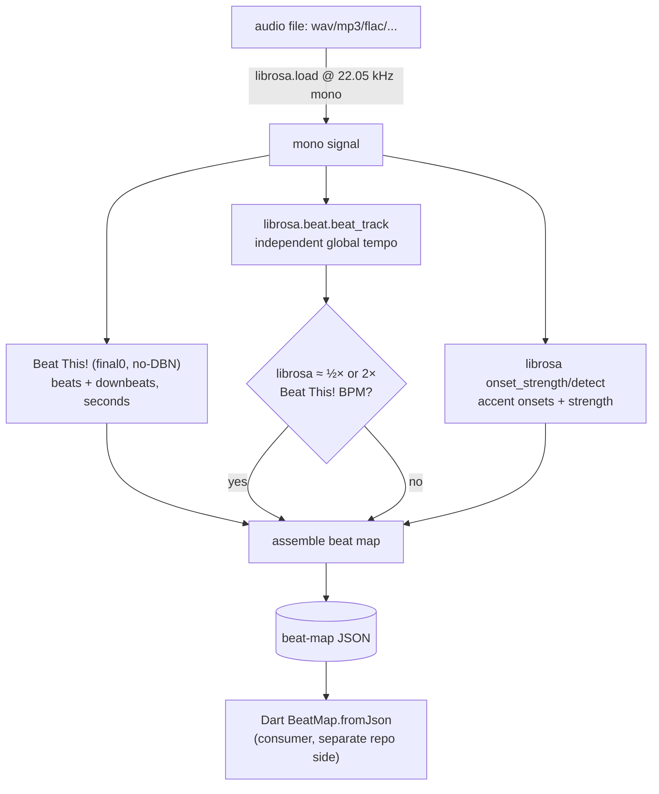

# dance_audio — offline beat-map analysis

Authoring-time tooling that turns an audio file into a **beat-map JSON** so the
character dance can land on the real beat instead of a guessed constant BPM.

**This is not shipped inside the app.** It runs offline on the authoring machine
and emits a data artifact the Flutter/Dart side consumes. The in-repo consumer is
[`lib/features/character/model/beat_map.dart`](../../lib/features/character/model/beat_map.dart)
(`BeatMap`); the full design and the quality ladder live in the plan,
[`docs/implementation_plans/2026-06-27_dance_audio_analysis.md`](../../docs/implementation_plans/2026-06-27_dance_audio_analysis.md).

## Pipeline



The hot path is one Beat This! forward pass (joint beat + downbeat, ~0.3 s of CPU
per 8 s of audio) plus a librosa cross-check used only to flag tempo octave
errors. Everything else is bookkeeping.

## Directory layout

| Path | Role |
| --- | --- |
| `analyze.py` | the tool: `load_audio` → `_run_beat_this` → assemble → JSON; also `--selftest` |
| `requirements.txt` | full runtime deps (Beat This! from git + librosa + soundfile) |
| `requirements-dev.txt` | **light** lint/test deps (no torch — see [Development](#development-lint--test)) |
| `Makefile` | `install` / `install-dev` / `lint` / `format` / `test` / `test-cov` / `clean` |
| `tests/` | torch-free pytest suite (mocks the inference) |
| `.flake8` | flake8 config (matches `tools/matrix_provisioner`) |
| `out/` | generated beat maps + scratch audio — **gitignored** |
| `.venv/` | local virtualenv (~1.3 GB) — **gitignored** |

## Install

Python 3.12+. Torch is installed **CPU-only** (no CUDA needed; CPU inference is
~0.3 s per 8 s of audio):

```sh
cd tools/dance_audio
python3 -m venv .venv
. .venv/bin/activate
make install          # CPU torch + Beat This! + librosa  (the full runtime)
```

`make install` runs the two-step install (CPU torch from the PyTorch CPU index,
then `requirements.txt`). Installing torch from plain PyPI instead pulls a CUDA
build that fails to load (`libcudart.so.13`), so use the CPU index / `make
install`.

## Use

```sh
# Analyse a track → JSON to a file (or stdout if -o is omitted)
python analyze.py track.mp3 -o out/track.json --bpm-hint 120

# Validate the install end-to-end without any audio (synthetic click track)
python analyze.py --selftest
```

| Flag | Effect |
| --- | --- |
| `-o, --out PATH` | write JSON to a file (default: stdout). A short summary goes to stderr. |
| `--bpm-hint N` | record an approximate BPM (kept in `cross_check`; does not change detection) |
| `--dbn` | enable Beat This!'s DBN post-processing — **requires `madmom`** (not installed; CC BY-NC-SA NonCommercial). Stay on the default no-DBN/MIT path unless you accept that license. |
| `--stamp` | embed a UTC creation time (**breaks deterministic output**) |
| `--selftest` | run the synthetic-click self-test and exit |

## Output schema (`schema_version: "1.0"`)

`beats[]` is the **source of truth**; `tempo_segments`, `downbeats_sec`,
`offset_sec`, and `loop` are derived conveniences. Times are seconds (3 dp), BPM
2 dp.

| Field | Meaning |
| --- | --- |
| `audio` | `{path, duration_sec, sample_rate}` of the analysed file |
| `analysis.tracker` | versions used, e.g. `beat_this@1.1.0 (no-dbn); librosa@0.11.0` |
| `analysis.created_utc` | `null` by default (determinism); a timestamp only with `--stamp` |
| `analysis.human_corrected` | `false` — flip to `true` after a manual fix (the schema's audit flag) |
| `analysis.cross_check` | `{librosa_global_bpm, bpm_hint, octave_flag}`; `octave_flag` ∈ `ok` / `librosa_half` / `librosa_double` |
| `tempo` | `{global_bpm, is_variable, bpm_min, bpm_max, confidence}` (median 60/IBI; `is_variable` when IBI spread > 4%) |
| `time_signature` | `{numerator, denominator, is_constant}`; numerator = median beats between downbeats (default 4) |
| `beats[]` | one row per detected beat: `{index, time_sec, beat_in_bar, is_downbeat, confidence}` |
| `tempo_segments[]` | run-length-encoded constant-BPM segments: `{start_beat, start_time_sec, bpm}` |
| `offset_sec` | time of beat 0 (StepMania `#OFFSET` analogue) |
| `downbeats_sec[]` | downbeat times (derivable from `beats[]` where `is_downbeat`) |
| `loop` | `{length_beats, anchor_downbeat_index}` — default 2-bar loop on the first downbeat; the choreographer overrides |
| `onsets[]` | accent onsets: `{time_sec, strength}` (normalized 0..1) — drives later "hit" accents |
| `waveform[]` | downsampled peak-amplitude envelope (0..1, ~1000 buckets) for drawing a waveform picker — computed offline so the consumer needs no platform audio plugin |

`confidence` (per beat and the `tempo` mean) is a **heuristic** from local tempo
consistency — high when an inter-beat interval is near the median — not a native
model score. It lets the consumer hold tempo through shaky regions instead of
snapping.

Later-rung fields from the plan (`sections`, `energy`, `vocal_activity`) are
**not emitted yet** — this tool covers the beat/downbeat rungs.

Example (abridged, real output for a 120 BPM 4/4 track):

```jsonc
{
  "schema_version": "1.0",
  "tempo": { "global_bpm": 120.0, "is_variable": false, "bpm_min": 115.38, "bpm_max": 125.0, "confidence": 0.936 },
  "time_signature": { "numerator": 4, "denominator": 4, "is_constant": true },
  "beats": [
    { "index": 0, "time_sec": 0.06, "beat_in_bar": 1, "is_downbeat": true,  "confidence": 1.0 },
    { "index": 1, "time_sec": 0.56, "beat_in_bar": 2, "is_downbeat": false, "confidence": 1.0 }
  ],
  "offset_sec": 0.06,
  "downbeats_sec": [0.06, 2.12, 4.14],
  "loop": { "length_beats": 8, "anchor_downbeat_index": 0 }
}
```

## How the Dart side consumes it

`BeatMap.fromJson(json)` reads `beats[]` + `time_signature`. Then
`BeatMap.clipSecondsAt(elapsed, clipDuration:, binding:)` warps wall-clock time
onto the detected beat grid (piecewise-linear over the beat anchors), and
`BeatLoopBinding.barAligned(map, bars:)` anchors a loop on a real **downbeat**
(rung 3) — falling back to `BeatLoopBinding.beatAligned(...)` (rung 2) when
downbeats aren't trusted. The character engine's `frameAt` pipeline is untouched;
only the input time is warped, preserving determinism. See
[`beat_map.dart`](../../lib/features/character/model/beat_map.dart).

## Determinism

The JSON is a pure function of (audio bytes, tool version, flags). No wall-clock
timestamp is written unless `--stamp`, so re-running on the same input yields
byte-identical output — clean diffs and reproducible reviews.

## Development (lint + test)

Conventions match `tools/matrix_provisioner` (flake8 + isort + black, pytest), via
the `Makefile`:

```sh
make install-dev   # light: lint/test deps only (no torch)
make format        # isort + black
make lint          # flake8 + isort --check + black --check
make test          # pytest
make test-cov      # pytest + coverage report
```

The tests are deliberately **torch-free**: only `_run_beat_this` touches Beat
This!/torch, and the suite mocks it — a `tests/conftest.py` autouse guard replaces
`_run_beat_this` with a raiser, so any test that reaches real inference fails
loudly instead of importing torch; tests that need beats supply their own stub.
That keeps CI (`.github/workflows/dance-audio-ci.yml`) fast: it installs
`requirements-dev.txt` only (numpy + librosa + lint/test tools), never the 1.3 GB
torch stack. Run `make install` for the full runtime when you actually analyse
audio.

## Accuracy notes & caveats

- **Beats are robust; downbeats need real music.** On a bare click track the bar
  model is out-of-distribution and downbeat phase is unreliable — judge downbeat
  quality on a real track, not the self-test. (Verified on a real 120 BPM 4/4
  Afrobeats track: 99% of bars detected as exactly 4 beats, no octave error — so
  downbeat-anchored looping is viable there.)
- **Afrobeats / syncopation is unbenchmarked.** No public West-African beat
  benchmark exists; keep a human review/correction step (`human_corrected`) for
  tracks that matter, and prefer a tight `--bpm-hint`-style prior when you know it.
- **Octave & phase.** `octave_flag` warns when librosa disagrees by ~½×/2×.
  Downbeat phase (which beat is "1") is the least reliable output; eyeball it for
  bar-critical choreography.

## Licensing

Offline authoring-time only, so GPL/AGPL tools would be fine to *run* here, but
the chosen stack is clean: **Beat This! (MIT, code + weights)**, **librosa
(ISC)**, optional **Demucs (MIT)**. Avoid **madmom** (the `--dbn` path): its model
files are CC BY-NC-SA — **NonCommercial**, a separate axis from copyleft. If beat
detection ever moves *inside* the shipped app, only the MIT stack travels cleanly.
