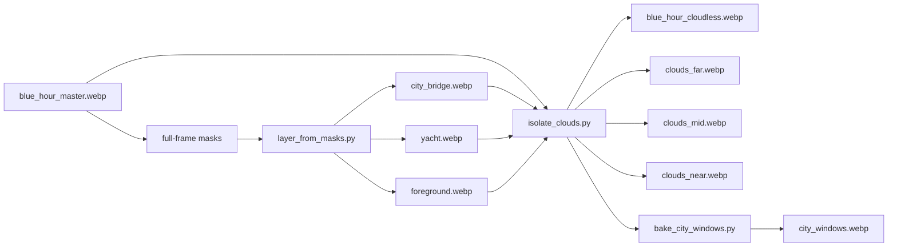
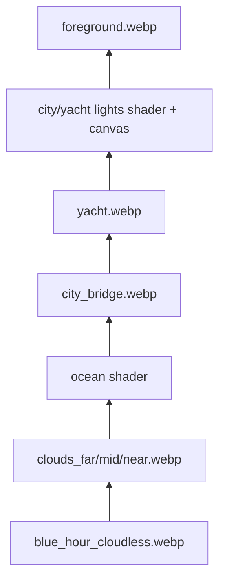

# Scenery Art Pipeline

Reusable art-build helpers for turning one generated full-frame scene plate into
stackable Flutter backdrop assets. Runtime code consumes lossless WebP assets
and shaders; masks/previews remain PNG debug artifacts.
OpenCV/Python are build-time tools only.

The current scene is the Lagos-inspired blue-hour waterfront used by
`lib/features/scenery/`.

## Inputs And Outputs

All scenery art uses one native coordinate space: `2560x1440`.

Required source:

- `assets/scenery/blue_hour_master.webp` - immutable full-frame master plate.

Mask sources:

- `tools/scenery_art/scenes/blue_hour_waterfront/masks/city_bridge.png`
- `tools/scenery_art/scenes/blue_hour_waterfront/masks/yacht.png`
- `tools/scenery_art/scenes/blue_hour_waterfront/masks/foreground.png`

Generated runtime assets:

- `assets/scenery/city_bridge.webp`
- `assets/scenery/yacht.webp`
- `assets/scenery/foreground.webp`
- `assets/scenery/blue_hour_cloudless.webp`
- `assets/scenery/clouds_far.webp`
- `assets/scenery/clouds_mid.webp`
- `assets/scenery/clouds_near.webp`

Generated previews/debug files go to `tmp/scenery_work/` and are not bundled.

## Quick Start

`isolate_clouds.py` needs OpenCV and NumPy. Use a venv; do not add OpenCV to the
Flutter app.

```bash
python3 -m venv /tmp/lotti-scenery-opencv
/tmp/lotti-scenery-opencv/bin/python -m pip install -r tools/scenery_art/requirements.txt
make -C tools/scenery_art PYTHON=/tmp/lotti-scenery-opencv/bin/python blue-hour
```

The make target cuts structure layers from masks, extracts cloud layers from the
master, then bakes the registered city/yacht window lookup:



## Layer Extraction

`layer_from_masks.py` copies RGB from the master and alpha from each supplied
mask. Masks may be RGB, RGBA, or grayscale:

- bright mask pixels become opaque;
- dark mask pixels become transparent;
- midtones become antialiased alpha.

The output WebPs are same-size full-frame layers. Do not crop them. Runtime code
expects every layer to line up with the master plate by coordinate alone.

Direct invocation:

```bash
python3 tools/scenery_art/layer_from_masks.py \
  --master assets/scenery/blue_hour_master.webp \
  --out-dir assets/scenery \
  --preview-dir tmp/scenery_work \
  --layer city_bridge=tools/scenery_art/scenes/blue_hour_waterfront/masks/city_bridge.png \
  --layer yacht=tools/scenery_art/scenes/blue_hour_waterfront/masks/yacht.png \
  --layer foreground=tools/scenery_art/scenes/blue_hour_waterfront/masks/foreground.png
```

## Cloud Extraction

`isolate_clouds.py` creates a cloudless base plate plus three transparent cloud
plates. It uses image signal rather than hand-painted cloud masks:

- local luma contrast catches painted cloud edges;
- broad luma/color distance from estimated clean sky catches darker cloud body;
- color gates reject saturated non-cloud pixels;
- structure alpha layers exclude fixed skyline, yacht, bridge, and foreground;
- occluded cloud alpha is repaired only near existing cloud masses so clouds can
  pass behind structures without carrying building-shaped holes;
- source RGB under structure masks is repaired toward clean sky, preventing
  hidden building pixels from drifting into view later.

The tool writes preview masks:

- `cloud_mask_preview.png` - orange overlay of movable cloud alpha.
- `clouds_all_mask.png` - raw combined motion alpha.
- `clouds_stencil_mask.png` - sparse high-confidence cloud highlights removed
  from the base with inpainting.
- `clouds_erase_mask.png` - broader base-cleanup mask that blends cloud bodies
  toward clean sky.
- `cloud_source_deoccluded.png` - cloud RGB source after structure repair.
- `clouds_recomposed.png` - cloudless plate plus cloud layers.

The detector intentionally keeps the left skyline-adjacent cloud band mostly
baked into the base plate. Those cloud pixels overlap tall tower silhouettes in
the master. Moving them independently makes tower-shaped ghosts drift across the
sky, which is worse than keeping that local cloud mass static.

## Runtime Contract

The runtime stack in `BackdropScene.blueHourWaterfront()` depends on these
assets being full-frame and aligned:



That order is why cloud extraction can include alpha under occluders: the fixed
city/yacht/foreground layers are drawn above the clouds in Flutter.

## Visual QA

After regenerating, inspect at least:

- `tmp/scenery_work/cloud_mask_preview.png` - no obvious city/yacht/deck pixels
  should be marked as moving cloud.
- `tmp/scenery_work/blue_hour_cloudless.png` - no large blocky inpaint scars in
  the open sky.
- `tmp/scenery_work/clouds_recomposed.png` - should look close to the master
  before animation.

For motion-specific QA, render a quick offline composite from repo root:

```bash
python3 - <<'PY'
from pathlib import Path
from PIL import Image, ImageChops, ImageDraw

W, H = 2560, 1440
out = Path('tmp/scenery_work/cloud_runtime_preview')
out.mkdir(parents=True, exist_ok=True)
base = Image.open('assets/scenery/blue_hour_cloudless.webp').convert('RGBA')
city = Image.open('assets/scenery/city_bridge.webp').convert('RGBA')
yacht = Image.open('assets/scenery/yacht.webp').convert('RGBA')
fg = Image.open('assets/scenery/foreground.webp').convert('RGBA')
cloud_specs = [
    ('clouds_far', 0.84, 0.00165),
    ('clouds_mid', 0.84, 0.0021),
    ('clouds_near', 0.9, 0.002775),
]

def comp(t):
    im = base.copy()
    for name, opacity, dxps in cloud_specs:
        cloud = Image.open(f'assets/scenery/{name}.webp').convert('RGBA')
        cloud.putalpha(cloud.getchannel('A').point(lambda p: int(p * opacity)))
        phase = (t * dxps) % 1.0
        dx = round((phase if phase <= 0.5 else phase - 1) * W)
        for wrap in [-1, 0, 1]:
            im.alpha_composite(cloud, (dx + wrap * W, 0))
    im.alpha_composite(city)
    im.alpha_composite(yacht)
    im.alpha_composite(fg)
    return im

for t in [0, 43.5, 120]:
    tag = str(t).replace('.', '_')
    comp(t).save(out / f'cloud_stack_t{tag}.png')

a = comp(0)
b = comp(43.5)
diff = ImageChops.difference(a, b).convert('L')
mask = Image.new('L', (W, H), 0)
ImageDraw.Draw(mask).rectangle((760, 40, 1900, 440), fill=255)
diff = ImageChops.multiply(diff, mask)
over = b.copy()
red = Image.new('RGBA', (W, H), (255, 0, 0, 0))
red.putalpha(diff.point(lambda p: min(255, p * 5) if p > 8 else 0))
over.alpha_composite(red)
over.crop((760, 40, 1900, 440)).resize((2280, 800)).save(
    out / 'top_dark_diff_overlay_t43.png'
)
print(out)
PY
```

`cloud_stack_t120.png` should not show skyline chunks drifting. The dark upper
clouds should move less than the bright foreground cloud details, but their body
should still register in `top_dark_diff_overlay_t43.png`.

## Common Failure Modes

- Buildings move with clouds: the motion mask or cloud RGB source includes
  structure pixels. Tighten structure exclusions or repair the cloud source under
  occluders.
- Building-shaped transparent holes move through clouds: the alpha was excluded
  under occluders but not repaired. Fill occluded alpha only near an existing
  cloud body.
- Dark clouds look static: the base plate still contains too much of the same
  cloud body. Increase the erase mask/blend, or increase far-layer opacity/speed.
- Open sky has blocky scars: the erase/stencil mask is too broad for inpainting.
  Keep broad dark bodies as low-alpha overlays and only inpaint sparse confident
  highlights.
- Runtime asset changes do not appear after hot reload: image asset bytes may be
  cached. Full restart the Flutter app after regenerating assets.
