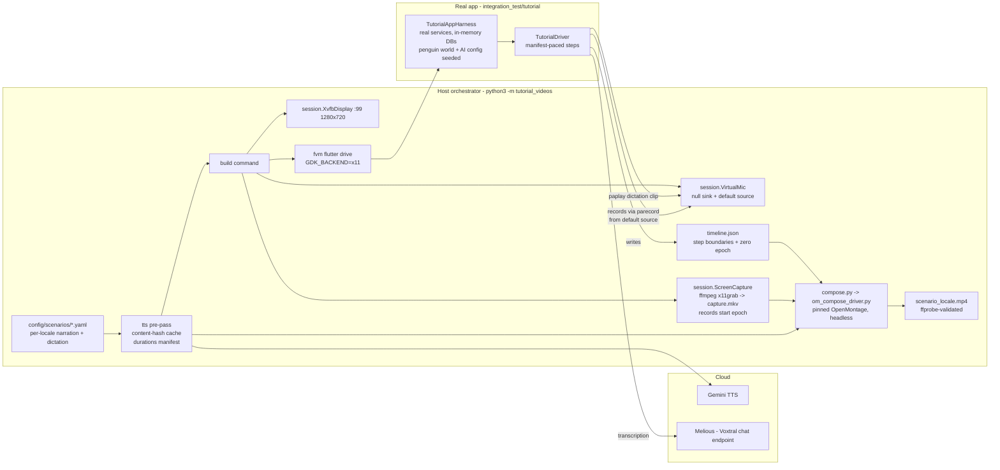
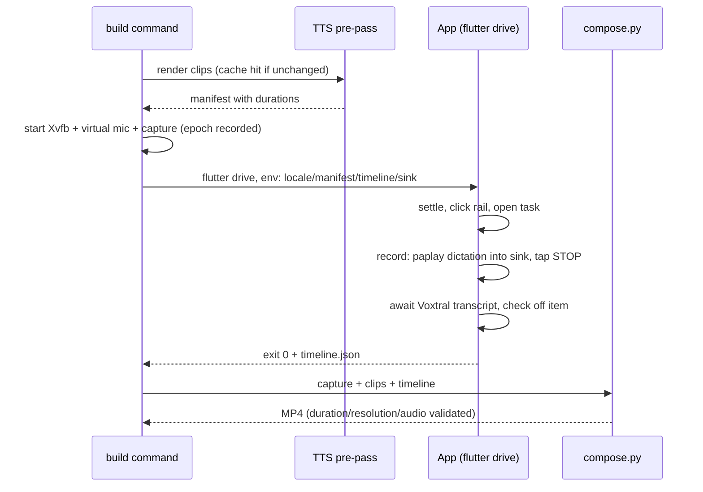

# Tutorial Video Workbench

Fully automated generation of localized onboarding/tutorial videos: the real
Linux desktop app is driven through a scripted flow while the screen is
recorded, pre-generated speech is played into the app's audio-transcription
feature through a virtual microphone, an off-screen voice-over narrates every
step, and everything is composed into one MP4 per locale.

Design history: `docs/implementation_plans/2026-07-21_tutorial_video_workbench.md`.

## One command

```sh
make tutorial_video TUTORIAL_LOCALE=de     # one locale
make tutorial_videos_all                   # TUTORIAL_LOCALES (default: en de)
```

Output: `build/tutorial_videos/<scenario>_<locale>.mp4` plus intermediates
(capture, narration mix, timeline) next to it.

Requirements:

- `.env` at the repo root with `GEMINI_API_KEY`, `MELIOUS_API_KEY`,
  `MELIOUS_BASE_URL` (never committed).
- A sibling **OpenMontage** checkout at `../OpenMontage`, set up and pinned
  per `config/openmontage.pin`.
- Host packages: `Xvfb`, `ffmpeg`, `pactl`/`paplay` (PipeWire or PulseAudio),
  `x11-utils`. Flutter via `fvm`.

## Architecture



### The timeline is the synchronization contract

Narration length differs per locale and transcription latency varies, so
nothing is synced in real time:

1. The **TTS pre-pass** renders narrator + user-voice clips (Gemini TTS,
   cached by content hash) and writes a **manifest** with measured durations.
2. The **Dart harness** paces each step to
   `max(min_duration, narration + pad)` and emits **`timeline.json`** with the
   actual wall-clock step boundaries plus `zero_epoch_ms`.
3. The **compositor** trims the capture head by
   `zero_epoch − capture_start_epoch` and places each narration clip at its
   step's actual start.



### Module boundaries

| Piece | Where | Responsibility |
| --- | --- | --- |
| Scenario config | `config/scenarios/*.yaml` | Source of truth per tutorial: steps, per-locale narration/dictation, speech-dictionary terms. Locale gaps fail validation before any API call. |
| Voices | `config/voices.yaml` | Engine + per-stream/per-locale voice & style (narrator ≠ user voice). |
| TTS | `tutorial_videos/tts/` | `base.py` engine protocol, cache, manifest; `gemini.py` adapter (urllib, no SDK). |
| Session | `tutorial_videos/session.py` | Crash-safe context managers: Xvfb, virtual mic (restores default source), ffmpeg capture (records start epoch). |
| App driver | `integration_test/tutorial/` | Real-app harness (see below) + scenario test; run via `test_driver/tutorial_driver.dart`. |
| Composition | `tutorial_videos/compose.py` + `om_compose_driver.py` | Job assembly + ffprobe validation on the lotti side; ALL OpenMontage API usage isolated in the driver, executed with OpenMontage's own venv. |
| Smokes | `smoke/` | Independently runnable Phase-0 checks for each mechanism. |

### The app-side harness (`integration_test/tutorial/`)

`TutorialAppHarness` boots the production `MyBeamerApp` shell on a real getIt
graph (real `PersistenceLogic`, `JournalDb`, `AiConfigRepository`,
`EntitiesCacheService`, real audio recorder) with in-memory databases and a
temp documents directory — no dev data is touched. It seeds:

- the **Intergalactic Penguin Logistics** world
  (`test/helpers/manual_demo_world.dart`) through real repositories,
- a **Melious provider + Voxtral model** (keys from env) so
  `ProfileAutomationService.tryTranscribe`'s direct fallback fires on
  recording stop — transcription goes through the **chat endpoint**
  (`transcribeChatAudio`), which merges the seeded per-locale
  **speech dictionary** into the prompt,
- the **UI language** (`MANUAL_LANGUAGE` settings row — the shell ignores
  test locale overrides),
- suppression of the AI-onboarding auto-modal.

`TutorialDriver` provides manifest-paced `step()`s, live `pumpUntil*` helpers,
viewport-sweep scrolling (task list rows are virtualized), `speakIntoMic`
(`paplay` into the sink), timeline emission, and failure-time screenshots to
`LOTTI_SCREENSHOT_DIR`.

Wall-clock pacing is intentional here (video driver, not a CI unit test) —
exempt from the fake-time policy, see `test/README.md`.

## Hard-won constraints (do not "simplify" these away)

- **`flutter drive`, not `flutter test`**: `flutter test` runs integration
  tests without ever mapping a window — nothing to record.
- **`GDK_BACKEND=x11` + empty `WAYLAND_DISPLAY`**: otherwise GTK opens the app
  on the host Wayland session instead of the Xvfb display.
- **Prompts to Voxtral must be in the audio's language** — with an English
  prompt it *translates* German audio instead of transcribing it.
- **Assert transcript keywords, not exact strings** — chat-endpoint
  transcription is near-verbatim, not verbatim.
- **OpenMontage output is stream-deterministic, not byte-identical** — compare
  decoded streams (`ffmpeg -f framemd5` / audio md5), never file hashes.
- The recording modal's stop control is unkeyed — tap the localized
  STOP/STOPP label; generic gesture matching hits CANCEL.

## Adding a locale

1. Add the locale's blocks to the scenario YAML (title, per-step narration,
   dictation text, dictionary) and per-stream styles in `voices.yaml` —
   `validate` fails loudly on any gap.
2. The app-side plumbing follows `LOTTI_MANUAL_LOCALE` (same mechanism as the
   manual screenshots; see `add-flutter-docusaurus-locale` skill for app
   locale onboarding).
3. `make tutorial_video TUTORIAL_LOCALE=<code>`.

## Future: character overlay

The character engine (`lib/features/character/`) renders deterministic
transparent-background PNG frames (`film_strip_test.dart`). Composition is
layer-based: the overlay becomes an additional alpha layer keyed to
`timeline.json` step ids — no pipeline changes required.

## Tests

`tests/` (stdlib `unittest`, no network): scenario validation, TTS caching,
manifest shape. Run from `tools/tutorial_videos`:

```sh
python3 -m unittest discover -s tests
```
