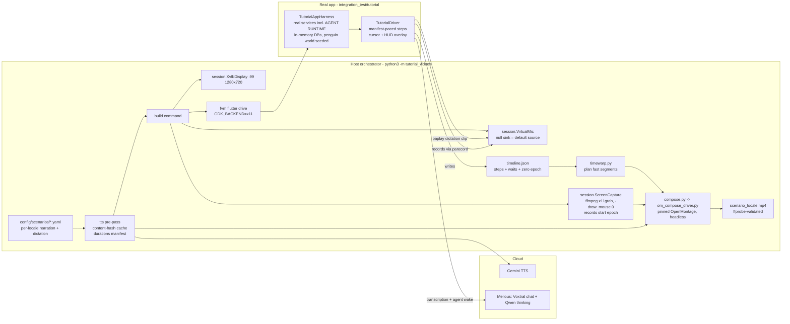
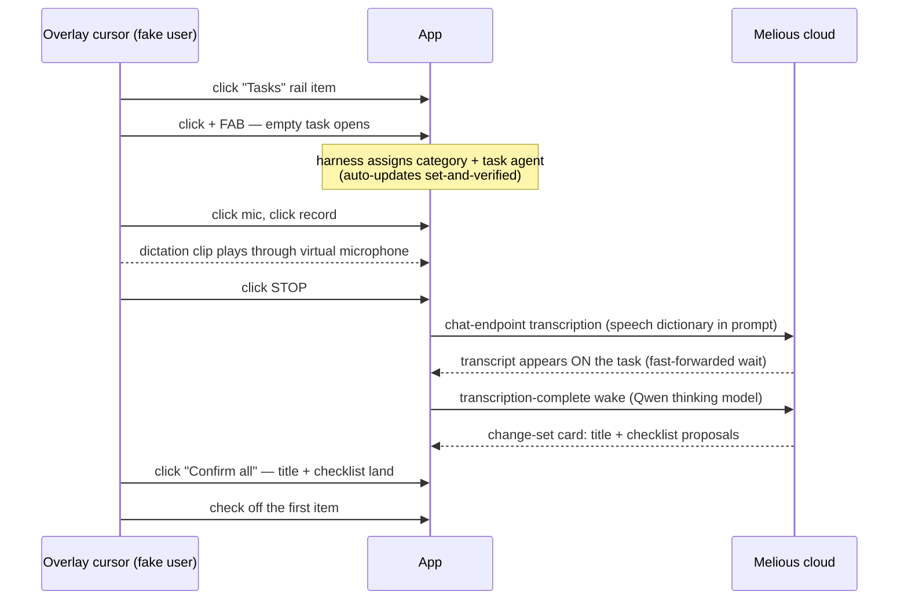

# Tutorial Video Workbench

Fully automated generation of localized onboarding/tutorial videos. One
command drives the **real Linux desktop app** through a scripted flow while
the screen is recorded: a task is created from scratch, speech is played into
the app's microphone, the live Voxtral transcript appears on screen, the task
agent proposes a title and checklist items, the proposals are confirmed, and
an item is checked off. Off-screen narration explains every step, pure waits
are fast-forwarded (with a real-time clock on screen proving they happened),
and everything is composed into one MP4 per locale.

Design history: `docs/implementation_plans/2026-07-21_tutorial_video_workbench.md`.
Agent-facing runbook: `.claude/skills/tutorial-videos/SKILL.md`.

## One command

```sh
make tutorial_video TUTORIAL_LOCALE=de     # one locale
make tutorial_videos_all                   # TUTORIAL_LOCALES (default: en de)
```

Output: `build/tutorial_videos/<scenario>_<locale>.mp4` plus intermediates
(raw + time-warped capture, narration mix, manifest, timeline, session)
next to it.

Requirements:

- `.env` at the repo root with `GEMINI_API_KEY`, `MELIOUS_API_KEY`,
  `MELIOUS_BASE_URL` (never committed).
- A sibling **OpenMontage** checkout at `../OpenMontage`, set up and pinned
  per `config/openmontage.pin`.
- Host packages: `Xvfb`, `ffmpeg`, `pactl`/`paplay` (PipeWire or PulseAudio),
  `x11-utils`. Flutter via `fvm`.

## Architecture



### The scenario flow (what the viewer sees)



### The timeline is the synchronization contract

Narration length differs per locale, cloud latency varies, and waits get
fast-forwarded — so nothing is synced in real time:

1. The **TTS pre-pass** (`tts/`) renders narrator + user-voice clips (Gemini
   TTS, cached by content hash) and writes a **manifest** with measured
   durations.
2. The **Dart harness** paces each step to
   `max(min_duration, narration + pad)`, records every pure-wait span longer
   than 3s (`pumpUntil` instrumentation), and emits **`timeline.json`**:
   actual step boundaries, wait spans, and `zero_epoch_ms`.
3. **`timewarp.py`** plans a piecewise-speed edit: wait footage accelerates
   (up to 8×, 0.6s readable lead-in) while narration stays at 1× — speeds are
   clamped so a step's narration always finishes before the next step's
   narration starts (no overlapping voices, pure functions, unit-tested).
4. **`compose.py`** trims the capture head
   (`zero_epoch − capture_start_epoch`), renders the warp (ffmpeg
   `trim/setpts/concat`), remaps narration starts through the warp, and hands
   everything to **OpenMontage** (`om_compose_driver.py`: `AudioMixer
   full_mix` + `VideoCompose compose`, executed headlessly with OpenMontage's
   own venv, approval gates bypassed). ffprobe validates duration,
   resolution, and audio.

### On-screen overlays (harness-drawn, part of the capture)

- **Cursor** (`TutorialCursorLayer`): synthetic taps don't move the real X
  pointer, so the harness draws its own — `TutorialDriver.tapLikeUser` glides
  it with easing and pulses on press; capture hides the real cursor
  (`x11grab -draw_mouse 0`).
- **Real-time HUD** (top-center chip, tabular figures): shows actual elapsed
  wall time, refreshed every frame via `TutorialDriver.tick()`. Because it
  shows REAL time, it visibly races during fast-forwarded waits — the
  honesty cue that the wait happened.

### The app-side harness (`integration_test/tutorial/`)

`TutorialAppHarness` boots the production `MyBeamerApp` shell on a real getIt
graph (real `PersistenceLogic`, `JournalDb`, `AiConfigRepository`, real audio
recorder, **real agent runtime** — `agentInitializationProvider` is NOT
stubbed) with in-memory databases and a temp documents directory — no dev
data is touched. Seeded state:

- the **Intergalactic Penguin Logistics** world
  (`test/helpers/manual_demo_world.dart`) through real repositories, with a
  `categoryTransform` hook (speech dictionary, default template/profile);
- **AI config**: Melious provider (env creds), Voxtral transcription model,
  Qwen thinking model (tool calling), and an inference profile wired to both
  — mirroring the dev app's proven Melious profile;
- the **UI language** (`MANUAL_LANGUAGE` settings row — the shell ignores
  test locale overrides);
- suppression of the AI-onboarding auto-modal.

The scenario test creates the task via the real + FAB, then (because
unfiltered lists create category-less tasks) assigns the category and creates
the task agent through the same services production uses
(`JournalRepository.updateCategoryId`, `TaskAgentService.createTaskAgent`),
and **set-and-verifies** `updateAutomaticUpdates(enabled: true)` — twice,
because the agent's initial wake can clobber an early write with a stale
config snapshot. Without that flag the transcription-complete wake never
re-runs the agent and no proposals appear.

`TutorialDriver` provides manifest-paced `step()`s, `tick()` (frame render +
HUD refresh), live `pumpUntil*` helpers with wait-span recording,
viewport-sweep scrolling (list rows are virtualized; pass **vertical**
scrollable finders — chip rows swallow drags), `tapLikeUser`, `speakIntoMic`
(`paplay` into the sink), timeline emission, and **failure-time screenshots**
to `LOTTI_SCREENSHOT_DIR` — the single most useful debugging tool this
project has.

Wall-clock pacing is intentional (video driver, not a CI unit test) — exempt
from the fake-time policy, see `test/README.md`.

## Hard-won constraints (do not "simplify" these away)

- **`flutter drive`, not `flutter test`**: `flutter test` runs integration
  tests without ever mapping a window — nothing to record.
- **`GDK_BACKEND=x11` + empty `WAYLAND_DISPLAY`**: otherwise GTK opens the
  app on the host Wayland session instead of the Xvfb display.
- **Prompts to Voxtral must be in the audio's language** — with an English
  prompt it *translates* German audio instead of transcribing it.
- **Assert transcript keywords, not exact strings** — chat-endpoint
  transcription is near-verbatim, not verbatim.
- **`AgentConfig.automaticUpdatesEnabled` defaults to OFF** and early writes
  race the initial wake — always set-and-verify.
- The recording modal's stop control is unkeyed — tap the localized
  STOP/STOPP label; generic gesture matching hits CANCEL and opens a
  discard dialog.
- Widget keys are duplicated across offstage tab stacks — scope finders to
  the visible page AND `.hitTestable()`; `.first`-wrapped finders throw on
  `evaluate()` when empty.
- Pump at ~16ms during every hold/wait — sparse pumping renders app
  animations at ~10fps, which reads as mushy cross-fades on video.
- Start the timeline only after startup settles — the Logbook auto-select
  navigates on its own right after boot.
- **OpenMontage output is stream-deterministic, not byte-identical** —
  compare decoded streams (`ffmpeg -f framemd5`), never file hashes.

## Adding a scenario or locale

- **Locale**: add the locale's blocks to the scenario YAML (title, per-step
  narration, dictation text, dictionary) and per-stream styles in
  `voices.yaml` — `validate` fails loudly on any gap. App-side plumbing
  follows `LOTTI_MANUAL_LOCALE` (same mechanism as manual screenshots).
- **Scenario**: new YAML in `config/scenarios/` (mirroring the schema
  documented in `create_task_from_audio.yaml`) + a matching
  `integration_test/tutorial/<scenario>_tutorial_test.dart` built on
  `TutorialAppHarness`/`TutorialDriver`. Iterate with
  `python3 -m tutorial_videos build` and read the failure screenshots.

Full step-by-step runbook: `.claude/skills/tutorial-videos/SKILL.md`.

## Future: character overlay

The character engine (`lib/features/character/`) renders deterministic
transparent-background PNG frames (`film_strip_test.dart`). Composition is
layer-based: the overlay becomes an additional alpha layer keyed to
`timeline.json` step ids — no pipeline changes required.

## Tests

`tests/` (stdlib `unittest`, no network): scenario validation, TTS caching,
manifest shape, time-warp planning. Run from `tools/tutorial_videos`:

```sh
python3 -m unittest discover -s tests
```
